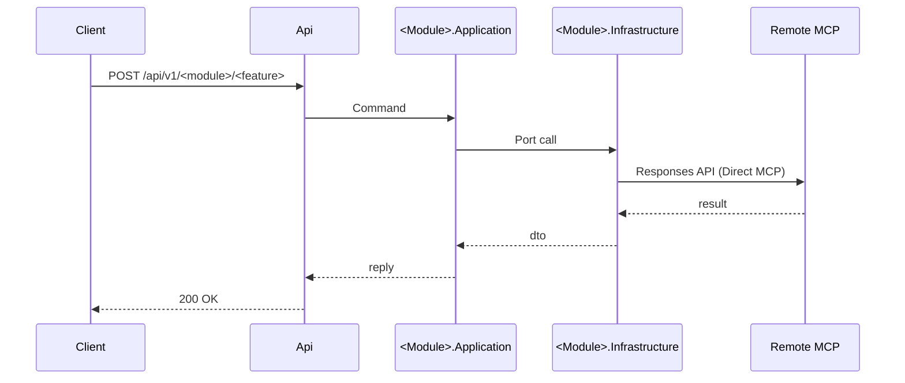

Below is a refined, **production‑grade** context doc you can commit as
`docs/AXON_TOP_DOWN_SLICE_FIRST.md`. It’s opinionated, minimal, and designed for **speed now** and **clean evolution later**.

---

# Axon – Top→Down, Slice‑First Delivery Brief (Hand‑Off)

**Stack:** .NET 10 (preview) · Clean Architecture · DDD · CQRS (MediatR) · OpenAI Direct MCP
**Repo structure:** see **@docs/ARCHITECTURE-FOLDERS.md** (authoritative paths & rules)
**Goal:** Ship MVP via **thin vertical slices**, planned **top→down** (contracts first), implemented **inside a module**, with **no cross‑module coupling**. Make promotion to Modular Monolith and Microservices a **file move, not a rewrite**.

---

## 0) Repository & Boundaries (ground truth)

```
src/
  Api/
  Shared/
    Common/
    Common.Abstractions/
  Modules/
    <Module>/
      Application/
      Domain/
      Infrastructure/
tests/
```

**Dependency graph (enforced):**

* `Api` → `Modules.<X>.Application`, `Shared.Common`, `Shared.Common.Abstractions`
* `Modules.<X>.Application` → `Modules.<X>.Domain`, `Shared.Common`, `Shared.Common.Abstractions`
* `Modules.<X>.Infrastructure` → `Modules.<X>.Application` (→ `Modules.<X>.Domain` only if mapping/persistence demands)
* **Forbidden:** `Api` → `Domain`; **any** cross‑module references; business code in `Shared/*`.

**Composition root:** `Api` wires Infrastructure implementations to Application ports via DI.

---

## 1) Non‑Negotiables (what we won’t compromise)

* **Top→Down planning; Vertical‑Slice execution.** Freeze external **contracts & flow** before domain code.
* **YAGNI.** Only build what the current slice needs. Delete bravely.
* **Feature‑first layout.** Each feature lives inside its module; no “misc” helpers.
* **Strict safety baseline.** Centralized analyzers & nullability; builds fail on warnings.
* **Docs or it didn’t happen.** Every change references a doc (one‑pager/spec) or adds a short ADR.

---

## 2) Tooling & Defaults (no surprises)

* **.NET 10 / TFM:** central via `Directory.Build.props` (no per‑project duplication).
* **Analyzers:** `AnalysisLevel=latest`, `EnableNETAnalyzers=true`, `TreatWarningsAsErrors=true`.
* **Safety analyzers ON:** Trim/Single‑file/AOT analyzers **enabled** (signals), **without** promising AOT/trim compatibility.
* **Reproducible builds:** `Deterministic=true`, `ContinuousIntegrationBuild=true` (in CI).
* **Solution filter:** `Axon.Backend.slnx` is primary.
* **API projects don’t pack**, libraries **generate XML docs** (CS1591 not as error).
* **Secrets/config:** environment variables or local user‑secrets; never commit secrets.

---

## 3) Planning Workflow (Top→Down)

**Phase 0 — Intent & Constraints** *(1–2h, no code)*
Create `docs/features/<feature>/ONE_PAGER.md`:

* Problem, scope, must‑haves, out‑of‑scope
* SLOs (P50/P95/P99) for simple vs. tool‑using requests
* Integration stance (Direct MCP primary)

**Gate:** If it’s not in the one‑pager, it’s optional.

**Phase 1 — Contracts & Flow** *(½–1 day, no code)*
Produce **three docs**:

* `API_CONTRACT.md` – request/response, versioning, errors
* `APP_PORTS.md` – Application ports (interfaces) & signatures
* `SEQUENCE.md` – mermaid diagram: Client → Api → App → Infra → (MCP) → reply
  Add an **ADR**: `docs/adr/ADR-YYYYMMDD-<slug>.md` (e.g., “Direct MCP as primary”).

**Exit:** Endpoint & port names are **frozen**; sequence agreed.

---

## 4) Implementation Workflow (Vertical Slice)

**Phase 2 — Skeleton & Stubs** *(2–4h)*
Create empty shells in **the target module only** (no logic yet):

```
src/Api/Endpoints/<Module>/<Feature>Endpoint.cs
src/Api/Contracts/<Module>/<Feature>Requests.cs
src/Api/Contracts/<Module>/<Feature>Responses.cs

src/Modules/<Module>/Application/Commands/<Feature>/*
src/Modules/<Module>/Application/Abstractions/* (ports)

src/Modules/<Module>/Infrastructure/* (adapter stubs)
src/Modules/<Module>/Domain/* (only placeholders if required)
```

**Exit:** builds; endpoint returns 200 with stub response.

**Phase 3 — MVP Slice (happy path)** *(1–2 days)*

* **Api:** endpoint → MediatR command (no domain types on the wire).
* **Application:** handler orchestrates minimal policy + calls ports.
* **Infrastructure:** implement port adapters (e.g., `OpenAiClient` with **Direct MCP**, restricted `allowed_tools`, optional `previous_response_id`).
* **Domain:** add only necessary invariants/entities now.

**Deferrals (strict):** EF/UoW, caching, retries, OTel/logging, auth.
**Exit:** real response; SLOs met for this path; build green (warnings‑as‑errors).

---

## 5) Feature Recipe (paths & naming)

Assume **Module=Chat**, **Feature=ProcessMessage**.

**Files:**

```
src/Api/Endpoints/Chat/ProcessMessageEndpoint.cs
src/Api/Contracts/Chat/ProcessMessageRequests.cs
src/Api/Contracts/Chat/ProcessMessageResponses.cs

src/Modules/Chat/Application/Commands/ProcessMessage/ProcessMessage.cs
src/Modules/Chat/Application/Commands/ProcessMessage/ProcessMessageHandler.cs
src/Modules/Chat/Application/Abstractions/IAiClient.cs

src/Modules/Chat/Infrastructure/Ai/OpenAiClient.cs

// Domain only if truly needed for MVP:
src/Modules/Chat/Domain/Aggregates/Conversation/Conversation.cs
```

**Conventions:**

* **Namespaces:** `Axon.Modules.<Module>.<Layer>.<Area>`

    * `Axon.Modules.Chat.Application.Commands.ProcessMessage.ProcessMessageHandler`
* One type per file; feature folders (`ProcessMessage/`) for commands/handlers/validators.
* Ports (interfaces) live in **Application**; adapters in **Infrastructure**.

---

## 6) Change Management (branch → PR)

1. Open an issue linking **ONE\_PAGER**.
2. Branch: `feat/<module>-<feature>` (e.g., `feat/chat-process-message`).
3. Update/confirm: `API_CONTRACT`, `APP_PORTS`, `SEQUENCE`, ADR.
4. Implement Phase 2 → Phase 3 in **module paths only**.
5. Add behavioral tests under `tests/Modules.<Module>.<Layer>.Tests`.
6. Run `dotnet build` locally (analyzers fail the build on warnings).
7. PR description must include: links to docs/ADR + checklist below.

**PR Checklist (paste & tick)**

* [ ] One‑pager & ADR linked; contracts match docs
* [ ] Endpoint DTOs contain **no domain types**
* [ ] No cross‑module references
* [ ] Build passes (warnings‑as‑errors)
* [ ] Behavioral tests added and passing
* [ ] Paths conform to **@docs/ARCHITECTURE-FOLDERS**

**Commit message template**
`feat(<module>): <feature> – MVP slice [ADR-YYYYMMDD-<slug>]`

---

## 7) Testing Strategy (pragmatic)

```
tests/
  Api.Tests/                           // endpoint tests (in-process host)
  Modules.<Module>.Application.Tests/  // commands/behaviors
  Modules.<Module>.Domain.Tests/       // aggregates/invariants
  Modules.<Module>.Infrastructure.Tests// adapters (with fakes)
```

* Prefer **behavioral** tests (command → observable outcome) over micro‑unit tests.
* **Builders** live in the module’s test project.
* Keep tests **feature‑named**: `ProcessMessage_ShouldReturnAssistantText_GivenValidInput`.

---

## 8) Cross‑Module Communication (future‑safe now)

* Inside a module: **Domain Events** (internal) handled within the module.
* Across modules: **Integration Events** published from **Application**:

    * `src/Modules/<X>/Application/Integration/Events/<Event>.cs`
    * Consume in **Application** of other modules (no domain coupling).
* When extracting services, move events to `Modules.<X>.Contracts` and swap in‑proc bus for a broker.

---

## 9) Evolving the Architecture

**Add a new module:**
Create `src/Modules/<New>/Application|Domain|Infrastructure` + matching tests; copy the same rules and slice recipe.

**Promote to Modular Monolith:** *(trigger: second module appears or a module grows)*

1. Create projects:
   `Axon.Modules.<X>.Application`, `Axon.Modules.<X>.Domain`, `Axon.Modules.<X>.Infrastructure`
2. Move folders verbatim; update references per the graph.
3. `Api` references **Application** only.
4. Make module internals **internal**; expose only Application contracts.

**Consider Microservices** only when a module needs **independent scaling + release cadence** and has **stable external contracts**. Your seams (ports + integration events) already support extraction.

---

## 10) Code Conventions (just enough, no bikeshedding)

* **API DTOs:** plain records/classes in `Api/Contracts/<Module>`; version endpoints under `/api/v1/...`; avoid breaking changes (additive evolution).
* **Errors:** domain/application return `Result` with `Error` (no exception flows for business rules).
* **Guards:** put cross‑module technical guards in `Shared.Common` **only after** 3× reuse.
* **SDK clients:** Infrastructure only; wrap behind ports; no SDK types escaping Application.

---

## 11) Docs You Must Touch

* `docs/ARCHITECTURE-FOLDERS.md` – authoritative paths & rules.
* `docs/features/<feature>/ONE_PAGER.md` – intent/scope/SLOs.
* `docs/features/<feature>/API_CONTRACT.md` – endpoint I/O + versioning.
* `docs/features/<feature>/APP_PORTS.md` – Application ports.
* `docs/features/<feature>/SEQUENCE.md` – sequence diagram (Mermaid).
* `docs/adr/ADR-YYYYMMDD-<slug>.md` – decision trail.

> **Rule:** any change to a public contract or flow requires an ADR.

---

## 12) AI Prompt Etiquette (Claude/Copilot)

Always include **Scope**, **Docs**, **Paths**, **Constraints**, **Done = …**.

**Template**

> **Scope:** Modules.<X> – Api + Application (Feature Y).
> **Docs:** @docs/ARCHITECTURE-FOLDERS, @docs/features/<y>/API\_CONTRACT.md, APP\_PORTS.md, SEQUENCE.md.
> **Paths:** list exact files you want created/edited.
> **Constraints:** no cross‑module refs; no domain types in API; no logging/EF/caching/auth.
> **Done =** build passes (warnings‑as‑errors); endpoint returns real result.

---

## 13) Quality Gates (CI)

* **Build:** `dotnet build Axon.Backend.slnx` – fails on any analyzer warning.
* **Tests:** run all `tests/*`.
* **Path police:** PR must not create files outside allowed module paths.
* **Contracts:** if API contract changed, PR must include updated docs + ADR.
* **SLOs:** collect latency for implemented path; flag regressions.

---

## 14) Anti‑Patterns (blocked)

* `Api` referencing `Domain`.
* Cross‑module calls (use integration events or app‑level abstraction).
* Business code in `Shared/*`.
* “Base classes for the future” in `Common` (add only after 3× reuse).
* Ports that anticipate future needs (keep signatures minimal).

---

## 15) Templates (copy/paste)

**ONE\_PAGER.md**

```md
# <Feature> – One‑Pager
Problem: …
Scope: …
Must‑haves: …
Out‑of‑scope: …
SLOs: Simple P50/P95/P99; With tools P50/P95/P99
Integration stance: Direct MCP (OpenAI)
Risks/Assumptions: …
```

**API\_CONTRACT.md**

```md
POST /api/v1/<module>/<feature>
Request:
{ … }
Response 200:
{ … }
Errors:
{ "code": "…", "message": "…" }
```

**APP\_PORTS.md**

```md
public interface I<PortName>
{
    Task<Return> DoAsync(Input input, CancellationToken ct);
}
```

**SEQUENCE.md (Mermaid)**



**ADR**

```md
# ADR-YYYYMMDD-<slug>
Context: …
Decision: …
Consequences: …
```

---

### Bottom line

Start with **docs**, freeze **contracts & flow**, implement **one thin slice** inside a module, keep **dependencies one‑way**, and defer cross‑cutting until MVP works. Your structure guarantees smooth promotion to **Modular Monolith** and—if warranted—**Microservices**.

---
