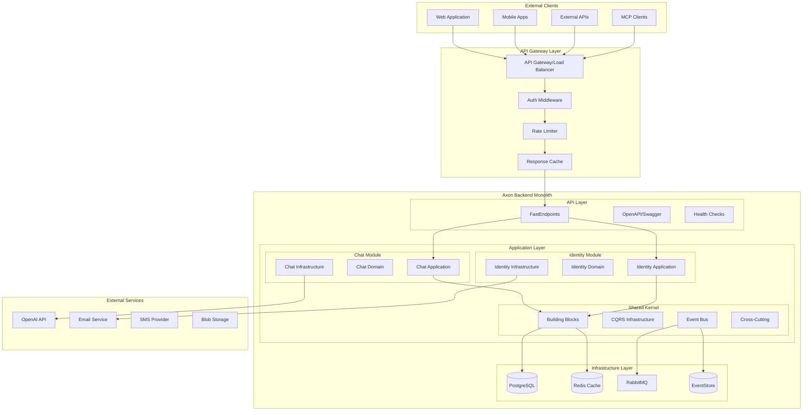
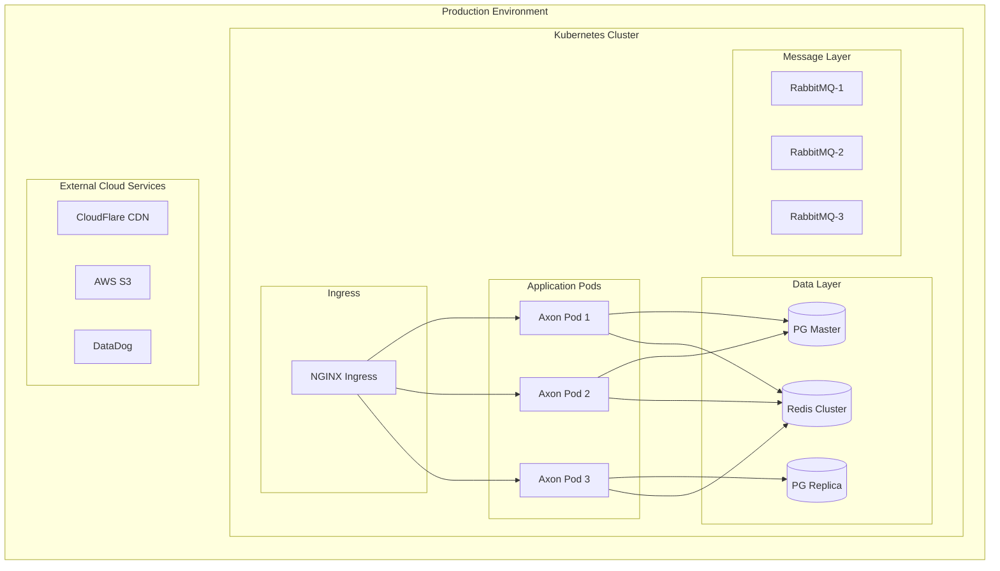
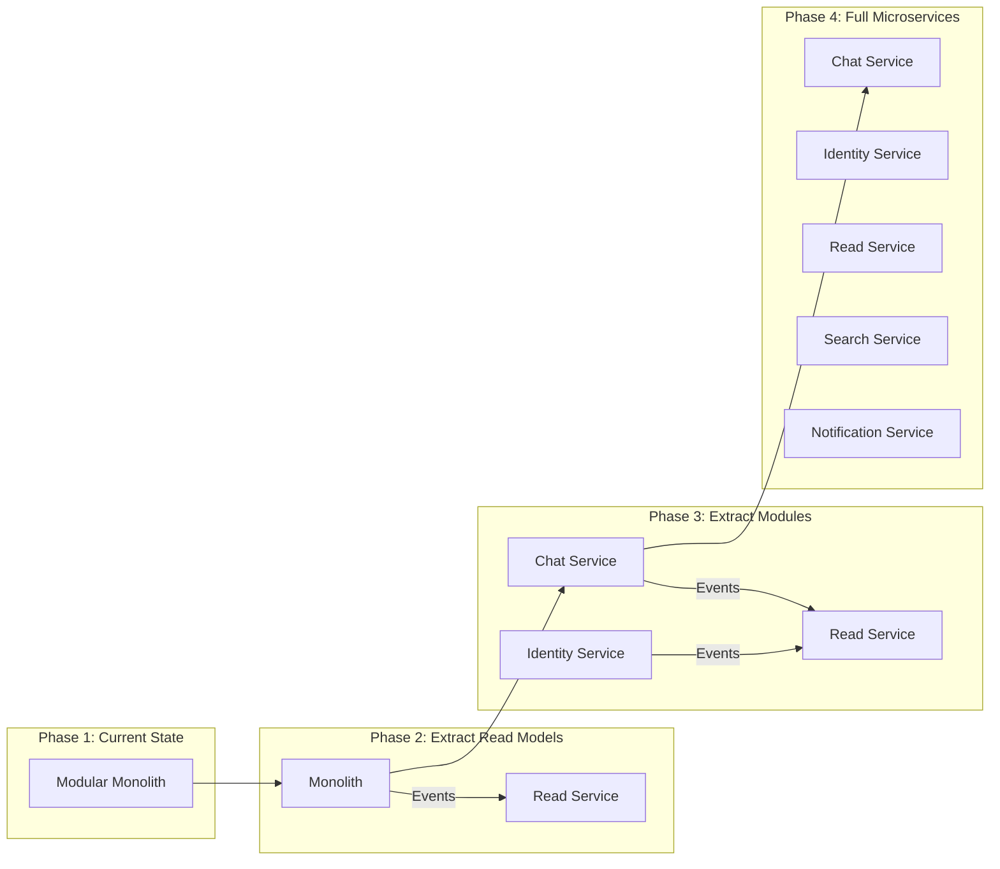

# 🏗️ Axon Backend - System Architecture (Enhanced Edition)

## Table of Contents
- [Executive Summary](#executive-summary)
- [Architectural Overview](#architectural-overview)
- [Clean Architecture Implementation](#clean-architecture-implementation)
- [Modular Monolith Design](#modular-monolith-design)
- [Module Architecture](#module-architecture)
- [Chat Module Deep Dive](#chat-module-deep-dive)
- [Identity Module Architecture](#identity-module-architecture)
- [Building Blocks Layer](#building-blocks-layer)
- [CQRS & Domain-Driven Design](#cqrs--domain-driven-design)
- [Event-Driven Architecture](#event-driven-architecture)
- [API Layer & FastEndpoints](#api-layer--fastendpoints)
- [Data Architecture & Persistence](#data-architecture--persistence)
- [Integration Patterns](#integration-patterns)
- [Error Handling & Resilience](#error-handling--resilience)
- [Security Architecture](#security-architecture)
- [Performance & Caching](#performance--caching)
- [Testing Architecture](#testing-architecture)
- [Deployment & DevOps](#deployment--devops)
- [Monitoring & Observability](#monitoring--observability)
- [Migration Strategy](#migration-strategy)
- [Technical Debt & Future Improvements](#technical-debt--future-improvements)

## Executive Summary

Axon Backend implements a **Modular Monolith** architecture designed for eventual microservices migration, built on **.NET 10** with **Clean Architecture**, **CQRS**, **Domain-Driven Design (DDD)**, and **Event Sourcing** principles.

### Key Architectural Decisions (ADRs)

| Decision | Rationale | Trade-offs | Status |
|----------|-----------|------------|--------|
| **Modular Monolith** | Single deployment with module isolation for simpler operations | Shared runtime resources | Active |
| **Clean Architecture** | Clear separation of concerns and dependency inversion | Additional abstraction layers | Active |
| **CQRS Pattern** | Optimized read/write paths for scalability | Increased complexity | Active |
| **FastEndpoints** | High-performance minimal APIs with less ceremony | Less framework maturity | Active |
| **PostgreSQL Primary** | Robust ACID compliance with JSONB support | Single point of failure | Active |
| **Event Sourcing (Partial)** | Audit trail and temporal queries for critical aggregates | Storage overhead | Planned |
| **.NET 10** | Latest performance improvements and features | Bleeding edge risks | Active |

### System Characteristics

- **Architecture Style**: Modular Monolith with Vertical Slices
- **Communication**: In-process (sync) and Event Bus (async)
- **Data Management**: Database per Module (logical separation)
- **Deployment**: Containerized with Kubernetes support
- **Scalability**: Horizontal via load balancing
- **Resilience**: Circuit breakers, retries, and fallbacks

## Architectural Overview

### High-Level System Architecture



### Deployment View



## Clean Architecture Implementation

### Layer Dependencies & Boundaries

```
┌─────────────────────────────────────────────────────────────┐
│                      Presentation Layer                      │
│                          (API)                               │
│  • FastEndpoints       • Request/Response DTOs              │
│  • Middleware          • OpenAPI Documentation               │
│  • Authentication      • Global Exception Handling           │
└────────────────────────┬────────────────────────────────────┘
                         │ References
                         ↓
┌─────────────────────────────────────────────────────────────┐
│                     Application Layer                        │
│                    (Use Cases/Services)                      │
│  • Command Handlers    • Query Handlers                     │
│  • Application Services• DTOs & ViewModels                  │
│  • Interfaces (Ports)  • Validation Rules                   │
│  • Orchestration       • Mapping Profiles                   │
└────────────────────────┬────────────────────────────────────┘
                         │ References
                         ↓
┌─────────────────────────────────────────────────────────────┐
│                       Domain Layer                           │
│                   (Business Logic Core)                      │
│  • Aggregates          • Entities                           │
│  • Value Objects       • Domain Events                      │
│  • Domain Services     • Specifications                     │
│  • Business Rules      • Domain Exceptions                  │
└────────────────────────┬────────────────────────────────────┘
                         ↑ Implements
┌─────────────────────────────────────────────────────────────┐
│                   Infrastructure Layer                       │
│                 (External Concerns/Adapters)                 │
│  • EF Core DbContext   • Repositories                       │
│  • External Services   • Message Bus                        │
│  • File System         • Email/SMS                          │
│  • AI Clients          • Caching                            │
└─────────────────────────────────────────────────────────────┘
```

### Project Structure (Actual Implementation)

```
Axon-Backend/
├── src/
│   ├── Api/                              # Presentation Layer
│   │   ├── Configuration/                # API setup and DI
│   │   │   ├── ServiceRegistration.cs   # FastEndpoints config
│   │   │   └── SwaggerConfiguration.cs  # OpenAPI setup
│   │   ├── Endpoints/                    # FastEndpoints implementations
│   │   │   └── Chat/
│   │   │       └── ProcessMessage/
│   │   │           ├── ProcessMessageEndpoint.cs
│   │   │           ├── ProcessMessageRequest.cs
│   │   │           ├── ProcessMessageResponse.cs
│   │   │           └── ProcessMessageValidator.cs
│   │   ├── Middleware/                   # Custom middleware
│   │   └── Program.cs                    # Entry point
│   │
│   ├── Modules/                          # Business Modules
│   │   ├── Chat/                         # Chat Module
│   │   │   ├── Domain/                   # Core business logic
│   │   │   │   ├── Conversation/
│   │   │   │   │   ├── Conversation.cs  # Aggregate root
│   │   │   │   │   ├── Entities/
│   │   │   │   │   │   └── Message.cs
│   │   │   │   │   ├── Events/
│   │   │   │   │   │   ├── ConversationStartedDomainEvent.cs
│   │   │   │   │   │   └── UserMessageAppendedDomainEvent.cs
│   │   │   │   │   └── ValueObjects/
│   │   │   │   │       ├── ConversationId.cs
│   │   │   │   │       ├── MessageContent.cs
│   │   │   │   │       └── UserId.cs
│   │   │   │   ├── Errors/
│   │   │   │   │   └── ChatErrors.cs
│   │   │   │   └── Services/
│   │   │   │       └── ConversationContextBuilder.cs
│   │   │   │
│   │   │   ├── Application/              # Use cases
│   │   │   │   ├── Commands/
│   │   │   │   │   ├── ProcessMessage/
│   │   │   │   │   ├── StartConversation/
│   │   │   │   │   └── AddMessage/
│   │   │   │   ├── Queries/
│   │   │   │   │   ├── GetConversation/
│   │   │   │   │   └── SearchConversations/
│   │   │   │   ├── Abstractions/
│   │   │   │   │   ├── IAiClient.cs
│   │   │   │   │   └── IMcpServerResolver.cs
│   │   │   │   ├── DTOs/
│   │   │   │   ├── Services/
│   │   │   │   └── Repositories/
│   │   │   │       └── IConversationRepository.cs
│   │   │   │
│   │   │   └── Infrastructure/           # External implementations
│   │   │       ├── Ai/
│   │   │       │   ├── OpenAiClient.cs
│   │   │       │   └── OpenAiClientFacade.cs
│   │   │       ├── Persistence/
│   │   │       │   ├── ChatDbContext.cs
│   │   │       │   ├── Configurations/
│   │   │       │   ├── Repositories/
│   │   │       │   └── Migrations/
│   │   │       └── Services/
│   │   │
│   │   └── Identity/                     # Identity Module
│   │       └── src/
│   │           ├── Domain/
│   │           ├── Application/
│   │           └── Infrastructure/
│   │
│   └── BuildingBlocks/                   # Shared Kernel
│       ├── Core/                         # Core abstractions
│       │   ├── Domain/
│       │   │   ├── BaseEntity.cs
│       │   │   ├── BaseAggregate.cs
│       │   │   └── IStrongId.cs
│       │   └── CQRS/
│       │       ├── ICommand.cs
│       │       ├── IQuery.cs
│       │       └── ICommandHandler.cs
│       ├── CQRS/                         # CQRS implementation
│       ├── Persistence/                  # Data access
│       │   ├── Common/
│       │   ├── Read/
│       │   └── Write/
│       ├── MassTransit/                  # Message bus
│       ├── Polly/                        # Resilience
│       └── Web/                          # Web utilities
│
├── tests/                                # Test projects
│   ├── UnitTests/
│   ├── IntegrationTests/
│   └── ArchitectureTests/
│
└── Docs/                                 # Documentation
    ├── Technical/
    ├── Architecture/
    └── Development/
```

### Dependency Injection & Module Registration

```csharp
// Program.cs - Application Entry Point
var builder = WebApplication.CreateBuilder(args);

// Add Building Blocks
builder.Services.AddBuildingBlocks(builder.Configuration);

// Add Modules
builder.AddChatModule();        // Chat module registration
builder.AddIdentityModules();   // Identity module registration

// Add API Layer
builder.Services.AddFastEndpoints();
builder.Services.AddSwaggerDoc();

var app = builder.Build();

// Configure Pipeline
app.UseAuthentication();
app.UseAuthorization();
app.UseFastEndpoints();
app.UseSwaggerGen();

// Use Modules
app.UseChatModule();
app.UseIdentityModules();

await app.RunAsync();
```

## Modular Monolith Design

### Module Isolation Principles

1. **Bounded Context Separation**: Each module represents a distinct bounded context
2. **Database Schema Isolation**: Logical separation via schemas
3. **No Direct References**: Modules communicate via contracts/events
4. **Independent Development**: Teams can work independently
5. **Separate Testing**: Module-specific test suites
6. **Migration Ready**: Can be extracted to microservices

### Module Communication Patterns

```csharp
// 1. Synchronous Communication via Public Contracts
namespace Axon.Modules.Chat.Contracts
{
    public interface IChatModuleApi
    {
        Task<ConversationDto> GetConversationAsync(Guid id);
        Task<MessageDto> GetMessageAsync(Guid id);
    }
    
    // Internal implementation
    internal class ChatModuleApi : IChatModuleApi
    {
        private readonly IMediator _mediator;
        
        public async Task<ConversationDto> GetConversationAsync(Guid id)
        {
            var query = new GetConversationQuery(id);
            var result = await _mediator.Send(query);
            return result.Value;
        }
    }
}

// 2. Asynchronous Communication via Integration Events
namespace Axon.Modules.Chat.IntegrationEvents
{
    public record ConversationCreatedIntegrationEvent(
        Guid ConversationId,
        Guid UserId,
        string Title,
        DateTime CreatedAt
    ) : IIntegrationEvent;
}

// 3. Domain Events (Internal to Module)
namespace Axon.Modules.Chat.Domain.Conversation.Events
{
    public sealed record ConversationStartedDomainEvent(
        ConversationId ConversationId,
        UserId UserId,
        string Title,
        DateTime OccurredAt
    ) : IDomainEvent;
}
```

### Module Structure Template

```csharp
// Module Root Marker
namespace Axon.Modules.[ModuleName]
{
    public class [ModuleName]Module { }  // Marker class for assembly scanning
}

// Module Configuration
public static class [ModuleName]ModuleExtensions
{
    public static IServiceCollection Add[ModuleName]Module(
        this IServiceCollection services,
        IConfiguration configuration)
    {
        // Register Domain Services
        services.AddScoped<I[ModuleName]DomainService, [ModuleName]DomainService>();
        
        // Register Application Services  
        services.AddMediatR(cfg => 
            cfg.RegisterServicesFromAssembly(typeof([ModuleName]Module).Assembly));
        
        // Register Infrastructure
        services.AddDbContext<[ModuleName]DbContext>(options =>
            options.UseNpgsql(configuration.GetConnectionString("[ModuleName]")));
            
        services.AddScoped<I[ModuleName]Repository, [ModuleName]Repository>();
        
        return services;
    }
    
    public static IApplicationBuilder Use[ModuleName]Module(
        this IApplicationBuilder app)
    {
        // Module-specific middleware
        app.UseMiddleware<[ModuleName]ExceptionMiddleware>();
        
        // Run migrations
        using var scope = app.ApplicationServices.CreateScope();
        var dbContext = scope.ServiceProvider.GetRequiredService<[ModuleName]DbContext>();
        dbContext.Database.Migrate();
        
        return app;
    }
}
```

## Module Architecture

### Chat Module Implementation

```csharp
// Domain Layer - Aggregate Root
namespace Axon.Modules.Chat.Domain.Conversation
{
    public sealed class Conversation : BaseAggregate<ConversationId>
    {
        private readonly List<Message> _messages = new();
        
        public ConversationId Id { get; private init; }
        public UserId UserId { get; private init; }
        public string Title { get; private set; }
        public ConversationState State { get; private set; }
        public DateTime CreatedAt { get; private init; }
        public DateTime? UpdatedAt { get; private set; }
        public IReadOnlyList<Message> Messages => _messages.AsReadOnly();
        
        // Factory Method with Validation
        public static Result<Conversation> Create(
            UserId userId,
            string title,
            MessageContent? initialMessage = null)
        {
            // Business Rule Validation
            if (string.IsNullOrWhiteSpace(title))
                return Result.Failure<Conversation>(ChatErrors.InvalidTitle);
                
            if (title.Length > 200)
                return Result.Failure<Conversation>(ChatErrors.TitleTooLong);
            
            var conversation = new Conversation
            {
                Id = ConversationId.New(),
                UserId = userId,
                Title = title,
                State = ConversationState.Active,
                CreatedAt = DateTime.UtcNow
            };
            
            // Raise Domain Event
            conversation.AddDomainEvent(new ConversationStartedDomainEvent(
                conversation.Id,
                userId,
                title,
                DateTime.UtcNow));
            
            if (initialMessage != null)
            {
                var message = Message.CreateUserMessage(initialMessage, userId);
                conversation._messages.Add(message);
                
                conversation.AddDomainEvent(new UserMessageAppendedDomainEvent(
                    conversation.Id,
                    message.Id,
                    DateTime.UtcNow));
            }
            
            return Result.Success(conversation);
        }
        
        // Business Operations
        public Result AddUserMessage(MessageContent content)
        {
            if (State != ConversationState.Active)
                return Result.Failure(ChatErrors.ConversationNotActive);
            
            var message = Message.CreateUserMessage(content, UserId);
            _messages.Add(message);
            UpdatedAt = DateTime.UtcNow;
            
            AddDomainEvent(new UserMessageAppendedDomainEvent(
                Id,
                message.Id,
                DateTime.UtcNow));
            
            return Result.Success();
        }
        
        public Result AddAssistantMessage(
            MessageContent content,
            ToolExecution[] toolExecutions)
        {
            if (State != ConversationState.Active)
                return Result.Failure(ChatErrors.ConversationNotActive);
            
            var message = Message.CreateAssistantMessage(content, toolExecutions);
            _messages.Add(message);
            UpdatedAt = DateTime.UtcNow;
            
            return Result.Success();
        }
        
        public Result Archive()
        {
            if (State == ConversationState.Archived)
                return Result.Failure(ChatErrors.AlreadyArchived);
            
            State = ConversationState.Archived;
            UpdatedAt = DateTime.UtcNow;
            
            return Result.Success();
        }
    }
}
```

### Application Layer - Command Handler

```csharp
namespace Axon.Modules.Chat.Application.Commands.ProcessMessage
{
    public sealed class ProcessMessageHandler : ICommandHandler<ProcessMessageCommand, ProcessMessageResponse>
    {
        private readonly IConversationRepository _conversationRepository;
        private readonly IAiClient _aiClient;
        private readonly IMcpServerResolver _mcpResolver;
        private readonly IMessageRequestBuilder _requestBuilder;
        private readonly IToolExecutionService _toolExecutor;
        private readonly IUnitOfWork _unitOfWork;
        private readonly ILogger<ProcessMessageHandler> _logger;
        private readonly IActivityTracker _activityTracker;
        
        public async Task<Result<ProcessMessageResponse>> Handle(
            ProcessMessageCommand command,
            CancellationToken cancellationToken)
        {
            using var activity = _activityTracker.StartActivity("ProcessMessage");
            
            try
            {
                // 1. Resolve or Create Conversation
                Conversation conversation;
                if (command.ConversationId.HasValue)
                {
                    conversation = await _conversationRepository
                        .GetByIdAsync(command.ConversationId.Value, cancellationToken);
                        
                    if (conversation == null)
                        return Result.Failure<ProcessMessageResponse>(
                            ChatErrors.ConversationNotFound);
                }
                else
                {
                    var createResult = Conversation.Create(
                        UserId.From(command.UserId ?? 0),
                        "New Conversation",
                        MessageContent.Create(command.Message).Value);
                        
                    if (createResult.IsFailure)
                        return Result.Failure<ProcessMessageResponse>(createResult.Error);
                        
                    conversation = createResult.Value;
                    await _conversationRepository.AddAsync(conversation, cancellationToken);
                }
                
                // 2. Add User Message (if existing conversation)
                if (command.ConversationId.HasValue)
                {
                    var messageContent = MessageContent.Create(command.Message);
                    if (messageContent.IsFailure)
                        return Result.Failure<ProcessMessageResponse>(messageContent.Error);
                        
                    var addResult = conversation.AddUserMessage(messageContent.Value);
                    if (addResult.IsFailure)
                        return Result.Failure<ProcessMessageResponse>(addResult.Error);
                }
                
                // 3. Build AI Request with MCP Tools
                var mcpServers = await _mcpResolver.ResolveServersAsync(cancellationToken);
                var aiRequest = await _requestBuilder.BuildRequestAsync(
                    conversation,
                    mcpServers,
                    cancellationToken);
                
                // 4. Process with AI
                _logger.LogInformation("Sending request to AI with {ToolCount} tools",
                    aiRequest.Tools?.Count ?? 0);
                    
                var aiResponse = await _aiClient.ProcessAsync(aiRequest, cancellationToken);
                
                // 5. Handle Tool Executions
                if (aiResponse.ToolExecutions?.Any() == true)
                {
                    _logger.LogInformation("Executing {Count} tools",
                        aiResponse.ToolExecutions.Length);
                        
                    var toolResults = await _toolExecutor.ExecuteToolsAsync(
                        aiResponse.ToolExecutions,
                        cancellationToken);
                        
                    // Send tool results back to AI
                    aiResponse = await _aiClient.ProcessToolResultsAsync(
                        toolResults,
                        cancellationToken);
                }
                
                // 6. Add Assistant Response
                var assistantContent = MessageContent.Create(aiResponse.Content);
                if (assistantContent.IsFailure)
                    return Result.Failure<ProcessMessageResponse>(assistantContent.Error);
                    
                conversation.AddAssistantMessage(
                    assistantContent.Value,
                    aiResponse.ToolExecutions ?? Array.Empty<ToolExecution>());
                
                // 7. Persist Changes
                await _conversationRepository.UpdateAsync(conversation, cancellationToken);
                await _unitOfWork.SaveChangesAsync(cancellationToken);
                
                // 8. Return Response
                return Result.Success(new ProcessMessageResponse
                {
                    ConversationId = conversation.Id.Value,
                    Response = aiResponse.Content,
                    ToolExecutions = aiResponse.ToolExecutions
                });
            }
            catch (AiServiceException ex)
            {
                _logger.LogError(ex, "AI service error");
                return Result.Failure<ProcessMessageResponse>(ChatErrors.AiServiceError);
            }
            catch (Exception ex)
            {
                _logger.LogError(ex, "Unexpected error processing message");
                return Result.Failure<ProcessMessageResponse>(ChatErrors.UnexpectedError);
            }
        }
    }
}
```

### Infrastructure Layer - Repository Implementation

```csharp
namespace Axon.Modules.Chat.Infrastructure.Persistence.Repositories
{
    public sealed class ConversationRepository : Repository<Conversation, ConversationId>, 
        IConversationRepository
    {
        private readonly ChatDbContext _context;
        
        public ConversationRepository(ChatDbContext context) : base(context)
        {
            _context = context;
        }
        
        public async Task<Conversation?> GetByIdAsync(
            ConversationId id,
            CancellationToken cancellationToken = default)
        {
            return await _context.Conversations
                .Include(c => c.Messages.OrderByDescending(m => m.CreatedAt))
                .FirstOrDefaultAsync(c => c.Id == id && !c.IsDeleted, cancellationToken);
        }
        
        public async Task<IReadOnlyList<Conversation>> GetByUserIdAsync(
            UserId userId,
            int skip = 0,
            int take = 20,
            CancellationToken cancellationToken = default)
        {
            return await _context.Conversations
                .Where(c => c.UserId == userId && !c.IsDeleted)
                .OrderByDescending(c => c.UpdatedAt ?? c.CreatedAt)
                .Skip(skip)
                .Take(take)
                .ToListAsync(cancellationToken);
        }
        
        public async Task<bool> ExistsAsync(
            ConversationId id,
            CancellationToken cancellationToken = default)
        {
            return await _context.Conversations
                .AnyAsync(c => c.Id == id && !c.IsDeleted, cancellationToken);
        }
    }
}
```

## Building Blocks Layer

### Core Domain Abstractions

```csharp
namespace BuildingBlocks.Core.Domain
{
    // Base Entity with Optimistic Concurrency
    public abstract record BaseEntity<TId> : IEntity<TId>
        where TId : struct, IEquatable<TId>
    {
        public TId Id { get; init; }
        public bool IsDeleted { get; set; }
        public long Version { get; set; }  // For optimistic concurrency
        
        public bool IsTransient() => Id.Equals(default(TId));
    }
    
    // Auditable Entity
    public abstract record BaseAuditableEntity<TId> : BaseEntity<TId>, IAuditable
        where TId : struct, IEquatable<TId>
    {
        public DateTime CreatedAt { get; init; }
        public string? CreatedBy { get; init; }
        public DateTime? UpdatedAt { get; set; }
        public string? UpdatedBy { get; set; }
    }
    
    // Aggregate Root with Domain Events
    public abstract record BaseAggregate<TId> : BaseAuditableEntity<TId>, IAggregate<TId>
        where TId : struct, IEquatable<TId>
    {
        private readonly List<IDomainEvent> _domainEvents = new();
        
        public IReadOnlyList<IDomainEvent> DomainEvents => _domainEvents.AsReadOnly();
        
        protected void AddDomainEvent(IDomainEvent domainEvent)
        {
            _domainEvents.Add(domainEvent);
        }
        
        public IEvent[] ClearDomainEvents()
        {
            var events = _domainEvents.ToArray();
            _domainEvents.Clear();
            return events;
        }
    }
    
    // Strong Typed IDs
    public interface IStrongId<T> where T : struct
    {
        T Value { get; }
    }
    
    // Value Object Base
    public abstract record ValueObject
    {
        protected abstract IEnumerable<object> GetEqualityComponents();
        
        public override int GetHashCode()
        {
            return GetEqualityComponents()
                .Select(x => x?.GetHashCode() ?? 0)
                .Aggregate((x, y) => x ^ y);
        }
    }
}
```

### CQRS Abstractions

```csharp
namespace BuildingBlocks.Core.CQRS
{
    // Command Interface
    public interface ICommand<TResponse> : IRequest<Result<TResponse>>
        where TResponse : notnull
    {
    }
    
    // Query Interface
    public interface IQuery<TResponse> : IRequest<Result<TResponse>>
        where TResponse : notnull
    {
    }
    
    // Command Handler
    public interface ICommandHandler<TCommand, TResponse> 
        : IRequestHandler<TCommand, Result<TResponse>>
        where TCommand : ICommand<TResponse>
        where TResponse : notnull
    {
    }
    
    // Query Handler
    public interface IQueryHandler<TQuery, TResponse> 
        : IRequestHandler<TQuery, Result<TResponse>>
        where TQuery : IQuery<TResponse>
        where TResponse : notnull
    {
    }
    
    // Result Pattern
    public class Result<T>
    {
        public T? Value { get; }
        public Error? Error { get; }
        public bool IsSuccess { get; }
        public bool IsFailure => !IsSuccess;
        
        private Result(T? value, Error? error, bool isSuccess)
        {
            Value = value;
            Error = error;
            IsSuccess = isSuccess;
        }
        
        public static Result<T> Success(T value) => 
            new(value, null, true);
            
        public static Result<T> Failure(Error error) => 
            new(default, error, false);
            
        public static implicit operator Result<T>(T value) => 
            Success(value);
            
        public static implicit operator Result<T>(Error error) => 
            Failure(error);
    }
    
    // Error Type
    public record Error(
        string Code,
        string Message,
        ErrorType Type = ErrorType.Failure,
        Dictionary<string, object>? Metadata = null)
    {
        public static Error NotFound(string message) => 
            new("NotFound", message, ErrorType.NotFound);
            
        public static Error Validation(string message) => 
            new("Validation", message, ErrorType.Validation);
            
        public static Error Unauthorized(string message) => 
            new("Unauthorized", message, ErrorType.Unauthorized);
            
        public static Error Conflict(string message) => 
            new("Conflict", message, ErrorType.Conflict);
    }
    
    public enum ErrorType
    {
        Failure,
        NotFound,
        Validation,
        Unauthorized,
        Forbidden,
        Conflict
    }
}
```

### Cross-Cutting Pipeline Behaviors

```csharp
namespace BuildingBlocks.Core.Behaviors
{
    // Validation Behavior
    public class ValidationBehavior<TRequest, TResponse> : IPipelineBehavior<TRequest, TResponse>
        where TRequest : IRequest<TResponse>
        where TResponse : class
    {
        private readonly IEnumerable<IValidator<TRequest>> _validators;
        
        public async Task<TResponse> Handle(
            TRequest request,
            RequestHandlerDelegate<TResponse> next,
            CancellationToken cancellationToken)
        {
            if (!_validators.Any())
                return await next();
            
            var context = new ValidationContext<TRequest>(request);
            
            var validationResults = await Task.WhenAll(
                _validators.Select(v => v.ValidateAsync(context, cancellationToken)));
                
            var failures = validationResults
                .SelectMany(r => r.Errors)
                .Where(f => f != null)
                .ToList();
            
            if (failures.Count != 0)
            {
                var error = Error.Validation(
                    string.Join("; ", failures.Select(f => f.ErrorMessage)));
                    
                // Return Result.Failure for commands/queries
                if (typeof(TResponse).IsGenericType &&
                    typeof(TResponse).GetGenericTypeDefinition() == typeof(Result<>))
                {
                    var resultType = typeof(TResponse).GetGenericArguments()[0];
                    var failureMethod = typeof(Result<>)
                        .MakeGenericType(resultType)
                        .GetMethod(nameof(Result<object>.Failure));
                        
                    return (TResponse)failureMethod!.Invoke(null, new object[] { error })!;
                }
                
                throw new ValidationException(failures);
            }
            
            return await next();
        }
    }
    
    // Logging Behavior
    public class LoggingBehavior<TRequest, TResponse> : IPipelineBehavior<TRequest, TResponse>
        where TRequest : IRequest<TResponse>
    {
        private readonly ILogger<LoggingBehavior<TRequest, TResponse>> _logger;
        
        public async Task<TResponse> Handle(
            TRequest request,
            RequestHandlerDelegate<TResponse> next,
            CancellationToken cancellationToken)
        {
            var requestName = typeof(TRequest).Name;
            var requestId = Guid.NewGuid();
            
            using (_logger.BeginScope(new Dictionary<string, object>
            {
                ["RequestId"] = requestId,
                ["RequestName"] = requestName
            }))
            {
                _logger.LogInformation("Handling {RequestName}", requestName);
                
                var stopwatch = Stopwatch.StartNew();
                
                try
                {
                    var response = await next();
                    
                    stopwatch.Stop();
                    
                    _logger.LogInformation(
                        "Handled {RequestName} in {ElapsedMs}ms",
                        requestName,
                        stopwatch.ElapsedMilliseconds);
                    
                    return response;
                }
                catch (Exception ex)
                {
                    stopwatch.Stop();
                    
                    _logger.LogError(ex,
                        "Error handling {RequestName} after {ElapsedMs}ms",
                        requestName,
                        stopwatch.ElapsedMilliseconds);
                    
                    throw;
                }
            }
        }
    }
    
    // Transaction Behavior
    public class TransactionBehavior<TRequest, TResponse> : IPipelineBehavior<TRequest, TResponse>
        where TRequest : ICommand<TResponse>
        where TResponse : notnull
    {
        private readonly IDbContext _dbContext;
        private readonly ILogger<TransactionBehavior<TRequest, TResponse>> _logger;
        
        public async Task<TResponse> Handle(
            TRequest request,
            RequestHandlerDelegate<TResponse> next,
            CancellationToken cancellationToken)
        {
            // Skip if already in transaction
            if (_dbContext.HasActiveTransaction)
                return await next();
            
            var strategy = _dbContext.Database.CreateExecutionStrategy();
            
            return await strategy.ExecuteAsync(async () =>
            {
                await using var transaction = await _dbContext.BeginTransactionAsync();
                
                try
                {
                    var response = await next();
                    
                    await _dbContext.CommitTransactionAsync(transaction);
                    
                    return response;
                }
                catch
                {
                    await _dbContext.RollbackTransactionAsync();
                    throw;
                }
            });
        }
    }
}
```

## CQRS & Domain-Driven Design

### Command and Query Separation

```csharp
// Command Side - Write Model
namespace Axon.Modules.Chat.Application.Commands
{
    // Command with Validation
    public sealed record ProcessMessageCommand(
        string Message,
        Guid? ConversationId,
        long? UserId,
        Guid? PreviousResponseId
    ) : ICommand<ProcessMessageResponse>;
    
    // Command Validator
    public sealed class ProcessMessageValidator : AbstractValidator<ProcessMessageCommand>
    {
        public ProcessMessageValidator()
        {
            RuleFor(x => x.Message)
                .NotEmpty().WithMessage("Message is required")
                .MaximumLength(4000).WithMessage("Message too long");
                
            When(x => x.ConversationId.HasValue, () =>
            {
                RuleFor(x => x.ConversationId)
                    .NotEqual(Guid.Empty).WithMessage("Invalid conversation ID");
            });
        }
    }
    
    // Command Response
    public sealed record ProcessMessageResponse
    {
        public Guid ConversationId { get; init; }
        public string Response { get; init; } = string.Empty;
        public ToolExecution[]? ToolExecutions { get; init; }
    }
}

// Query Side - Read Model
namespace Axon.Modules.Chat.Application.Queries
{
    // Query
    public sealed record GetConversationQuery(
        Guid ConversationId
    ) : IQuery<ConversationDto>;
    
    // Query Handler with Optimized Read Model
    public sealed class GetConversationHandler : IQueryHandler<GetConversationQuery, ConversationDto>
    {
        private readonly IConversationReadRepository _readRepository;
        private readonly IMapper _mapper;
        
        public async Task<Result<ConversationDto>> Handle(
            GetConversationQuery query,
            CancellationToken cancellationToken)
        {
            // Direct query to read-optimized model
            var conversation = await _readRepository
                .GetConversationWithMessagesAsync(query.ConversationId, cancellationToken);
                
            if (conversation == null)
                return Result.Failure<ConversationDto>(ChatErrors.ConversationNotFound);
                
            return Result.Success(_mapper.Map<ConversationDto>(conversation));
        }
    }
}
```

### Domain Event Handling

```csharp
// Domain Event
public sealed record ConversationStartedDomainEvent(
    ConversationId ConversationId,
    UserId UserId,
    string Title,
    DateTime OccurredAt
) : IDomainEvent;

// Domain Event Handler
public sealed class ConversationStartedDomainEventHandler 
    : INotificationHandler<ConversationStartedDomainEvent>
{
    private readonly IEventBus _eventBus;
    private readonly ILogger<ConversationStartedDomainEventHandler> _logger;
    
    public async Task Handle(
        ConversationStartedDomainEvent notification,
        CancellationToken cancellationToken)
    {
        _logger.LogInformation(
            "Handling domain event: Conversation {ConversationId} started",
            notification.ConversationId);
        
        // Publish integration event for other modules
        var integrationEvent = new ConversationCreatedIntegrationEvent(
            notification.ConversationId.Value,
            notification.UserId.Value,
            notification.Title,
            notification.OccurredAt);
            
        await _eventBus.PublishAsync(integrationEvent, cancellationToken);
    }
}
```

## Event-Driven Architecture

### Event Bus Implementation (MassTransit)

```csharp
namespace BuildingBlocks.MassTransit
{
    public static class MassTransitExtensions
    {
        public static IServiceCollection AddCustomMassTransit(
            this IServiceCollection services,
            IConfiguration configuration,
            params Type[] consumerAssemblies)
        {
            services.AddMassTransit(x =>
            {
                // Register consumers from assemblies
                foreach (var assembly in consumerAssemblies)
                {
                    x.AddConsumers(assembly);
                }
                
                // Configure RabbitMQ
                x.UsingRabbitMq((context, cfg) =>
                {
                    cfg.Host(configuration["RabbitMQ:Host"], h =>
                    {
                        h.Username(configuration["RabbitMQ:Username"]);
                        h.Password(configuration["RabbitMQ:Password"]);
                    });
                    
                    // Configure endpoints
                    cfg.ConfigureEndpoints(context);
                    
                    // Retry policy
                    cfg.UseMessageRetry(r => r.Exponential(
                        retryCount: 5,
                        minInterval: TimeSpan.FromSeconds(1),
                        maxInterval: TimeSpan.FromSeconds(30),
                        intervalDelta: TimeSpan.FromSeconds(2)));
                    
                    // Circuit breaker
                    cfg.UseCircuitBreaker(cb =>
                    {
                        cb.TrackingPeriod = TimeSpan.FromMinutes(1);
                        cb.TripThreshold = 15;
                        cb.ActiveThreshold = 10;
                        cb.ResetInterval = TimeSpan.FromMinutes(5);
                    });
                    
                    // Outbox pattern for reliability
                    cfg.UseInMemoryOutbox();
                });
            });
            
            return services;
        }
    }
}
```

### Outbox Pattern Implementation

```csharp
namespace Axon.Modules.Chat.Infrastructure.Persistence.Entities
{
    public class OutboxMessage
    {
        public Guid Id { get; set; }
        public string EventType { get; set; } = string.Empty;
        public string Payload { get; set; } = string.Empty;
        public DateTime CreatedAt { get; set; }
        public DateTime? ProcessedAt { get; set; }
        public int RetryCount { get; set; }
        public string? Error { get; set; }
        
        public void MarkAsProcessed()
        {
            ProcessedAt = DateTime.UtcNow;
        }
        
        public void IncrementRetry(string? error = null)
        {
            RetryCount++;
            Error = error;
        }
        
        public bool ShouldRetry() => RetryCount < 3 && ProcessedAt == null;
    }
}

// Outbox Processor Background Service
public class OutboxProcessor : BackgroundService
{
    private readonly IServiceProvider _serviceProvider;
    private readonly ILogger<OutboxProcessor> _logger;
    
    protected override async Task ExecuteAsync(CancellationToken stoppingToken)
    {
        while (!stoppingToken.IsCancellationRequested)
        {
            try
            {
                using var scope = _serviceProvider.CreateScope();
                var dbContext = scope.ServiceProvider.GetRequiredService<ChatDbContext>();
                var eventBus = scope.ServiceProvider.GetRequiredService<IEventBus>();
                
                var messages = await dbContext.OutboxMessages
                    .Where(m => m.ProcessedAt == null && m.RetryCount < 3)
                    .OrderBy(m => m.CreatedAt)
                    .Take(100)
                    .ToListAsync(stoppingToken);
                
                foreach (var message in messages)
                {
                    try
                    {
                        var @event = JsonSerializer.Deserialize(
                            message.Payload,
                            Type.GetType(message.EventType)!);
                            
                        await eventBus.PublishAsync(@event, stoppingToken);
                        
                        message.MarkAsProcessed();
                    }
                    catch (Exception ex)
                    {
                        _logger.LogError(ex, "Failed to process outbox message {Id}", message.Id);
                        message.IncrementRetry(ex.Message);
                    }
                }
                
                await dbContext.SaveChangesAsync(stoppingToken);
            }
            catch (Exception ex)
            {
                _logger.LogError(ex, "Error in outbox processor");
            }
            
            await Task.Delay(TimeSpan.FromSeconds(5), stoppingToken);
        }
    }
}
```

## API Layer & FastEndpoints

### FastEndpoints Implementation

```csharp
namespace Axon.Api.Endpoints.Chat.ProcessMessage
{
    public sealed class ProcessMessageEndpoint : Endpoint<ProcessMessageRequest, ProcessMessageResponse>
    {
        private readonly IMediator _mediator;
        private readonly ILogger<ProcessMessageEndpoint> _logger;
        
        public override void Configure()
        {
            Post("/api/chat/process");
            AllowAnonymous(); // TODO: Change to require auth
            
            Summary(s =>
            {
                s.Summary = "Process a chat message";
                s.Description = "Processes a user message through AI and returns response";
                s.Response<ProcessMessageResponse>(200, "Message processed successfully");
                s.Response<ValidationProblemDetails>(400, "Validation failed");
                s.Response<ProblemDetails>(500, "Internal server error");
                
                s.ExampleRequest = new ProcessMessageRequest
                {
                    Message = "Hello, how can you help me?",
                    ConversationId = Guid.NewGuid()
                };
            });
            
            Options(o => o.WithTags("Chat"));
        }
        
        public override async Task HandleAsync(
            ProcessMessageRequest req,
            CancellationToken ct)
        {
            var command = new ProcessMessageCommand(
                req.Message,
                req.ConversationId,
                req.UserId,
                req.PreviousResponseId);
            
            var result = await _mediator.Send(command, ct);
            
            if (result.IsFailure)
            {
                await SendErrorAsync(result.Error, ct);
                return;
            }
            
            await SendOkAsync(result.Value, ct);
        }
        
        private async Task SendErrorAsync(Error error, CancellationToken ct)
        {
            var problemDetails = error.Type switch
            {
                ErrorType.NotFound => new ProblemDetails
                {
                    Status = 404,
                    Title = "Not Found",
                    Detail = error.Message
                },
                ErrorType.Validation => new ValidationProblemDetails
                {
                    Status = 400,
                    Title = "Validation Failed",
                    Detail = error.Message
                },
                _ => new ProblemDetails
                {
                    Status = 500,
                    Title = "Internal Server Error",
                    Detail = error.Message
                }
            };
            
            await SendAsync(problemDetails, problemDetails.Status ?? 500, ct);
        }
    }
    
    // Request DTO
    public sealed record ProcessMessageRequest
    {
        public required string Message { get; init; }
        public Guid? ConversationId { get; init; }
        public long? UserId { get; init; }
        public Guid? PreviousResponseId { get; init; }
    }
    
    // Response DTO  
    public sealed record ProcessMessageResponse
    {
        public Guid ConversationId { get; init; }
        public string Response { get; init; } = string.Empty;
        public ToolExecution[]? ToolExecutions { get; init; }
    }
    
    // Validator
    public sealed class ProcessMessageValidator : Validator<ProcessMessageRequest>
    {
        public ProcessMessageValidator()
        {
            RuleFor(x => x.Message)
                .NotEmpty()
                .MaximumLength(4000);
        }
    }
}
```

### Global Configuration

```csharp
namespace Axon.Api.Configuration
{
    public static class ServiceRegistration
    {
        public static IServiceCollection AddApiServices(
            this IServiceCollection services,
            IConfiguration configuration)
        {
            // Add FastEndpoints
            services.AddFastEndpoints(options =>
            {
                options.SourceGeneratorDiscoveredTypes = DiscoveredTypes.All;
            });
            
            // Add Swagger
            services.AddSwaggerDocument(options =>
            {
                options.DocumentSettings = s =>
                {
                    s.Title = "Axon Backend API";
                    s.Version = "v1";
                    s.Description = "AI-powered chat backend API";
                };
                
                options.EnableJWTBearerAuth = true;
                options.TagDescriptions = t =>
                {
                    t["Chat"] = "Chat operations";
                    t["Identity"] = "Authentication and user management";
                };
            });
            
            // Add versioning
            services.AddApiVersioning(options =>
            {
                options.DefaultApiVersion = new ApiVersion(1, 0);
                options.AssumeDefaultVersionWhenUnspecified = true;
                options.ReportApiVersions = true;
            });
            
            return services;
        }
    }
}
```

## Data Architecture & Persistence

### Entity Framework Core Configuration

```csharp
namespace Axon.Modules.Chat.Infrastructure.Persistence
{
    public sealed class ChatDbContext : DbContext
    {
        private readonly ICurrentUserService _currentUserService;
        private readonly IDateTimeProvider _dateTimeProvider;
        
        public DbSet<Conversation> Conversations => Set<Conversation>();
        public DbSet<Message> Messages => Set<Message>();
        public DbSet<OutboxMessage> OutboxMessages => Set<OutboxMessage>();
        
        public ChatDbContext(
            DbContextOptions<ChatDbContext> options,
            ICurrentUserService currentUserService,
            IDateTimeProvider dateTimeProvider) : base(options)
        {
            _currentUserService = currentUserService;
            _dateTimeProvider = dateTimeProvider;
        }
        
        protected override void OnModelCreating(ModelBuilder modelBuilder)
        {
            // Apply schema
            modelBuilder.HasDefaultSchema("chat");
            
            // Apply configurations
            modelBuilder.ApplyConfigurationsFromAssembly(typeof(ChatDbContext).Assembly);
            
            // Global query filters
            modelBuilder.Entity<Conversation>()
                .HasQueryFilter(e => !e.IsDeleted);
                
            modelBuilder.Entity<Message>()
                .HasQueryFilter(e => !e.IsDeleted);
        }
        
        public override async Task<int> SaveChangesAsync(CancellationToken cancellationToken = default)
        {
            // Handle auditing
            foreach (var entry in ChangeTracker.Entries<IAuditable>())
            {
                switch (entry.State)
                {
                    case EntityState.Added:
                        entry.Entity.CreatedAt = _dateTimeProvider.UtcNow;
                        entry.Entity.CreatedBy = _currentUserService.UserId;
                        break;
                        
                    case EntityState.Modified:
                        entry.Entity.UpdatedAt = _dateTimeProvider.UtcNow;
                        entry.Entity.UpdatedBy = _currentUserService.UserId;
                        break;
                }
            }
            
            // Handle domain events
            var domainEvents = ChangeTracker.Entries<IAggregate>()
                .SelectMany(e => e.Entity.DomainEvents)
                .ToList();
            
            // Clear domain events before saving
            ChangeTracker.Entries<IAggregate>()
                .ToList()
                .ForEach(e => e.Entity.ClearDomainEvents());
            
            // Save changes
            var result = await base.SaveChangesAsync(cancellationToken);
            
            // Publish domain events after successful save
            await PublishDomainEventsAsync(domainEvents, cancellationToken);
            
            return result;
        }
        
        private async Task PublishDomainEventsAsync(
            List<IDomainEvent> domainEvents,
            CancellationToken cancellationToken)
        {
            // Save to outbox for reliability
            foreach (var @event in domainEvents)
            {
                var outboxMessage = new OutboxMessage
                {
                    Id = Guid.NewGuid(),
                    EventType = @event.GetType().AssemblyQualifiedName!,
                    Payload = JsonSerializer.Serialize(@event),
                    CreatedAt = _dateTimeProvider.UtcNow
                };
                
                OutboxMessages.Add(outboxMessage);
            }
            
            await base.SaveChangesAsync(cancellationToken);
        }
    }
}
```

### Entity Configuration

```csharp
namespace Axon.Modules.Chat.Infrastructure.Persistence.Configurations
{
    public class ConversationConfiguration : IEntityTypeConfiguration<Conversation>
    {
        public void Configure(EntityTypeBuilder<Conversation> builder)
        {
            builder.ToTable("conversations", "chat");
            
            // Primary Key
            builder.HasKey(c => c.Id);
            
            // Properties
            builder.Property(c => c.Id)
                .HasConversion(
                    v => v.Value,
                    v => ConversationId.From(v))
                .ValueGeneratedNever();
            
            builder.Property(c => c.UserId)
                .HasConversion(
                    v => v.Value,
                    v => UserId.From(v))
                .IsRequired();
            
            builder.Property(c => c.Title)
                .HasMaxLength(200)
                .IsRequired();
            
            builder.Property(c => c.State)
                .HasConversion<string>()
                .HasMaxLength(50)
                .IsRequired();
            
            // Relationships
            builder.HasMany(c => c.Messages)
                .WithOne()
                .HasForeignKey("ConversationId")
                .OnDelete(DeleteBehavior.Cascade);
            
            // Indexes
            builder.HasIndex(c => c.UserId)
                .HasDatabaseName("IX_Conversations_UserId");
                
            builder.HasIndex(c => new { c.UserId, c.CreatedAt })
                .HasDatabaseName("IX_Conversations_UserId_CreatedAt")
                .IsDescending(false, true);
            
            // Concurrency token
            builder.Property(c => c.Version)
                .IsConcurrencyToken();
        }
    }
}
```

## Error Handling & Resilience

### Polly Resilience Policies

```csharp
namespace BuildingBlocks.Polly
{
    public static class ResilienceExtensions
    {
        public static IServiceCollection AddResilience(this IServiceCollection services)
        {
            // Add Polly resilience pipeline
            services.AddResiliencePipeline("default", builder =>
            {
                builder
                    .AddRetry(new RetryStrategyOptions
                    {
                        MaxRetryAttempts = 3,
                        Delay = TimeSpan.FromSeconds(1),
                        BackoffType = DelayBackoffType.Exponential,
                        UseJitter = true,
                        OnRetry = args =>
                        {
                            var logger = args.Context.ServiceProvider
                                .GetRequiredService<ILogger<Program>>();
                            logger.LogWarning(
                                "Retry {Attempt} after {Delay}ms",
                                args.AttemptNumber,
                                args.RetryDelay.TotalMilliseconds);
                            return default;
                        }
                    })
                    .AddCircuitBreaker(new CircuitBreakerStrategyOptions
                    {
                        FailureRatio = 0.5,
                        SamplingDuration = TimeSpan.FromSeconds(10),
                        MinimumThroughput = 20,
                        BreakDuration = TimeSpan.FromSeconds(30),
                        OnOpened = args =>
                        {
                            var logger = args.Context.ServiceProvider
                                .GetRequiredService<ILogger<Program>>();
                            logger.LogError("Circuit breaker opened");
                            return default;
                        }
                    })
                    .AddTimeout(TimeSpan.FromSeconds(10));
            });
            
            return services;
        }
    }
}

// Usage in Infrastructure
public class ResilientOpenAiClient : IAiClient
{
    private readonly HttpClient _httpClient;
    private readonly ResiliencePipeline _resiliencePipeline;
    
    public async Task<AiResponse> ProcessAsync(
        AiRequest request,
        CancellationToken cancellationToken)
    {
        return await _resiliencePipeline.ExecuteAsync(
            async token => await CallOpenAiAsync(request, token),
            cancellationToken);
    }
}
```

### Global Exception Handling

```csharp
namespace Axon.Api.Middleware
{
    public class GlobalExceptionMiddleware
    {
        private readonly RequestDelegate _next;
        private readonly ILogger<GlobalExceptionMiddleware> _logger;
        private readonly IWebHostEnvironment _environment;
        
        public async Task InvokeAsync(HttpContext context)
        {
            try
            {
                await _next(context);
            }
            catch (Exception ex)
            {
                await HandleExceptionAsync(context, ex);
            }
        }
        
        private async Task HandleExceptionAsync(HttpContext context, Exception exception)
        {
            _logger.LogError(exception, "An unhandled exception occurred");
            
            var problemDetails = exception switch
            {
                ValidationException validationEx => new ValidationProblemDetails
                {
                    Status = StatusCodes.Status400BadRequest,
                    Title = "Validation Failed",
                    Detail = string.Join("; ", validationEx.Errors.Select(e => e.ErrorMessage)),
                    Extensions = { ["traceId"] = Activity.Current?.Id ?? context.TraceIdentifier }
                },
                
                EntityNotFoundException notFoundEx => new ProblemDetails
                {
                    Status = StatusCodes.Status404NotFound,
                    Title = "Resource Not Found",
                    Detail = notFoundEx.Message,
                    Extensions = { ["traceId"] = Activity.Current?.Id ?? context.TraceIdentifier }
                },
                
                UnauthorizedException unauthorizedEx => new ProblemDetails
                {
                    Status = StatusCodes.Status401Unauthorized,
                    Title = "Unauthorized",
                    Detail = unauthorizedEx.Message,
                    Extensions = { ["traceId"] = Activity.Current?.Id ?? context.TraceIdentifier }
                },
                
                _ => new ProblemDetails
                {
                    Status = StatusCodes.Status500InternalServerError,
                    Title = "An error occurred",
                    Detail = _environment.IsDevelopment() 
                        ? exception.ToString() 
                        : "An error occurred while processing your request",
                    Extensions = { ["traceId"] = Activity.Current?.Id ?? context.TraceIdentifier }
                }
            };
            
            context.Response.StatusCode = problemDetails.Status ?? 500;
            context.Response.ContentType = "application/problem+json";
            
            await context.Response.WriteAsJsonAsync(problemDetails);
        }
    }
}
```

## Testing Architecture

### Test Project Structure

```
tests/
├── UnitTests/
│   ├── Chat/
│   │   ├── Domain/
│   │   │   └── ConversationTests.cs
│   │   ├── Application/
│   │   │   └── ProcessMessageHandlerTests.cs
│   │   └── Infrastructure/
│   │       └── OpenAiClientTests.cs
│   └── Identity/
│
├── IntegrationTests/
│   ├── Chat/
│   │   ├── Endpoints/
│   │   │   └── ProcessMessageEndpointTests.cs
│   │   └── Database/
│   │       └── ConversationRepositoryTests.cs
│   └── TestBase/
│       ├── IntegrationTestBase.cs
│       └── TestContainers.cs
│
└── ArchitectureTests/
    ├── DependencyTests.cs
    ├── NamingConventionTests.cs
    └── LayerTests.cs
```

### Unit Test Example

```csharp
public class ConversationTests
{
    [Fact]
    public void Create_WithValidData_ShouldSucceed()
    {
        // Arrange
        var userId = UserId.From(123);
        var title = "Test Conversation";
        
        // Act
        var result = Conversation.Create(userId, title);
        
        // Assert
        result.IsSuccess.Should().BeTrue();
        result.Value.UserId.Should().Be(userId);
        result.Value.Title.Should().Be(title);
        result.Value.State.Should().Be(ConversationState.Active);
        result.Value.DomainEvents.Should().ContainSingle()
            .Which.Should().BeOfType<ConversationStartedDomainEvent>();
    }
    
    [Fact]
    public void AddUserMessage_WhenConversationArchived_ShouldFail()
    {
        // Arrange
        var conversation = CreateConversation();
        conversation.Archive();
        var content = MessageContent.Create("Test message").Value;
        
        // Act
        var result = conversation.AddUserMessage(content);
        
        // Assert
        result.IsFailure.Should().BeTrue();
        result.Error.Should().Be(ChatErrors.ConversationNotActive);
    }
}
```

### Integration Test Example

```csharp
public class ProcessMessageEndpointTests : IntegrationTestBase
{
    [Fact]
    public async Task ProcessMessage_WithNewConversation_ShouldCreateAndReturn()
    {
        // Arrange
        var request = new ProcessMessageRequest
        {
            Message = "Hello, AI!"
        };
        
        // Act
        var (response, statusCode) = await Client.POSTAsync<
            ProcessMessageEndpoint,
            ProcessMessageRequest,
            ProcessMessageResponse>(request);
        
        // Assert
        statusCode.Should().Be(HttpStatusCode.OK);
        response.ConversationId.Should().NotBeEmpty();
        response.Response.Should().NotBeNullOrWhiteSpace();
        
        // Verify in database
        await using var scope = Services.CreateAsyncScope();
        var dbContext = scope.ServiceProvider.GetRequiredService<ChatDbContext>();
        
        var conversation = await dbContext.Conversations
            .FirstOrDefaultAsync(c => c.Id == ConversationId.From(response.ConversationId));
            
        conversation.Should().NotBeNull();
        conversation!.Messages.Should().HaveCount(2); // User + Assistant
    }
}
```

### Architecture Test Example

```csharp
public class LayerTests
{
    private static readonly Assembly[] Assemblies = 
    {
        typeof(Conversation).Assembly,           // Domain
        typeof(ProcessMessageHandler).Assembly,  // Application
        typeof(ChatDbContext).Assembly,         // Infrastructure
        typeof(ProcessMessageEndpoint).Assembly  // API
    };
    
    [Fact]
    public void Domain_ShouldNotDependOnOtherLayers()
    {
        // Arrange
        var domainAssembly = typeof(Conversation).Assembly;
        
        // Act & Assert
        domainAssembly.Should()
            .NotReference(typeof(ProcessMessageHandler).Assembly)
            .And.NotReference(typeof(ChatDbContext).Assembly)
            .And.NotReference(typeof(ProcessMessageEndpoint).Assembly);
    }
    
    [Fact]
    public void Handlers_ShouldHaveNameEndingWithHandler()
    {
        // Arrange
        var handlerTypes = Types.InAssemblies(Assemblies)
            .That().ImplementInterface(typeof(IRequestHandler<,>))
            .GetTypes();
        
        // Act & Assert
        handlerTypes.Should()
            .OnlyContain(t => t.Name.EndsWith("Handler"));
    }
}
```

## Monitoring & Observability

### OpenTelemetry Configuration

```csharp
public static class ObservabilityConfiguration
{
    public static IServiceCollection AddObservability(
        this IServiceCollection services,
        IConfiguration configuration)
    {
        // Add metrics
        services.AddSingleton<Metrics>();
        
        // Configure OpenTelemetry
        services.AddOpenTelemetry()
            .ConfigureResource(resource => resource
                .AddService(
                    serviceName: "axon-backend",
                    serviceVersion: Assembly.GetExecutingAssembly()
                        .GetName().Version?.ToString() ?? "unknown")
                .AddAttributes(new Dictionary<string, object>
                {
                    ["environment"] = configuration["Environment"] ?? "development",
                    ["deployment.environment"] = configuration["DeploymentEnvironment"] ?? "local"
                }))
            .WithTracing(tracing => tracing
                .AddAspNetCoreInstrumentation(options =>
                {
                    options.RecordException = true;
                    options.Filter = httpContext => 
                        !httpContext.Request.Path.StartsWithSegments("/health");
                })
                .AddHttpClientInstrumentation()
                .AddEntityFrameworkCoreInstrumentation(options =>
                {
                    options.SetDbStatementForText = true;
                })
                .AddSource("MassTransit")
                .AddSource("Axon")
                .AddOtlpExporter(options =>
                {
                    options.Endpoint = new Uri(
                        configuration["OpenTelemetry:Endpoint"] ?? 
                        "http://localhost:4317");
                }))
            .WithMetrics(metrics => metrics
                .AddAspNetCoreInstrumentation()
                .AddHttpClientInstrumentation()
                .AddRuntimeInstrumentation()
                .AddProcessInstrumentation()
                .AddMeter("Axon.Metrics")
                .AddPrometheusExporter());
        
        return services;
    }
}

// Custom Metrics
public class Metrics
{
    private readonly Meter _meter;
    private readonly Counter<long> _messagesProcessed;
    private readonly Histogram<double> _processingDuration;
    private readonly ObservableGauge<int> _activeConversations;
    
    public Metrics(IMeterFactory meterFactory)
    {
        _meter = meterFactory.Create("Axon.Metrics");
        
        _messagesProcessed = _meter.CreateCounter<long>(
            "axon.messages.processed",
            unit: "messages",
            description: "Total number of messages processed");
            
        _processingDuration = _meter.CreateHistogram<double>(
            "axon.message.processing.duration",
            unit: "ms",
            description: "Message processing duration");
            
        _activeConversations = _meter.CreateObservableGauge(
            "axon.conversations.active",
            () => GetActiveConversationCount(),
            unit: "conversations",
            description: "Number of active conversations");
    }
    
    public void RecordMessageProcessed(string conversationType = "default")
    {
        _messagesProcessed.Add(1, 
            new KeyValuePair<string, object?>("type", conversationType));
    }
    
    public void RecordProcessingDuration(double durationMs, string operation)
    {
        _processingDuration.Record(durationMs,
            new KeyValuePair<string, object?>("operation", operation));
    }
}
```

### Health Checks

```csharp
public static class HealthCheckConfiguration
{
    public static IServiceCollection AddHealthChecks(
        this IServiceCollection services,
        IConfiguration configuration)
    {
        services.AddHealthChecks()
            // Database health check
            .AddNpgSql(
                configuration.GetConnectionString("Default"),
                name: "postgres-db",
                tags: new[] { "db", "critical" })
                
            // Redis health check
            .AddRedis(
                configuration.GetConnectionString("Redis"),
                name: "redis-cache",
                tags: new[] { "cache" })
                
            // RabbitMQ health check
            .AddRabbitMQ(
                rabbitConnectionString: configuration.GetConnectionString("RabbitMQ"),
                name: "rabbitmq-bus",
                tags: new[] { "messaging" })
                
            // Custom AI service health check
            .AddTypeActivatedCheck<AiServiceHealthCheck>(
                "ai-service",
                tags: new[] { "external", "ai" });
        
        // Add health check UI
        services.AddHealthChecksUI(options =>
        {
            options.SetEvaluationTimeInSeconds(30);
            options.MaximumHistoryEntriesPerEndpoint(50);
        })
        .AddInMemoryStorage();
        
        return services;
    }
}
```

## Migration Strategy

### From Monolith to Microservices



### Migration Checklist

- [ ] **Module Boundaries**: Ensure clean separation
- [ ] **Data Isolation**: Separate schemas/databases
- [ ] **API Contracts**: Define and version public APIs
- [ ] **Event Contracts**: Stabilize integration events
- [ ] **Configuration**: Externalize all configuration
- [ ] **Monitoring**: Distributed tracing ready
- [ ] **Testing**: Module-level integration tests
- [ ] **Documentation**: API documentation complete
- [ ] **Deployment**: Container-ready with health checks
- [ ] **Rollback Plan**: Gradual migration with fallback

## Technical Debt & Future Improvements

### Current Technical Debt

1. **Event Sourcing**: Partial implementation only
2. **Authentication**: Currently using AllowAnonymous
3. **Caching**: Basic implementation, needs distributed cache
4. **Search**: No full-text search implementation
5. **Rate Limiting**: Not implemented
6. **API Versioning**: Basic setup, needs strategy

### Planned Improvements

1. **Complete Event Sourcing**: For audit and temporal queries
2. **GraphQL API**: For flexible client queries
3. **gRPC Services**: For internal service communication
4. **Elasticsearch**: For advanced search capabilities
5. **Distributed Caching**: Redis cluster implementation
6. **Service Mesh**: Istio for advanced networking
7. **SAGA Pattern**: For distributed transactions
8. **Feature Flags**: For gradual rollouts

---

*Document Version: 2.0.0*  
*Last Updated: August 2025*  
*Status: Living Document*  
*Next Review: September 2025*