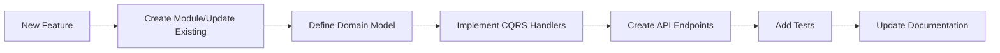

# 🚀 Axon Backend - Technical Documentation Hub

> **Comprehensive technical documentation for the Axon Backend system - A state-of-the-art modular monolith built with .NET 10, Clean Architecture, CQRS, and Domain-Driven Design**

## 📚 Documentation Index

### Core Documentation

| Document | Description | Status |
|----------|-------------|--------|
| [**Coding Practices & Standards**](01_CODING_PRACTICES.md) | Comprehensive guide to coding standards, conventions, patterns, and best practices | ✅ Complete |
| [**System Architecture**](02_ARCHITECTURE.md) | Detailed architecture documentation including Clean Architecture, CQRS, Modular Monolith design | ✅ Complete |
| [**Building Blocks Reference**](03_BUILDING_BLOCKS.md) | Complete reference for all reusable components, patterns, and infrastructure | ✅ Complete |
| [**Libraries & Dependencies**](04_LIBRARIES_AND_DEPENDENCIES.md) | Comprehensive list of all libraries, versions, and usage patterns | ✅ Complete |

### Quick Navigation

- 🏗️ [Architecture Overview](#architecture-overview)
- 💻 [Development Guidelines](#development-guidelines)
- 🧱 [Building Blocks](#building-blocks)
- 📦 [Technology Stack](#technology-stack)
- 🚀 [Getting Started](#getting-started)
- 📖 [Additional Resources](#additional-resources)

## Architecture Overview

### System Design Principles
- **Modular Monolith**: Single deployable unit with strong module boundaries
- **Clean Architecture**: Dependency inversion and separation of concerns
- **Domain-Driven Design**: Rich domain models with business logic encapsulation
- **CQRS Pattern**: Separate read and write models for scalability
- **Event-Driven**: Loose coupling through domain and integration events

### Key Components
```
┌─────────────────────────────────────┐
│         API Gateway Layer           │
│     (FastEndpoints, Auth, RL)       │
└─────────────────────────────────────┘
                 ↓
┌─────────────────────────────────────┐
│         Business Modules            │
│   (Chat, Identity, Future...)       │
└─────────────────────────────────────┘
                 ↓
┌─────────────────────────────────────┐
│        Building Blocks              │
│   (Core, CQRS, Events, Cache)       │
└─────────────────────────────────────┘
                 ↓
┌─────────────────────────────────────┐
│        Infrastructure               │
│  (PostgreSQL, Redis, RabbitMQ)      │
└─────────────────────────────────────┘
```

## Development Guidelines

### Essential Reading Order
1. **Start Here**: [Coding Practices & Standards](01_CODING_PRACTICES.md)
   - Core philosophy and principles
   - Naming conventions and code organization
   - Error handling and validation patterns

2. **Understand the Architecture**: [System Architecture](02_ARCHITECTURE.md)
   - Clean Architecture implementation
   - Module boundaries and communication
   - CQRS and Event Sourcing patterns

3. **Use Building Blocks**: [Building Blocks Reference](03_BUILDING_BLOCKS.md)
   - Base entities and aggregates
   - CQRS infrastructure
   - Cross-cutting concerns

4. **Know Your Tools**: [Libraries & Dependencies](04_LIBRARIES_AND_DEPENDENCIES.md)
   - Package versions and configurations
   - Usage patterns and best practices

### Development Workflow



## Building Blocks

### Core Components
- **Base Entities**: `BaseEntity<TId>`, `BaseAuditableEntity<TId>`
- **Aggregates**: `BaseAggregate<TId>`, `BaseAuditableAggregate<TId>`
- **Strong IDs**: Type-safe identifiers with `IStrongId<TValue>`
- **Value Objects**: Immutable domain primitives
- **Result Pattern**: Explicit error handling without exceptions

### CQRS Infrastructure
- **Commands**: `ICommand<TResponse>`, `ICommandHandler<TCommand, TResponse>`
- **Queries**: `IQuery<TResponse>`, `IQueryHandler<TQuery, TResponse>`
- **Pipeline Behaviors**: Validation, Logging, Transaction, Metrics
- **Event System**: Domain events and integration events

### Cross-Cutting Concerns
- **Validation**: FluentValidation with async rules
- **Caching**: Multi-level caching (L1 Memory + L2 Redis)
- **Resilience**: Polly for retry and circuit breaker
- **Observability**: OpenTelemetry for tracing and metrics

## Technology Stack

### Core Technologies
| Category | Technology | Version |
|----------|------------|---------|
| **Runtime** | .NET | 10.0 |
| **Language** | C# | 13 |
| **Database** | PostgreSQL | 16 |
| **Cache** | Redis | Latest |
| **Message Broker** | RabbitMQ | Latest |
| **Event Store** | EventStore | 23.3.7 |

### Key Libraries
| Library | Purpose | Version |
|---------|---------|---------|
| **MediatR** | CQRS Mediator | 13.0.0 |
| **Entity Framework Core** | ORM | 9.0.0 |
| **FluentValidation** | Validation | 11.11.0 |
| **Mapster** | Object Mapping | 7.4.0 |
| **MassTransit** | Message Bus | 8.3.6 |
| **Polly** | Resilience | 8.5.0 |
| **OpenTelemetry** | Observability | 1.11.1 |

## Getting Started

### Prerequisites
- .NET 10 SDK
- Docker Desktop
- PostgreSQL 16 (or use Docker)
- Redis (or use Docker)
- Your favorite IDE (Visual Studio 2022, Rider, VS Code)

### Quick Start
```bash
# Clone repository
git clone https://github.com/your-org/axon-backend.git

# Navigate to project
cd axon-backend

# Restore dependencies
dotnet restore

# Run database migrations
dotnet ef database update -p src/Modules/Chat/Infrastructure -s src/Api

# Run the application
dotnet run --project src/Api
```

### Docker Compose Setup
```bash
# Start all infrastructure services
docker-compose up -d

# Run application
dotnet run --project src/Api
```

## Module Structure

### Current Modules
- **Chat Module**: Real-time conversation management with AI integration
- **Identity Module**: Authentication, authorization, and user management

### Module Template
```
src/Modules/[ModuleName]/
├── Domain/              # Pure business logic
├── Application/         # Use cases and orchestration
└── Infrastructure/      # External concerns
```

## Testing Strategy

### Test Pyramid
```
        /\
       /  \  E2E Tests (5%)
      /    \
     /──────\ Integration Tests (25%)
    /        \
   /──────────\ Unit Tests (70%)
```

### Test Categories
- **Unit Tests**: Domain logic, handlers, services
- **Integration Tests**: API endpoints, database operations
- **Architecture Tests**: Dependency rules, conventions

## Contributing

### Pull Request Process
1. Create feature branch from `main`
2. Follow coding standards in documentation
3. Write tests for new functionality
4. Update relevant documentation
5. Submit PR with detailed description

### Documentation Updates
When updating documentation:
1. Keep language clear and concise
2. Include code examples
3. Update table of contents
4. Maintain consistent formatting

## Additional Resources

### Internal Documentation
- [Test Architecture](../../tests/TestArchitecture.md)
- [Migration Guide](../../src/BuildingBlocks/MIGRATION_GUIDE.md)
- [API Documentation](http://localhost:5000/swagger)

### External Resources
- [Clean Architecture by Robert C. Martin](https://blog.cleancoder.com/uncle-bob/2012/08/13/the-clean-architecture.html)
- [Domain-Driven Design by Eric Evans](https://www.domainlanguage.com/ddd/)
- [CQRS Journey by Microsoft](https://docs.microsoft.com/en-us/previous-versions/msp-n-p/jj554200(v=pandp.10))
- [.NET Documentation](https://docs.microsoft.com/en-us/dotnet/)

## Version History

| Version | Date | Changes |
|---------|------|---------|
| 1.0.0 | August 2025 | Initial comprehensive documentation |

## Support

For questions or issues:
- Check existing documentation
- Review code examples in tests
- Contact the architecture team

---

**📝 Note**: This documentation is living and should be updated as the system evolves. Each team member is responsible for maintaining documentation for their contributions.

**🎯 Mission**: Build a maintainable, scalable, and robust system that serves as the foundation for AI-powered conversational experiences.

---

*Copyright © 2025 Axon Backend Team. All rights reserved.*