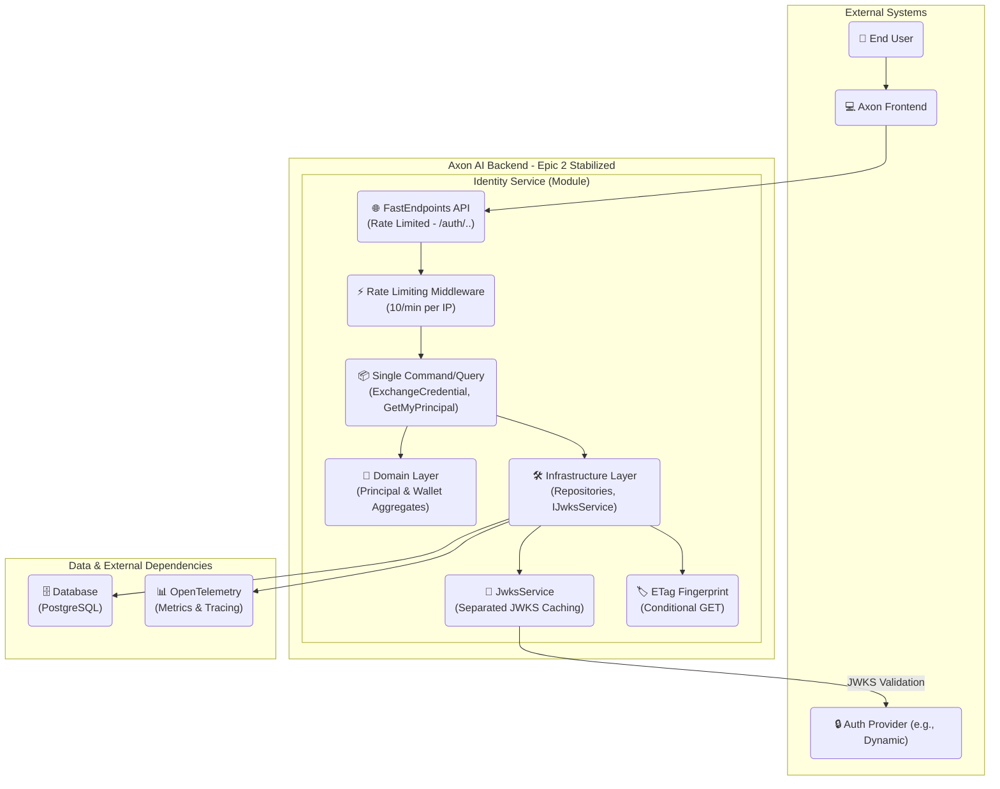

# 2. High-Level Architecture

## Technical Summary (Epic 2 Stabilized)

The Identity service is a stateless module within the **Axon-Backend** monorepo with **simplified architecture**. The **Principal** aggregate root owns **Credentials**, **WalletOwnerships**, and **ChainDefaults**. Epic 2 eliminated dual command patterns and separated service concerns for production readiness.

**Architecture Layers:**
* **API Layer:** FastEndpoints with rate limiting middleware, routes directly to single canonical handlers
* **Application Layer:** Single command/query patterns - `ExchangeCredentialCommand`, `GetMyPrincipalQuery` (eliminated dual patterns)
* **Domain Layer:** Unchanged aggregates and invariants
* **Infrastructure Layer:** Separated concerns with `IJwksService` extraction from `DynamicAuthService`, compiled queries, ETag fingerprinting

## High-Level Overview (Production-Hardened)

* **Style:** Modular monolith module ("Identity"), REST API, stateless, **production-optimized**.
* **Flow (Simplified):** Frontend sends JWT → API routes directly to handler → Single Application command/query → Domain invariants → Infrastructure persistence → Response with metrics/ETags
* **Epic 2 Enhancements:** Rate limiting (10/min per IP), ETag conditional GET, separated JWKS service, comprehensive observability, aggressive dead code removal
* **Non-Negotiables:** Global wallet uniqueness, no silent reassignments (409), idempotency, single command patterns, deterministic ETag caching

## High-Level Project Diagram

## Architectural & Design Patterns (Epic 2 Refined)

* **Clean Architecture:** API → Application (Single CQRS) → Domain (Aggregates) ← Infrastructure (separated services).
* **DDD:** `AxonPrincipal` aggregate root enforces invariants for credentials, wallet ownership, defaults.
* **CQRS Simplified:** Single canonical handlers - `ExchangeCredentialCommand` (write), `GetMyPrincipalQuery` (read) - **dual patterns eliminated**.
* **Separated Concerns:** `DynamicAuthService` focused on JWT validation, `IJwksService` handles JWKS caching with Polly retry policies.
* **Stateless Service:** Validate provider JWT on every request; no server tokens/cookies; ETag-based caching.
* **Repository Pattern:** Application depends on interfaces; Infrastructure implements with EF Core compiled queries and batch operations.
* **Result Pattern:** Consistent `Result<TSuccess, TError>` for all business outcomes and error handling.
* **Rate Limiting:** ASP.NET Core middleware with per-IP tracking and proper HTTP headers.

---
