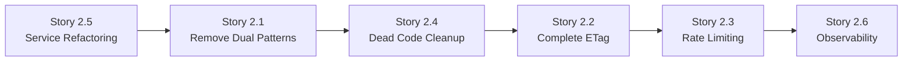

# 22. Next Steps (Epic 2 Implementation Priorities)

## Immediate Epic 2 Priorities (Critical Path)

**Phase 1: Service Simplification (Story 2.5)**
1. **Extract IJwksService from DynamicAuthService** - Create separate service for JWKS caching with Polly retry policies
2. **Simplify DynamicAuthService** - Focus solely on JWT validation logic, removing JWKS management
3. **Add comprehensive unit tests** - Achieve >90% coverage on both services

**Phase 2: Architecture Cleanup (Story 2.1, 2.4)**
1. **Remove dual patterns** - Delete ExchangeTokenCommand, GetCurrentUserQuery folders completely
2. **Update API endpoints** - Route ExchangeEndpoint and MeEndpoint directly to single canonical handlers  
3. **Aggressive dead code removal** - Delete EmailHash value object, unused validation helpers, clean imports
4. **Eliminate build warnings** - Clean up all compiler warnings and generated artifacts

**Phase 3: Production Features (Stories 2.2, 2.3, 2.6)**
1. **Complete ETag implementation** - Add If-None-Match header support and 304 Not Modified responses
2. **Implement rate limiting** - ASP.NET Core middleware with 10/min per IP for /auth/exchange
3. **Add observability** - Correlation IDs, metrics (exchange_success/failure, etag_hits/misses), structured logging

## Implementation Sequence Recommendation

## Validation & Testing

1. **Integration tests for complete workflows** - Exchange flow, ETag 200→304 cycle, rate limiting behavior
2. **Repository method completion** - Implement all remaining contract methods with compiled queries
3. **End-to-end Epic 2 validation** - Verify all architectural improvements work together
4. **Performance benchmarking** - Confirm ETag cache hit ratios and rate limiter overhead < 1ms

## Post-Epic 2 Future Enhancements

- Read replica for `/auth/me` endpoint (performance scaling)
- Advanced rate limiting strategies (user-based, not just IP-based)
- Additional authentication providers beyond Dynamic
- Enhanced audit logging and compliance features

---

## Appendix A — HTTP Error Codes (Canonical)

* `400` Malformed JWT/request
* `401` Invalid/expired JWT
* `409` Wallet ownership conflict (verified & signing already owned)
* `422` Business rule violation (non-conflict)
* `429` Too Many Requests (rate limit)
* `500` Unexpected

## Appendix B — Consistency Guarantees

* **Idempotency:** Unique/partial-unique constraints + upsert patterns + transaction boundaries.
* **Statelessness:** Every call validated by provider JWT; no server tokens.
* **Deterministic Caching:** ETag from DB fingerprint across principal + related rows (verified & signing ownerships + defaults).
* **Privacy:** MVP persists **no contact identifiers**; logs and audits exclude PII.
