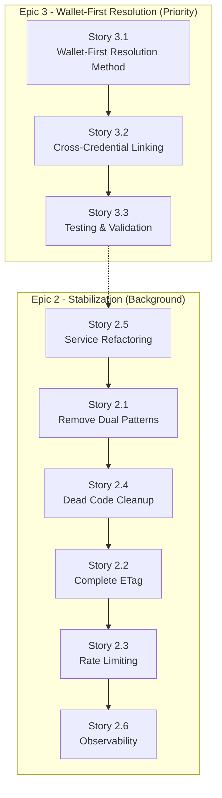

# 22. Next Steps (Epic 3 Implementation Priorities)

## Immediate Epic 3 Priorities (Critical Path) 🎯

**Phase 1: Implement Wallet-First Resolution (Story 3.1)**
1. **Create `ResolveOrCreatePrincipalWalletFirst` method** - Replace credential-first logic at line 148 in `ExchangeCredentialHandler`
2. **Update method signature and integration point** - Modify `ExecuteExchangeTransaction` to use wallet specs for resolution
3. **Handle wallet ownership conflicts** - Use existing `IsCredentialTakenAsync` for conflict detection

**Phase 2: Cross-Credential Linking (Story 3.2)**
1. **Implement credential addition logic** - Add new credentials to existing principals found via wallet
2. **Enhance conflict detection** - Prevent credential hijacking across principals
3. **Update integration logic** - Ensure idempotency when same credential is processed multiple times

**Phase 3: Testing & Validation (Story 3.3)**
1. **Unit tests for wallet resolution** - Test scenarios where wallet matches existing principal
2. **Integration tests for cross-auth** - Validate Google → Dynamic → Wallet auth flows resolve to same principal
3. **Conflict handling tests** - Ensure proper error handling for credential conflicts

## Epic 2 Implementation Status (Background Tasks)

**Phase 1: Service Simplification (Story 2.5)**
1. **Extract IJwksService from DynamicAuthService** - Create separate service for JWKS caching with Polly retry policies
2. **Simplify DynamicAuthService** - Focus solely on JWT validation logic, removing JWKS management
3. **Add comprehensive unit tests** - Achieve >90% coverage on both services

**Phase 2: Architecture Cleanup (Story 2.1, 2.4)**
1. **Remove dual patterns** - Delete ExchangeTokenCommand, GetCurrentUserQuery folders completely
2. **Update API endpoints** - Route ExchangeEndpoint and MeEndpoint directly to single canonical handlers
3. **Aggressive dead code removal** - Delete EmailHash value object, unused validation helpers, clean imports
4. **Eliminate build warnings** - Clean up all compiler warnings and generated artifacts

**Phase 3: Production Features (Stories 2.2, 2.3, 2.6)**
1. **Complete ETag implementation** - Add If-None-Match header support and 304 Not Modified responses
2. **Implement rate limiting** - ASP.NET Core middleware with 10/min per IP for /auth/exchange
3. **Add observability** - Correlation IDs, metrics (exchange_success/failure, etag_hits/misses), structured logging

## Implementation Sequence Recommendation

**Epic 3 (Priority) → Epic 2 (Background)**



## Epic 3 Validation & Testing

1. **Wallet-First Resolution Tests**
   - User logs in with Google → creates principal with wallet
   - Same user logs in with Dynamic (same wallet) → resolves to same principal, adds Dynamic credential
   - Verify no duplicate principals created

2. **Cross-Credential Linking Tests**
   - Principal A owns wallet X with Google auth
   - Principal B tries to link wallet X with Dynamic auth → should resolve to Principal A, add Dynamic credential
   - Credential conflict detection when credential belongs to different principal

3. **Edge Case Validation**
   - Multiple wallets, some owned, some new
   - Empty wallet list (fallback to credential-only resolution)
   - Invalid wallet addresses handling

## Epic 2/3 Integration Testing

1. **End-to-end workflow validation** - Complete exchange flow with wallet-first resolution
2. **Repository method completion** - All Epic 3 methods implemented with compiled queries
3. **Performance validation** - Wallet lookup adds minimal overhead to exchange flow
4. **ETag compatibility** - Wallet-first resolution doesn't break ETag caching

## Future Enhancements (Post-Epic 3)

- **Solana Sign-In Integration** - Direct wallet signature authentication without OAuth providers
- **Advanced wallet verification** - On-chain signature verification for ownership proof
- **Multi-provider wallet support** - Ethereum, Polygon, BSC wallet resolution
- **Enhanced audit logging** - Complete audit trail for identity resolution paths

---

## Appendix A — HTTP Error Codes (Canonical)

* `400` Malformed JWT/request
* `401` Invalid/expired JWT
* `409` Wallet ownership conflict (verified & signing already owned)
* `422` Business rule violation (non-conflict)
* `429` Too Many Requests (rate limit)
* `500` Unexpected

## Appendix B — Consistency Guarantees

* **Idempotency:** Unique/partial-unique constraints + upsert patterns + transaction boundaries.
* **Statelessness:** Every call validated by provider JWT; no server tokens.
* **Deterministic Caching:** ETag from DB fingerprint across principal + related rows (verified & signing ownerships + defaults).
* **Privacy:** MVP persists **no contact identifiers**; logs and audits exclude PII.
* **Wallet-First Resolution:** Epic 3 ensures single identity per wallet set, preventing authentication method fragmentation.

## Appendix C — Epic 3 Wallet-First Resolution Algorithm

**Core Logic Flow:**
1. **Wallet Check Phase**: For each wallet in request, query `FindByWalletIdAsync` to find existing owner
2. **Principal Resolution**: If wallet owner found, use that principal; otherwise fallback to credential lookup
3. **Credential Addition**: If using existing principal, add new credential if not already present
4. **Conflict Detection**: Use `IsCredentialTakenAsync` to prevent credential hijacking
5. **Idempotent Completion**: Process remaining wallets and apply defaults as normal

**Method Signature (Implementation Target):**
```csharp
private async Task<Result<(AxonPrincipal, bool), Error>> ResolveOrCreatePrincipalWalletFirst(
    ProviderType providerType,
    string issuer,
    string subject,
    List<(string chainId, Address address)> walletSpecs,
    CancellationToken cancellationToken)
```

**Integration Point:**
- Replace line 148-149 in `ExchangeCredentialHandler.ExecuteExchangeTransaction`
- Parse wallet specs from `userData.Wallets` before principal resolution
- Maintain backward compatibility when no wallets provided (credential-only path)
