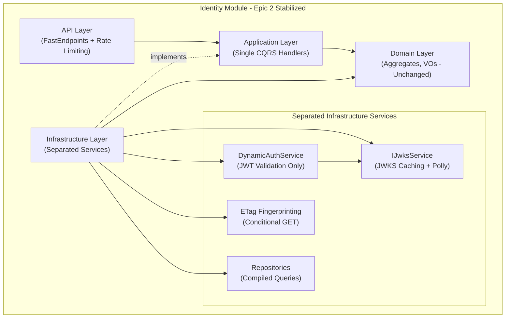

# 5. Components (Epic 2 Simplified Architecture)

**Epic 2 Component Responsibilities:**

* **API Layer:** FastEndpoints with rate limiting middleware (10/min per IP), direct routing to single handlers, ETag header management.
* **Application Layer:** **Simplified** - Single canonical handlers (`ExchangeCredentialCommand`, `GetMyPrincipalQuery`), eliminated dual patterns.
* **Domain Layer:** **Unchanged** - Aggregates + invariants (pure C#).
* **Infrastructure Layer (Refactored):**
  * **DynamicAuthService:** Focused solely on JWT validation logic
  * **IJwksService:** Extracted JWKS caching, key rotation, Polly retry policies  
  * **ETag Service:** Deterministic fingerprint generation for conditional GET
  * **Repositories:** Enhanced with compiled queries, batch operations, ETag support
  * **Observability:** OpenTelemetry tracing, metrics, structured logging with correlation IDs

---
