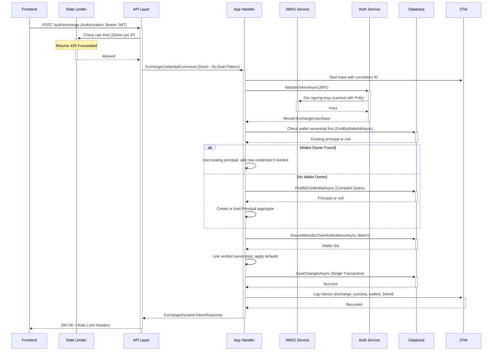

# 7. Core Workflows

## New User Credential Exchange (`POST /auth/exchange`) - Epic 3 Wallet-First Resolution



## Existing User Identity Retrieval (`GET /auth/me`) - Epic 2 with ETag Optimization

```mermaid
sequenceDiagram
    participant Frontend
    participant API Layer
    participant App Handler
    participant Auth Service
    participant ETag Service
    participant Database
    participant OTel

    Frontend->>+API Layer: GET /auth/me (Authorization: Bearer JWT, If-None-Match: "etag-hash")
    API Layer->>+App Handler: GetMyPrincipalQuery (Direct - Single Pattern)
    App Handler->>+OTel: Start trace with correlation ID

    App Handler->>+Auth Service: ValidateTokenAsync(JWT)
    Note over Auth Service: Uses cached JWKS via IJwksService
    Auth Service-->>-App Handler: Claims (iss, sub, provider)

    App Handler->>+Database: FindByCredentialAsync (Compiled Query)
    Database-->>-App Handler: Principal ID

    App Handler->>+ETag Service: GetPrincipalFingerprintAsync(principalId)
    ETag Service->>+Database: SELECT fingerprint (compiled query)
    Note over ETag Service: Hash: principal.updated_at + verified ownerships + defaults
    Database-->>-ETag Service: Current ETag hash
    ETag Service-->>-App Handler: Current ETag

    alt ETag matches If-None-Match
        App Handler->>+OTel: Log metric (etag_hit)
        OTel-->>-App Handler: Recorded
        App Handler-->>-API Layer: 304 Not Modified (No body)
        API Layer-->>-Frontend: 304 Not Modified
    else ETag different or missing
        App Handler->>+Database: GetByIdWithActiveOwnershipsAsync (Compiled Query)
        Database-->>-App Handler: Principal + Ownerships + Defaults
        
        App Handler->>+OTel: Log metric (etag_miss)
        OTel-->>-App Handler: Recorded
        App Handler-->>-API Layer: 200 + ETag Header + CurrentUserResult
        API Layer-->>-Frontend: 200 OK + ETag + Cache-Control: private, max-age=0
    end
```

---
