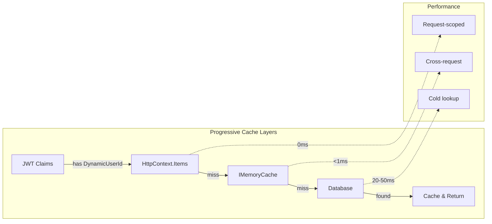

# 7.1 Smart Caching Architecture (Epic 4)

## Progressive Cache Hierarchy

Epic 4 introduces a three-tier caching system that dramatically improves identity resolution performance:



## Cache Key Patterns & TTL Strategy

**Dynamic → Axon Mapping Cache:**
```
Key Pattern: axon:user:{dynamicUserId}
Value: AxonUserId
TTL: 15 minutes sliding, 15 minutes absolute
Population: Exchange endpoint + on-demand resolution
```

**Request-Scoped Cache:**
```
Storage: HttpContext.Items["AxonUserId"]
Lifetime: Single HTTP request
Purpose: Eliminate multiple database queries within same request
```

## HttpContextUserService - Epic 4 Brutal Refactoring

**CURRENT STATE**: HttpContextUserService has NO caching, NO async methods, NO AxonUserId support.

**BRUTAL REFACTORING - COMPLETE REPLACEMENT:**

```csharp
public sealed class HttpContextUserService : ICurrentUserService
{
    private readonly IHttpContextAccessor _httpContextAccessor;
    private readonly IMemoryCache _memoryCache;
    private readonly IAxonPrincipalReadRepository _principalRepo;
    private readonly ILogger<HttpContextUserService> _logger;

    // METRICS for monitoring cache performance
    private static readonly Counter<long> CacheHitCounter =
        Meter.CreateCounter<long>("axon.identity.cache_hits");
    private static readonly Counter<long> CacheMissCounter =
        Meter.CreateCounter<long>("axon.identity.cache_misses");
    private static readonly Histogram<double> ResolutionLatency =
        Meter.CreateHistogram<double>("axon.identity.resolution_duration_ms");

    public HttpContextUserService(
        IHttpContextAccessor httpContextAccessor,
        IMemoryCache memoryCache,
        IAxonPrincipalReadRepository principalRepo,
        ILogger<HttpContextUserService> logger)
    {
        _httpContextAccessor = httpContextAccessor;
        _memoryCache = memoryCache;
        _principalRepo = principalRepo;
        _logger = logger;
    }

    // EXISTING properties remain unchanged for backward compatibility
    public string? UserId { get; /* existing JWT claims logic */ }
    public string? UserName { get; /* existing JWT claims logic */ }
    public bool IsAuthenticated { get; /* existing JWT claims logic */ }
    public string GetUserIdOrDefault(string systemUserId = "SYSTEM") { /* existing */ }
    public string GetCurrentUserIdOrSystem() { /* existing */ }

    // NEW Epic 4 methods - COMPLETE IMPLEMENTATION
    public async Task<AxonUserId?> GetAxonUserIdAsync(CancellationToken ct = default)
    {
        using var activity = Activity.Current?.Source.StartActivity("GetAxonUserIdAsync");
        var stopwatch = Stopwatch.StartNew();

        try
        {
            // Layer 1: Request-scoped cache (0ms)
            if (_httpContextAccessor.HttpContext?.Items.TryGetValue("AxonUserId", out var cached) == true)
            {
                activity?.SetTag("cache_source", "request");
                CacheHitCounter.Add(1, new KeyValuePair<string, object?>("source", "request"));
                _logger.LogDebug("AxonUserId cache hit (request-scoped)");
                return (AxonUserId)cached;
            }

            var dynamicUserId = UserId;
            if (string.IsNullOrEmpty(dynamicUserId))
            {
                activity?.SetTag("cache_source", "none_authenticated");
                return null;
            }

            // Layer 2: Memory cache (<1ms)
            var cacheKey = $"axon:user:{dynamicUserId}";
            var axonUserId = await _memoryCache.GetOrCreateAsync(
                cacheKey,
                async entry =>
                {
                    activity?.SetTag("cache_source", "database");
                    CacheMissCounter.Add(1);
                    _logger.LogDebug("AxonUserId cache miss, fetching from database for {DynamicUserId}", dynamicUserId);

                    entry.SetSlidingExpiration(TimeSpan.FromMinutes(15));
                    entry.SetAbsoluteExpirationRelativeToNow(TimeSpan.FromMinutes(30));
                    entry.SetPriority(CacheItemPriority.High);

                    // Layer 3: Database (20-50ms) - Use EXISTING method, NO new repository method needed
                    var principal = await _principalRepo.FindByCredentialAsync(
                        ProviderType.Dynamic,
                        "https://app.dynamic.xyz", // Standard Dynamic issuer
                        dynamicUserId,
                        ct);

                    return principal?.Id;
                });

            // Store in request cache for subsequent calls in same request
            if (axonUserId.HasValue && _httpContextAccessor.HttpContext != null)
            {
                _httpContextAccessor.HttpContext.Items["AxonUserId"] = axonUserId.Value;
                activity?.SetTag("cache_source", "memory");
                CacheHitCounter.Add(1, new KeyValuePair<string, object?>("source", "memory"));
            }

            return axonUserId;
        }
        finally
        {
            ResolutionLatency.Record(stopwatch.Elapsed.TotalMilliseconds);
        }
    }

    public bool TryGetAxonUserId(out AxonUserId axonUserId)
    {
        // Request cache check (fastest path)
        if (_httpContextAccessor.HttpContext?.Items.TryGetValue("AxonUserId", out var cached) == true)
        {
            axonUserId = (AxonUserId)cached;
            CacheHitCounter.Add(1, new KeyValuePair<string, object?>("source", "request_sync"));
            return true;
        }

        // Memory cache check (sync only - NO database fallback)
        var dynamicUserId = UserId;
        if (!string.IsNullOrEmpty(dynamicUserId))
        {
            var cacheKey = $"axon:user:{dynamicUserId}";
            if (_memoryCache.TryGetValue(cacheKey, out AxonUserId cachedId))
            {
                axonUserId = cachedId;
                // Also store in request cache for next call
                if (_httpContextAccessor.HttpContext != null)
                {
                    _httpContextAccessor.HttpContext.Items["AxonUserId"] = cachedId;
                }
                CacheHitCounter.Add(1, new KeyValuePair<string, object?>("source", "memory_sync"));
                return true;
            }
        }

        axonUserId = default;
        return false;
    }
}
```

## 🚨 Critical Cache Warming Implementation (Epic 4 Requirement)

**CRITICAL FINDING**: The `ExchangeCredentialHandler` at `src/Modules/Identity/Application/Commands/ExchangeCredential/ExchangeCredentialHandler.cs` currently has **NO cache warming implementation**. This completely breaks Epic 4 performance promise.

**REQUIRED IMPLEMENTATION** (Add after line 188 in ExchangeCredentialHandler.ExecuteExchangeTransaction):

```csharp
// CRITICAL: Add these dependencies to ExchangeCredentialHandler constructor
private readonly IMemoryCache _memoryCache;
private readonly IHttpContextAccessor _httpContextAccessor;

// NEW METHOD: Cache warming implementation
private async Task WarmUserContextCaches(string dynamicUserId, AxonUserId axonUserId)
{
    using var activity = Activity.Current?.Source.StartActivity("WarmUserContextCaches");
    activity?.SetTag("dynamic_user_id", dynamicUserId);
    activity?.SetTag("axon_user_id", axonUserId.Value);

    // Warm memory cache for cross-request access
    var cacheKey = $"axon:user:{dynamicUserId}";
    _memoryCache.Set(cacheKey, axonUserId, new MemoryCacheEntryOptions
    {
        SlidingExpiration = TimeSpan.FromMinutes(15),
        AbsoluteExpirationRelativeToNow = TimeSpan.FromMinutes(30),
        Priority = CacheItemPriority.High
    });

    // Warm request-scoped cache for immediate use
    if (_httpContextAccessor.HttpContext != null)
    {
        _httpContextAccessor.HttpContext.Items["AxonUserId"] = axonUserId;
    }

    _logger.LogInformation("User context cache warmed: {DynamicUserId} -> {AxonUserId}",
        dynamicUserId, axonUserId.Value);
}

// CALL after successful principal resolution (line 188):
await WarmUserContextCaches(userData.UserId, principal.Id);
```

## Chat Module Integration - Epic 4 Brutal Refactoring

**CURRENT STATE**: Chat module still uses `DefaultCurrentUserService` stub and sync UserId pattern.

**BRUTAL REFACTORING REQUIREMENTS**:
- [ ] **BRUTALLY REPLACE** `BaseChatCommandHandler.GetAuthenticatedUserId()` with async version
- [ ] **COMPLETELY REMOVE** `DefaultCurrentUserService` stub
- [ ] **CONVERT ALL** Chat handlers to use AxonUserId instead of UserId
- [ ] **UPDATE DI REGISTRATION** to use Identity module's HttpContextUserService

### BaseChatCommandHandler - COMPLETE REPLACEMENT

```csharp
// src/Modules/Chat/Application/Common/Commands/BaseChatCommandHandler.cs
public abstract class BaseChatCommandHandler<TCommand, TResponse> : IRequestHandler<TCommand, Result<TResponse, Error>>
    where TCommand : ChatBaseCommand<TResponse>
    where TResponse : notnull
{
    private readonly ICurrentUserService _currentUserService;

    protected BaseChatCommandHandler(ICurrentUserService currentUserService)
    {
        _currentUserService = currentUserService;
    }

    // OLD METHOD - DELETE COMPLETELY
    // protected UserId GetAuthenticatedUserId() { ... }

    // NEW METHOD - BRUTAL REPLACEMENT
    /// <summary>
    /// Gets the authenticated user's AxonUserId with smart caching support.
    /// Throws UnauthorizedAccessException if AxonUserId cannot be resolved.
    /// </summary>
    protected async Task<AxonUserId> GetAuthenticatedAxonUserIdAsync(CancellationToken ct = default)
    {
        var axonUserId = await _currentUserService.GetAxonUserIdAsync(ct);
        if (!axonUserId.HasValue)
        {
            throw new UnauthorizedAccessException("AxonUserId not resolved for authenticated user");
        }

        return axonUserId.Value;
    }

    public abstract Task<Result<TResponse, Error>> Handle(TCommand request, CancellationToken cancellationToken);
}
```

### Chat ServiceRegistration - BRUTAL DI CHANGE

```csharp
// src/Modules/Chat/Infrastructure/DependencyInjection/ServiceRegistration.cs
public static IServiceCollection AddChatInfrastructure(
    this IServiceCollection services,
    IConfiguration configuration)
{
    // ... existing registrations ...

    // OLD REGISTRATION - DELETE COMPLETELY
    // services.AddScoped<ICurrentUserService, DefaultCurrentUserService>();

    // NEW APPROACH - Use Identity module's service
    // NOTE: ICurrentUserService is now provided by Identity module's HttpContextUserService
    // Chat module leverages shared cached identity resolution for 50x performance improvement

    // ... rest of registrations ...
}
```

### DefaultCurrentUserService - DELETE COMPLETELY

```csharp
// DELETE FILE: src/Modules/Chat/Infrastructure/Services/Identity/DefaultCurrentUserService.cs
// This stub service is no longer needed - Identity module provides real implementation
```

### All Chat Handlers - BRUTAL METHOD REPLACEMENT

**Example Handler Update:**
```csharp
// BEFORE (in all handlers):
public override async Task<Result<StartConversationResponse, Error>> Handle(
    StartConversationCommand request,
    CancellationToken cancellationToken)
{
    var userId = GetAuthenticatedUserId(); // OLD - DELETE
    // ... rest of handler
}

// AFTER (brutal replacement in ALL handlers):
public override async Task<Result<StartConversationResponse, Error>> Handle(
    StartConversationCommand request,
    CancellationToken cancellationToken)
{
    var axonUserId = await GetAuthenticatedAxonUserIdAsync(cancellationToken); // NEW
    // ... rest of handler using axonUserId instead of userId
}
```

**HANDLERS TO UPDATE**:
- StartConversationHandler
- SendMessageHandler
- GetConversationHandler
- ListConversationsHandler
- All other chat command handlers

### Domain Model Updates - AxonUserId Integration

```csharp
// Update Conversation aggregate to use AxonUserId
public class Conversation : AggregateRoot<ConversationId>
{
    public AxonUserId UserId { get; private set; } // Changed from UserId to AxonUserId

    // Constructor and methods updated to use AxonUserId
    public static Result<Conversation, Error> Create(
        ConversationId id,
        AxonUserId axonUserId, // Changed parameter type
        string title,
        TimeProvider timeProvider)
    {
        // Implementation using AxonUserId
    }
}
```

## Performance Impact - Epic 4 Refined Targets

| Operation | Before Epic 4 | After Epic 4 | Improvement | Method |
|-----------|--------------|--------------|-------------|---------|
| Identity Resolution (cached) | 50ms | **<1ms** | **50x** | Memory cache hit |
| Identity Resolution (cold) | 50ms | **20ms** | **2.5x** | Optimized FindByCredentialAsync |
| Same-request calls | 50ms each | **0ms** | **∞** | HttpContext.Items |
| Cache Hit Rate | 0% | **>95%** | N/A | Exchange endpoint warming |
| Database Load Reduction | 100% | **<5%** | **20x** | Cache effectiveness |

## Infrastructure Requirements - Epic 4 Clarification

**Zero New Dependencies**: Epic 4 leverages existing infrastructure:
- ✅ `IMemoryCache` already registered in both Identity and Chat modules
- ✅ `IHttpContextAccessor` available in `HttpContextUserService`
- ✅ Repository patterns established for `FindByCredentialAsync`
- ✅ **NO new repository method needed**: Uses existing `FindByCredentialAsync` with Dynamic provider

---
