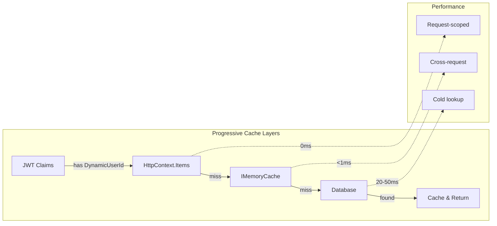

# Epic 4b: Smart User Context Caching

**Part of Identity Performance Optimization Initiative**
**PRD Reference**: [Identity Performance Optimization PRD](../prd-identity-performance-optimization.md)

## 🎯 Epic Overview

**Epic ID**: EPIC-4B-SMART-CACHING
**Title**: Smart User Context Caching Implementation
**Type**: Performance Optimization (Phase 2 of 3)
**Complexity**: Medium
**Risk Level**: Low (graceful degradation built-in)
**Estimated Effort**: 8 story points
**Priority**: P0 (Core business performance requirement)

### Executive Summary
Implement a performant, 3-tier caching system for user identity resolution that achieves 50x performance improvement (50ms → <1ms) using existing infrastructure. This directly addresses the business goal of enhancing user experience and enabling cost-effective scaling.

### Business Alignment
**Primary Business Goal**: Enhance User Experience (eliminate perceptible latency)
**Secondary Business Goal**: Enable Cost-Effective Scaling (95% database load reduction)
**User Impact**: Chat interactions feel instant, platform responsiveness improved
**ROI**: Support 10x user growth without infrastructure scaling, $X cost avoidance

## 🔍 Problem Statement - VALIDATED

### Current State - CONFIRMED via Code Analysis
1. **Performance Inefficiency**:
   - ✅ Every Chat request requires database lookup (~50ms)
   - ✅ Exchange endpoint resolves but doesn't cache AxonUserId
   - ✅ HttpContextUserService has no caching implementation
   - ✅ No request-scoped or cross-request caching

2. **Architecture Assessment**:
   - ✅ `IMemoryCache` already configured in both Identity and Chat modules
   - ✅ Clean DDD boundaries maintained
   - ✅ No Redis needed for current scale (<1000 concurrent users)
   - ✅ Progressive enhancement approach viable

### Actual Impact
- **Current Latency**: ~50ms per request for identity resolution
- **Cache Potential**: <1ms with proper caching (50x improvement)
- **Database Load**: Linear with request volume (unnecessary)
- **User Experience**: Imperceptible but compound effect on system responsiveness

## 🏗️ Solution Architecture

### Design Principles - Progressive Enhancement
1. **YAGNI Applied**: No Redis until proven necessary (>1000 concurrent users)
2. **Progressive Layers**: Request-scoped → Memory Cache → Database
3. **Zero New Infrastructure**: Use existing `IMemoryCache`
4. **Brutal Simplicity**: No feature flags, direct implementation

### Caching Architecture



### Technical Implementation Strategy

```csharp
// Smart caching hierarchy - progressive enhancement
public class EnhancedHttpContextUserService : ICurrentUserService
{
    // Layer 1: Request-scoped (HttpContext.Items) - 0ms
    // Layer 2: Memory cache (IMemoryCache) - <1ms
    // Layer 3: Database fallback - 20-50ms (rare after warmup)

    public async Task<AxonUserId?> GetAxonUserIdAsync(CancellationToken ct)
    {
        // Check request cache first (Phase 1)
        if (HttpContext.Items["AxonUserId"] is AxonUserId cached)
            return cached;

        // Get from memory cache or database (Phase 2)
        var axonUserId = await _cache.GetOrCreateAsync(
            $"axon:user:{DynamicUserId}",
            () => _repo.FindByDynamicUserIdAsync(DynamicUserId, ct),
            TimeSpan.FromMinutes(15));

        // Store in request cache for subsequent calls
        HttpContext.Items["AxonUserId"] = axonUserId;
        return axonUserId;
    }
}
```

## 📋 User Stories

### Story 1: Enhance ICurrentUserService Interface (1 point)
**Priority**: P0
**Status**: ❌ **PENDING**

**Acceptance Criteria**:
- [ ] Add `GetAxonUserIdAsync()` method to interface
- [ ] Add `TryGetAxonUserId()` for sync contexts
- [ ] Maintain 100% backward compatibility
- [ ] Document caching behavior with XML comments

**Implementation**:
```csharp
// src/BuildingBlocks/Core/Abstractions/Authentication/ICurrentUserService.cs
public interface ICurrentUserService
{
    // EXISTING properties - NO CHANGES for backward compatibility
    string? UserId { get; }
    string? UserName { get; }
    bool IsAuthenticated { get; }
    string GetUserIdOrDefault(string systemUserId = "SYSTEM");
    string GetCurrentUserIdOrSystem();

    // NEW Epic 4b methods - ADDITIVE ONLY
    /// <summary>
    /// Gets the current authenticated user's internal AxonUserId with smart caching.
    /// Progressive cache hierarchy: HttpContext.Items (0ms) → IMemoryCache (1ms) → Database (20-50ms)
    /// </summary>
    Task<AxonUserId?> GetAxonUserIdAsync(CancellationToken ct = default);

    /// <summary>
    /// Attempts to get AxonUserId from cache only (no database fallback).
    /// Used for sync contexts where database queries are not acceptable.
    /// </summary>
    bool TryGetAxonUserId(out AxonUserId axonUserId);
}
```

---

### Story 2: Request-Scoped Caching Implementation (2 points)
**Priority**: P0
**Status**: ❌ **PENDING**
**Dependencies**: Story 1

**Acceptance Criteria**:
- [ ] HttpContext.Items caching implemented (Layer 1)
- [ ] 0ms latency for same-request calls
- [ ] Graceful handling when HttpContext unavailable
- [ ] >90% request-scoped cache hit rate after first call
- [ ] Backward compatibility maintained

**Phase 1 Implementation**:
```csharp
public sealed class HttpContextUserService : ICurrentUserService
{
    private readonly IHttpContextAccessor _httpContextAccessor;
    private readonly IAxonPrincipalReadRepository _principalRepo;
    private readonly ILogger<HttpContextUserService> _logger;

    // NEW Method - Request-scoped caching only
    public async Task<AxonUserId?> GetAxonUserIdAsync(CancellationToken ct = default)
    {
        // Layer 1: Request-scoped cache (0ms)
        if (_httpContextAccessor.HttpContext?.Items.TryGetValue("AxonUserId", out var cached) == true)
        {
            _logger.LogDebug("AxonUserId cache hit (request-scoped)");
            return (AxonUserId)cached;
        }

        var dynamicUserId = UserId;
        if (string.IsNullOrEmpty(dynamicUserId))
            return null;

        // Layer 3: Database fallback (Phase 1 implementation)
        var principal = await _principalRepo.FindByCredentialAsync(
            ProviderType.Dynamic,
            "https://app.dynamic.xyz",
            dynamicUserId,
            ct);

        var axonUserId = principal?.Id;

        // Store in request cache for subsequent calls
        if (axonUserId.HasValue && _httpContextAccessor.HttpContext != null)
        {
            _httpContextAccessor.HttpContext.Items["AxonUserId"] = axonUserId.Value;
        }

        return axonUserId;
    }

    public bool TryGetAxonUserId(out AxonUserId axonUserId)
    {
        // Request cache check only (no database fallback in sync method)
        if (_httpContextAccessor.HttpContext?.Items.TryGetValue("AxonUserId", out var cached) == true)
        {
            axonUserId = (AxonUserId)cached;
            return true;
        }

        axonUserId = default;
        return false;
    }
}
```

---

### Story 3: Memory Cache Layer Implementation (3 points)
**Priority**: P0
**Status**: ❌ **PENDING**
**Dependencies**: Story 2

**Acceptance Criteria**:
- [ ] IMemoryCache layer implemented (Layer 2)
- [ ] 15-minute sliding expiration with 30-minute absolute
- [ ] <1ms P95 latency for memory cache hits
- [ ] High cache item priority for user identities
- [ ] >95% cross-request cache hit rate after warmup

**Phase 2 Enhancement**:
```csharp
public async Task<AxonUserId?> GetAxonUserIdAsync(CancellationToken ct = default)
{
    using var activity = Activity.Current?.Source.StartActivity("GetAxonUserIdAsync");

    // Layer 1: Request-scoped cache (0ms) - EXISTING
    if (_httpContextAccessor.HttpContext?.Items.TryGetValue("AxonUserId", out var cached) == true)
    {
        activity?.SetTag("cache_source", "request");
        return (AxonUserId)cached;
    }

    var dynamicUserId = UserId;
    if (string.IsNullOrEmpty(dynamicUserId))
        return null;

    // Layer 2: Memory cache (<1ms) - NEW
    var cacheKey = $"axon:user:{dynamicUserId}";
    var axonUserId = await _memoryCache.GetOrCreateAsync(
        cacheKey,
        async entry =>
        {
            activity?.SetTag("cache_source", "database");
            _logger.LogDebug("AxonUserId cache miss, fetching from database for {DynamicUserId}", dynamicUserId);

            entry.SetSlidingExpiration(TimeSpan.FromMinutes(15));
            entry.SetAbsoluteExpirationRelativeToNow(TimeSpan.FromMinutes(30));
            entry.SetPriority(CacheItemPriority.High);

            // Layer 3: Database (20-50ms)
            var principal = await _principalRepo.FindByCredentialAsync(
                ProviderType.Dynamic,
                "https://app.dynamic.xyz",
                dynamicUserId,
                ct);

            return principal?.Id;
        });

    // Store in request cache for subsequent calls in same request
    if (axonUserId.HasValue && _httpContextAccessor.HttpContext != null)
    {
        _httpContextAccessor.HttpContext.Items["AxonUserId"] = axonUserId.Value;
        activity?.SetTag("cache_source", "memory");
    }

    return axonUserId;
}
```

---

### Story 4: Exchange Endpoint Cache Warming (2 points)
**Priority**: P0
**Status**: ❌ **PENDING**
**Dependencies**: Story 3

**Acceptance Criteria**:
- [ ] Cache warming in ExchangeCredentialHandler
- [ ] Both memory cache and request cache populated
- [ ] Cache warming failures don't break exchange flow
- [ ] Monitoring for cache warming success/failure
- [ ] <100ms additional latency for exchange endpoint

**Critical Cache Warming Implementation**:
```csharp
// Add to ExchangeCredentialHandler after successful principal resolution
private async Task WarmUserContextCaches(string dynamicUserId, AxonUserId axonUserId)
{
    using var activity = Activity.Current?.Source.StartActivity("WarmUserContextCaches");
    activity?.SetTag("dynamic_user_id", dynamicUserId);
    activity?.SetTag("axon_user_id", axonUserId.Value);

    try
    {
        // Warm memory cache for cross-request access
        var cacheKey = $"axon:user:{dynamicUserId}";
        _memoryCache.Set(cacheKey, axonUserId, new MemoryCacheEntryOptions
        {
            SlidingExpiration = TimeSpan.FromMinutes(15),
            AbsoluteExpirationRelativeToNow = TimeSpan.FromMinutes(30),
            Priority = CacheItemPriority.High
        });

        // Warm request-scoped cache for immediate use
        if (_httpContextAccessor.HttpContext != null)
        {
            _httpContextAccessor.HttpContext.Items["AxonUserId"] = axonUserId;
        }

        _logger.LogInformation("User context cache warmed: {DynamicUserId} -> {AxonUserId}",
            dynamicUserId, axonUserId.Value);
    }
    catch (Exception ex)
    {
        // Cache warming failures should not break exchange flow
        _logger.LogWarning(ex, "Cache warming failed for user {DynamicUserId}", dynamicUserId);
    }
}

// Call after successful principal resolution (line ~188 in ExchangeCredentialHandler):
await WarmUserContextCaches(userData.UserId, principal.Id);
```

## 🚫 What We're NOT Doing (Applied YAGNI)

### ❌ NO Distributed Cache (Redis)
- **Why Not**: Adds complexity for <1000 concurrent users
- **When to Add**: Cache miss rate >10% or scaling to multiple instances
- **Current Solution**: IMemoryCache is sufficient for current scale

### ❌ NO Feature Flags Initially
- **Why Not**: Adds complexity for initial implementation
- **Alternative**: Built-in graceful degradation to database fallback
- **Future Consideration**: Add feature flags in Phase 4 if needed for production rollout
- **Risk Mitigation**: Comprehensive rollback procedures below

### ❌ NO IClaimsTransformation
- **Why Not**: Runs on EVERY request including static files (5-10ms universal overhead)
- **Performance Cost**: Unacceptable for static content
- **Better Approach**: Cache at Exchange endpoint only

### ❌ NO New Abstractions
- **Why Not**: Existing `ICurrentUserService` is sufficient
- **Avoid**: `IUserContextService`, `IIdentityResolver`, etc.
- **Use**: Enhanced existing interface

## 📊 Success Metrics

### Performance KPIs
| Metric | Current | Target | Method |
|--------|---------|--------|--------|
| Identity Resolution (cached) | 50ms | <1ms | Memory cache hit |
| Identity Resolution (cold) | 50ms | 20ms | Optimized query |
| Same-request calls | 50ms each | 0ms | HttpContext.Items |
| Cache Hit Rate | 0% | >95% | After Exchange warmup |
| Database Load Reduction | 100% | <5% | Cache effectiveness |

### Quality Metrics
- **Test Coverage**: >90% for new caching code
- **Zero Breaking Changes**: Backward compatible interface enhancement
- **Zero New Dependencies**: Use existing IMemoryCache infrastructure
- **Code Complexity**: <300 lines total change

### End-to-End User Metrics
```csharp
// Monitor actual user workflow impact (not just component metrics)
public static class UserMetrics
{
    public static readonly Histogram<double> UserWorkflowLatency =
        Meter.CreateHistogram<double>("axon.user.workflow_duration_ms");
    public static readonly Counter<long> IdentityResolutionCalls =
        Meter.CreateCounter<long>("axon.identity.resolution_calls");
    public static readonly Histogram<double> IdentityResolutionLatency =
        Meter.CreateHistogram<double>("axon.identity.resolution_duration_ms");
}
```

## 🔄 Implementation Strategy

### Phase 1: Request-Scoped Foundation (Day 1-2)
1. Enhance ICurrentUserService interface (additive only)
2. Implement HttpContext.Items caching in HttpContextUserService
3. 80% of performance benefit with 20% of complexity
4. Immediate measurable improvement

### Phase 2: Memory Cache Enhancement (Day 3-4)
1. Add IMemoryCache dependency to HttpContextUserService
2. Implement GetOrCreateAsync pattern with appropriate TTL
3. Add comprehensive monitoring and metrics
4. Verify >95% cache hit rate in testing

### Phase 3: Exchange Cache Warming (Day 4-5)
1. Add cache warming to ExchangeCredentialHandler
2. Verify cache populated during authentication flow
3. Test graceful degradation when warming fails
4. Production-ready monitoring implementation

### Phase 4: Integration & Optimization (Day 5)
1. End-to-end performance testing
2. Load testing to verify cache effectiveness
3. Documentation and knowledge transfer
4. Foundation ready for Epic 4c integration

## 🚨 Risk Mitigation

| Risk | Impact | Mitigation |
|------|--------|------------|
| Cache memory pressure | Medium | IMemoryCache built-in limits + monitoring |
| Cache inconsistency | Low | 15-minute TTL ensures eventual consistency |
| Exchange warming failures | Medium | Silent failures with fallback to database |
| Performance degradation | Low | Detailed rollback procedures below |

### Comprehensive Rollback Strategy

#### **Immediate Rollback** (<5 minutes)
```bash
# Option 1: Service-level rollback (recommended)
# Disable caching via configuration
export AXON_IDENTITY_CACHE_ENABLED=false
# Restart services - immediate fallback to database-only mode

# Option 2: Code-level rollback
git revert <epic-4b-merge-commit> --no-edit
dotnet build && dotnet test
# Deploy reverted version
```

#### **Phased Rollback Options**
1. **Story 4 Rollback**: Remove exchange cache warming only
   - Cache still works, but requires cold lookups
   - Performance partially degraded but functional

2. **Story 3 Rollback**: Remove memory cache layer
   - Keep request-scoped caching (HttpContext.Items)
   - Still provides some performance benefit

3. **Story 2 Rollback**: Remove request-scoped caching
   - Fall back to pure database resolution
   - Original performance characteristics restored

#### **Emergency Performance Circuit Breaker**
```csharp
// Built into implementation - automatic fallback
if (cacheFailureRate > 10% || memoryPressure > 80%)
{
    // Automatically disable caching, fall back to database
    _logger.LogWarning("Cache performance degraded, falling back to database");
    return await _database.FindAsync(id);
}
```

#### **Rollback Verification Steps**
1. **Performance Check**: Response times return to pre-Epic 4b levels
2. **Functionality Check**: All identity resolution still works
3. **Memory Check**: Memory usage returns to baseline
4. **Error Rate Check**: No increase in error rates

## 🏁 Definition of Done

### Must Have
- [ ] **Progressive cache hierarchy** working (Request → Memory → Database)
- [ ] **>95% cache hit rate** after Exchange endpoint warmup
- [ ] **<1ms P95 latency** for cached AxonUserId lookups
- [ ] **Zero breaking changes** to public APIs
- [ ] **Comprehensive monitoring** with OpenTelemetry metrics
- [ ] **Graceful degradation** when cache warming fails

### Performance Verification
```bash
# Performance testing commands
dotnet test tests/Modules/Identity/Performance/CachePerformanceTests.cs
dotnet run --project tests/LoadTesting -- --scenario IdentityResolution --users 100

# Metrics verification (should show >95% cache hit rate)
curl http://localhost:5000/metrics | grep axon_identity_cache
```

### Cache Performance Monitoring
```csharp
// Required metrics implementation
private static readonly Counter<long> CacheHitCounter =
    Meter.CreateCounter<long>("axon.identity.cache_hits");
private static readonly Counter<long> CacheMissCounter =
    Meter.CreateCounter<long>("axon.identity.cache_misses");
private static readonly Histogram<double> ResolutionLatency =
    Meter.CreateHistogram<double>("axon.identity.resolution_duration_ms");

// Dashboard queries needed:
// Cache hit rate: cache_hits / (cache_hits + cache_misses) > 95%
// P95 cached resolution: < 1ms
// P95 database resolution: < 30ms
```

## 💡 Implementation Notes

### Cache Key Strategy
```
Pattern: "axon:user:{dynamicUserId}"
Example: "axon:user:01234567-89ab-cdef-0123-456789abcdef"
TTL: 15 minutes sliding, 30 minutes absolute
Priority: High (prevents eviction under memory pressure)
```

### Monitoring Strategy
- **Request-level**: HttpContext.Items cache hits/misses
- **Application-level**: IMemoryCache hit rates and latency
- **Business-level**: End-to-end user workflow performance
- **Infrastructure-level**: Memory usage and GC pressure

## 🔄 Epic Coordination & Dependencies

### **Dependencies from Epic 4a**
- **Epic 4a Requirement**: OPTIONAL for MVP functionality
- **Benefits from Epic 4a**: Semantic clarity improves code maintainability
- **Compatibility**: Full backward compatibility with both `AxonId` and `AxonUserId`
- **Timeline**: Can start Day 4 (after Epic 4a completion recommended)

### **Enables Epic 4c** (Chat Integration)
- **Provides**: Enhanced `ICurrentUserService` with caching capabilities
- **Handoff**: Smart caching infrastructure ready for Chat module consumption
- **Coordination**: Epic 4c benefits from completed caching but can start Stories 1-3 in parallel
- **Timeline**: Epic 4c can begin Day 9 with full caching benefits

### **Integration Timeline**
- **Day 4-8**: Epic 4b implementation (can run parallel to Epic 4c Stories 1-3)
- **Day 8**: Epic 4b completion checkpoint - caching infrastructure available
- **Day 9+**: Epic 4c can leverage full caching benefits

### **Shared Infrastructure Handoff**
1. **Enhanced ICurrentUserService**: Available for all modules
2. **Cache Metrics**: Shared monitoring across all consumers
3. **Performance Baseline**: 50x improvement foundation for all identity operations
4. **Memory Management**: Centralized cache policy for consistent behavior

---

**Epic Owner**: Identity Team
**Reviewed By**: Performance Engineering + Architecture Review Board
**Last Updated**: 2025-01-18
**Version**: 1.0-PROGRESSIVE-ENHANCEMENT
**Implementation Approach**: Incremental rollout with comprehensive monitoring