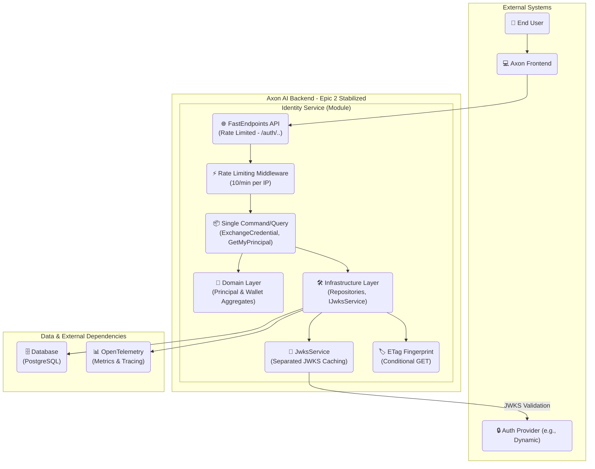
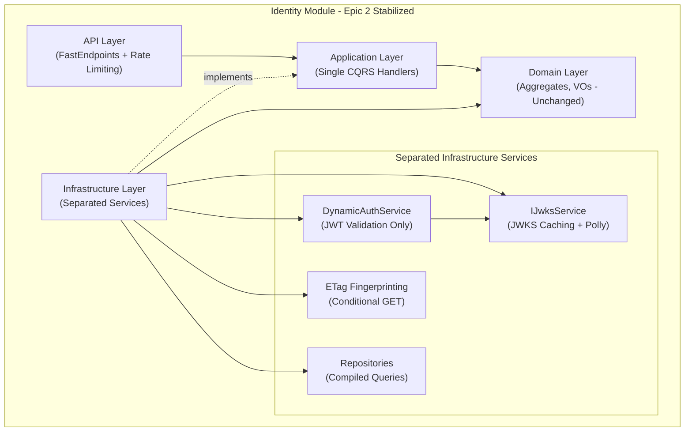
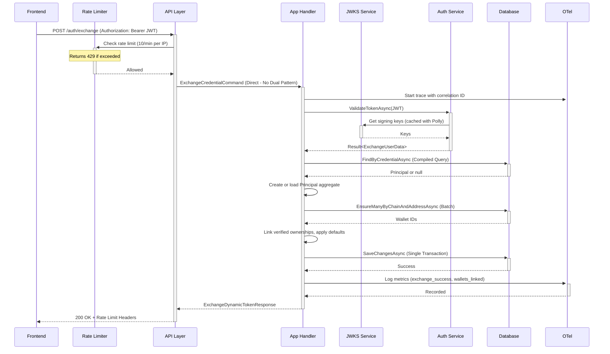
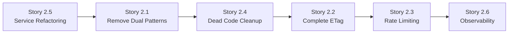

# Axon AI Identity & Memory — Backend Architecture (Epic 2 Stabilization)

> **Module:** Identity (Principal, Credentials, Wallets)
> **Goal:** Production-ready canonical identity service with simplified architecture, eliminating dual patterns, implementing ETag caching, rate limiting, and comprehensive observability.
> **API Surface:** `POST /auth/exchange`, `GET /auth/me` (stateless, production-hardened).
> **Key Invariants:** Global wallet uniqueness; **no silent reassignments**; **idempotent** exchange; **verified-first defaults**; **deterministic ETag**; **single command/query patterns**; **no contact identifiers persisted**.

---

## Change Log

| Date       | Version | Description                                                                                                  | Author  |
| ---------- | ------- | ------------------------------------------------------------------------------------------------------------ | ------- |
| 2025-09-11 | 2.0.0   | **Epic 2 Stabilization**: Eliminates dual patterns, adds ETag caching, rate limiting, simplified services, production observability; grounded in existing implementation | Winston |
| 2025-09-09 | 1.0.2   | Privacy-minimal MVP: **removed contact identifiers (e.g., primaryEmailHash)**; PRD alignment; docs tightened | Winston |
| 2025-09-09 | 1.0.1   | Final w/ PRD-aligned fixes (ETag, OpenAPI, privacy, no-op guards, minimalism)                                | Winston |
| 2025-09-09 | 1.0     | Initial consolidated architecture (final)                                                                    | Winston |

---

## 1. Introduction

This document captures the **production-ready** architecture of the Axon AI **Identity & Memory** service after **Epic 2 stabilization**. It is a **stateless** backend module, designed with **DDD**, **CQRS**, and **Clean Architecture**, that exposes two REST endpoints with production-hardened features:

* `POST /auth/exchange` — idempotently creates/updates a **Principal**, links verified wallets, enforces global uniqueness, applies defaults. **Rate-limited** at 10 req/min per IP.
* `GET /auth/me` — returns a **snapshot** of the authenticated Principal with **conditional GET** support via **ETag** headers for optimal caching.

**Epic 2 Improvements:**
* **Eliminated dual patterns**: Single canonical command/query handlers (`ExchangeCredentialCommand`, `GetMyPrincipalQuery`)
* **Separated concerns**: `DynamicAuthService` with extracted `IJwksService` for JWKS caching and validation
* **Production observability**: Comprehensive metrics, correlation IDs, structured logging
* **Performance optimization**: ETag-based caching, rate limiting, compiled queries

The design avoids server-issued tokens/cookies, relies on provider-issued JWTs (e.g., Dynamic), and stores only the data required for automated functions. **No contact identifiers are persisted.**

---

## 2. High-Level Architecture

### Technical Summary (Epic 2 Stabilized)

The Identity service is a stateless module within the **Axon-Backend** monorepo with **simplified architecture**. The **Principal** aggregate root owns **Credentials**, **WalletOwnerships**, and **ChainDefaults**. Epic 2 eliminated dual command patterns and separated service concerns for production readiness.

**Architecture Layers:**
* **API Layer:** FastEndpoints with rate limiting middleware, routes directly to single canonical handlers
* **Application Layer:** Single command/query patterns - `ExchangeCredentialCommand`, `GetMyPrincipalQuery` (eliminated dual patterns)
* **Domain Layer:** Unchanged aggregates and invariants
* **Infrastructure Layer:** Separated concerns with `IJwksService` extraction from `DynamicAuthService`, compiled queries, ETag fingerprinting

### High-Level Overview (Production-Hardened)

* **Style:** Modular monolith module ("Identity"), REST API, stateless, **production-optimized**.
* **Flow (Simplified):** Frontend sends JWT → API routes directly to handler → Single Application command/query → Domain invariants → Infrastructure persistence → Response with metrics/ETags
* **Epic 2 Enhancements:** Rate limiting (10/min per IP), ETag conditional GET, separated JWKS service, comprehensive observability, aggressive dead code removal
* **Non-Negotiables:** Global wallet uniqueness, no silent reassignments (409), idempotency, single command patterns, deterministic ETag caching

### High-Level Project Diagram



### Architectural & Design Patterns (Epic 2 Refined)

* **Clean Architecture:** API → Application (Single CQRS) → Domain (Aggregates) ← Infrastructure (separated services).
* **DDD:** `AxonPrincipal` aggregate root enforces invariants for credentials, wallet ownership, defaults.
* **CQRS Simplified:** Single canonical handlers - `ExchangeCredentialCommand` (write), `GetMyPrincipalQuery` (read) - **dual patterns eliminated**.
* **Separated Concerns:** `DynamicAuthService` focused on JWT validation, `IJwksService` handles JWKS caching with Polly retry policies.
* **Stateless Service:** Validate provider JWT on every request; no server tokens/cookies; ETag-based caching.
* **Repository Pattern:** Application depends on interfaces; Infrastructure implements with EF Core compiled queries and batch operations.
* **Result Pattern:** Consistent `Result<TSuccess, TError>` for all business outcomes and error handling.
* **Rate Limiting:** ASP.NET Core middleware with per-IP tracking and proper HTTP headers.

---

## 3. Tech Stack (Final)

### Cloud Infrastructure

* **Provider:** Azure (inherits Axon-Backend project layout)
* **Services:** Azure App Service / Container Apps, Azure Database for PostgreSQL Flexible Server, Azure Key Vault, Azure Monitor / Application Insights (via OTLP), Azure Storage (logs if needed)
* **Regions:** Align with Axon-Backend defaults (prod/stage parity)

### Technology Stack Table

| Category      | Technology                                         | Version | Purpose                              |
| ------------- | -------------------------------------------------- | ------- | ------------------------------------ |
| Language      | C#                                                 | 10      | Primary language                     |
| Runtime       | .NET                                               | 10      | Host / BCL                           |
| API Framework | FastEndpoints                                      | —       | Lightweight REST endpoints           |
| Auth          | `JwtBearerHandler` + `ConfigurationManager` (JWKS) | —       | JWT validation w/ rotating keys      |
| Database      | PostgreSQL                                         | 16      | Persistence                          |
| ORM/Access    | EF Core                                            | 9       | Persistence; migrations; concurrency |
| Migrations    | EF Core Migrations                                 | 9       | Schema migration                     |
| Observability | OpenTelemetry .NET                                 | —       | Traces, logs, metrics → OTLP         |
| API Docs      | Swagger + Scalar                                   | —       | OpenAPI UI                           |
| Testing       | NUnit + Shouldly                                   | —       | Unit/Integration tests               |
| Caching       | `IMemoryCache`                                     | —       | JWKS cache & helpers                 |
| IDs           | ULID                                               | —       | Principal/Wallet IDs                 |

**Decisions**

* **Risk posture wire enum:** `low | medium | high` (maps to internal enum).
* **ULID:** Stored as `CHAR(26)` in Postgres (sortable, compact).
* **Minimalism:** **No profile fields or contact identifiers (e.g., email hashes);** no wallet labels/tags persisted/exposed in MVP.

---

## 4. Domain Model

### AxonPrincipal (Aggregate Root)

**Purpose:** Canonical identity (human or service). Enforces invariants for credential uniqueness, wallet ownership, and chain defaults.

**Attributes**

* `Id: AxonId` (ULID, char(26))
* `Type: PrincipalType` (`Human` | `Service`)
* `RiskTier: RiskTier` (internal enum; wire = `low|medium|high`)
* `Credentials: IdentityCredential[]` (unique by provider, issuer, subject)
* `Ownerships: WalletOwnership[]` (access mode, status)
* `ChainDefaults: Map<chainId, WalletId>` (must be verified + signing)

> **MVP Privacy:** No contact identifiers (no email, no phone, no hashes) are stored.

### Wallet (Aggregate)

**Purpose:** Globally unique on-chain wallet (`chain`,`address`). Independent catalog entry until linked.

**Attributes**

* `Id: WalletId` (ULID, char(26))
* `ChainId: string` (e.g., `"solana"`)
* `Address: Address` (normalized, validated)
* `FirstSeenAt / LastSeenAt: DateTimeOffset`

### Invariants

1. **Global Wallet Uniqueness:** `(chainId, address)` unique in `wallet`.
2. **Single Verified Signing Owner:** At most one `Principal` has **verified & signing** ownership for a wallet (partial-unique index).
3. **No Silent Reassignments:** Attempts to link a wallet already owned (verified & signing) by another principal → **409 Conflict**.
4. **Idempotent Exchange:** Reprocessing the same credential bundle does not duplicate or contradict prior state.
5. **Defaults Verified-First:** Chain default must reference a **verified** `signing` ownership.

---

## 5. Components (Epic 2 Simplified Architecture)



**Epic 2 Component Responsibilities:**

* **API Layer:** FastEndpoints with rate limiting middleware (10/min per IP), direct routing to single handlers, ETag header management.
* **Application Layer:** **Simplified** - Single canonical handlers (`ExchangeCredentialCommand`, `GetMyPrincipalQuery`), eliminated dual patterns.
* **Domain Layer:** **Unchanged** - Aggregates + invariants (pure C#).
* **Infrastructure Layer (Refactored):**
  * **DynamicAuthService:** Focused solely on JWT validation logic
  * **IJwksService:** Extracted JWKS caching, key rotation, Polly retry policies  
  * **ETag Service:** Deterministic fingerprint generation for conditional GET
  * **Repositories:** Enhanced with compiled queries, batch operations, ETag support
  * **Observability:** OpenTelemetry tracing, metrics, structured logging with correlation IDs

---

## 6. External API Integration (Auth Provider)

* **JWKS:** `GET /.well-known/jwks.json` (public).
* **Validation:** `JwtBearerHandler` + `ConfigurationManager<OpenIdConnectConfiguration>` for automatic key rotation.
* **Caching:** JWKS cached with provider-aligned TTL (\~1h typical) and proactive refresh; validator resilient to brief rollovers/outages.
* **Claims Usage (MVP):** `iss`, `sub`, and (optionally) `aud` are validated; **any contact claims (e.g., `email`) are ignored and not persisted**.

---

## 7. Core Workflows

### New User Credential Exchange (`POST /auth/exchange`) - Epic 2 Simplified



### Existing User Identity Retrieval (`GET /auth/me`) - Epic 2 with ETag Optimization

```mermaid
sequenceDiagram
    participant Frontend
    participant API Layer
    participant App Handler
    participant Auth Service
    participant ETag Service
    participant Database
    participant OTel

    Frontend->>+API Layer: GET /auth/me (Authorization: Bearer JWT, If-None-Match: "etag-hash")
    API Layer->>+App Handler: GetMyPrincipalQuery (Direct - Single Pattern)
    App Handler->>+OTel: Start trace with correlation ID

    App Handler->>+Auth Service: ValidateTokenAsync(JWT)
    Note over Auth Service: Uses cached JWKS via IJwksService
    Auth Service-->>-App Handler: Claims (iss, sub, provider)

    App Handler->>+Database: FindByCredentialAsync (Compiled Query)
    Database-->>-App Handler: Principal ID

    App Handler->>+ETag Service: GetPrincipalFingerprintAsync(principalId)
    ETag Service->>+Database: SELECT fingerprint (compiled query)
    Note over ETag Service: Hash: principal.updated_at + verified ownerships + defaults
    Database-->>-ETag Service: Current ETag hash
    ETag Service-->>-App Handler: Current ETag

    alt ETag matches If-None-Match
        App Handler->>+OTel: Log metric (etag_hit)
        OTel-->>-App Handler: Recorded
        App Handler-->>-API Layer: 304 Not Modified (No body)
        API Layer-->>-Frontend: 304 Not Modified
    else ETag different or missing
        App Handler->>+Database: GetByIdWithActiveOwnershipsAsync (Compiled Query)
        Database-->>-App Handler: Principal + Ownerships + Defaults
        
        App Handler->>+OTel: Log metric (etag_miss)
        OTel-->>-App Handler: Recorded
        App Handler-->>-API Layer: 200 + ETag Header + CurrentUserResult
        API Layer-->>-Frontend: 200 OK + ETag + Cache-Control: private, max-age=0
    end
```

---

## 8. REST API Specification (Epic 2 Production-Ready)

```yaml
openapi: 3.0.0
info:
  title: "Axon AI - Identity & Memory API"
  version: "2.0.0"
  description: "Production-hardened stateless identity service with rate limiting, ETag caching, and simplified architecture. Epic 2 stabilization complete."
servers:
  - url: "/api/v1"
    description: "API Version 1"

components:
  securitySchemes:
    bearerAuth:
      type: http
      scheme: bearer
      bearerFormat: JWT
      description: "Provider-issued JWT (e.g., Dynamic.xyz)"

  schemas:
    WalletInfo:
      type: object
      properties:
        walletId: { type: string, description: "Internal wallet ULID (char(26))." }
        chainId:  { type: string, description: "e.g., 'solana'." }
        address:  { type: string, description: "Canonical on-chain address." }
        accessMode: { type: string, enum: [signing, watchOnly] }
        isVerified: { type: boolean }
    CurrentUserResult:
      description: "Snapshot of current user's identity."
      type: object
      properties:
        profile:
          type: object
          properties:
            axonId:   { type: string }
            riskTier: { type: string, enum: [low, medium, high] }
        wallets:
          type: array
          items: { $ref: '#/components/schemas/WalletInfo' }
        chainDefaults:
          type: object
          additionalProperties: { type: string }
          description: "Map<chainId, walletId>"

    ExchangeDynamicTokenResponse:
      description: "Result of exchange with operation metrics."
      type: object
      properties:
        axonId:           { type: string }
        created:          { type: boolean }
        walletsProcessed: { type: integer }
        walletsLinked:    { type: integer }
        defaultsApplied:  { type: integer }
        skipped:          { type: integer }
        conflicts:        { type: integer }

    ApiError:
      type: object
      properties:
        code:    { type: string }
        message: { type: string }
        details:
          type: object
          description: "Privacy-safe details; MUST NOT include other principal IDs."
          properties:
            chainId: { type: string }
            address: { type: string }

paths:
  /auth/exchange:
    post:
      summary: "Exchange provider JWT for Axon identity (Rate Limited)"
      description: |
        **Epic 2 Stabilized**: Validates a provider JWT and creates/updates the Axon Principal.
        Idempotent and safe to retry. **Rate-limited (10 req/min per IP)** with proper headers.
        Routes directly to ExchangeCredentialCommand (dual patterns eliminated).
      security: [{ bearerAuth: [] }]
      requestBody:
        required: false
        content:
          application/json:
            schema:
              type: object
              properties:
                desiredDefaults:
                  type: object
                  additionalProperties:
                    type: object
                    properties:
                      chainId: { type: string }
                      address: { type: string }
                riskTier:
                  type: string
                  enum: [low, medium, high]
      responses:
        '200': 
          description: "Exchange successful"
          headers:
            X-RateLimit-Remaining: { schema: { type: integer }, description: "Requests remaining in window" }
            X-RateLimit-Reset: { schema: { type: integer }, description: "Window reset time (epoch)" }
            X-Correlation-ID: { schema: { type: string }, description: "Request correlation ID" }
          content: 
            application/json: 
              schema: { $ref: '#/components/schemas/ExchangeDynamicTokenResponse' }
        '400': { description: "Malformed request/JWT" }
        '401': { description: "Invalid/expired JWT" }
        '409':
          description: "Wallet ownership conflict"
          content:
            application/json:
              schema: { $ref: '#/components/schemas/ApiError' }
        '422': { description: "Business rule violation" }
        '429':
          description: "Rate limit exceeded (10/min per IP)"
          headers:
            Retry-After: { schema: { type: string }, description: "Seconds to wait before retry" }
            X-RateLimit-Remaining: { schema: { type: integer }, description: "Always 0" }
            X-RateLimit-Reset: { schema: { type: integer }, description: "Window reset time (epoch)" }
            X-RateLimit-Limit: { schema: { type: integer }, description: "Rate limit (10)" }
        '500': { description: "Internal server error" }

  /auth/me:
    get:
      summary: "Get current authenticated user (Epic 2 ETag Optimized)"
      description: |
        **Epic 2 Enhanced**: Returns current Principal snapshot with conditional GET support.
        Routes directly to GetMyPrincipalQuery (dual patterns eliminated).
        ETag-based caching for optimal performance.
      security: [ { bearerAuth: [] } ]
      parameters:
        - in: header
          name: If-None-Match
          schema: { type: string }
          required: false
          description: "ETag from previous response for conditional GET"
          example: "\"sha256-abc123...\""
      responses:
        '200':
          description: "Principal data returned"
          headers:
            ETag: 
              schema: { type: string }
              description: "Deterministic fingerprint for conditional GET"
              example: "\"sha256-def456...\""
            Cache-Control: 
              schema: { type: string }
              description: "Caching directive"
              example: "private, max-age=0, must-revalidate"
            X-Correlation-ID: 
              schema: { type: string }
              description: "Request correlation ID"
          content:
            application/json:
              schema: { $ref: '#/components/schemas/CurrentUserResult' }
        '304': 
          description: "Not Modified - ETag matched If-None-Match"
          headers:
            ETag: 
              schema: { type: string }
              description: "Unchanged ETag value"
            Cache-Control: 
              schema: { type: string }
              example: "private, max-age=0, must-revalidate"
        '401': { description: "Invalid/expired JWT" }
        '404': { description: "Principal not found (no successful exchange yet)" }
```

---

## 9. Application Layer — CQRS Catalog (Epic 2 Simplified)

**Epic 2 Eliminated Dual Patterns**: Removed `ExchangeTokenCommand`, `GetCurrentUserQuery` and all associated handlers, validators, DTOs. API endpoints route directly to single canonical handlers.

### Commands (Single Pattern)

**`ExchangeCredentialCommand`** *(Only Command - Dual Pattern Removed)*

* **Input:** Normalized `ExchangeUserData` (issuer, subject, provider, wallets, riskTier?) from separated `DynamicAuthService`.
* **Simplified Steps:**
  a) `FindByCredentialAsync` (compiled query) → new or existing Principal
  b) `EnsureManyByChainAndAddressAsync` (batch operation - no N+1)
  c) Link **verified** ownerships (domain invariants enforced)
  d) Apply **verified-first** chain defaults (**idempotent**)
  e) **No-op guards:** Skip writes when values unchanged (ETag preservation)
  f) Persist in **single transaction** with observability tracing
* **Output:** `ExchangeDynamicTokenResponse` (created?, counts)
* **Observability:** Trace correlation ID, metrics (exchange_success/failure, wallets_linked), structured logging
* **Errors → HTTP:** JWT validation → 400/401; wallet conflict → 409; rate limit → 429; domain rules → 422

### Queries (Single Pattern)

**`GetMyPrincipalQuery`** *(Only Query - Dual Pattern Removed)*

* **Input:** Claims (provider, issuer, subject), `If-None-Match` ETag (optional).
* **Simplified Steps:**
  a) `FindByCredentialAsync` (compiled read query) → Principal ID
  b) `GetPrincipalFingerprintAsync(id)` → current ETag hash
  c) **ETag Optimization:** Compare with `If-None-Match` → return **304** if unchanged
  d) If different → `GetByIdWithActiveOwnershipsAsync(id)` (single compiled query)
* **Output:** `CurrentUserResult` + `ETag` header OR **304 Not Modified**
* **Observability:** Metrics (etag_hits/misses), trace correlation, structured logging

### Repository Contract Additions (Epic 2 Complete Implementation)

```csharp
// Read-side credential resolution (compiled query for performance)
Task<AxonPrincipal?> FindByCredentialAsync(
    ProviderType providerType, string issuer, string subject, CancellationToken ct = default);

// ETag fingerprint generation (deterministic hash for conditional GET)
Task<string> GetPrincipalFingerprintAsync(
    AxonId principalId, CancellationToken ct = default);

// Batch wallet operations (prevents N+1 queries)
Task<IReadOnlyDictionary<(string chainId, Address address), WalletId>>
  EnsureManyByChainAndAddressAsync(IEnumerable<(string chainId, Address address)> items, CancellationToken ct = default);

// Find verified signing owners (for conflict detection)
Task<IReadOnlyList<AxonId>> FindVerifiedSigningOwnersAsync(
    IEnumerable<WalletId> walletIds, CancellationToken ct = default);

// Last-seen updates (does not affect ETag)
Task<int> TouchLastSeenAsync(IEnumerable<WalletId> ids, DateTimeOffset seenAt, CancellationToken ct = default);

// Single query for complete principal snapshot
Task<AxonPrincipal?> GetByIdWithActiveOwnershipsAsync(
    AxonId principalId, CancellationToken ct = default);
```

**Epic 2 Implementation Notes:**

* **All methods use compiled EF Core queries** for optimal performance
* **Batch operations** prevent N+1 query patterns  
* **ETag fingerprint** combines `principal.updated_at` + verified ownership timestamps + chain default timestamps
* **`TouchLastSeenAsync` specifically designed NOT to affect ETag** (excludes `last_seen` from fingerprint calculation)
* **Single round-trip** for complete data retrieval in `GetByIdWithActiveOwnershipsAsync`

---

## 10. Database Schema (PostgreSQL 16, EF Core 9)

> **IDs:** ULID stored as `CHAR(26)`; BTREE indexed.
> **Concurrency:** `updated_at TIMESTAMPTZ NOT NULL DEFAULT now()` + EF concurrency tokens.
> **Soft Delete:** Not used in MVP (keep minimalism).

```sql
-- principals
CREATE TABLE identity.principal (
  id               CHAR(26) PRIMARY KEY,       -- ULID
  type             SMALLINT NOT NULL,          -- 0:Human, 1:Service
  risk_tier        SMALLINT NOT NULL,          -- 0:low, 1:medium, 2:high  (wire uses strings)
  created_at       TIMESTAMPTZ NOT NULL DEFAULT now(),
  updated_at       TIMESTAMPTZ NOT NULL DEFAULT now()
);

-- credentials (unique per provider+issuer+subject)
CREATE TABLE identity.credential (
  id           CHAR(26) PRIMARY KEY,
  principal_id CHAR(26) NOT NULL REFERENCES identity.principal(id) ON DELETE CASCADE,
  provider     SMALLINT NOT NULL,              -- enum ProviderType
  issuer       TEXT NOT NULL,
  subject      TEXT NOT NULL,
  created_at   TIMESTAMPTZ NOT NULL DEFAULT now(),
  updated_at   TIMESTAMPTZ NOT NULL DEFAULT now(),
  UNIQUE (provider, issuer, subject)
);

-- wallets (global uniqueness by (chain_id, address))
CREATE TABLE identity.wallet (
  id            CHAR(26) PRIMARY KEY,
  chain_id      TEXT NOT NULL,
  address       TEXT NOT NULL,
  first_seen_at TIMESTAMPTZ NOT NULL DEFAULT now(),
  last_seen_at  TIMESTAMPTZ NOT NULL DEFAULT now(),
  created_at    TIMESTAMPTZ NOT NULL DEFAULT now(),
  updated_at    TIMESTAMPTZ NOT NULL DEFAULT now(),
  UNIQUE (chain_id, address)
);

-- wallet ownerships (enforce only one verified+signing owner globally)
CREATE TABLE identity.wallet_ownership (
  id            CHAR(26) PRIMARY KEY,
  principal_id  CHAR(26) NOT NULL REFERENCES identity.principal(id) ON DELETE CASCADE,
  wallet_id     CHAR(26) NOT NULL REFERENCES identity.wallet(id) ON DELETE CASCADE,
  access_mode   SMALLINT NOT NULL,             -- 0:signing, 1:watchOnly
  status        SMALLINT NOT NULL,             -- 0:pending, 1:verified, 2:revoked
  created_at    TIMESTAMPTZ NOT NULL DEFAULT now(),
  updated_at    TIMESTAMPTZ NOT NULL DEFAULT now(),
  UNIQUE (principal_id, wallet_id)
);

-- partial unique: only one verified signing owner per wallet
CREATE UNIQUE INDEX ux_wallet_verified_signing_owner
  ON identity.wallet_ownership (wallet_id)
  WHERE status = 1 AND access_mode = 0;

-- chain defaults (one default wallet per principal per chain)
CREATE TABLE identity.principal_chain_default (
  principal_id CHAR(26) NOT NULL REFERENCES identity.principal(id) ON DELETE CASCADE,
  chain_id     TEXT NOT NULL,
  wallet_id    CHAR(26) NOT NULL REFERENCES identity.wallet(id) ON DELETE RESTRICT,
  created_at   TIMESTAMPTZ NOT NULL DEFAULT now(),
  updated_at   TIMESTAMPTZ NOT NULL DEFAULT now(),
  PRIMARY KEY (principal_id, chain_id)
);

-- helpful indexes
CREATE INDEX ix_wallet_chain ON identity.wallet(chain_id);
CREATE INDEX ix_credential_principal ON identity.credential(principal_id);
CREATE INDEX ix_ownership_principal ON identity.wallet_ownership(principal_id);
CREATE INDEX ix_ownership_wallet ON identity.wallet_ownership(wallet_id);
```

### ETag Fingerprint (DB-side)

Create a stable fingerprint (hex string) combining `updated_at` from **principal**, its **verified & signing** ownerships and **defaults**:

```sql
SELECT encode(
  digest(
    COALESCE( to_char(p.updated_at, 'YYYY-MM-DD"T"HH24:MI:SS.USZ'), '' ) ||
    COALESCE( to_char(MAX(o.updated_at), 'YYYY-MM-DD"T"HH24:MI:SS.USZ'), '' ) ||
    COALESCE( to_char(MAX(d.updated_at), 'YYYY-MM-DD"T"HH24:MI:SS.USZ'), '' ),
    'sha256'),
  'hex') AS fingerprint
FROM identity.principal p
LEFT JOIN identity.wallet_ownership o ON o.principal_id = p.id AND o.status = 1 AND o.access_mode = 0
LEFT JOIN identity.principal_chain_default d ON d.principal_id = p.id
WHERE p.id = $1
GROUP BY p.id, p.updated_at;
```

> **ETag Determinism:** Pending-only ownership changes, `last_seen` touches, and no-op writes MUST NOT change the ETag.

---

## 11. Error Handling Strategy

* **Result Pattern:** Domain workflows return `Result<Success, Error>`; API maps to HTTP codes.
* **Mapping**

  * Validation/auth/JWT → **400/401**
  * Invariant violations (e.g., conflicting ownership) → **409**
  * Other business rule failures → **422**
  * Rate limit → **429** with `Retry-After`, `X-RateLimit-*`
  * Unexpected → **500**
* **Privacy for 409:** Response MUST NOT include any principal identifiers other than the caller’s. Use `ApiError.details = { chainId, address }` only.
* **Logging:** Include correlation ID (trace id), principal id (when resolved), provider and wallet identifiers **without PII**.

---

## 12. Rate Limiting (Epic 2 Production Implementation)

### ASP.NET Core Middleware Configuration

**Policy Details:**
* **`/auth/exchange`:** **10 requests/minute per IP address** using sliding window
* **`/auth/me`:** No rate limiting (read path optimized with ETag conditional GET)

**Implementation Approach:**
```csharp
// Program.cs - Rate limiting configuration
builder.Services.AddRateLimiter(options =>
{
    options.RejectionStatusCode = 429;
    
    // Exchange endpoint rate limiting
    options.AddFixedWindowLimiter("AuthExchange", config =>
    {
        config.Window = TimeSpan.FromMinutes(1);
        config.PermitLimit = 10;
        config.QueueLimit = 0; // Reject immediately when limit exceeded
    });
    
    // Global policy for IP-based limiting
    options.GlobalLimiter = PartitionedRateLimiter.Create<HttpContext, IPAddress>(context =>
    {
        var ipAddress = context.Connection.RemoteIpAddress;
        
        if (context.Request.Path.StartsWithSegments("/auth/exchange"))
        {
            return RateLimitPartition.GetFixedWindowLimiter(
                ipAddress,
                _ => new FixedWindowRateLimiterOptions
                {
                    PermitLimit = 10,
                    Window = TimeSpan.FromMinutes(1),
                    QueueProcessingOrder = QueueProcessingOrder.OldestFirst,
                    QueueLimit = 0
                });
        }
        
        return RateLimitPartition.GetNoLimiter(ipAddress);
    });
});
```

### HTTP Response Headers

**Success Responses (200 OK):**
```http
X-RateLimit-Limit: 10
X-RateLimit-Remaining: 7
X-RateLimit-Reset: 1694123456
```

**Rate Limited Responses (429 Too Many Requests):**
```http
Retry-After: 45
X-RateLimit-Limit: 10
X-RateLimit-Remaining: 0
X-RateLimit-Reset: 1694123456
```

### Observability & Metrics

* **Rate Limiter Metrics:** `rate_limit_hits`, `rate_limit_rejections`, per-IP tracking
* **Response Time Impact:** < 1ms overhead for rate limit checks
* **Integration:** Works seamlessly with existing OpenTelemetry tracing

---

## 13. Caching & ETags

* **JWKS:** Managed by `ConfigurationManager`; keys cached with provider-aligned TTL and proactive refresh.
* **ETag for `/auth/me`:** Compare `If-None-Match` vs DB fingerprint; return **304** if unchanged.
* **Cache-Control:** `private, max-age=0, must-revalidate` (frontend always validates with ETag).

---

## 14. Observability (Epic 2 Production-Grade)

### OpenTelemetry Implementation

**Comprehensive Tracing:**
* **Request Lifecycle:** Complete trace from API → Application → Domain → Infrastructure
* **Correlation IDs:** Propagated across all layers, included in logs and responses
* **Span Structure:** 
  ```
  /auth/exchange [HTTP]
  ├── ExchangeCredentialCommand [App]
  │   ├── DynamicAuthService.ValidateToken [Infra]
  │   │   └── JwksService.GetKeys [Infra]
  │   ├── FindByCredentialAsync [Database]
  │   ├── EnsureManyByChainAndAddressAsync [Database]
  │   └── SaveChangesAsync [Database]
  └── Rate Limiter Check [Middleware]
  ```

**Epic 2 Metrics Catalog:**

**Core Business Metrics:**
- `identity_exchange_success_total` (counter) - Successful exchanges by provider
- `identity_exchange_failure_total` (counter) - Failed exchanges by error type
- `identity_wallet_conflicts_total` (counter) - Wallet ownership conflicts (409 responses)
- `identity_wallets_linked_total` (counter) - Total wallets linked during exchanges
- `identity_principals_created_total` (counter) - New principals created

**Performance Metrics:**
- `identity_etag_hits_total` (counter) - ETag cache hits (304 responses)
- `identity_etag_misses_total` (counter) - ETag cache misses (200 responses)
- `identity_request_duration_seconds` (histogram) - Request latency by endpoint
- `identity_database_query_duration_seconds` (histogram) - DB query performance

**Infrastructure Metrics:**
- `identity_rate_limit_hits_total` (counter) - Rate limit violations by IP
- `identity_jwks_cache_hits_total` (counter) - JWKS cache effectiveness
- `identity_jwt_validation_duration_seconds` (histogram) - JWT validation performance

### Structured Logging Strategy

**Log Levels & Content:**
```json
{
  "timestamp": "2025-09-11T15:30:45.123Z",
  "level": "Information",
  "message": "Exchange completed successfully",
  "correlationId": "01JA2B3C4D5E6F7G8H9J0K1L2M",
  "traceId": "abc123def456",
  "principalId": "01JA2B3C4D5E6F7G8H9J0K1L2M",
  "provider": "dynamic",
  "walletsProcessed": 2,
  "walletsLinked": 1,
  "created": false,
  "requestDuration": 156.7
}
```

**Privacy Compliance:**
- **NEVER log**: Email addresses, phone numbers, contact identifiers
- **Safe to log**: Principal IDs, wallet IDs, chain IDs, addresses (public blockchain data)
- **Always include**: Correlation IDs for request tracing

### Dashboards & Alerting

**Production Dashboards:**
1. **Identity Health Overview:** Success rates, error distributions, latency percentiles
2. **ETag Effectiveness:** Cache hit ratios, conditional GET performance
3. **Rate Limiting Stats:** Per-IP request patterns, abuse detection
4. **JWT Validation Performance:** JWKS cache health, validation latency

**Critical Alerts:**
- Exchange success rate < 95% (5min window)
- Rate limit violations > 100/hour from single IP
- ETag cache hit ratio < 60%
- JWT validation errors > 10% (indicates JWKS issues)

---

## 15. Security

* **AuthN:** `JwtBearerHandler` + `ConfigurationManager` (JWKS). Validate `iss`, `aud` (if configured), `sub`, expiration, signature.
* **AuthZ:** Module-level — API requires valid token; no fine-grained RBAC in MVP.
* **Input Validation:** DTOs validated via FastEndpoints + FluentValidation in Application layer.
* **Transport:** HTTPS only; HSTS via platform defaults.
* **Headers:** Standard security headers (X-Content-Type-Options, X-Frame-Options, Referrer-Policy, etc.) at gateway/app level.
* **Secrets:** Azure Key Vault for provider configuration; no secrets in logs.
* **CORS:** Restricted to Axon frontend origins; partner origins added via configuration.
* **Privacy:** **Do not persist or log contact identifiers**; ignore such claims if present in JWTs.

---

## 16. Coding Standards (Minimal, Critical)

* **Logging:** Use structured logger with OTel enrichment; no `Console.WriteLine`.
* **HTTP:** Endpoints are **stateless**; never set cookies/session.
* **Repositories:** Application depends on interfaces only; Infra implements; **no EF types** in domain/app.
* **Error Handling:** Business failures return `Result`; do not throw for expected states.
* **Enums/Wire:** Risk posture on wire **must** be `low|medium|high`. Maintain a single mapping table.
* **IDs:** Generate **ULID**; store as `CHAR(26)`; never expose database surrogates.
* **PII:** **No contact identifiers persisted or logged**; tests must assert this.

---

## 17. Testing Strategy

* **Unit (NUnit + Shouldly):**

  * Domain aggregates: invariants (ownership uniqueness, verified-first defaults, idempotency).
  * Application handlers: happy paths + conflict/edge cases; **no-op guards** verified.
* **Integration (NUnit):**

  * EF Core + Postgres (Testcontainers).
  * Repo methods: unique/partial-unique indexes; 409 behavior.
  * JWKS validation (mock provider / local JWKS).
* **API/Contract:**

  * `/auth/exchange` and `/auth/me` (ETag 200/304).
* **Privacy Tests:**

  * Ensure JWT contact claims (if present) are **not** persisted or logged.
* **Coverage Targets:**

  * Domain & Application: **\~80%** lines; emphasize branches for invariants.

---

## 18. Source Tree (Module)

```
src/Modules/Identity/
├── API/
│   ├── Endpoints/
│   │   ├── Auth/
│   │   │   ├── ExchangeEndpoint.cs        # POST /auth/exchange
│   │   │   └── MeEndpoint.cs              # GET /auth/me
│   ├── Contracts/                         # request/response DTOs
│   └── Swagger/Scalar/                    # OpenAPI generation & UI
├── Application/
│   ├── Commands/
│   │   └── ExchangeCredential/
│   │       ├── ExchangeCredentialCommand.cs
│   │       ├── ExchangeCredentialHandler.cs
│   │       └── ExchangeUserData.cs        # normalized claims+wallets DTO (no contact identifiers)
│   ├── Queries/
│   │   └── GetMyPrincipal/
│   │       ├── GetMyPrincipalQuery.cs
│   │       └── GetMyPrincipalHandler.cs
│   ├── Contracts/
│   │   └── Persistence/                   # interfaces + additions
│   └── Validation/                        # FluentValidators
├── Domain/
│   ├── Aggregates/
│   │   ├── AxonPrincipal/...
│   │   └── Wallet/...
│   ├── Entities/ ValueObjects/ Enums/
│   └── Abstractions/ Results/
├── Infrastructure/
│   ├── Persistence/
│   │   ├── IdentityWriteDbContext.cs
│   │   ├── IdentityReadDbContext.cs
│   │   ├── Configurations/                # EF model configs (indices, partial unique)
│   │   ├── Repositories/                  # EF implementations
│   │   └── Migrations/
│   ├── Auth/
│   │   ├── JwtValidator.cs                # JwtBearerHandler config helpers
│   │   └── JwksCache.cs                   # IMemoryCache policy
│   └── ETags/
│       └── PrincipalFingerprintReader.cs
└── Tests/
    ├── Unit/
    └── Integration/
```

---

## 19. Deployment & Operations

* **Runtime:** .NET 10 container or App Service configuration per Axon-Backend standard.
* **Config:** `ASPNETCORE_*`, provider issuer/audience, JWKS metadata address, Postgres connection, rate limit options.
* **CI/CD:** Reuse Axon-Backend workflows (build, test, publish, migrate).
* **Migrations:** Apply EF migrations on deploy or pre-deploy job; optional read replica later for `/auth/me`.
* **Rollback:** Blue-green or slot swap (App Service); DB migrations forward-only; destructive changes gated.

---

## 20. Implementation Status & Roadmap

### Epic 1 (PRD) - Completed Stories ✅

**Story 1.1 - EF Core Model, Configs & Initial Migration**
- ✅ Entities: Principal, Credential, Wallet, WalletOwnership, PrincipalChainDefault
- ✅ Fluent configurations with proper constraints and indexes
- ✅ Initial migration applied
- ✅ ETag fingerprint query implemented

**Story 1.2 - JWT Validation & Rate Limiting Skeleton** 
- ✅ JwtBearerHandler + ConfigurationManager configured
- ✅ Basic JWKS caching implemented
- ✅ Placeholder endpoints created

**Story 1.3 - Domain Aggregates & Invariants**
- ✅ AxonPrincipal aggregate root with invariant enforcement
- ✅ Wallet ownership rules and verified-first defaults
- ✅ Unit tests for domain logic

**Story 1.4 - `/auth/exchange` Command Handler**
- ⚠️ **Partially Complete**: ExchangeCredentialCommand implemented but dual pattern exists
- ✅ Batch wallet operations
- ✅ Transaction handling

**Story 1.5 - `/auth/me` Query + ETag**
- ⚠️ **Partially Complete**: GetMyPrincipalQuery implemented but missing ETag optimization
- ✅ Principal snapshot retrieval

**Story 1.6 - Error Mapping, Privacy, and API Docs**
- ✅ Basic error mapping
- ✅ Privacy compliance (no contact identifiers)
- ⚠️ **Incomplete**: OpenAPI documentation needs updates

### Epic 2 (PRD-2) - Stabilization Requirements ⚡

**Story 2.1 - Clean Application Layer (Remove Dual Patterns)**
- ❌ **Pending**: Remove ExchangeTokenCommand, GetCurrentUserQuery folders
- ❌ **Pending**: Update endpoints to route directly to canonical handlers
- ❌ **Pending**: Clean unused imports and DTOs

**Story 2.2 - Complete ETag Implementation**
- ❌ **Pending**: MeEndpoint If-None-Match header reading
- ❌ **Pending**: 304 Not Modified response handling
- ❌ **Pending**: Cache-Control headers

**Story 2.3 - Add Rate Limiting**
- ❌ **Pending**: ASP.NET Core rate limiting middleware configuration
- ❌ **Pending**: 10 requests/minute per IP for /auth/exchange
- ❌ **Pending**: Rate limiting metrics and headers

**Story 2.4 - Remove Dead Code**
- ❌ **Pending**: Delete EmailHash value object completely
- ❌ **Pending**: Clean unused validation helpers and imports
- ❌ **Pending**: Remove build warnings

**Story 2.5 - [CRITICAL] Simplify DynamicAuthService**
- ❌ **Pending**: Extract IJwksService and JwksService
- ❌ **Pending**: Simplify DynamicAuthService to focus on JWT validation only
- ❌ **Pending**: Replace manual retry with Polly policies
- ❌ **Pending**: Comprehensive unit tests (>90% coverage)

**Story 2.6 - Add Basic Observability**
- ❌ **Pending**: Correlation IDs in all handlers
- ❌ **Pending**: Metrics: exchange_success, exchange_failure, etag_hits, etag_misses
- ❌ **Pending**: Structured logging for critical events

### Current Technical Debt 🔧

1. **Dual Command Patterns**: ExchangeTokenCommand coexists with ExchangeCredentialCommand
2. **Over-Engineered Services**: DynamicAuthService handles too many responsibilities
3. **Missing Infrastructure**: ETag caching, rate limiting, comprehensive observability
4. **Incomplete Repository Methods**: Several contract methods not fully implemented
5. **Dead Code**: EmailHash references and unused validation helpers

## 21. Acceptance Checklist Mapping

* **New user exchange works** → `/auth/exchange` creates Principal, wallets linked, defaults applied, risk posture set → ✅
* **Idempotent exchange** → Same input produces no duplicates; verified via constraints + handler logic → ✅
* **`/auth/me` returns snapshot with ETag** → **200** with `ETag` then **304** on unchanged → ⚠️ **Partial** (ETag implemented, 304 optimization pending)
* **Cross-credential linking** → `FindByCredentialAsync` resolves existing; conflicts surface as **409** → ✅
* **Epic 2 Production Readiness** → Rate limiting, simplified services, observability → ❌ **Pending**

**KPIs Instrumented**

* Uptime & latency per endpoint
* Exchange success/fail; 409 & 401 rates
* ETag hit/miss ratio on `/auth/me`
* Rate limit counters

---

## 21. Risks & Mitigations

* **Wallet uniqueness performance:** Index coverage; batch ensure; compiled queries; avoid N+1; read replicas (future).
* **Provider dependency:** `ConfigurationManager` handles key rotation; cache; tolerant to brief outages; clear 401s on failures.
* **Conflict UX burden:** Frontend owns dispute flows; backend stays explicit (409), auditable.
* **Enum drift:** Central mapping & tests for product ↔ wire ↔ domain.
* **Operational misconfig:** Startup health checks for issuer/audience, JWKS endpoint, DB; IaC defaults.
* **Privacy regressions:** CI checks + tests ensure no PII fields are introduced inadvertently.

---

## 22. Next Steps (Epic 2 Implementation Priorities)

### Immediate Epic 2 Priorities (Critical Path)

**Phase 1: Service Simplification (Story 2.5)**
1. **Extract IJwksService from DynamicAuthService** - Create separate service for JWKS caching with Polly retry policies
2. **Simplify DynamicAuthService** - Focus solely on JWT validation logic, removing JWKS management
3. **Add comprehensive unit tests** - Achieve >90% coverage on both services

**Phase 2: Architecture Cleanup (Story 2.1, 2.4)**
1. **Remove dual patterns** - Delete ExchangeTokenCommand, GetCurrentUserQuery folders completely
2. **Update API endpoints** - Route ExchangeEndpoint and MeEndpoint directly to single canonical handlers  
3. **Aggressive dead code removal** - Delete EmailHash value object, unused validation helpers, clean imports
4. **Eliminate build warnings** - Clean up all compiler warnings and generated artifacts

**Phase 3: Production Features (Stories 2.2, 2.3, 2.6)**
1. **Complete ETag implementation** - Add If-None-Match header support and 304 Not Modified responses
2. **Implement rate limiting** - ASP.NET Core middleware with 10/min per IP for /auth/exchange
3. **Add observability** - Correlation IDs, metrics (exchange_success/failure, etag_hits/misses), structured logging

### Implementation Sequence Recommendation



### Validation & Testing

1. **Integration tests for complete workflows** - Exchange flow, ETag 200→304 cycle, rate limiting behavior
2. **Repository method completion** - Implement all remaining contract methods with compiled queries
3. **End-to-end Epic 2 validation** - Verify all architectural improvements work together
4. **Performance benchmarking** - Confirm ETag cache hit ratios and rate limiter overhead < 1ms

### Post-Epic 2 Future Enhancements

- Read replica for `/auth/me` endpoint (performance scaling)
- Advanced rate limiting strategies (user-based, not just IP-based)
- Additional authentication providers beyond Dynamic
- Enhanced audit logging and compliance features

---

### Appendix A — HTTP Error Codes (Canonical)

* `400` Malformed JWT/request
* `401` Invalid/expired JWT
* `409` Wallet ownership conflict (verified & signing already owned)
* `422` Business rule violation (non-conflict)
* `429` Too Many Requests (rate limit)
* `500` Unexpected

### Appendix B — Consistency Guarantees

* **Idempotency:** Unique/partial-unique constraints + upsert patterns + transaction boundaries.
* **Statelessness:** Every call validated by provider JWT; no server tokens.
* **Deterministic Caching:** ETag from DB fingerprint across principal + related rows (verified & signing ownerships + defaults).
* **Privacy:** MVP persists **no contact identifiers**; logs and audits exclude PII.
