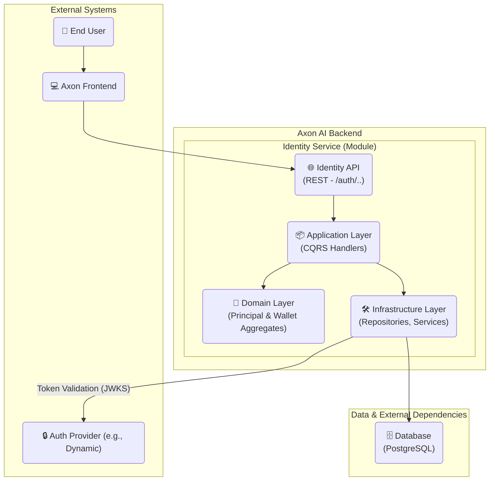
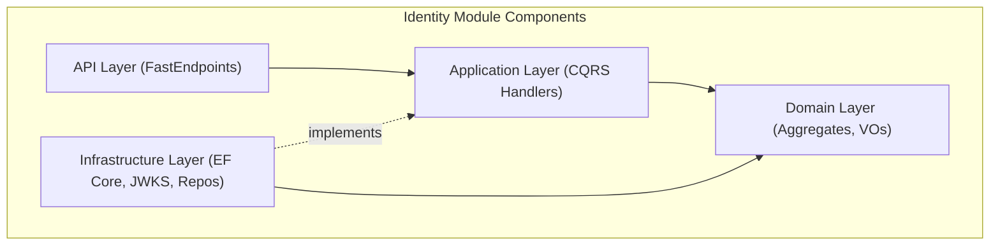
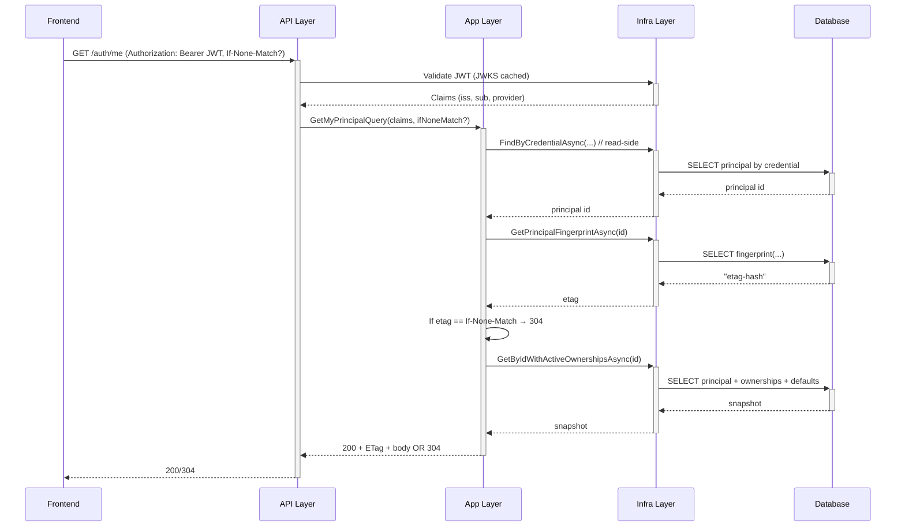

# Axon AI Identity & Memory — Backend Architecture (Final)

> **Module:** Identity (Principal, Credentials, Wallets)
> **Goal:** Canonical identity ("Principal") unifying multiple credentials & wallets with minimal "memory" (per-chain default wallet + global risk posture).
> **API Surface:** `POST /auth/exchange`, `GET /auth/me` (stateless).
> **Key Invariants:** Global wallet uniqueness; **no silent reassignments**; **idempotent** exchange; **verified-first defaults**; **deterministic ETag**; **no contact identifiers persisted in MVP**.

---

## Change Log

| Date       | Version | Description                                                                                                  | Author  |
| ---------- | ------- | ------------------------------------------------------------------------------------------------------------ | ------- |
| 2025-09-09 | 1.0.2   | Privacy-minimal MVP: **removed contact identifiers (e.g., primaryEmailHash)**; PRD alignment; docs tightened | Winston |
| 2025-09-09 | 1.0.1   | Final w/ PRD-aligned fixes (ETag, OpenAPI, privacy, no-op guards, minimalism)                                | Winston |
| 2025-09-09 | 1.0     | Initial consolidated architecture (final)                                                                    | Winston |

---

## 1. Introduction

This document captures the **final** architecture of the Axon AI **Identity & Memory** service. It is a **stateless** backend module, designed with **DDD**, **CQRS**, and **Clean Architecture**, that exposes only two REST endpoints to deliver an identity foundation for the Axon Co-Pilot:

* `POST /auth/exchange` — idempotently creates/updates a **Principal**, links verified wallets, enforces global uniqueness, applies defaults.
* `GET /auth/me` — returns a **snapshot** of the authenticated Principal (wallets, defaults, risk posture) with **ETag** support.

The design avoids server-issued tokens/cookies, relies on provider-issued JWTs (e.g., Dynamic), and stores only the data required for automated functions. **No contact identifiers (e.g., emails, hashes) are persisted in the MVP.**

---

## 2. High-Level Architecture

### Technical Summary

The Identity service is a stateless module within the **Axon-Backend** monorepo. We model the **Principal** as the aggregate root that owns **Credentials**, **WalletOwnerships**, and **ChainDefaults**. The API is thin (FastEndpoints), the **Application** layer orchestrates commands/queries (CQRS), the **Domain** layer enforces invariants, and the **Infrastructure** layer handles EF Core persistence and provider JWKS validation.

### High-Level Overview

* **Style:** Modular monolith module ("Identity"), REST API, stateless.
* **Flow:** Frontend sends provider JWT → `/auth/exchange` validates & normalizes → Application use case locates/creates Principal, links wallets, applies defaults → persisted in Postgres under transaction → response includes summary metrics. `/auth/me` validates JWT → resolves Principal → returns snapshot with deterministic **ETag** for conditional GET.
* **Non-Negotiables:** Global wallet uniqueness (chain+address), no silent reassignment (409), idempotency, **minimal persistence (no contact identifiers)**, deterministic caching.

### High-Level Project Diagram



### Architectural & Design Patterns

* **Clean Architecture:** API → Application (CQRS) → Domain (Aggregates) ← Infrastructure (repo ports).
* **DDD:** `AxonPrincipal` aggregate root enforces invariants for credentials, wallet ownership, defaults.
* **CQRS:** Write (`/auth/exchange`) vs read (`/auth/me`) paths are explicit.
* **Stateless Service:** Validate provider JWT on every request; no server tokens/cookies.
* **Repository Pattern:** Application depends on interfaces; Infra implements with EF Core & compiled queries.
* **Result Pattern:** Use `Result<TSuccess, TError>` for expected business outcomes.

---

## 3. Tech Stack (Final)

### Cloud Infrastructure

* **Provider:** Azure (inherits Axon-Backend project layout)
* **Services:** Azure App Service / Container Apps, Azure Database for PostgreSQL Flexible Server, Azure Key Vault, Azure Monitor / Application Insights (via OTLP), Azure Storage (logs if needed)
* **Regions:** Align with Axon-Backend defaults (prod/stage parity)

### Technology Stack Table

| Category      | Technology                                         | Version | Purpose                              |
| ------------- | -------------------------------------------------- | ------- | ------------------------------------ |
| Language      | C#                                                 | 10      | Primary language                     |
| Runtime       | .NET                                               | 10      | Host / BCL                           |
| API Framework | FastEndpoints                                      | —       | Lightweight REST endpoints           |
| Auth          | `JwtBearerHandler` + `ConfigurationManager` (JWKS) | —       | JWT validation w/ rotating keys      |
| Database      | PostgreSQL                                         | 16      | Persistence                          |
| ORM/Access    | EF Core                                            | 9       | Persistence; migrations; concurrency |
| Migrations    | EF Core Migrations                                 | 9       | Schema migration                     |
| Observability | OpenTelemetry .NET                                 | —       | Traces, logs, metrics → OTLP         |
| API Docs      | Swagger + Scalar                                   | —       | OpenAPI UI                           |
| Testing       | NUnit + Shouldly                                   | —       | Unit/Integration tests               |
| Caching       | `IMemoryCache`                                     | —       | JWKS cache & helpers                 |
| IDs           | ULID                                               | —       | Principal/Wallet IDs                 |

**Decisions**

* **Risk posture wire enum:** `low | medium | high` (maps to internal enum).
* **ULID:** Stored as `CHAR(26)` in Postgres (sortable, compact).
* **Minimalism:** **No profile fields or contact identifiers (e.g., email hashes);** no wallet labels/tags persisted/exposed in MVP.

---

## 4. Domain Model

### AxonPrincipal (Aggregate Root)

**Purpose:** Canonical identity (human or service). Enforces invariants for credential uniqueness, wallet ownership, and chain defaults.

**Attributes**

* `Id: AxonId` (ULID, char(26))
* `Type: PrincipalType` (`Human` | `Service`)
* `RiskTier: RiskTier` (internal enum; wire = `low|medium|high`)
* `Credentials: IdentityCredential[]` (unique by provider, issuer, subject)
* `Ownerships: WalletOwnership[]` (access mode, status)
* `ChainDefaults: Map<chainId, WalletId>` (must be verified + signing)

> **MVP Privacy:** No contact identifiers (no email, no phone, no hashes) are stored.

### Wallet (Aggregate)

**Purpose:** Globally unique on-chain wallet (`chain`,`address`). Independent catalog entry until linked.

**Attributes**

* `Id: WalletId` (ULID, char(26))
* `ChainId: string` (e.g., `"solana"`)
* `Address: Address` (normalized, validated)
* `FirstSeenAt / LastSeenAt: DateTimeOffset`

### Invariants

1. **Global Wallet Uniqueness:** `(chainId, address)` unique in `wallet`.
2. **Single Verified Signing Owner:** At most one `Principal` has **verified & signing** ownership for a wallet (partial-unique index).
3. **No Silent Reassignments:** Attempts to link a wallet already owned (verified & signing) by another principal → **409 Conflict**.
4. **Idempotent Exchange:** Reprocessing the same credential bundle does not duplicate or contradict prior state.
5. **Defaults Verified-First:** Chain default must reference a **verified** `signing` ownership.

---

## 5. Components



* **API Layer:** Contracts, mapping, validation, security. No business logic.
* **Application Layer:** Commands/Queries orchestration; transactions; DTO mapping.
* **Domain Layer:** Aggregates + invariants (pure C#).
* **Infrastructure Layer:** EF Core contexts, repositories, compiled queries, JWKS validator, rate limiting, OTel.

---

## 6. External API Integration (Auth Provider)

* **JWKS:** `GET /.well-known/jwks.json` (public).
* **Validation:** `JwtBearerHandler` + `ConfigurationManager<OpenIdConnectConfiguration>` for automatic key rotation.
* **Caching:** JWKS cached with provider-aligned TTL (\~1h typical) and proactive refresh; validator resilient to brief rollovers/outages.
* **Claims Usage (MVP):** `iss`, `sub`, and (optionally) `aud` are validated; **any contact claims (e.g., `email`) are ignored and not persisted**.

---

## 7. Core Workflows

### New User Credential Exchange (`POST /auth/exchange`)

```mermaid
sequenceDiagram
    participant Frontend
    participant API Layer
    participant App Layer
    participant Infra Layer
    participant Auth Provider
    participant Database

    Frontend->>+API Layer: POST /auth/exchange (Authorization: Bearer JWT)
    API Layer->>+Infra Layer: ValidateAndNormalizeAsync(JWT) -> ExchangeUserData
    Infra Layer->>+Auth Provider: Fetch JWKS (if not cached)
    Auth Provider-->>Infra Layer: JWKS
    Infra Layer-->>-API Layer: Result<ExchangeUserData>

    API Layer->>+App Layer: ExchangeCredentialCommand(UserData)

    App Layer->>+Infra Layer: FindByCredentialAsync(...)
    Infra Layer->>+Database: SELECT principal by credential
    Database-->>-Infra Layer: (null or existing)
    Infra Layer-->>-App Layer: Principal?

    App Layer->>App Layer: Create or load aggregate
    App Layer->>+Infra Layer: EnsureManyByChainAndAddressAsync(...)
    Infra Layer->>+Database: INSERT/SELECT wallets
    Database-->>-Infra Layer: wallet ids
    Infra Layer-->>-App Layer: ids

    App Layer->>App Layer: Link ownerships; apply verified-first defaults
    App Layer->>+Infra Layer: Save(Principal) in transaction
    Infra Layer->>+Database: INSERT/UPDATE principals/ownerships/defaults
    Database-->>-Infra Layer: success
    Infra Layer-->>-App Layer: committed

    App Layer-->>-API Layer: ExchangeDynamicTokenResponse
    API Layer-->>-Frontend: 200 OK
```

### Existing User Identity Retrieval (`GET /auth/me`)



---

## 8. REST API Specification (Final)

```yaml
openapi: 3.0.0
info:
  title: "Axon AI - Identity & Memory API"
  version: "1.0.2"
  description: "Stateless identity service centered on a canonical Principal. MVP persists no contact identifiers."
servers:
  - url: "/api/v1"
    description: "API Version 1"

components:
  securitySchemes:
    bearerAuth:
      type: http
      scheme: bearer
      bearerFormat: JWT
      description: "Provider-issued JWT (e.g., Dynamic.xyz)"

  schemas:
    WalletInfo:
      type: object
      properties:
        walletId: { type: string, description: "Internal wallet ULID (char(26))." }
        chainId:  { type: string, description: "e.g., 'solana'." }
        address:  { type: string, description: "Canonical on-chain address." }
        accessMode: { type: string, enum: [signing, watchOnly] }
        isVerified: { type: boolean }
    CurrentUserResult:
      description: "Snapshot of current user's identity."
      type: object
      properties:
        profile:
          type: object
          properties:
            axonId:   { type: string }
            riskTier: { type: string, enum: [low, medium, high] }
        wallets:
          type: array
          items: { $ref: '#/components/schemas/WalletInfo' }
        chainDefaults:
          type: object
          additionalProperties: { type: string }
          description: "Map<chainId, walletId>"

    ExchangeDynamicTokenResponse:
      description: "Result of exchange with operation metrics."
      type: object
      properties:
        axonId:           { type: string }
        created:          { type: boolean }
        walletsProcessed: { type: integer }
        walletsLinked:    { type: integer }
        defaultsApplied:  { type: integer }
        skipped:          { type: integer }
        conflicts:        { type: integer }

    ApiError:
      type: object
      properties:
        code:    { type: string }
        message: { type: string }
        details:
          type: object
          description: "Privacy-safe details; MUST NOT include other principal IDs."
          properties:
            chainId: { type: string }
            address: { type: string }

paths:
  /auth/exchange:
    post:
      summary: "Exchange provider JWT for Axon identity"
      description: |
        Validates a provider JWT and creates/updates the Axon Principal.
        Idempotent and safe to retry. Rate-limited (10 rpm/IP).
      security: [{ bearerAuth: [] }]
      requestBody:
        required: false
        content:
          application/json:
            schema:
              type: object
              properties:
                desiredDefaults:
                  type: object
                  additionalProperties:
                    type: object
                    properties:
                      chainId: { type: string }
                      address: { type: string }
                riskTier:
                  type: string
                  enum: [low, medium, high]
      responses:
        '200': { description: "OK", content: { application/json: { schema: { $ref: '#/components/schemas/ExchangeDynamicTokenResponse' } } } }
        '400': { description: "Malformed request/JWT" }
        '401': { description: "Invalid/expired JWT" }
        '409':
          description: "Wallet ownership conflict"
          content:
            application/json:
              schema: { $ref: '#/components/schemas/ApiError' }
        '422': { description: "Business rule violation" }
        '429':
          description: "Rate limit exceeded"
          headers:
            Retry-After: { schema: { type: string } }
            X-RateLimit-Remaining: { schema: { type: integer } }
            X-RateLimit-Reset: { schema: { type: integer } }
        '500': { description: "Internal server error" }

  /auth/me:
    get:
      summary: "Get current authenticated user (with ETag)"
      security: [ { bearerAuth: [] } ]
      parameters:
        - in: header
          name: If-None-Match
          schema: { type: string }
          required: false
          description: "ETag from previous response"
      responses:
        '200':
          description: "OK"
          headers:
            ETag: { schema: { type: string } }
            Cache-Control: { schema: { type: string } }
          content:
            application/json:
              schema: { $ref: '#/components/schemas/CurrentUserResult' }
        '304': { description: "Not Modified" }
        '401': { description: "Unauthorized" }
        '404': { description: "Principal not found" }
```

---

## 9. Application Layer — CQRS Catalog (Final)

### Commands

**`ExchangeCredentialCommand`**

* **Input:** Normalized `ExchangeUserData` (issuer, subject, provider, wallets, riskTier?) from Infra validator.
* **Steps:**
  a) `FindByCredentialAsync` (write repo) → new or existing Principal
  b) `EnsureManyByChainAndAddressAsync` (wallets)
  c) Link **verified** ownerships (enforce invariants)
  d) Apply **verified-first** chain defaults (**idempotent**)
  e) **No-op guards:** if requested default equals current → **skip write**; if requested riskTier equals current → **skip write** (prevents `updated_at` churn and ETag changes)
  f) Persist in **single transaction**
* **Output:** `ExchangeDynamicTokenResponse` (created?, counts)
* **Errors → HTTP:** Credential invalid → 400/401; wallet conflict → 409; domain rule issues → 422.

> **Idempotency:** Rely on unique/partial-unique constraints and compare-before-update semantics.

### Queries

**`GetMyPrincipalQuery`**

* **Input:** Claims (provider, issuer, subject), `If-None-Match` (optional).
* **Steps:**
  a) `FindByCredentialAsync` (**read** repo) → id
  b) `GetPrincipalFingerprintAsync(id)` → compare with `If-None-Match`
  c) If changed → `GetByIdWithActiveOwnershipsAsync(id)` (include chain defaults)
* **Output:** `CurrentUserResult` + `ETag` OR **304**.

### Repository Contract Additions

```csharp
// read-side credential resolution for GET
Task<AxonPrincipal?> FindByCredentialAsync(
    ProviderType providerType, string issuer, string subject, CancellationToken ct = default);

// deterministic fingerprint/etag builder
Task<string> GetPrincipalFingerprintAsync(
    AxonId principalId, CancellationToken ct = default);

// batch wallet ensure to reduce round-trips
Task<IReadOnlyDictionary<(string chainId, Address address), WalletId>>
  EnsureManyByChainAndAddressAsync(IEnumerable<(string chainId, Address address)> items, CancellationToken ct = default);

// optional: bump last-seen in batch (should not affect ETag)
Task<int> TouchLastSeenAsync(IEnumerable<WalletId> ids, DateTimeOffset seenAt, CancellationToken ct = default);
```

**Notes**

* `GetByIdWithActiveOwnershipsAsync` MUST include chain defaults in one round-trip.
* Normalize on a `ChainId` value object across boundaries.

---

## 10. Database Schema (PostgreSQL 16, EF Core 9)

> **IDs:** ULID stored as `CHAR(26)`; BTREE indexed.
> **Concurrency:** `updated_at TIMESTAMPTZ NOT NULL DEFAULT now()` + EF concurrency tokens.
> **Soft Delete:** Not used in MVP (keep minimalism).

```sql
-- principals
CREATE TABLE identity.principal (
  id               CHAR(26) PRIMARY KEY,       -- ULID
  type             SMALLINT NOT NULL,          -- 0:Human, 1:Service
  risk_tier        SMALLINT NOT NULL,          -- 0:low, 1:medium, 2:high  (wire uses strings)
  created_at       TIMESTAMPTZ NOT NULL DEFAULT now(),
  updated_at       TIMESTAMPTZ NOT NULL DEFAULT now()
);

-- credentials (unique per provider+issuer+subject)
CREATE TABLE identity.credential (
  id           CHAR(26) PRIMARY KEY,
  principal_id CHAR(26) NOT NULL REFERENCES identity.principal(id) ON DELETE CASCADE,
  provider     SMALLINT NOT NULL,              -- enum ProviderType
  issuer       TEXT NOT NULL,
  subject      TEXT NOT NULL,
  created_at   TIMESTAMPTZ NOT NULL DEFAULT now(),
  updated_at   TIMESTAMPTZ NOT NULL DEFAULT now(),
  UNIQUE (provider, issuer, subject)
);

-- wallets (global uniqueness by (chain_id, address))
CREATE TABLE identity.wallet (
  id            CHAR(26) PRIMARY KEY,
  chain_id      TEXT NOT NULL,
  address       TEXT NOT NULL,
  first_seen_at TIMESTAMPTZ NOT NULL DEFAULT now(),
  last_seen_at  TIMESTAMPTZ NOT NULL DEFAULT now(),
  created_at    TIMESTAMPTZ NOT NULL DEFAULT now(),
  updated_at    TIMESTAMPTZ NOT NULL DEFAULT now(),
  UNIQUE (chain_id, address)
);

-- wallet ownerships (enforce only one verified+signing owner globally)
CREATE TABLE identity.wallet_ownership (
  id            CHAR(26) PRIMARY KEY,
  principal_id  CHAR(26) NOT NULL REFERENCES identity.principal(id) ON DELETE CASCADE,
  wallet_id     CHAR(26) NOT NULL REFERENCES identity.wallet(id) ON DELETE CASCADE,
  access_mode   SMALLINT NOT NULL,             -- 0:signing, 1:watchOnly
  status        SMALLINT NOT NULL,             -- 0:pending, 1:verified, 2:revoked
  created_at    TIMESTAMPTZ NOT NULL DEFAULT now(),
  updated_at    TIMESTAMPTZ NOT NULL DEFAULT now(),
  UNIQUE (principal_id, wallet_id)
);

-- partial unique: only one verified signing owner per wallet
CREATE UNIQUE INDEX ux_wallet_verified_signing_owner
  ON identity.wallet_ownership (wallet_id)
  WHERE status = 1 AND access_mode = 0;

-- chain defaults (one default wallet per principal per chain)
CREATE TABLE identity.principal_chain_default (
  principal_id CHAR(26) NOT NULL REFERENCES identity.principal(id) ON DELETE CASCADE,
  chain_id     TEXT NOT NULL,
  wallet_id    CHAR(26) NOT NULL REFERENCES identity.wallet(id) ON DELETE RESTRICT,
  created_at   TIMESTAMPTZ NOT NULL DEFAULT now(),
  updated_at   TIMESTAMPTZ NOT NULL DEFAULT now(),
  PRIMARY KEY (principal_id, chain_id)
);

-- helpful indexes
CREATE INDEX ix_wallet_chain ON identity.wallet(chain_id);
CREATE INDEX ix_credential_principal ON identity.credential(principal_id);
CREATE INDEX ix_ownership_principal ON identity.wallet_ownership(principal_id);
CREATE INDEX ix_ownership_wallet ON identity.wallet_ownership(wallet_id);
```

### ETag Fingerprint (DB-side)

Create a stable fingerprint (hex string) combining `updated_at` from **principal**, its **verified & signing** ownerships and **defaults**:

```sql
SELECT encode(
  digest(
    COALESCE( to_char(p.updated_at, 'YYYY-MM-DD"T"HH24:MI:SS.USZ'), '' ) ||
    COALESCE( to_char(MAX(o.updated_at), 'YYYY-MM-DD"T"HH24:MI:SS.USZ'), '' ) ||
    COALESCE( to_char(MAX(d.updated_at), 'YYYY-MM-DD"T"HH24:MI:SS.USZ'), '' ),
    'sha256'),
  'hex') AS fingerprint
FROM identity.principal p
LEFT JOIN identity.wallet_ownership o ON o.principal_id = p.id AND o.status = 1 AND o.access_mode = 0
LEFT JOIN identity.principal_chain_default d ON d.principal_id = p.id
WHERE p.id = $1
GROUP BY p.id, p.updated_at;
```

> **ETag Determinism:** Pending-only ownership changes, `last_seen` touches, and no-op writes MUST NOT change the ETag.

---

## 11. Error Handling Strategy

* **Result Pattern:** Domain workflows return `Result<Success, Error>`; API maps to HTTP codes.
* **Mapping**

  * Validation/auth/JWT → **400/401**
  * Invariant violations (e.g., conflicting ownership) → **409**
  * Other business rule failures → **422**
  * Rate limit → **429** with `Retry-After`, `X-RateLimit-*`
  * Unexpected → **500**
* **Privacy for 409:** Response MUST NOT include any principal identifiers other than the caller’s. Use `ApiError.details = { chainId, address }` only.
* **Logging:** Include correlation ID (trace id), principal id (when resolved), provider and wallet identifiers **without PII**.

---

## 12. Rate Limiting

* **Policy:** `/auth/exchange` limited to **10 requests/min per IP**.
* **ASP.NET Core RateLimiter:** Concurrency + token bucket as needed; headers: `X-RateLimit-Remaining`, `X-RateLimit-Reset`, `Retry-After`.
* **`/auth/me`:** light or no rate limit (read path); rely on ETag to reduce traffic.

---

## 13. Caching & ETags

* **JWKS:** Managed by `ConfigurationManager`; keys cached with provider-aligned TTL and proactive refresh.
* **ETag for `/auth/me`:** Compare `If-None-Match` vs DB fingerprint; return **304** if unchanged.
* **Cache-Control:** `private, max-age=0, must-revalidate` (frontend always validates with ETag).

---

## 14. Observability

* **OpenTelemetry .NET**

  * **Traces:** Request, validator, DB calls; propagate trace/context.
  * **Metrics:** Request rate, latency, error counts; `exchange_success/failure`, `wallet_conflicts`, `etag_hits/misses`.
  * **Logs:** Structured JSON; include `requestId`, `principalId?`, `provider`, `chainId` when applicable; **exclude contact identifiers entirely**.
* **Export:** OTLP to existing collector (inherits Axon-Backend pipeline).
* **Dashboards:** API latency; 401/409/429 rates; DB latency; rate limiter stats.

---

## 15. Security

* **AuthN:** `JwtBearerHandler` + `ConfigurationManager` (JWKS). Validate `iss`, `aud` (if configured), `sub`, expiration, signature.
* **AuthZ:** Module-level — API requires valid token; no fine-grained RBAC in MVP.
* **Input Validation:** DTOs validated via FastEndpoints + FluentValidation in Application layer.
* **Transport:** HTTPS only; HSTS via platform defaults.
* **Headers:** Standard security headers (X-Content-Type-Options, X-Frame-Options, Referrer-Policy, etc.) at gateway/app level.
* **Secrets:** Azure Key Vault for provider configuration; no secrets in logs.
* **CORS:** Restricted to Axon frontend origins; partner origins added via configuration.
* **Privacy:** **Do not persist or log contact identifiers**; ignore such claims if present in JWTs.

---

## 16. Coding Standards (Minimal, Critical)

* **Logging:** Use structured logger with OTel enrichment; no `Console.WriteLine`.
* **HTTP:** Endpoints are **stateless**; never set cookies/session.
* **Repositories:** Application depends on interfaces only; Infra implements; **no EF types** in domain/app.
* **Error Handling:** Business failures return `Result`; do not throw for expected states.
* **Enums/Wire:** Risk posture on wire **must** be `low|medium|high`. Maintain a single mapping table.
* **IDs:** Generate **ULID**; store as `CHAR(26)`; never expose database surrogates.
* **PII:** **No contact identifiers persisted or logged**; tests must assert this.

---

## 17. Testing Strategy

* **Unit (NUnit + Shouldly):**

  * Domain aggregates: invariants (ownership uniqueness, verified-first defaults, idempotency).
  * Application handlers: happy paths + conflict/edge cases; **no-op guards** verified.
* **Integration (NUnit):**

  * EF Core + Postgres (Testcontainers).
  * Repo methods: unique/partial-unique indexes; 409 behavior.
  * JWKS validation (mock provider / local JWKS).
* **API/Contract:**

  * `/auth/exchange` and `/auth/me` (ETag 200/304).
* **Privacy Tests:**

  * Ensure JWT contact claims (if present) are **not** persisted or logged.
* **Coverage Targets:**

  * Domain & Application: **\~80%** lines; emphasize branches for invariants.

---

## 18. Source Tree (Module)

```
src/Modules/Identity/
├── API/
│   ├── Endpoints/
│   │   ├── Auth/
│   │   │   ├── ExchangeEndpoint.cs        # POST /auth/exchange
│   │   │   └── MeEndpoint.cs              # GET /auth/me
│   ├── Contracts/                         # request/response DTOs
│   └── Swagger/Scalar/                    # OpenAPI generation & UI
├── Application/
│   ├── Commands/
│   │   └── ExchangeCredential/
│   │       ├── ExchangeCredentialCommand.cs
│   │       ├── ExchangeCredentialHandler.cs
│   │       └── ExchangeUserData.cs        # normalized claims+wallets DTO (no contact identifiers)
│   ├── Queries/
│   │   └── GetMyPrincipal/
│   │       ├── GetMyPrincipalQuery.cs
│   │       └── GetMyPrincipalHandler.cs
│   ├── Contracts/
│   │   └── Persistence/                   # interfaces + additions
│   └── Validation/                        # FluentValidators
├── Domain/
│   ├── Aggregates/
│   │   ├── AxonPrincipal/...
│   │   └── Wallet/...
│   ├── Entities/ ValueObjects/ Enums/
│   └── Abstractions/ Results/
├── Infrastructure/
│   ├── Persistence/
│   │   ├── IdentityWriteDbContext.cs
│   │   ├── IdentityReadDbContext.cs
│   │   ├── Configurations/                # EF model configs (indices, partial unique)
│   │   ├── Repositories/                  # EF implementations
│   │   └── Migrations/
│   ├── Auth/
│   │   ├── JwtValidator.cs                # JwtBearerHandler config helpers
│   │   └── JwksCache.cs                   # IMemoryCache policy
│   └── ETags/
│       └── PrincipalFingerprintReader.cs
└── Tests/
    ├── Unit/
    └── Integration/
```

---

## 19. Deployment & Operations

* **Runtime:** .NET 10 container or App Service configuration per Axon-Backend standard.
* **Config:** `ASPNETCORE_*`, provider issuer/audience, JWKS metadata address, Postgres connection, rate limit options.
* **CI/CD:** Reuse Axon-Backend workflows (build, test, publish, migrate).
* **Migrations:** Apply EF migrations on deploy or pre-deploy job; optional read replica later for `/auth/me`.
* **Rollback:** Blue-green or slot swap (App Service); DB migrations forward-only; destructive changes gated.

---

## 20. Acceptance Checklist Mapping

* **New user exchange works** → `/auth/exchange` creates Principal, wallets linked, defaults applied, risk posture set → ✅
* **Idempotent exchange** → Same input produces no duplicates; verified via constraints + handler logic → ✅
* **`/auth/me` returns snapshot with ETag** → **200** with `ETag` then **304** on unchanged → ✅
* **Cross-credential linking** → `FindByCredentialAsync` resolves existing; conflicts surface as **409** → ✅

**KPIs Instrumented**

* Uptime & latency per endpoint
* Exchange success/fail; 409 & 401 rates
* ETag hit/miss ratio on `/auth/me`
* Rate limit counters

---

## 21. Risks & Mitigations

* **Wallet uniqueness performance:** Index coverage; batch ensure; compiled queries; avoid N+1; read replicas (future).
* **Provider dependency:** `ConfigurationManager` handles key rotation; cache; tolerant to brief outages; clear 401s on failures.
* **Conflict UX burden:** Frontend owns dispute flows; backend stays explicit (409), auditable.
* **Enum drift:** Central mapping & tests for product ↔ wire ↔ domain.
* **Operational misconfig:** Startup health checks for issuer/audience, JWKS endpoint, DB; IaC defaults.
* **Privacy regressions:** CI checks + tests ensure no PII fields are introduced inadvertently.

---

## 22. Next Steps

1. Implement repo additions (read-side `FindByCredentialAsync`, `GetPrincipalFingerprintAsync`; write-side `EnsureManyByChainAndAddressAsync`; optional `TouchLastSeenAsync`).
2. Wire FastEndpoints with JwtBearer + RateLimiter policies.
3. EF Core configurations for unique & partial unique indexes; add `updated_at` concurrency tokens.
4. OpenTelemetry wiring (traces/logs/metrics) to existing OTLP collector.
5. Author tests for domain invariants, handler idempotency, ETag determinism, and **PII-free persistence/logging**.
6. Finalize OpenAPI; host Swagger + Scalar UIs.

---

### Appendix A — HTTP Error Codes (Canonical)

* `400` Malformed JWT/request
* `401` Invalid/expired JWT
* `409` Wallet ownership conflict (verified & signing already owned)
* `422` Business rule violation (non-conflict)
* `429` Too Many Requests (rate limit)
* `500` Unexpected

### Appendix B — Consistency Guarantees

* **Idempotency:** Unique/partial-unique constraints + upsert patterns + transaction boundaries.
* **Statelessness:** Every call validated by provider JWT; no server tokens.
* **Deterministic Caching:** ETag from DB fingerprint across principal + related rows (verified & signing ownerships + defaults).
* **Privacy:** MVP persists **no contact identifiers**; logs and audits exclude PII.
