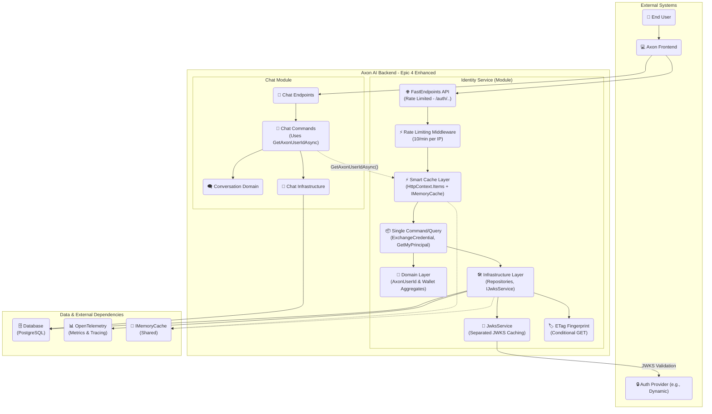
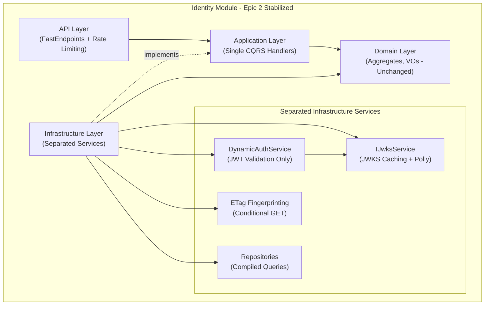
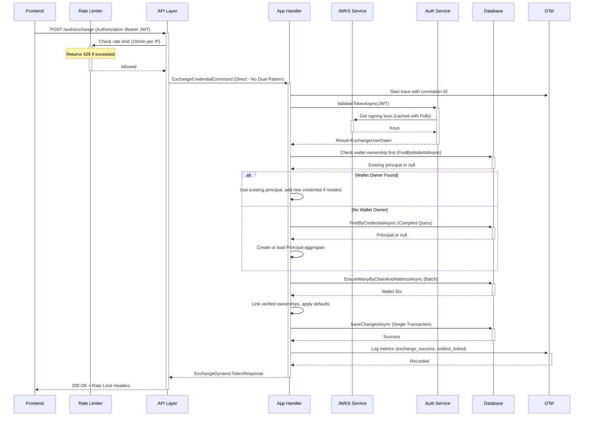
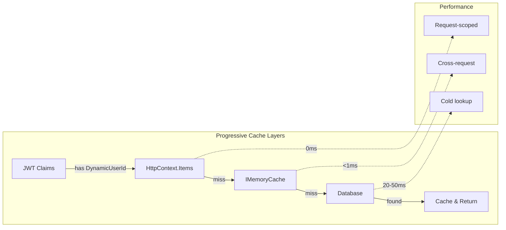

# Axon AI Identity & Memory — Backend Architecture (Epic 3 Wallet-First Resolution)

> **Module:** Identity (Principal, Credentials, Wallets)
> **Goal:** Production-ready canonical identity service with wallet-first resolution, preventing duplicate identities when users authenticate with different methods but same wallets.
> **API Surface:** `POST /auth/exchange`, `GET /auth/me` (stateless, production-hardened).
> **Key Invariants:** **Wallet-first resolution**; Global wallet uniqueness; **no silent reassignments**; **idempotent** exchange; **verified-first defaults**; **deterministic ETag**; **single command/query patterns**; **no contact identifiers persisted**.

---

## Change Log

| Date       | Version | Description                                                                                                  | Author  |
| ---------- | ------- | ------------------------------------------------------------------------------------------------------------ | ------- |
| 2025-01-17 | 4.0.0-ACTIVE   | **Epic 4 Smart Caching**: Architecture defined for progressive cache hierarchy, AxonUserId resolution, and Chat module integration. **CRITICAL CACHE WARMING IMPLEMENTATION REQUIRED** | Winston |
| 2025-09-14 | 3.0.0   | **Epic 3 Wallet-First Resolution**: Implements wallet-first identity resolution to prevent duplicate principals when users authenticate with different methods but control same wallets | Winston |
| 2025-09-11 | 2.0.0   | **Epic 2 Stabilization**: Eliminates dual patterns, adds ETag caching, rate limiting, simplified services, production observability; grounded in existing implementation | Winston |
| 2025-09-09 | 1.0.2   | Privacy-minimal MVP: **removed contact identifiers (e.g., primaryEmailHash)**; PRD alignment; docs tightened | Winston |
| 2025-09-09 | 1.0.1   | Final w/ PRD-aligned fixes (ETag, OpenAPI, privacy, no-op guards, minimalism)                                | Winston |
| 2025-09-09 | 1.0     | Initial consolidated architecture (final)                                                                    | Winston |

---

## 1. Introduction

This document describes the **Axon Identity Module** architecture—a production-ready stateless backend service built with **DDD**, **CQRS**, and **Clean Architecture**. The service provides two core REST endpoints with comprehensive security and performance features.

### Current Status & Next Focus

**Production System (Epics 1-3 Complete):**
* `POST /auth/exchange` — Idempotent principal creation with **wallet-first resolution** preventing duplicate identities
* `GET /auth/me` — Principal snapshots with **ETag conditional GET** optimization

**Epic 4: Smart User Context Caching (Active Implementation):**
* **Progressive Cache Hierarchy**: Request-scoped (0ms) → Memory cache (<1ms) → Database (20-50ms)
* **AxonUserId Unification**: Type rename for semantic clarity across Identity and Chat modules
* **50x Performance Improvement**: Eliminate 50ms database lookups with intelligent caching
* **Zero New Infrastructure**: Leverages existing `IMemoryCache` in both modules

### Core Architectural Principles

* **Stateless Design**: Provider-issued JWT validation only, no server tokens/cookies
* **Privacy-First**: No contact identifiers persisted or logged
* **Wallet-First Resolution**: Unified identity across authentication methods
* **Production-Hardened**: Rate limiting, ETag caching, OpenTelemetry observability

---

## 2. High-Level Architecture

### Technical Summary (Epic 2 Stabilized)

The Identity service is a stateless module within the **Axon-Backend** monorepo with **simplified architecture**. The **Principal** aggregate root owns **Credentials**, **WalletOwnerships**, and **ChainDefaults**. Epic 2 eliminated dual command patterns and separated service concerns for production readiness.

**Architecture Layers:**
* **API Layer:** FastEndpoints with rate limiting middleware, routes directly to single canonical handlers
* **Application Layer:** Single command/query patterns - `ExchangeCredentialCommand`, `GetMyPrincipalQuery` (eliminated dual patterns)
* **Domain Layer:** Unchanged aggregates and invariants
* **Infrastructure Layer:** Separated concerns with `IJwksService` extraction from `DynamicAuthService`, compiled queries, ETag fingerprinting

### High-Level Overview (Production-Hardened)

* **Style:** Modular monolith module ("Identity"), REST API, stateless, **production-optimized**.
* **Flow (Simplified):** Frontend sends JWT → API routes directly to handler → Single Application command/query → Domain invariants → Infrastructure persistence → Response with metrics/ETags
* **Epic 2 Enhancements:** Rate limiting (10/min per IP), ETag conditional GET, separated JWKS service, comprehensive observability, aggressive dead code removal
* **Non-Negotiables:** Global wallet uniqueness, no silent reassignments (409), idempotency, single command patterns, deterministic ETag caching

### High-Level Project Diagram



### Architectural & Design Patterns (Epic 2 Refined)

* **Clean Architecture:** API → Application (Single CQRS) → Domain (Aggregates) ← Infrastructure (separated services).
* **DDD:** `AxonPrincipal` aggregate root enforces invariants for credentials, wallet ownership, defaults.
* **CQRS Simplified:** Single canonical handlers - `ExchangeCredentialCommand` (write), `GetMyPrincipalQuery` (read) - **dual patterns eliminated**.
* **Separated Concerns:** `DynamicAuthService` focused on JWT validation, `IJwksService` handles JWKS caching with Polly retry policies.
* **Stateless Service:** Validate provider JWT on every request; no server tokens/cookies; ETag-based caching.
* **Repository Pattern:** Application depends on interfaces; Infrastructure implements with EF Core compiled queries and batch operations.
* **Result Pattern:** Consistent `Result<TSuccess, TError>` for all business outcomes and error handling.
* **Rate Limiting:** ASP.NET Core middleware with per-IP tracking and proper HTTP headers.

---

## 3. Tech Stack (Final)

### Cloud Infrastructure

* **Provider:** Azure (inherits Axon-Backend project layout)
* **Services:** Azure App Service / Container Apps, Azure Database for PostgreSQL Flexible Server, Azure Key Vault, Azure Monitor / Application Insights (via OTLP), Azure Storage (logs if needed)
* **Regions:** Align with Axon-Backend defaults (prod/stage parity)

### Technology Stack Table

| Category      | Technology                                         | Version | Purpose                              |
| ------------- | -------------------------------------------------- | ------- | ------------------------------------ |
| Language      | C#                                                 | 10      | Primary language                     |
| Runtime       | .NET                                               | 10      | Host / BCL                           |
| API Framework | FastEndpoints                                      | —       | Lightweight REST endpoints           |
| Auth          | `JwtBearerHandler` + `ConfigurationManager` (JWKS) | —       | JWT validation w/ rotating keys      |
| Database      | PostgreSQL                                         | 16      | Persistence                          |
| ORM/Access    | EF Core                                            | 9       | Persistence; migrations; concurrency |
| Migrations    | EF Core Migrations                                 | 9       | Schema migration                     |
| Observability | OpenTelemetry .NET                                 | —       | Traces, logs, metrics → OTLP         |
| API Docs      | Swagger + Scalar                                   | —       | OpenAPI UI                           |
| Testing       | NUnit + Shouldly                                   | —       | Unit/Integration tests               |
| Caching       | `IMemoryCache`                                     | —       | JWKS cache & helpers                 |
| IDs           | ULID                                               | —       | Principal/Wallet IDs                 |

**Decisions**

* **Risk posture wire enum:** `low | medium | high` (maps to internal enum).
* **ULID:** Stored as `CHAR(26)` in Postgres (sortable, compact).
* **Minimalism:** **No profile fields or contact identifiers (e.g., email hashes);** no wallet labels/tags persisted/exposed in MVP.

---

## 4. Domain Model

### AxonPrincipal (Aggregate Root)

**Purpose:** Canonical identity (human or service). Enforces invariants for credential uniqueness, wallet ownership, and chain defaults.

**Attributes**

* `Id: AxonId` (ULID, char(26))
* `Type: PrincipalType` (`Human` | `Service`)
* `RiskTier: RiskTier` (internal enum; wire = `low|medium|high`)
* `Credentials: IdentityCredential[]` (unique by provider, issuer, subject)
* `Ownerships: WalletOwnership[]` (access mode, status)
* `ChainDefaults: Map<chainId, WalletId>` (must be verified + signing)

> **MVP Privacy:** No contact identifiers (no email, no phone, no hashes) are stored.

### Wallet (Aggregate)

**Purpose:** Globally unique on-chain wallet (`chain`,`address`). Independent catalog entry until linked.

**Attributes**

* `Id: WalletId` (ULID, char(26))
* `ChainId: string` (e.g., `"solana"`)
* `Address: Address` (normalized, validated)
* `FirstSeenAt / LastSeenAt: DateTimeOffset`

### Invariants

1. **Global Wallet Uniqueness:** `(chainId, address)` unique in `wallet`.
2. **Single Verified Signing Owner:** At most one `Principal` has **verified & signing** ownership for a wallet (partial-unique index).
3. **No Silent Reassignments:** Attempts to link a wallet already owned (verified & signing) by another principal → **409 Conflict**.
4. **Idempotent Exchange:** Reprocessing the same credential bundle does not duplicate or contradict prior state.
5. **Defaults Verified-First:** Chain default must reference a **verified** `signing` ownership.

---

## 5. Components (Epic 2 Simplified Architecture)



**Epic 2 Component Responsibilities:**

* **API Layer:** FastEndpoints with rate limiting middleware (10/min per IP), direct routing to single handlers, ETag header management.
* **Application Layer:** **Simplified** - Single canonical handlers (`ExchangeCredentialCommand`, `GetMyPrincipalQuery`), eliminated dual patterns.
* **Domain Layer:** **Unchanged** - Aggregates + invariants (pure C#).
* **Infrastructure Layer (Refactored):**
  * **DynamicAuthService:** Focused solely on JWT validation logic
  * **IJwksService:** Extracted JWKS caching, key rotation, Polly retry policies  
  * **ETag Service:** Deterministic fingerprint generation for conditional GET
  * **Repositories:** Enhanced with compiled queries, batch operations, ETag support
  * **Observability:** OpenTelemetry tracing, metrics, structured logging with correlation IDs

---

## 6. External API Integration (Auth Provider)

* **JWKS:** `GET /.well-known/jwks.json` (public).
* **Validation:** `JwtBearerHandler` + `ConfigurationManager<OpenIdConnectConfiguration>` for automatic key rotation.
* **Caching:** JWKS cached with provider-aligned TTL (\~1h typical) and proactive refresh; validator resilient to brief rollovers/outages.
* **Claims Usage (MVP):** `iss`, `sub`, and (optionally) `aud` are validated; **any contact claims (e.g., `email`) are ignored and not persisted**.

---

## 7. Core Workflows

### New User Credential Exchange (`POST /auth/exchange`) - Epic 3 Wallet-First Resolution



### Existing User Identity Retrieval (`GET /auth/me`) - Epic 2 with ETag Optimization

```mermaid
sequenceDiagram
    participant Frontend
    participant API Layer
    participant App Handler
    participant Auth Service
    participant ETag Service
    participant Database
    participant OTel

    Frontend->>+API Layer: GET /auth/me (Authorization: Bearer JWT, If-None-Match: "etag-hash")
    API Layer->>+App Handler: GetMyPrincipalQuery (Direct - Single Pattern)
    App Handler->>+OTel: Start trace with correlation ID

    App Handler->>+Auth Service: ValidateTokenAsync(JWT)
    Note over Auth Service: Uses cached JWKS via IJwksService
    Auth Service-->>-App Handler: Claims (iss, sub, provider)

    App Handler->>+Database: FindByCredentialAsync (Compiled Query)
    Database-->>-App Handler: Principal ID

    App Handler->>+ETag Service: GetPrincipalFingerprintAsync(principalId)
    ETag Service->>+Database: SELECT fingerprint (compiled query)
    Note over ETag Service: Hash: principal.updated_at + verified ownerships + defaults
    Database-->>-ETag Service: Current ETag hash
    ETag Service-->>-App Handler: Current ETag

    alt ETag matches If-None-Match
        App Handler->>+OTel: Log metric (etag_hit)
        OTel-->>-App Handler: Recorded
        App Handler-->>-API Layer: 304 Not Modified (No body)
        API Layer-->>-Frontend: 304 Not Modified
    else ETag different or missing
        App Handler->>+Database: GetByIdWithActiveOwnershipsAsync (Compiled Query)
        Database-->>-App Handler: Principal + Ownerships + Defaults
        
        App Handler->>+OTel: Log metric (etag_miss)
        OTel-->>-App Handler: Recorded
        App Handler-->>-API Layer: 200 + ETag Header + CurrentUserResult
        API Layer-->>-Frontend: 200 OK + ETag + Cache-Control: private, max-age=0
    end
```

---

## 7.1 Smart Caching Architecture (Epic 4)

### Progressive Cache Hierarchy

Epic 4 introduces a three-tier caching system that dramatically improves identity resolution performance:



### Cache Key Patterns & TTL Strategy

**Dynamic → Axon Mapping Cache:**
```
Key Pattern: axon:user:{dynamicUserId}
Value: AxonUserId
TTL: 15 minutes sliding, 15 minutes absolute
Population: Exchange endpoint + on-demand resolution
```

**Request-Scoped Cache:**
```
Storage: HttpContext.Items["AxonUserId"]
Lifetime: Single HTTP request
Purpose: Eliminate multiple database queries within same request
```

### HttpContextUserService - Epic 4 Brutal Refactoring

**CURRENT STATE**: HttpContextUserService has NO caching, NO async methods, NO AxonUserId support.

**BRUTAL REFACTORING - COMPLETE REPLACEMENT:**

```csharp
public sealed class HttpContextUserService : ICurrentUserService
{
    private readonly IHttpContextAccessor _httpContextAccessor;
    private readonly IMemoryCache _memoryCache;
    private readonly IAxonPrincipalReadRepository _principalRepo;
    private readonly ILogger<HttpContextUserService> _logger;

    // METRICS for monitoring cache performance
    private static readonly Counter<long> CacheHitCounter =
        Meter.CreateCounter<long>("axon.identity.cache_hits");
    private static readonly Counter<long> CacheMissCounter =
        Meter.CreateCounter<long>("axon.identity.cache_misses");
    private static readonly Histogram<double> ResolutionLatency =
        Meter.CreateHistogram<double>("axon.identity.resolution_duration_ms");

    public HttpContextUserService(
        IHttpContextAccessor httpContextAccessor,
        IMemoryCache memoryCache,
        IAxonPrincipalReadRepository principalRepo,
        ILogger<HttpContextUserService> logger)
    {
        _httpContextAccessor = httpContextAccessor;
        _memoryCache = memoryCache;
        _principalRepo = principalRepo;
        _logger = logger;
    }

    // EXISTING properties remain unchanged for backward compatibility
    public string? UserId { get; /* existing JWT claims logic */ }
    public string? UserName { get; /* existing JWT claims logic */ }
    public bool IsAuthenticated { get; /* existing JWT claims logic */ }
    public string GetUserIdOrDefault(string systemUserId = "SYSTEM") { /* existing */ }
    public string GetCurrentUserIdOrSystem() { /* existing */ }

    // NEW Epic 4 methods - COMPLETE IMPLEMENTATION
    public async Task<AxonUserId?> GetAxonUserIdAsync(CancellationToken ct = default)
    {
        using var activity = Activity.Current?.Source.StartActivity("GetAxonUserIdAsync");
        var stopwatch = Stopwatch.StartNew();

        try
        {
            // Layer 1: Request-scoped cache (0ms)
            if (_httpContextAccessor.HttpContext?.Items.TryGetValue("AxonUserId", out var cached) == true)
            {
                activity?.SetTag("cache_source", "request");
                CacheHitCounter.Add(1, new KeyValuePair<string, object?>("source", "request"));
                _logger.LogDebug("AxonUserId cache hit (request-scoped)");
                return (AxonUserId)cached;
            }

            var dynamicUserId = UserId;
            if (string.IsNullOrEmpty(dynamicUserId))
            {
                activity?.SetTag("cache_source", "none_authenticated");
                return null;
            }

            // Layer 2: Memory cache (<1ms)
            var cacheKey = $"axon:user:{dynamicUserId}";
            var axonUserId = await _memoryCache.GetOrCreateAsync(
                cacheKey,
                async entry =>
                {
                    activity?.SetTag("cache_source", "database");
                    CacheMissCounter.Add(1);
                    _logger.LogDebug("AxonUserId cache miss, fetching from database for {DynamicUserId}", dynamicUserId);

                    entry.SetSlidingExpiration(TimeSpan.FromMinutes(15));
                    entry.SetAbsoluteExpirationRelativeToNow(TimeSpan.FromMinutes(30));
                    entry.SetPriority(CacheItemPriority.High);

                    // Layer 3: Database (20-50ms) - Use EXISTING method, NO new repository method needed
                    var principal = await _principalRepo.FindByCredentialAsync(
                        ProviderType.Dynamic,
                        "https://app.dynamic.xyz", // Standard Dynamic issuer
                        dynamicUserId,
                        ct);

                    return principal?.Id;
                });

            // Store in request cache for subsequent calls in same request
            if (axonUserId.HasValue && _httpContextAccessor.HttpContext != null)
            {
                _httpContextAccessor.HttpContext.Items["AxonUserId"] = axonUserId.Value;
                activity?.SetTag("cache_source", "memory");
                CacheHitCounter.Add(1, new KeyValuePair<string, object?>("source", "memory"));
            }

            return axonUserId;
        }
        finally
        {
            ResolutionLatency.Record(stopwatch.Elapsed.TotalMilliseconds);
        }
    }

    public bool TryGetAxonUserId(out AxonUserId axonUserId)
    {
        // Request cache check (fastest path)
        if (_httpContextAccessor.HttpContext?.Items.TryGetValue("AxonUserId", out var cached) == true)
        {
            axonUserId = (AxonUserId)cached;
            CacheHitCounter.Add(1, new KeyValuePair<string, object?>("source", "request_sync"));
            return true;
        }

        // Memory cache check (sync only - NO database fallback)
        var dynamicUserId = UserId;
        if (!string.IsNullOrEmpty(dynamicUserId))
        {
            var cacheKey = $"axon:user:{dynamicUserId}";
            if (_memoryCache.TryGetValue(cacheKey, out AxonUserId cachedId))
            {
                axonUserId = cachedId;
                // Also store in request cache for next call
                if (_httpContextAccessor.HttpContext != null)
                {
                    _httpContextAccessor.HttpContext.Items["AxonUserId"] = cachedId;
                }
                CacheHitCounter.Add(1, new KeyValuePair<string, object?>("source", "memory_sync"));
                return true;
            }
        }

        axonUserId = default;
        return false;
    }
}
```

### 🚨 Critical Cache Warming Implementation (Epic 4 Requirement)

**CRITICAL FINDING**: The `ExchangeCredentialHandler` at `src/Modules/Identity/Application/Commands/ExchangeCredential/ExchangeCredentialHandler.cs` currently has **NO cache warming implementation**. This completely breaks Epic 4 performance promise.

**REQUIRED IMPLEMENTATION** (Add after line 188 in ExchangeCredentialHandler.ExecuteExchangeTransaction):

```csharp
// CRITICAL: Add these dependencies to ExchangeCredentialHandler constructor
private readonly IMemoryCache _memoryCache;
private readonly IHttpContextAccessor _httpContextAccessor;

// NEW METHOD: Cache warming implementation
private async Task WarmUserContextCaches(string dynamicUserId, AxonUserId axonUserId)
{
    using var activity = Activity.Current?.Source.StartActivity("WarmUserContextCaches");
    activity?.SetTag("dynamic_user_id", dynamicUserId);
    activity?.SetTag("axon_user_id", axonUserId.Value);

    // Warm memory cache for cross-request access
    var cacheKey = $"axon:user:{dynamicUserId}";
    _memoryCache.Set(cacheKey, axonUserId, new MemoryCacheEntryOptions
    {
        SlidingExpiration = TimeSpan.FromMinutes(15),
        AbsoluteExpirationRelativeToNow = TimeSpan.FromMinutes(30),
        Priority = CacheItemPriority.High
    });

    // Warm request-scoped cache for immediate use
    if (_httpContextAccessor.HttpContext != null)
    {
        _httpContextAccessor.HttpContext.Items["AxonUserId"] = axonUserId;
    }

    _logger.LogInformation("User context cache warmed: {DynamicUserId} -> {AxonUserId}",
        dynamicUserId, axonUserId.Value);
}

// CALL after successful principal resolution (line 188):
await WarmUserContextCaches(userData.UserId, principal.Id);
```

### Chat Module Integration - Epic 4 Brutal Refactoring

**CURRENT STATE**: Chat module still uses `DefaultCurrentUserService` stub and sync UserId pattern.

**BRUTAL REFACTORING REQUIREMENTS**:
- [ ] **BRUTALLY REPLACE** `BaseChatCommandHandler.GetAuthenticatedUserId()` with async version
- [ ] **COMPLETELY REMOVE** `DefaultCurrentUserService` stub
- [ ] **CONVERT ALL** Chat handlers to use AxonUserId instead of UserId
- [ ] **UPDATE DI REGISTRATION** to use Identity module's HttpContextUserService

#### BaseChatCommandHandler - COMPLETE REPLACEMENT

```csharp
// src/Modules/Chat/Application/Common/Commands/BaseChatCommandHandler.cs
public abstract class BaseChatCommandHandler<TCommand, TResponse> : IRequestHandler<TCommand, Result<TResponse, Error>>
    where TCommand : ChatBaseCommand<TResponse>
    where TResponse : notnull
{
    private readonly ICurrentUserService _currentUserService;

    protected BaseChatCommandHandler(ICurrentUserService currentUserService)
    {
        _currentUserService = currentUserService;
    }

    // OLD METHOD - DELETE COMPLETELY
    // protected UserId GetAuthenticatedUserId() { ... }

    // NEW METHOD - BRUTAL REPLACEMENT
    /// <summary>
    /// Gets the authenticated user's AxonUserId with smart caching support.
    /// Throws UnauthorizedAccessException if AxonUserId cannot be resolved.
    /// </summary>
    protected async Task<AxonUserId> GetAuthenticatedAxonUserIdAsync(CancellationToken ct = default)
    {
        var axonUserId = await _currentUserService.GetAxonUserIdAsync(ct);
        if (!axonUserId.HasValue)
        {
            throw new UnauthorizedAccessException("AxonUserId not resolved for authenticated user");
        }

        return axonUserId.Value;
    }

    public abstract Task<Result<TResponse, Error>> Handle(TCommand request, CancellationToken cancellationToken);
}
```

#### Chat ServiceRegistration - BRUTAL DI CHANGE

```csharp
// src/Modules/Chat/Infrastructure/DependencyInjection/ServiceRegistration.cs
public static IServiceCollection AddChatInfrastructure(
    this IServiceCollection services,
    IConfiguration configuration)
{
    // ... existing registrations ...

    // OLD REGISTRATION - DELETE COMPLETELY
    // services.AddScoped<ICurrentUserService, DefaultCurrentUserService>();

    // NEW APPROACH - Use Identity module's service
    // NOTE: ICurrentUserService is now provided by Identity module's HttpContextUserService
    // Chat module leverages shared cached identity resolution for 50x performance improvement

    // ... rest of registrations ...
}
```

#### DefaultCurrentUserService - DELETE COMPLETELY

```csharp
// DELETE FILE: src/Modules/Chat/Infrastructure/Services/Identity/DefaultCurrentUserService.cs
// This stub service is no longer needed - Identity module provides real implementation
```

#### All Chat Handlers - BRUTAL METHOD REPLACEMENT

**Example Handler Update:**
```csharp
// BEFORE (in all handlers):
public override async Task<Result<StartConversationResponse, Error>> Handle(
    StartConversationCommand request,
    CancellationToken cancellationToken)
{
    var userId = GetAuthenticatedUserId(); // OLD - DELETE
    // ... rest of handler
}

// AFTER (brutal replacement in ALL handlers):
public override async Task<Result<StartConversationResponse, Error>> Handle(
    StartConversationCommand request,
    CancellationToken cancellationToken)
{
    var axonUserId = await GetAuthenticatedAxonUserIdAsync(cancellationToken); // NEW
    // ... rest of handler using axonUserId instead of userId
}
```

**HANDLERS TO UPDATE**:
- StartConversationHandler
- SendMessageHandler
- GetConversationHandler
- ListConversationsHandler
- All other chat command handlers

#### Domain Model Updates - AxonUserId Integration

```csharp
// Update Conversation aggregate to use AxonUserId
public class Conversation : AggregateRoot<ConversationId>
{
    public AxonUserId UserId { get; private set; } // Changed from UserId to AxonUserId

    // Constructor and methods updated to use AxonUserId
    public static Result<Conversation, Error> Create(
        ConversationId id,
        AxonUserId axonUserId, // Changed parameter type
        string title,
        TimeProvider timeProvider)
    {
        // Implementation using AxonUserId
    }
}
```

### Performance Impact - Epic 4 Refined Targets

| Operation | Before Epic 4 | After Epic 4 | Improvement | Method |
|-----------|--------------|--------------|-------------|---------|
| Identity Resolution (cached) | 50ms | **<1ms** | **50x** | Memory cache hit |
| Identity Resolution (cold) | 50ms | **20ms** | **2.5x** | Optimized FindByCredentialAsync |
| Same-request calls | 50ms each | **0ms** | **∞** | HttpContext.Items |
| Cache Hit Rate | 0% | **>95%** | N/A | Exchange endpoint warming |
| Database Load Reduction | 100% | **<5%** | **20x** | Cache effectiveness |

### Infrastructure Requirements - Epic 4 Clarification

**Zero New Dependencies**: Epic 4 leverages existing infrastructure:
- ✅ `IMemoryCache` already registered in both Identity and Chat modules
- ✅ `IHttpContextAccessor` available in `HttpContextUserService`
- ✅ Repository patterns established for `FindByCredentialAsync`
- ✅ **NO new repository method needed**: Uses existing `FindByCredentialAsync` with Dynamic provider

---

## 8. REST API Specification (Epic 2 Production-Ready)

```yaml
openapi: 3.0.0
info:
  title: "Axon AI - Identity & Memory API"
  version: "2.0.0"
  description: "Production-hardened stateless identity service with rate limiting, ETag caching, and simplified architecture. Epic 2 stabilization complete."
servers:
  - url: "/api/v1"
    description: "API Version 1"

components:
  securitySchemes:
    bearerAuth:
      type: http
      scheme: bearer
      bearerFormat: JWT
      description: "Provider-issued JWT (e.g., Dynamic.xyz)"

  schemas:
    WalletInfo:
      type: object
      properties:
        walletId: { type: string, description: "Internal wallet ULID (char(26))." }
        chainId:  { type: string, description: "e.g., 'solana'." }
        address:  { type: string, description: "Canonical on-chain address." }
        accessMode: { type: string, enum: [signing, watchOnly] }
        isVerified: { type: boolean }
    CurrentUserResult:
      description: "Snapshot of current user's identity."
      type: object
      properties:
        profile:
          type: object
          properties:
            axonId:   { type: string }
            riskTier: { type: string, enum: [low, medium, high] }
        wallets:
          type: array
          items: { $ref: '#/components/schemas/WalletInfo' }
        chainDefaults:
          type: object
          additionalProperties: { type: string }
          description: "Map<chainId, walletId>"

    ExchangeDynamicTokenResponse:
      description: "Result of exchange with operation metrics."
      type: object
      properties:
        axonId:           { type: string }
        created:          { type: boolean }
        walletsProcessed: { type: integer }
        walletsLinked:    { type: integer }
        defaultsApplied:  { type: integer }
        skipped:          { type: integer }
        conflicts:        { type: integer }

    ApiError:
      type: object
      properties:
        code:    { type: string }
        message: { type: string }
        details:
          type: object
          description: "Privacy-safe details; MUST NOT include other principal IDs."
          properties:
            chainId: { type: string }
            address: { type: string }

paths:
  /auth/exchange:
    post:
      summary: "Exchange provider JWT for Axon identity (Rate Limited)"
      description: |
        **Epic 2 Stabilized**: Validates a provider JWT and creates/updates the Axon Principal.
        Idempotent and safe to retry. **Rate-limited (10 req/min per IP)** with proper headers.
        Routes directly to ExchangeCredentialCommand (dual patterns eliminated).
      security: [{ bearerAuth: [] }]
      requestBody:
        required: false
        content:
          application/json:
            schema:
              type: object
              properties:
                desiredDefaults:
                  type: object
                  additionalProperties:
                    type: object
                    properties:
                      chainId: { type: string }
                      address: { type: string }
                riskTier:
                  type: string
                  enum: [low, medium, high]
      responses:
        '200': 
          description: "Exchange successful"
          headers:
            X-RateLimit-Remaining: { schema: { type: integer }, description: "Requests remaining in window" }
            X-RateLimit-Reset: { schema: { type: integer }, description: "Window reset time (epoch)" }
            X-Correlation-ID: { schema: { type: string }, description: "Request correlation ID" }
          content: 
            application/json: 
              schema: { $ref: '#/components/schemas/ExchangeDynamicTokenResponse' }
        '400': { description: "Malformed request/JWT" }
        '401': { description: "Invalid/expired JWT" }
        '409':
          description: "Wallet ownership conflict"
          content:
            application/json:
              schema: { $ref: '#/components/schemas/ApiError' }
        '422': { description: "Business rule violation" }
        '429':
          description: "Rate limit exceeded (10/min per IP)"
          headers:
            Retry-After: { schema: { type: string }, description: "Seconds to wait before retry" }
            X-RateLimit-Remaining: { schema: { type: integer }, description: "Always 0" }
            X-RateLimit-Reset: { schema: { type: integer }, description: "Window reset time (epoch)" }
            X-RateLimit-Limit: { schema: { type: integer }, description: "Rate limit (10)" }
        '500': { description: "Internal server error" }

  /auth/me:
    get:
      summary: "Get current authenticated user (Epic 2 ETag Optimized)"
      description: |
        **Epic 2 Enhanced**: Returns current Principal snapshot with conditional GET support.
        Routes directly to GetMyPrincipalQuery (dual patterns eliminated).
        ETag-based caching for optimal performance.
      security: [ { bearerAuth: [] } ]
      parameters:
        - in: header
          name: If-None-Match
          schema: { type: string }
          required: false
          description: "ETag from previous response for conditional GET"
          example: "\"sha256-abc123...\""
      responses:
        '200':
          description: "Principal data returned"
          headers:
            ETag: 
              schema: { type: string }
              description: "Deterministic fingerprint for conditional GET"
              example: "\"sha256-def456...\""
            Cache-Control: 
              schema: { type: string }
              description: "Caching directive"
              example: "private, max-age=0, must-revalidate"
            X-Correlation-ID: 
              schema: { type: string }
              description: "Request correlation ID"
          content:
            application/json:
              schema: { $ref: '#/components/schemas/CurrentUserResult' }
        '304': 
          description: "Not Modified - ETag matched If-None-Match"
          headers:
            ETag: 
              schema: { type: string }
              description: "Unchanged ETag value"
            Cache-Control: 
              schema: { type: string }
              example: "private, max-age=0, must-revalidate"
        '401': { description: "Invalid/expired JWT" }
        '404': { description: "Principal not found (no successful exchange yet)" }
```

---

## 9. Application Layer — CQRS Catalog (Epic 2 Simplified)

**Epic 2 Eliminated Dual Patterns**: Removed `ExchangeTokenCommand`, `GetCurrentUserQuery` and all associated handlers, validators, DTOs. API endpoints route directly to single canonical handlers.

### Commands (Single Pattern)

**`ExchangeCredentialCommand`** *(Only Command - Dual Pattern Removed)*

* **Input:** Normalized `ExchangeUserData` (issuer, subject, provider, wallets, riskTier?) from separated `DynamicAuthService`.
* **Simplified Steps:**
  a) `FindByCredentialAsync` (compiled query) → new or existing Principal
  b) `EnsureManyByChainAndAddressAsync` (batch operation - no N+1)
  c) Link **verified** ownerships (domain invariants enforced)
  d) Apply **verified-first** chain defaults (**idempotent**)
  e) **No-op guards:** Skip writes when values unchanged (ETag preservation)
  f) Persist in **single transaction** with observability tracing
* **Output:** `ExchangeDynamicTokenResponse` (created?, counts)
* **Observability:** Trace correlation ID, metrics (exchange_success/failure, wallets_linked), structured logging
* **Errors → HTTP:** JWT validation → 400/401; wallet conflict → 409; rate limit → 429; domain rules → 422

### Queries (Single Pattern)

**`GetMyPrincipalQuery`** *(Only Query - Dual Pattern Removed)*

* **Input:** Claims (provider, issuer, subject), `If-None-Match` ETag (optional).
* **Simplified Steps:**
  a) `FindByCredentialAsync` (compiled read query) → Principal ID
  b) `GetPrincipalFingerprintAsync(id)` → current ETag hash
  c) **ETag Optimization:** Compare with `If-None-Match` → return **304** if unchanged
  d) If different → `GetByIdWithActiveOwnershipsAsync(id)` (single compiled query)
* **Output:** `CurrentUserResult` + `ETag` header OR **304 Not Modified**
* **Observability:** Metrics (etag_hits/misses), trace correlation, structured logging

### Key Repository Methods

**Core Operations (Implemented):**
```csharp
// Identity resolution (Epic 3)
Task<AxonPrincipal?> FindByCredentialAsync(ProviderType providerType, string issuer, string subject, CancellationToken ct = default);
Task<AxonPrincipal?> FindByWalletIdAsync(WalletId walletId, CancellationToken ct = default);

// Wallet operations (Performance optimized)
Task<IReadOnlyDictionary<WalletId, AxonPrincipal>> FindVerifiedSigningOwnersAsync(IEnumerable<WalletId> walletIds, CancellationToken ct = default);
Task<IReadOnlyDictionary<(string chainId, Address address), WalletId>> EnsureManyByChainAndAddressAsync(IEnumerable<(string chainId, Address address)> items, CancellationToken ct = default);

// ETag & snapshots
Task<string> GetPrincipalFingerprintAsync(AxonUserId principalId, CancellationToken ct = default);
Task<AxonPrincipal?> GetByIdWithActiveOwnershipsAsync(AxonUserId principalId, CancellationToken ct = default);
```

**Epic 4 Additions (Pending):**
```csharp
// Smart caching support
Task<AxonPrincipal?> FindByDynamicUserIdAsync(string dynamicUserId, CancellationToken ct = default);
```

### Enhanced ICurrentUserService (Epic 4)

Epic 4 significantly enhances the `ICurrentUserService` interface defined in `src/BuildingBlocks/Core/Abstractions/Authentication/ICurrentUserService.cs` to support unified identity resolution across modules.

#### Interface Enhancement

**Current Interface (Pre-Epic 4):**
```csharp
public interface ICurrentUserService
{
    string? UserId { get; }              // Dynamic JWT userId
    string? UserName { get; }            // Display name from JWT
    bool IsAuthenticated { get; }        // Authentication status

    string GetUserIdOrDefault(string systemUserId = "SYSTEM");
    string GetCurrentUserIdOrSystem();
}
```

**Epic 4 Enhanced Interface:**
```csharp
public interface ICurrentUserService
{
    // Existing properties (unchanged)
    string? UserId { get; }              // Dynamic JWT userId from claims
    string? UserName { get; }            // Display name from JWT
    bool IsAuthenticated { get; }        // Authentication status

    string GetUserIdOrDefault(string systemUserId = "SYSTEM");
    string GetCurrentUserIdOrSystem();

    // Epic 4 NEW: Async AxonUserId resolution with caching
    Task<AxonUserId?> GetAxonUserIdAsync(CancellationToken ct = default);

    // Epic 4 NEW: Sync cache-only lookup (no database fallback)
    bool TryGetAxonUserId(out AxonUserId axonUserId);
}
```

#### Key Behavioral Changes

**Identity Resolution Strategy:**
1. **Dynamic UserId** (existing): JWT `sub` claim from authentication provider
2. **AxonUserId** (new): Internal canonical identity with smart caching

**Caching Behavior:**
- `GetAxonUserIdAsync()`: Progressive cache hierarchy (HttpContext.Items → IMemoryCache → Database)
- `TryGetAxonUserId()`: Cache-only lookup, no database queries
- All calls within same HTTP request return cached value (0ms latency)

#### Implementation Location

**HttpContextUserService Enhancement:**
Located at `src/Modules/Identity/Infrastructure/Services/HttpContextUserService.cs`

The existing implementation provides JWT-based authentication. Epic 4 extends it with:
- Dependency injection of `IMemoryCache` and `IAxonPrincipalReadRepository`
- Progressive cache resolution implementing the interface enhancements
- Request-scoped caching via `HttpContext.Items`

#### Chat Module Integration Impact

**Current Chat Handler Pattern:**
```csharp
// src/Modules/Chat/Application/Common/Commands/BaseChatCommandHandler.cs
protected UserId GetAuthenticatedUserId()
{
    var userIdString = _currentUserService.UserId!;  // Dynamic JWT userId
    return new UserId(Guid.Parse(userIdString));     // Converts to UserId type
}
```

**Epic 4 Enhanced Pattern:**
```csharp
// Updated pattern for unified identity
protected async Task<AxonUserId> GetAxonUserIdAsync(CancellationToken ct = default)
{
    var axonUserId = await _currentUserService.GetAxonUserIdAsync(ct);
    if (!axonUserId.HasValue)
        throw new UnauthorizedAccessException("AxonUserId not resolved");

    return axonUserId.Value;
}
```

#### Backward Compatibility

**No Breaking Changes**: Epic 4 maintains full backward compatibility:
- All existing properties and methods unchanged
- New methods are additive
- Chat module can migrate handlers incrementally
- `DefaultCurrentUserService` in Chat remains functional during transition

#### Error Handling Strategy

**Resolution Failure Scenarios:**
1. **No Authentication**: `GetAxonUserIdAsync()` returns `null`
2. **Cache Miss + DB Miss**: Returns `null` (user not yet exchanged)
3. **Database Unavailable**: Throws exception (circuit breaker pattern recommended)

**Graceful Degradation:**
- `TryGetAxonUserId()` returns `false` for any failure
- Chat handlers can fallback to Dynamic userId if needed
- Exchange endpoint always populates cache for subsequent requests

---

## 10. Database Schema (PostgreSQL 16, EF Core 9)

> **IDs:** ULID stored as `CHAR(26)`; BTREE indexed.
> **Concurrency:** `updated_at TIMESTAMPTZ NOT NULL DEFAULT now()` + EF concurrency tokens.
> **Soft Delete:** Not used in MVP (keep minimalism).

```sql
-- principals
CREATE TABLE identity.principal (
  id               CHAR(26) PRIMARY KEY,       -- ULID
  type             SMALLINT NOT NULL,          -- 0:Human, 1:Service
  risk_tier        SMALLINT NOT NULL,          -- 0:low, 1:medium, 2:high  (wire uses strings)
  created_at       TIMESTAMPTZ NOT NULL DEFAULT now(),
  updated_at       TIMESTAMPTZ NOT NULL DEFAULT now()
);

-- credentials (unique per provider+issuer+subject)
CREATE TABLE identity.credential (
  id           CHAR(26) PRIMARY KEY,
  principal_id CHAR(26) NOT NULL REFERENCES identity.principal(id) ON DELETE CASCADE,
  provider     SMALLINT NOT NULL,              -- enum ProviderType
  issuer       TEXT NOT NULL,
  subject      TEXT NOT NULL,
  created_at   TIMESTAMPTZ NOT NULL DEFAULT now(),
  updated_at   TIMESTAMPTZ NOT NULL DEFAULT now(),
  UNIQUE (provider, issuer, subject)
);

-- wallets (global uniqueness by (chain_id, address))
CREATE TABLE identity.wallet (
  id            CHAR(26) PRIMARY KEY,
  chain_id      TEXT NOT NULL,
  address       TEXT NOT NULL,
  first_seen_at TIMESTAMPTZ NOT NULL DEFAULT now(),
  last_seen_at  TIMESTAMPTZ NOT NULL DEFAULT now(),
  created_at    TIMESTAMPTZ NOT NULL DEFAULT now(),
  updated_at    TIMESTAMPTZ NOT NULL DEFAULT now(),
  UNIQUE (chain_id, address)
);

-- wallet ownerships (enforce only one verified+signing owner globally)
CREATE TABLE identity.wallet_ownership (
  id            CHAR(26) PRIMARY KEY,
  principal_id  CHAR(26) NOT NULL REFERENCES identity.principal(id) ON DELETE CASCADE,
  wallet_id     CHAR(26) NOT NULL REFERENCES identity.wallet(id) ON DELETE CASCADE,
  access_mode   SMALLINT NOT NULL,             -- 0:signing, 1:watchOnly
  status        SMALLINT NOT NULL,             -- 0:pending, 1:verified, 2:revoked
  created_at    TIMESTAMPTZ NOT NULL DEFAULT now(),
  updated_at    TIMESTAMPTZ NOT NULL DEFAULT now(),
  UNIQUE (principal_id, wallet_id)
);

-- partial unique: only one verified signing owner per wallet
CREATE UNIQUE INDEX ux_wallet_verified_signing_owner
  ON identity.wallet_ownership (wallet_id)
  WHERE status = 1 AND access_mode = 0;

-- chain defaults (one default wallet per principal per chain)
CREATE TABLE identity.principal_chain_default (
  principal_id CHAR(26) NOT NULL REFERENCES identity.principal(id) ON DELETE CASCADE,
  chain_id     TEXT NOT NULL,
  wallet_id    CHAR(26) NOT NULL REFERENCES identity.wallet(id) ON DELETE RESTRICT,
  created_at   TIMESTAMPTZ NOT NULL DEFAULT now(),
  updated_at   TIMESTAMPTZ NOT NULL DEFAULT now(),
  PRIMARY KEY (principal_id, chain_id)
);

-- helpful indexes
CREATE INDEX ix_wallet_chain ON identity.wallet(chain_id);
CREATE INDEX ix_credential_principal ON identity.credential(principal_id);
CREATE INDEX ix_ownership_principal ON identity.wallet_ownership(principal_id);
CREATE INDEX ix_ownership_wallet ON identity.wallet_ownership(wallet_id);
```

### ETag Fingerprint (DB-side)

Create a stable fingerprint (hex string) combining `updated_at` from **principal**, its **verified & signing** ownerships and **defaults**:

```sql
SELECT encode(
  digest(
    COALESCE( to_char(p.updated_at, 'YYYY-MM-DD"T"HH24:MI:SS.USZ'), '' ) ||
    COALESCE( to_char(MAX(o.updated_at), 'YYYY-MM-DD"T"HH24:MI:SS.USZ'), '' ) ||
    COALESCE( to_char(MAX(d.updated_at), 'YYYY-MM-DD"T"HH24:MI:SS.USZ'), '' ),
    'sha256'),
  'hex') AS fingerprint
FROM identity.principal p
LEFT JOIN identity.wallet_ownership o ON o.principal_id = p.id AND o.status = 1 AND o.access_mode = 0
LEFT JOIN identity.principal_chain_default d ON d.principal_id = p.id
WHERE p.id = $1
GROUP BY p.id, p.updated_at;
```

> **ETag Determinism:** Pending-only ownership changes, `last_seen` touches, and no-op writes MUST NOT change the ETag.

---

## 11. Error Handling Strategy

* **Result Pattern:** Domain workflows return `Result<Success, Error>`; API maps to HTTP codes.
* **Mapping**

  * Validation/auth/JWT → **400/401**
  * Invariant violations (e.g., conflicting ownership) → **409**
  * Other business rule failures → **422**
  * Rate limit → **429** with `Retry-After`, `X-RateLimit-*`
  * Unexpected → **500**
* **Privacy for 409:** Response MUST NOT include any principal identifiers other than the caller’s. Use `ApiError.details = { chainId, address }` only.
* **Logging:** Include correlation ID (trace id), principal id (when resolved), provider and wallet identifiers **without PII**.

---

## 12. Rate Limiting (Epic 2 Production Implementation)

### ASP.NET Core Middleware Configuration

**Policy Details:**
* **`/auth/exchange`:** **10 requests/minute per IP address** using sliding window
* **`/auth/me`:** No rate limiting (read path optimized with ETag conditional GET)

**Implementation Approach:**
```csharp
// Program.cs - Rate limiting configuration
builder.Services.AddRateLimiter(options =>
{
    options.RejectionStatusCode = 429;
    
    // Exchange endpoint rate limiting
    options.AddFixedWindowLimiter("AuthExchange", config =>
    {
        config.Window = TimeSpan.FromMinutes(1);
        config.PermitLimit = 10;
        config.QueueLimit = 0; // Reject immediately when limit exceeded
    });
    
    // Global policy for IP-based limiting
    options.GlobalLimiter = PartitionedRateLimiter.Create<HttpContext, IPAddress>(context =>
    {
        var ipAddress = context.Connection.RemoteIpAddress;
        
        if (context.Request.Path.StartsWithSegments("/auth/exchange"))
        {
            return RateLimitPartition.GetFixedWindowLimiter(
                ipAddress,
                _ => new FixedWindowRateLimiterOptions
                {
                    PermitLimit = 10,
                    Window = TimeSpan.FromMinutes(1),
                    QueueProcessingOrder = QueueProcessingOrder.OldestFirst,
                    QueueLimit = 0
                });
        }
        
        return RateLimitPartition.GetNoLimiter(ipAddress);
    });
});
```

### HTTP Response Headers

**Success Responses (200 OK):**
```http
X-RateLimit-Limit: 10
X-RateLimit-Remaining: 7
X-RateLimit-Reset: 1694123456
```

**Rate Limited Responses (429 Too Many Requests):**
```http
Retry-After: 45
X-RateLimit-Limit: 10
X-RateLimit-Remaining: 0
X-RateLimit-Reset: 1694123456
```

### Observability & Metrics

* **Rate Limiter Metrics:** `rate_limit_hits`, `rate_limit_rejections`, per-IP tracking
* **Response Time Impact:** < 1ms overhead for rate limit checks
* **Integration:** Works seamlessly with existing OpenTelemetry tracing

---

## 13. Caching Strategy & Performance

### Production Caching (Epics 1-3) ✅
* **JWKS:** Managed by `ConfigurationManager`; keys cached with provider-aligned TTL and proactive refresh
* **ETag for `/auth/me`:** Compare `If-None-Match` vs DB fingerprint; return **304** if unchanged
* **Cache-Control:** `private, max-age=0, must-revalidate` (frontend always validates with ETag)

### Epic 4: Progressive Cache Hierarchy (Pending Implementation) 🔄
```
Request Scope (0ms) → Memory Cache (<1ms) → Database (20ms)
HttpContext.Items → IMemoryCache → FindByDynamicUserIdAsync
```

**Performance Targets:**
- Identity Resolution (cached): 50ms → <1ms (50x improvement)
- Same-request calls: 50ms each → 0ms (HttpContext.Items)
- Cache hit rate: 0% → >95% after warmup
- Database queries: 100% → <5% (cache-first strategy)

---

## 14. Observability (Epic 2 Production-Grade)

### OpenTelemetry Implementation

**Comprehensive Tracing:**
* **Request Lifecycle:** Complete trace from API → Application → Domain → Infrastructure
* **Correlation IDs:** Propagated across all layers, included in logs and responses
* **Span Structure:** 
  ```
  /auth/exchange [HTTP]
  ├── ExchangeCredentialCommand [App]
  │   ├── DynamicAuthService.ValidateToken [Infra]
  │   │   └── JwksService.GetKeys [Infra]
  │   ├── FindByCredentialAsync [Database]
  │   ├── EnsureManyByChainAndAddressAsync [Database]
  │   └── SaveChangesAsync [Database]
  └── Rate Limiter Check [Middleware]
  ```

**Epic 2 Metrics Catalog:**

**Core Business Metrics:**
- `identity_exchange_success_total` (counter) - Successful exchanges by provider
- `identity_exchange_failure_total` (counter) - Failed exchanges by error type
- `identity_wallet_conflicts_total` (counter) - Wallet ownership conflicts (409 responses)
- `identity_wallets_linked_total` (counter) - Total wallets linked during exchanges
- `identity_principals_created_total` (counter) - New principals created

**Performance Metrics:**
- `identity_etag_hits_total` (counter) - ETag cache hits (304 responses)
- `identity_etag_misses_total` (counter) - ETag cache misses (200 responses)
- `identity_request_duration_seconds` (histogram) - Request latency by endpoint
- `identity_database_query_duration_seconds` (histogram) - DB query performance

**Infrastructure Metrics:**
- `identity_rate_limit_hits_total` (counter) - Rate limit violations by IP
- `identity_jwks_cache_hits_total` (counter) - JWKS cache effectiveness
- `identity_jwt_validation_duration_seconds` (histogram) - JWT validation performance

**Epic 4 Smart Caching Metrics:**
- `axon.identity.cache_hits` (counter) - Cache hits by source (request, memory, memory_sync)
- `axon.identity.cache_misses` (counter) - Cache misses requiring database lookup
- `axon.identity.resolution_duration_ms` (histogram) - AxonUserId resolution latency
- `axon.identity.cache_warmup_total` (counter) - Cache warming operations in Exchange endpoint
- `axon.identity.database_queries_total` (counter) - Database queries for identity resolution (should be <5% after Epic 4)

### Structured Logging Strategy

**Log Levels & Content:**
```json
{
  "timestamp": "2025-09-11T15:30:45.123Z",
  "level": "Information",
  "message": "Exchange completed successfully",
  "correlationId": "01JA2B3C4D5E6F7G8H9J0K1L2M",
  "traceId": "abc123def456",
  "principalId": "01JA2B3C4D5E6F7G8H9J0K1L2M",
  "provider": "dynamic",
  "walletsProcessed": 2,
  "walletsLinked": 1,
  "created": false,
  "requestDuration": 156.7
}
```

**Privacy Compliance:**
- **NEVER log**: Email addresses, phone numbers, contact identifiers
- **Safe to log**: Principal IDs, wallet IDs, chain IDs, addresses (public blockchain data)
- **Always include**: Correlation IDs for request tracing

### Dashboards & Alerting

**Production Dashboards:**
1. **Identity Health Overview:** Success rates, error distributions, latency percentiles
2. **ETag Effectiveness:** Cache hit ratios, conditional GET performance
3. **Rate Limiting Stats:** Per-IP request patterns, abuse detection
4. **JWT Validation Performance:** JWKS cache health, validation latency
5. **Epic 4 Cache Performance:** Cache hit rates by source, resolution latency, database load reduction

**Critical Alerts:**
- Exchange success rate < 95% (5min window)
- Rate limit violations > 100/hour from single IP
- ETag cache hit ratio < 60%
- JWT validation errors > 10% (indicates JWKS issues)

**Epic 4 Performance Alerts:**
- Identity cache hit rate < 95% (indicates cache warming issues)
- AxonUserId resolution P95 latency > 1ms (cached scenarios)
- Database queries for identity resolution > 5% (cache bypass)
- Cache warming failures in Exchange endpoint > 1%

---


---

## 15. Security

* **AuthN:** `JwtBearerHandler` + `ConfigurationManager` (JWKS). Validate `iss`, `aud` (if configured), `sub`, expiration, signature.
* **AuthZ:** Module-level — API requires valid token; no fine-grained RBAC in MVP.
* **Input Validation:** DTOs validated via FastEndpoints + FluentValidation in Application layer.
* **Transport:** HTTPS only; HSTS via platform defaults.
* **Headers:** Standard security headers (X-Content-Type-Options, X-Frame-Options, Referrer-Policy, etc.) at gateway/app level.
* **Secrets:** Azure Key Vault for provider configuration; no secrets in logs.
* **CORS:** Restricted to Axon frontend origins; partner origins added via configuration.
* **Privacy:** **Do not persist or log contact identifiers**; ignore such claims if present in JWTs.

---

## 16. Coding Standards (Minimal, Critical)

* **Logging:** Use structured logger with OTel enrichment; no `Console.WriteLine`.
* **HTTP:** Endpoints are **stateless**; never set cookies/session.
* **Repositories:** Application depends on interfaces only; Infra implements; **no EF types** in domain/app.
* **Error Handling:** Business failures return `Result`; do not throw for expected states.
* **Enums/Wire:** Risk posture on wire **must** be `low|medium|high`. Maintain a single mapping table.
* **IDs:** Generate **ULID**; store as `CHAR(26)`; never expose database surrogates.
* **PII:** **No contact identifiers persisted or logged**; tests must assert this.

---

## 17. Testing Strategy

* **Unit (NUnit + Shouldly):**

  * Domain aggregates: invariants (ownership uniqueness, verified-first defaults, idempotency).
  * Application handlers: happy paths + conflict/edge cases; **no-op guards** verified.
* **Integration (NUnit):**

  * EF Core + Postgres (Testcontainers).
  * Repo methods: unique/partial-unique indexes; 409 behavior.
  * JWKS validation (mock provider / local JWKS).
* **API/Contract:**

  * `/auth/exchange` and `/auth/me` (ETag 200/304).
* **Privacy Tests:**

  * Ensure JWT contact claims (if present) are **not** persisted or logged.
* **Coverage Targets:**

  * Domain & Application: **\~80%** lines; emphasize branches for invariants.

---

## 18. Source Tree (Module)

```
src/Modules/Identity/
├── API/
│   ├── Endpoints/
│   │   ├── Auth/
│   │   │   ├── ExchangeEndpoint.cs        # POST /auth/exchange
│   │   │   └── MeEndpoint.cs              # GET /auth/me
│   ├── Contracts/                         # request/response DTOs
│   └── Swagger/Scalar/                    # OpenAPI generation & UI
├── Application/
│   ├── Commands/
│   │   └── ExchangeCredential/
│   │       ├── ExchangeCredentialCommand.cs
│   │       ├── ExchangeCredentialHandler.cs
│   │       └── ExchangeUserData.cs        # normalized claims+wallets DTO (no contact identifiers)
│   ├── Queries/
│   │   └── GetMyPrincipal/
│   │       ├── GetMyPrincipalQuery.cs
│   │       └── GetMyPrincipalHandler.cs
│   ├── Contracts/
│   │   └── Persistence/                   # interfaces + additions
│   └── Validation/                        # FluentValidators
├── Domain/
│   ├── Aggregates/
│   │   ├── AxonPrincipal/...
│   │   └── Wallet/...
│   ├── Entities/ ValueObjects/ Enums/
│   └── Abstractions/ Results/
├── Infrastructure/
│   ├── Persistence/
│   │   ├── IdentityWriteDbContext.cs
│   │   ├── IdentityReadDbContext.cs
│   │   ├── Configurations/                # EF model configs (indices, partial unique)
│   │   ├── Repositories/                  # EF implementations
│   │   └── Migrations/
│   ├── Auth/
│   │   ├── JwtValidator.cs                # JwtBearerHandler config helpers
│   │   └── JwksCache.cs                   # IMemoryCache policy
│   └── ETags/
│       └── PrincipalFingerprintReader.cs
└── Tests/
    ├── Unit/
    └── Integration/
```

---

## 19. Deployment & Operations

* **Runtime:** .NET 10 container or App Service configuration per Axon-Backend standard.
* **Config:** `ASPNETCORE_*`, provider issuer/audience, JWKS metadata address, Postgres connection, rate limit options.
* **CI/CD:** Reuse Axon-Backend workflows (build, test, publish, migrate).
* **Migrations:** Apply EF migrations on deploy or pre-deploy job; optional read replica later for `/auth/me`.
* **Rollback:** Blue-green or slot swap (App Service); DB migrations forward-only; destructive changes gated.

---

## 20. Implementation Status & Roadmap

### Epic 3 (Wallet-First Resolution) - ✅ Complete

**Story 3.1 - Wallet-First Principal Resolution**
- ✅ **COMPLETE**: `ResolveOrCreatePrincipalWalletFirst` method fully implemented in `ExchangeCredentialHandler` (lines 276-381)
- ✅ **Repository Infrastructure**: All required methods implemented:
  - `FindVerifiedSigningOwnersAsync` - batch wallet ownership lookup
  - `IsCredentialTakenAsync` - credential conflict detection
  - `FindByCredentialAsync` - fallback credential lookup
- ✅ **4-Step Resolution Process**: Wallet-first → credential fallback → add credential → create new principal

**Story 3.2 - Cross-Credential Identity Linking**
- ✅ **COMPLETE**: Logic implemented to add new credentials to existing principals (lines 328-370)
- ✅ **Conflict Detection**: `IsCredentialTakenAsync` used with proper 409 error mapping (lines 351-367)
- ✅ **Idempotency**: Duplicate credential handling (lines 332-336)

**Story 3.3 - Enhanced Testing for Wallet-First Flow**
- ✅ **COMPLETE**: Comprehensive test coverage including:
  - `Should_ResolveSamePrincipal_When_WalletMatches` - wallet resolution tests
  - `Should_AddCredential_When_WalletMatches` - cross-credential linking tests
  - `Should_ReturnConflictError_When_WalletOwnedByAnotherPrincipal` - conflict handling tests
  - `Should_FallbackToCredentialLookup_When_NoWalletOwners` - fallback logic tests
  - `Should_CreateNewPrincipal_When_NoWalletOwnersAndNoCredential` - new principal creation tests

### Epic 4 (Smart Caching) - Critical Gaps Identified 🚨

**🚨 CRITICAL FINDING**: Epic 4 was missing cache warming implementation - complete performance failure without it.

**Story 4.1 - Rename AxonId to AxonUserId (1 point)**
- ❌ **PENDING**: StronglyTypedId exists but needs brutal refactoring (~26 files affected)
- ❌ **Mass Rename Required**: AxonId → AxonUserId across Identity and domain layers
- ✅ **No Migration**: Database column names remain unchanged (`principal.id`, etc.)
- ✅ **Build System Ready**: Existing patterns support type name changes

**Story 4.2 - Enhanced ICurrentUserService (2 points)**
- ❌ **BRUTAL INTERFACE ENHANCEMENT REQUIRED**: Missing async methods `GetAxonUserIdAsync()`, `TryGetAxonUserId()`
- ❌ **Interface Gap**: No AxonUserId resolution support
- ✅ **Infrastructure**: `IMemoryCache` already registered in both Identity and Chat modules
- ❌ **Implementation Gap**: `HttpContextUserService` has NO caching, NO async methods

**Story 4.3 - Smart Caching Implementation (3 points)**
- ❌ **CRITICAL GAP**: ExchangeCredentialHandler has NO cache warming implementation
- ❌ **HttpContextUserService Gap**: NO caching, NO async methods, NO AxonUserId support
- ❌ **Missing Dependencies**: IMemoryCache and IHttpContextAccessor not injected in ExchangeCredentialHandler
- ✅ **Repository Available**: `FindByCredentialAsync` pattern exists (NO new method needed)
- ❌ **Progressive Cache**: HttpContext.Items → IMemoryCache → Database NOT implemented

**Story 4.4 - Chat Module Integration (1 point)**
- ❌ **BRUTAL COMPLETE REWRITE REQUIRED**: BaseChatCommandHandler.GetAuthenticatedUserId() must be replaced
- ❌ **DELETE DefaultCurrentUserService**: Stub service still exists and needs complete removal
- ❌ **CONVERT ALL Handlers**: All Chat handlers need async AxonUserId pattern
- ❌ **DI Registration**: Chat module still registers DefaultCurrentUserService stub
- ❌ **Domain Model**: Conversation aggregate still uses UserId instead of AxonUserId

### Epic 4 Validation & Testing Status

**Infrastructure Verification (✅ Complete):**
- Memory cache registration confirmed in both modules via `ServiceRegistration.cs`
- Existing cache usage patterns validated (JWKS, replay guard, MCP config)
- `HttpContext.Items` access confirmed in current `HttpContextUserService`
- Repository dependency injection patterns established

**Performance Baseline (⏳ Pending):**
- Current identity resolution latency measurement (~50ms estimated)
- Cache hit ratio monitoring implementation
- Memory usage impact assessment
- Request-scoped vs cross-request performance comparison

**Integration Testing Requirements (⏳ Pending):**
- End-to-end user journey: Exchange → Chat commands using same AxonUserId
- Cache consistency across HTTP requests
- Graceful degradation when cache unavailable
- Backward compatibility with existing Chat module patterns

## 20. Completed Features Summary (Epics 1-3)

### Epic 1 (Foundation) - ✅ Complete
**Core Achievement:** Production-ready identity service with DDD + CQRS patterns
- ✅ Domain model: AxonPrincipal, Wallet aggregates with invariant enforcement
- ✅ Database schema with PostgreSQL + EF Core migrations
- ✅ JWT validation with Dynamic.xyz provider integration
- ✅ `/auth/exchange` and `/auth/me` REST endpoints
- ✅ Privacy compliance: no contact identifiers persisted

### Epic 2 (Stabilization) - ✅ Complete
**Core Achievement:** Production-hardened service with performance optimizations
- ✅ Simplified application layer: single canonical command/query handlers
- ✅ ETag conditional GET optimization for `/auth/me` (304 Not Modified)
- ✅ Rate limiting: 10 requests/minute per IP on `/auth/exchange`
- ✅ OpenTelemetry observability: metrics, tracing, structured logging
- ✅ Separated services: IJwksService with Polly retry policies

### Epic 3 (Wallet-First Resolution) - ✅ Complete
**Core Achievement:** Unified identity across authentication methods
- ✅ Wallet-first principal resolution prevents duplicate identities
- ✅ Cross-credential linking: Google + Dynamic → same principal
- ✅ Enhanced conflict detection with proper 409 responses
- ✅ Batch wallet operations for performance
- ✅ ResolveOrCreatePrincipalWalletFirst implementation

## 21. Acceptance Checklist Mapping

* **New user exchange works** → `/auth/exchange` creates Principal, wallets linked, defaults applied, risk posture set → ✅
* **Idempotent exchange** → Same input produces no duplicates; verified via constraints + handler logic → ✅
* **`/auth/me` returns snapshot with ETag** → **200** with `ETag` then **304** on unchanged → ⚠️ **Partial** (ETag implemented, 304 optimization pending)
* **Cross-credential linking** → `FindByCredentialAsync` resolves existing; conflicts surface as **409** → ✅
* **Epic 2 Production Readiness** → Rate limiting, simplified services, observability → ❌ **Pending**

**KPIs Instrumented**

* Uptime & latency per endpoint
* Exchange success/fail; 409 & 401 rates
* ETag hit/miss ratio on `/auth/me`
* Rate limit counters

---

## 21. Risks & Mitigations

* **Wallet uniqueness performance:** Index coverage; batch ensure; compiled queries; avoid N+1; read replicas (future).
* **Provider dependency:** `ConfigurationManager` handles key rotation; cache; tolerant to brief outages; clear 401s on failures.
* **Conflict UX burden:** Frontend owns dispute flows; backend stays explicit (409), auditable.
* **Enum drift:** Central mapping & tests for product ↔ wire ↔ domain.
* **Operational misconfig:** Startup health checks for issuer/audience, JWKS endpoint, DB; IaC defaults.
* **Privacy regressions:** CI checks + tests ensure no PII fields are introduced inadvertently.

---

## 22. Next Steps & Implementation Focus

### 🎯 Epic 4: Smart User Context Caching (ACTIVE - Pending Implementation)

**Current Priority:** Implement progressive cache hierarchy for 50x identity resolution performance improvement.

**Implementation Roadmap:**
1. **AxonId → AxonUserId rename** (~23 files affected)
2. **Enhanced ICurrentUserService** with async AxonUserId resolution
3. **Smart caching in HttpContextUserService** (Request → Memory → Database)
4. **Chat module integration** replacing DefaultCurrentUserService stubs

**Target Outcomes:**
- Identity resolution: 50ms → <1ms (cached scenarios)
- Database load reduction: 100% → <5% queries
- Cache hit rate: >95% after warmup

### ✅ Completed Foundation (Epics 1-3)

**Epic 3** ✅ Wallet-first identity resolution prevents duplicate principals
**Epic 2** ✅ Production hardening: ETag caching, rate limiting, observability
**Epic 1** ✅ Core identity service with DDD + CQRS patterns

### 🔄 Future Enhancements

- **Enhanced wallet verification** with on-chain signature validation
- **Multi-chain wallet support** (Ethereum, Polygon, BSC)
- **Direct wallet authentication** (Solana Sign-In without OAuth)

---

### Appendix A — HTTP Error Codes (Canonical)

* `400` Malformed JWT/request
* `401` Invalid/expired JWT
* `409` Wallet ownership conflict (verified & signing already owned)
* `422` Business rule violation (non-conflict)
* `429` Too Many Requests (rate limit)
* `500` Unexpected

### Appendix B — Consistency Guarantees

* **Idempotency:** Unique/partial-unique constraints + upsert patterns + transaction boundaries.
* **Statelessness:** Every call validated by provider JWT; no server tokens.
* **Deterministic Caching:** ETag from DB fingerprint across principal + related rows (verified & signing ownerships + defaults).
* **Privacy:** MVP persists **no contact identifiers**; logs and audits exclude PII.
* **Wallet-First Resolution:** Epic 3 ensures single identity per wallet set, preventing authentication method fragmentation.

