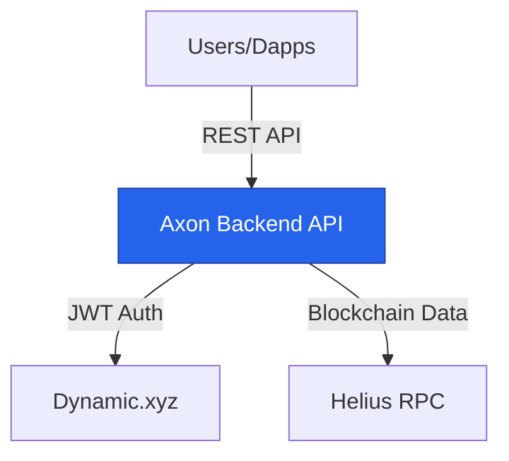
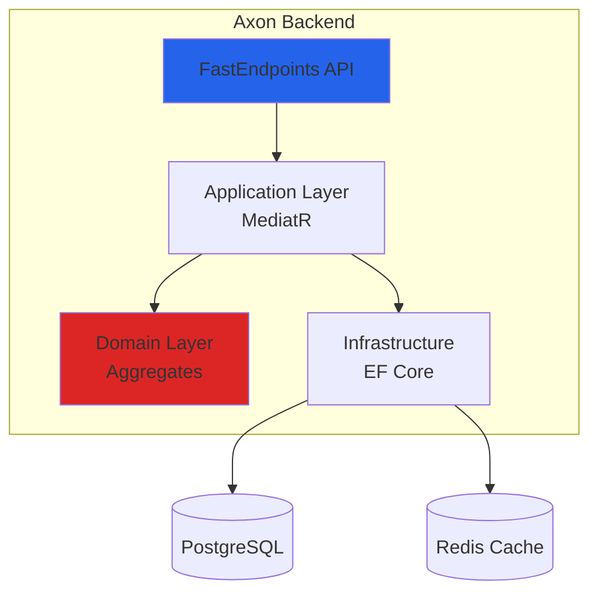

# System Overview

**Architecture, module boundaries, C4 diagrams. Token-efficient reference for AI context.**

---

## Architecture Style

**Modular Monolith** with Clean Architecture + DDD + CQRS

### Why Modular Monolith?
- Single deployable (simpler ops)
- Module isolation (future microservices path)
- Shared infrastructure (EF Core, logging)
- Fast development (no distributed complexity)

**See**: [ADR-001: Modular Monolith](./adrs/001-modular-monolith.md)

---

## C4 Context Diagram



**External Dependencies**:
- **Dynamic.xyz**: JWT authentication provider
- **Helius**: Solana RPC for blockchain verification

---

## C4 Container Diagram



**Layers** (Clean Architecture):
1. **API**: FastEndpoints, auth, HTTP
2. **Application**: Commands/Queries, handlers
3. **Domain**: Aggregates, entities, business rules
4. **Infrastructure**: Repositories, DbContext, external services

---

## Module Map

```
Axon Backend
├── Identity Module
│   ├── Aggregates: AxonPrincipal, Wallet
│   ├── Purpose: Authentication, wallet ownership
│   └── DB Schema: identity.*
│
└── Chat Module
    ├── Aggregates: Conversation, Message, Participant
    ├── Purpose: Multi-participant conversations
    └── DB Schema: chat.*
```

### Module Boundaries

**✅ ALLOWED:**
- Commands/Queries within module
- Domain events for cross-module communication
- Shared BuildingBlocks (Result, StrongId, Error)

**❌ FORBIDDEN:**
- Direct method calls between modules
- Shared database tables
- Cross-module queries

---

## Technology Stack

```yaml
Runtime: .NET 10 (Preview)
Language: C# 13

API:
  - FastEndpoints
  - JWT Bearer Auth
  - OpenTelemetry

Application:
  - MediatR (CQRS)
  - FluentValidation

Domain:
  - CSharpFunctionalExtensions (Result<T>)
  - StronglyTypedId (source generator)
  - Vogen (value objects)

Infrastructure:
  - EF Core 9
  - PostgreSQL
  - Redis (optional caching)

Testing:
  - NUnit
  - Shouldly
  - Testcontainers
  - NSubstitute
```

---

## Data Flow

### Write Path (Command)

```
HTTP Request
  → FastEndpoints
  → MediatR Command
  → Aggregate (business logic)
  → Repository.SaveChangesAsync()
  → Domain Events dispatched
  → HTTP Response
```

### Read Path (Query)

```
HTTP Request
  → FastEndpoints
  → MediatR Query
  → Read DbContext (projection)
  → DTO mapping
  → HTTP Response
```

---

## Key Architectural Decisions

| Decision | Rationale | ADR |
|----------|-----------|-----|
| Modular Monolith | Simplicity + modularity | [ADR-001](./adrs/001-modular-monolith.md) |
| CQRS + MediatR | Clear command/query separation | [ADR-002](./adrs/002-cqrs-mediatr.md) |
| Result<T, Error> | Railway-oriented programming | [ADR-003](./adrs/003-result-pattern.md) |
| StrongId<T> | Type safety for IDs | [ADR-004](./adrs/004-strong-ids.md) |
| PostgreSQL | Robust RDBMS | [ADR-005](./adrs/005-postgresql.md) |
| FastEndpoints | Performance over controllers | [ADR-006](./adrs/006-fastendpoints.md) |

---

## Module Communication

**Pattern**: Domain Events → Integration Events

```csharp
// Identity module
public Result<Unit, Error> VerifyWallet(WalletId walletId)
{
    // ... business logic
    RaiseDomainEvent(new WalletVerifiedEvent(walletId));
    return Result.Success<Unit, Error>(Unit.Value);
}

// Chat module listens
public sealed class WalletVerifiedHandler
    : INotificationHandler<DomainEventNotification<WalletVerifiedEvent>>
{
    public async Task Handle(...) { /* React to wallet verification */ }
}
```

---

## Deployment

**Single Artifact**:
- Axon.Api.dll (all modules included)
- PostgreSQL database
- Redis (optional)

**Configuration**:
- `appsettings.json` (defaults)
- `appsettings.Local.json` (local dev)
- Environment variables (production)

---

## Related Docs

- [Modular Monolith](./modular-monolith.md) - Module boundaries
- [Clean Architecture](./clean-architecture.md) - Layer rules
- [ADRs](./adrs/00-INDEX.md) - All decisions
- [Tech Stack](./tech-stack.md) - Library details

---

**Lines**: ~250
**Focus**: C4 diagrams + module boundaries for AI context