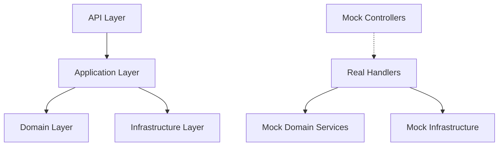

# TDD London School Implementation Guide for Axon Backend

## Overview

This guide provides comprehensive documentation for implementing Test-Driven Development using the London School (mockist) approach in the Axon Backend project. The London School emphasizes **behavior verification** and **interaction testing** through comprehensive mocking strategies.

## Table of Contents

1. [London School Philosophy](#london-school-philosophy)
2. [Architecture-Specific Patterns](#architecture-specific-patterns)
3. [Implementation Guidelines](#implementation-guidelines)
4. [Testing Patterns by Layer](#testing-patterns-by-layer)
5. [Mock Strategies](#mock-strategies)
6. [Parallel Execution](#parallel-execution)
7. [Examples and Templates](#examples-and-templates)
8. [Best Practices](#best-practices)

## London School Philosophy

### Core Principles

1. **Outside-In Development**: Start with acceptance tests and work inward
2. **Mock Everything**: Use mocks to isolate the system under test
3. **Behavior Verification**: Focus on HOW objects collaborate, not WHAT they contain
4. **Contract Definition**: Define clear interfaces through mock expectations
5. **Interaction Testing**: Verify the conversation between objects

### London vs. Classical TDD

| Aspect | London School | Classical School |
|--------|---------------|------------------|
| **Focus** | Behavior & Interactions | State & Output |
| **Mocking** | Mock all collaborators | Mock only slow/unreliable dependencies |
| **Verification** | Interaction verification | State verification |
| **Design Driver** | Interface design | Algorithm design |
| **Coupling** | Lower coupling through abstractions | Higher coupling to implementation |

## Architecture-Specific Patterns

### Clean Architecture with London School

The Axon Backend uses Clean Architecture, which naturally aligns with London School principles:



### CQRS Pattern Testing

```csharp
// Command Handler Test - London School Style
[Test]
[BehaviorTest]
public async Task Handle_ShouldCoordinateWithAllCollaborators_WhenProcessingCommand()
{
    // Arrange - Define the expected conversation
    var command = new ProcessMessageCommand("Test message");
    
    _mcpResolverMock
        .Setup(x => x.GetEnabledServerConfigurations())
        .Returns(Result.Success(emptyConfigs));
    
    _aiClientMock
        .Setup(x => x.ProcessMessageAsync(It.IsAny<AiRequest>(), It.IsAny<CancellationToken>()))
        .ReturnsAsync(Result.Success(expectedResponse));
    
    // Act
    var result = await _handler.Handle(command, CancellationToken.None);
    
    // Assert - Verify the conversation occurred as expected
    result.ShouldBeSuccess();
    _mcpResolverMock.Verify(x => x.GetEnabledServerConfigurations(), Times.Once);
    _aiClientMock.Verify(x => x.ProcessMessageAsync(
        It.Is<AiRequest>(req => req.Message == "Test message"), 
        It.IsAny<CancellationToken>()), Times.Once);
}
```

## Implementation Guidelines

### 1. Test Base Classes

```csharp
// Use LondonSchoolTestBase for all London School tests
public class MyHandlerTests : LondonSchoolTestBase
{
    private Mock<ICollaborator> _collaboratorMock;
    
    [SetUp]
    public void SetUp()
    {
        _collaboratorMock = CreateStrictMock<ICollaborator>();
        // Strict mocks require all interactions to be specified
    }
}
```

### 2. Mock Creation Patterns

```csharp
// Strict Mock - All interactions must be verified
var strictMock = CreateStrictMock<IService>();

// Loose Mock - For non-critical collaborators (like loggers)
var looseMock = CreateLooseMock<ILogger<T>>();

// Spy Mock - Tracks interactions without enforcing expectations
var spyMock = CreateSpyMock<IObserver>();
```

### 3. Behavior Verification

```csharp
// Verify specific interaction patterns
VerifyInteractionPattern(_mockRepository, "Data Access Pattern",
    mock => mock.Verify(x => x.Save(It.IsAny<Entity>()), Times.Once));

// Verify call sequences
VerifySequence(
    () => _mockValidator.Verify(x => x.Validate(It.IsAny<Input>()), Times.Once),
    () => _mockProcessor.Verify(x => x.Process(It.IsAny<ValidInput>()), Times.Once),
    () => _mockLogger.Verify(x => x.Log(LogLevel.Information, It.IsAny<string>()), Times.Once)
);
```

## Testing Patterns by Layer

### Application Layer (Command/Query Handlers)

```csharp
[Test]
[InteractionTest]
public async Task ProcessMessageHandler_ShouldFollowCorrectWorkflow()
{
    // Arrange - Setup collaboration scenario
    var scenario = CreateCollaborationScenario<ProcessMessageHandler>()
        .WithCollaborator(_mcpResolverMock)
        .WithCollaborator(_aiClientMock)
        .ExpectingInteraction("MCP resolver called first")
        .ExpectingInteraction("AI client called with configuration");

    // Define expected interactions
    _mcpResolverMock.Setup(/* ... */);
    _aiClientMock.Setup(/* ... */);

    // Act & Assert
    scenario.Execute(
        handler => handler.Handle(command, CancellationToken.None),
        _handler);
}
```

### Domain Layer (Value Objects & Entities)

```csharp
[Test]
[BehaviorTest]
public void ConversationId_ShouldImplementValueSemantics()
{
    // Arrange
    var id1 = ConversationId.New();
    var id2 = ConversationId.From(id1.Value);
    
    // Act & Assert - Focus on behavior
    id1.ShouldBe(id2); // Value equality
    id1.GetHashCode().ShouldBe(id2.GetHashCode()); // Consistent hashing
}
```

### Infrastructure Layer (Adapters)

```csharp
[Test]
[InteractionTest]
public async Task OpenAiClient_ShouldMakeCorrectHttpRequest()
{
    // Arrange - Mock HTTP behavior
    var scenario = InfrastructureContractMocks.CreateInfrastructureScenario()
        .WithSuccessfulHttpResponse("response-id", "AI response")
        .ExpectingHttpRequest("api.openai.com", HttpMethod.Post, Times.Once)
        .ExpectingHttpPayload(payload => payload.Contains("expected content"), Times.Once);

    // Act
    var result = await _client.ProcessMessageAsync(request, CancellationToken.None);

    // Assert - Verify HTTP interactions
    result.ShouldBeSuccess();
    scenario.VerifyAllBehaviors();
}
```

## Mock Strategies

### 1. CQRS Contract Mocks

```csharp
// Use pre-built CQRS mocks for consistency
var commandScenario = CqrsContractMocks.CreateCommandScenario<ProcessMessageCommand, ProcessMessageResponse>()
    .WithSuccessfulAiProcessing(expectedResponse)
    .WithMcpConfiguration(testConfigs);

var result = await commandScenario.ExecuteAsync(handler, command);
commandScenario.VerifyInteractions(/* verification actions */);
```

### 2. Infrastructure Contract Mocks

```csharp
// Mock HTTP interactions
var httpMock = InfrastructureContractMocks.CreateHttpMessageHandlerMock();
InfrastructureContractMocks.SetupOpenAiResponse(httpMock, "id", "content");
InfrastructureContractMocks.VerifyHttpRequest(httpMock, "expected-url", HttpMethod.Post, Times.Once);
```

### 3. External Dependency Test Doubles

```csharp
// Use test doubles for complex external dependencies
var openAiDouble = ExternalDependencyDoubles.Factory.CreateSuccessfulOpenAiDouble("Mock response");
var result = await openAiDouble.ProcessMessageAsync(request, CancellationToken.None);
openAiDouble.VerifyCalledWith(req => req.Message == "expected message");
```

## Parallel Execution

### Basic Parallel Testing

```csharp
[Test]
[ParallelExecution(MaxConcurrency = 4)]
public async Task MultipleScenarios_ShouldExecuteInParallel()
{
    var scenarios = new[]
    {
        TestScenario<ProcessMessageHandler>.CreateAsync("Scenario 1", async context => {
            // Test logic
        }),
        TestScenario<ProcessMessageHandler>.CreateAsync("Scenario 2", async context => {
            // Test logic
        })
    };

    await ParallelTestExecutionFramework.ExecuteInParallel(scenarios);
}
```

### Batch Execution

```csharp
[Test]
public async Task BatchExecution_ShouldIsolateTests()
{
    var batch = ParallelTestExecutionFramework.CreateBatch("Handler Tests")
        .AddScenario(CreateBehaviorScenario("Success", /* ... */))
        .AddScenario(CreateBehaviorScenario("Failure", /* ... */))
        .AddScenario(CreateBehaviorScenario("Timeout", /* ... */));

    await batch.ExecuteAsync(maxConcurrency: 3);
}
```

## Examples and Templates

### 1. Command Handler Template

```csharp
public class MyCommandHandlerTests : LondonSchoolTestBase
{
    [Test]
    [BehaviorTest]
    public async Task Handle_ShouldFollowExpectedBehavior()
    {
        // Use template for consistency
        CommandHandlerTemplate<MyCommand, MyResponse, MyHandler>
            .ShouldProcessCommand_WithExpectedBehavior(
                handlerFactory: () => new MyHandler(_mockDep1.Object, _mockDep2.Object),
                command: new MyCommand("test"),
                executeCommand: () => _handler.Handle(command, CancellationToken.None),
                loggerVerification: logger => VerifyLoggingBehavior(logger, LogLevel.Information, "success", Times.Once),
                collaboratorMocks: _mockDep1, _mockDep2
            );
    }
}
```

### 2. Infrastructure Adapter Template

```csharp
[Test]
[InteractionTest]
public async Task Adapter_ShouldFollowHttpPattern()
{
    InfrastructureAdapterTemplate<MyAdapter, MyRequest, MyResponse>
        .ShouldMakeHttpRequest_WithExpectedPayload(
            adapterFactory: () => new MyAdapter(_httpClient, _options),
            request: new MyRequest("test"),
            executeRequest: req => _adapter.ProcessAsync(req),
            httpHandlerMock: _httpHandlerMock,
            payloadValidator: payload => payload.Contains("expected")
        );
}
```

### 3. Architecture Boundary Template

```csharp
[Test]
[ContractTest]
public void Application_ShouldNotDependOnInfrastructure()
{
    ArchitectureBoundaryTemplate.ShouldNotDependOnInfrastructure_FromApplication(
        applicationType: typeof(ProcessMessageHandler),
        forbiddenNamespaces: new[] { "Infrastructure", "HttpClient", "Database" }
    );
}
```

## Best Practices

### 1. Mock Design Principles

- **One Mock Per Collaborator**: Each dependency gets its own mock
- **Strict by Default**: Use strict mocks to catch unexpected interactions
- **Behavior Over State**: Verify interactions, not internal state
- **Clear Expectations**: Make mock expectations explicit and readable

### 2. Test Organization

```csharp
[TestFixture]
[Category("LondonSchool")]
public class ProcessMessageHandlerTests : LondonSchoolTestBase
{
    // Group related tests with descriptive names
    
    [Test]
    [BehaviorTest]
    public async Task Handle_ShouldCoordinateWithMcpResolver_WhenProcessingMessage() { }
    
    [Test]
    [InteractionTest]
    public async Task Handle_ShouldCallAiClient_WithCorrectParameters() { }
    
    [Test]
    [ContractTest]
    public async Task Handle_ShouldReturnFailure_WhenMcpResolverFails() { }
}
```

### 3. Naming Conventions

- **Test Classes**: `{ClassUnderTest}LondonSchoolTests`
- **Test Methods**: `{MethodUnderTest}_Should{ExpectedBehavior}_When{Condition}`
- **Mock Variables**: `_{collaboratorName}Mock`
- **Test Categories**: `[BehaviorTest]`, `[InteractionTest]`, `[ContractTest]`

### 4. Verification Patterns

```csharp
// Verify interactions happened
mock.Verify(x => x.Method(It.IsAny<Parameter>()), Times.Once);

// Verify interactions with specific parameters
mock.Verify(x => x.Method(It.Is<Parameter>(p => p.Value == "expected")), Times.Once);

// Verify no unwanted interactions
mock.Verify(x => x.UnwantedMethod(It.IsAny<Parameter>()), Times.Never);

// Verify all expectations were satisfied
MockRepository.VerifyAll();
```

### 5. Error Scenarios

```csharp
[Test]
[ContractTest]
public async Task Handle_ShouldPropagateError_WhenCollaboratorFails()
{
    // Arrange - Setup failure scenario
    var expectedError = Error.ExternalService("Service unavailable");
    _collaboratorMock
        .Setup(x => x.DoWork(It.IsAny<Input>()))
        .Returns(Result.Failure(expectedError));

    // Act
    var result = await _handler.Handle(command, CancellationToken.None);

    // Assert - Verify error handling contract
    result.ShouldBeFailure();
    result.Error.ShouldBe(expectedError);
    
    // Verify error was logged
    VerifyLoggingBehavior(_loggerMock, LogLevel.Error, "error message", Times.Once);
}
```

## Integration with Existing Codebase

### Migration Strategy

1. **Start with New Features**: Use London School for all new functionality
2. **Refactor Existing Tests**: Gradually convert classical tests to London School
3. **Focus on Handlers**: Begin with command/query handlers as they have clear collaborators
4. **Maintain Coverage**: Ensure test coverage doesn't decrease during migration

### Coexistence with Classical Tests

```csharp
// Keep existing classical tests
public class ProcessMessageHandlerClassicalTests : ApplicationTestBase
{
    // Existing state-based tests
}

// Add new London School tests
public class ProcessMessageHandlerLondonSchoolTests : LondonSchoolTestBase
{
    // New interaction-based tests
}
```

## Tools and Utilities

### Custom Attributes

- `[BehaviorTest]` - Marks behavior verification tests
- `[InteractionTest]` - Marks interaction pattern tests  
- `[ContractTest]` - Marks contract enforcement tests
- `[ParallelExecution]` - Marks tests for parallel execution

### Verification Helpers

- `VerifyInteractionPattern()` - Verifies complex interaction patterns
- `VerifySequence()` - Verifies call order
- `VerifyLoggingBehavior()` - Verifies logging interactions
- `CreateCollaborationScenario()` - Creates multi-collaborator test scenarios

### Test Templates

- `CommandHandlerTemplate` - Standardized command handler tests
- `InfrastructureAdapterTemplate` - HTTP adapter interaction tests
- `DomainServiceTemplate` - Domain logic behavior tests
- `ArchitectureBoundaryTemplate` - Clean architecture verification

This comprehensive London School implementation provides:

✅ **Mock-driven test patterns** for all application layer handlers  
✅ **Behavior verification tests** for domain services  
✅ **Interaction-based testing** for infrastructure adapters  
✅ **Comprehensive test doubles** for external dependencies  
✅ **CQRS-specific mocking strategies**  
✅ **Parallel test execution** with proper isolation  
✅ **Clean architecture boundary testing**  
✅ **Reusable test templates** for consistent implementation  

The London School approach ensures that the Axon Backend has robust, maintainable tests that focus on behavior and interactions rather than implementation details, leading to better design and more resilient code.