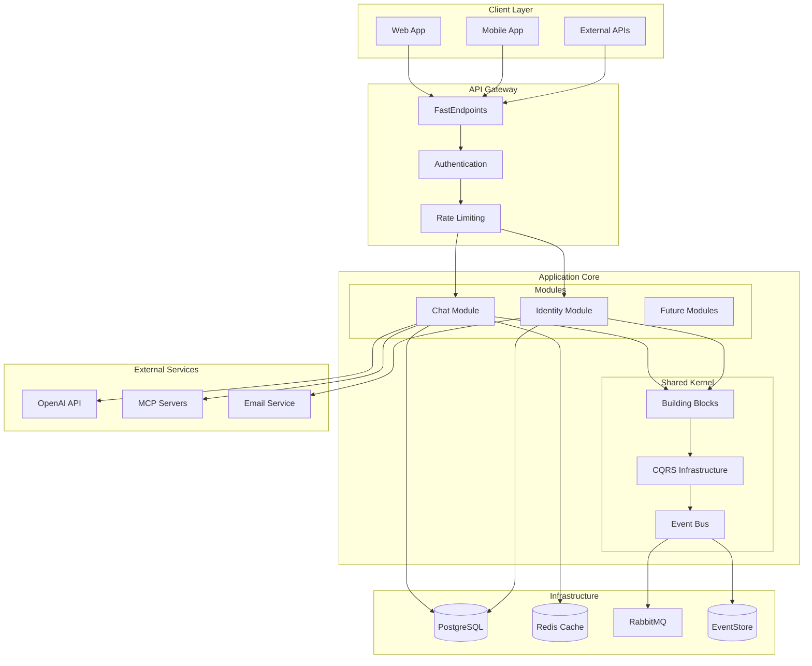
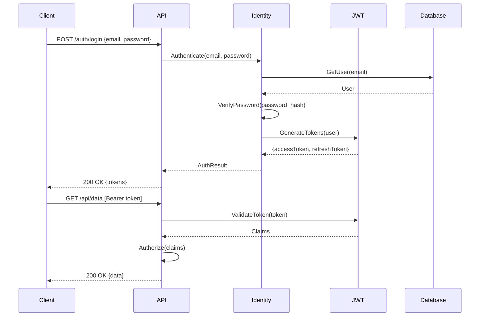

# 🏗️ Axon Backend - System Architecture

## Table of Contents
- [Executive Summary](#executive-summary)
- [Architectural Overview](#architectural-overview)
- [Clean Architecture Implementation](#clean-architecture-implementation)
- [Modular Monolith Design](#modular-monolith-design)
- [CQRS & Event Sourcing](#cqrs--event-sourcing)
- [Module Architecture](#module-architecture)
- [Chat Module Deep Dive](#chat-module-deep-dive)
- [Identity Module Architecture](#identity-module-architecture)
- [Building Blocks Layer](#building-blocks-layer)
- [API Gateway Pattern](#api-gateway-pattern)
- [Data Architecture](#data-architecture)
- [Integration Patterns](#integration-patterns)
- [Deployment Architecture](#deployment-architecture)
- [Security Architecture](#security-architecture)
- [Performance Architecture](#performance-architecture)
- [Monitoring & Observability](#monitoring--observability)

## Executive Summary

Axon Backend implements a **Modular Monolith** architecture with **Clean Architecture** principles, **CQRS** pattern, and **Domain-Driven Design** tactical patterns. The system is designed for high scalability, maintainability, and eventual migration to microservices if needed.

### Key Architectural Decisions
- **Modular Monolith**: Single deployable unit with module isolation
- **Clean Architecture**: Dependency inversion and separation of concerns
- **CQRS**: Command Query Responsibility Segregation for scalability
- **Event-Driven**: Domain events for loose coupling
- **FastEndpoints**: High-performance minimal API framework
- **.NET 10**: Latest framework features and performance improvements

## Architectural Overview



## Clean Architecture Implementation

### Layer Separation

```
┌─────────────────────────────────────────────────────────────┐
│                         API Layer                           │
│  • FastEndpoints       • Controllers      • Middleware      │
│  • Request/Response    • Authentication   • Validation      │
└─────────────────────────────────────────────────────────────┘
                              ↓
┌─────────────────────────────────────────────────────────────┐
│                    Application Layer                        │
│  • Commands/Queries    • Handlers         • DTOs            │
│  • Application Services• Interfaces       • Orchestration   │
└─────────────────────────────────────────────────────────────┘
                              ↓
┌─────────────────────────────────────────────────────────────┐
│                      Domain Layer                           │
│  • Entities            • Value Objects    • Aggregates      │
│  • Domain Services     • Domain Events    • Specifications  │
└─────────────────────────────────────────────────────────────┘
                              ↓
┌─────────────────────────────────────────────────────────────┐
│                   Infrastructure Layer                      │
│  • Repositories        • External Services • Database       │
│  • Message Bus         • File System      • Email           │
└─────────────────────────────────────────────────────────────┘
```

### Dependency Rules

1. **Domain Layer**: No external dependencies (pure business logic)
2. **Application Layer**: Depends only on Domain
3. **Infrastructure Layer**: Implements Application interfaces
4. **API Layer**: Orchestrates and depends on all layers

### Project Structure

```
src/
├── Api/                           # API Layer
│   ├── Endpoints/                # FastEndpoints
│   ├── Contracts/                # Request/Response DTOs
│   ├── Common/                   # Shared API concerns
│   └── Configuration/            # API setup
│
├── Modules/                      # Business Modules
│   ├── Chat/                    # Chat Module
│   │   ├── Domain/              # Business logic
│   │   ├── Application/         # Use cases
│   │   └── Infrastructure/      # External implementations
│   │
│   └── Identity/                # Identity Module
│       ├── Domain/
│       ├── Application/
│       └── Infrastructure/
│
└── BuildingBlocks/              # Shared Kernel
    ├── Core/                    # Core abstractions
    ├── CQRS/                    # CQRS infrastructure
    ├── Persistence/             # Data access
    └── Web/                     # Web utilities
```

## Modular Monolith Design

### Module Boundaries

Each module is a self-contained vertical slice with:
- **Own Domain Model**: Separate bounded context
- **Own Database Schema**: Logical separation
- **Own API Surface**: Module-specific endpoints
- **Internal Privacy**: No direct references between modules

### Module Communication

```csharp
// Modules communicate via:

// 1. Domain Events (Async)
public class OrderPlacedDomainEvent : IDomainEvent
{
    public Guid OrderId { get; init; }
    public Guid CustomerId { get; init; }
}

// 2. Integration Events (Cross-module)
public class PaymentProcessedIntegrationEvent : IIntegrationEvent
{
    public Guid PaymentId { get; init; }
    public decimal Amount { get; init; }
}

// 3. Public Contracts (Sync when necessary)
public interface IChatModuleApi
{
    Task<ConversationDto> GetConversationAsync(Guid id);
}
```

### Module Isolation Patterns

```csharp
// Each module has its own:

// 1. Bounded Context
namespace Axon.Modules.Chat.Domain
{
    public class Conversation : BaseAggregate<ConversationId>
    {
        // Chat-specific domain logic
    }
}

// 2. Database Context
public class ChatDbContext : DbContext
{
    public DbSet<Conversation> Conversations { get; set; }
    public DbSet<Message> Messages { get; set; }
    
    protected override void OnModelCreating(ModelBuilder modelBuilder)
    {
        // Use schema separation
        modelBuilder.HasDefaultSchema("chat");
    }
}

// 3. Dependency Injection
public static class ChatModuleRegistration
{
    public static IServiceCollection AddChatModule(
        this IServiceCollection services,
        IConfiguration configuration)
    {
        // Register module-specific services
        services.AddDbContext<ChatDbContext>();
        services.AddScoped<IConversationRepository, ConversationRepository>();
        
        // Register handlers
        services.AddMediatR(cfg => 
            cfg.RegisterServicesFromAssembly(typeof(ChatModule).Assembly));
            
        return services;
    }
}
```

## CQRS & Event Sourcing

### Command Side Architecture

```csharp
// Command Flow
public class CommandPipeline
{
    // 1. API receives request
    [Post("/api/chat/process")]
    public async Task<IActionResult> ProcessMessage(ProcessMessageRequest request)
    {
        // 2. Map to command
        var command = request.ToCommand();
        
        // 3. Send through MediatR
        var result = await _mediator.Send(command);
        
        // 4. Return response
        return result.ToActionResult();
    }
}

// Command Handler
public class ProcessMessageHandler : ICommandHandler<ProcessMessageCommand, ProcessMessageResponse>
{
    public async Task<Result<ProcessMessageResponse>> Handle(
        ProcessMessageCommand command,
        CancellationToken cancellationToken)
    {
        // 1. Load aggregate from event store
        var conversation = await _eventStore.LoadAsync<Conversation>(command.ConversationId);
        
        // 2. Execute business operation
        conversation.AddMessage(command.Message);
        
        // 3. Save events
        await _eventStore.SaveAsync(conversation);
        
        // 4. Update read model
        await _readModelUpdater.UpdateAsync(conversation);
        
        // 5. Publish integration events
        await _eventBus.PublishAsync(new MessageProcessedEvent());
        
        return Result.Success(new ProcessMessageResponse());
    }
}
```

### Query Side Architecture

```csharp
// Query Flow
public class QueryPipeline
{
    // Optimized read model
    public class ConversationReadModel
    {
        public Guid Id { get; set; }
        public string Title { get; set; }
        public int MessageCount { get; set; }
        public DateTime LastActivity { get; set; }
        // Denormalized data for fast queries
    }
    
    // Query Handler
    public class GetConversationHandler : IQueryHandler<GetConversationQuery, ConversationDto>
    {
        private readonly IReadModelRepository _repository;
        
        public async Task<Result<ConversationDto>> Handle(
            GetConversationQuery query,
            CancellationToken cancellationToken)
        {
            // Direct query to read model (no domain logic)
            var readModel = await _repository
                .GetConversationReadModelAsync(query.ConversationId);
                
            return Result.Success(readModel.ToDto());
        }
    }
}
```

### Event Sourcing Implementation

```csharp
// Event Store Abstraction
public interface IEventStore
{
    Task<T> LoadAsync<T>(Guid aggregateId) where T : IAggregate;
    Task SaveAsync<T>(T aggregate) where T : IAggregate;
    Task<IEnumerable<IEvent>> GetEventsAsync(Guid aggregateId);
}

// Event-Sourced Aggregate
public class Conversation : EventSourcedAggregate
{
    private readonly List<Message> _messages = new();
    
    // Apply events to rebuild state
    public void Apply(ConversationStartedEvent @event)
    {
        Id = @event.ConversationId;
        UserId = @event.UserId;
        CreatedAt = @event.Timestamp;
    }
    
    public void Apply(MessageAddedEvent @event)
    {
        _messages.Add(new Message(@event.MessageId, @event.Content));
        LastActivity = @event.Timestamp;
    }
    
    // Business operations raise events
    public void AddMessage(string content)
    {
        var @event = new MessageAddedEvent(
            ConversationId: Id,
            MessageId: MessageId.New(),
            Content: content,
            Timestamp: DateTime.UtcNow);
            
        RaiseEvent(@event);
    }
}
```

## Module Architecture

### Module Template Structure

```
Module/
├── Domain/                       # Core Business Logic
│   ├── [Aggregate]/             # Aggregate roots
│   │   ├── [Aggregate].cs      # Main aggregate
│   │   ├── Events/             # Domain events
│   │   └── Rules/              # Business rules
│   ├── Entities/               # Domain entities
│   ├── ValueObjects/           # Value objects
│   ├── Services/               # Domain services
│   ├── Specifications/         # Business specifications
│   └── Errors/                 # Domain errors
│
├── Application/                 # Use Cases
│   ├── Commands/               # Write operations
│   │   └── [Command]/
│   │       ├── [Command]Command.cs
│   │       ├── [Command]Handler.cs
│   │       ├── [Command]Validator.cs
│   │       └── [Command]Response.cs
│   ├── Queries/                # Read operations
│   ├── DTOs/                   # Data transfer objects
│   ├── Mappings/               # Object mappings
│   ├── Services/               # Application services
│   ├── Abstractions/           # Interfaces
│   └── Behaviors/              # Pipeline behaviors
│
└── Infrastructure/             # External Concerns
    ├── Persistence/           # Database implementation
    │   ├── Configurations/    # EF configurations
    │   ├── Repositories/      # Repository implementations
    │   ├── Migrations/        # Database migrations
    │   └── DbContext.cs      # Module DB context
    ├── Services/              # External service implementations
    ├── MessageBus/            # Event publishing
    └── Configuration/         # DI setup
```

### Module Registration Pattern

```csharp
// Module interface
public interface IModule
{
    void RegisterServices(IServiceCollection services, IConfiguration configuration);
    void Configure(IApplicationBuilder app);
    void ConfigureEndpoints(IEndpointRouteBuilder endpoints);
}

// Module implementation
public class ChatModule : IModule
{
    public void RegisterServices(IServiceCollection services, IConfiguration configuration)
    {
        // Domain services
        services.AddScoped<IConversationContextBuilder, ConversationContextBuilder>();
        
        // Application services
        services.AddScoped<IMessageRequestBuilder, MessageRequestBuilder>();
        services.AddScoped<IAiClient, OpenAiClient>();
        
        // Infrastructure
        services.AddDbContext<ChatDbContext>(options =>
            options.UseNpgsql(configuration.GetConnectionString("ChatDb")));
            
        services.AddScoped<IConversationRepository, ConversationRepository>();
        services.AddScoped<IUnitOfWork, UnitOfWork>();
        
        // MediatR handlers
        services.AddMediatR(cfg => 
            cfg.RegisterServicesFromAssembly(typeof(ChatModule).Assembly));
    }
    
    public void Configure(IApplicationBuilder app)
    {
        // Module-specific middleware
        app.UseMiddleware<ChatMetricsMiddleware>();
    }
    
    public void ConfigureEndpoints(IEndpointRouteBuilder endpoints)
    {
        // Module API endpoints
        endpoints.MapPost("/api/chat/process", ProcessMessageEndpoint.Handle);
        endpoints.MapGet("/api/chat/conversations/{id}", GetConversationEndpoint.Handle);
    }
}
```

## Chat Module Deep Dive

### Domain Model

```csharp
// Aggregate Root
public sealed class Conversation : BaseAggregate<ConversationId>
{
    private readonly List<Message> _messages = new();
    
    public ConversationId Id { get; private init; }
    public UserId UserId { get; private init; }
    public string Title { get; private set; }
    public ConversationState State { get; private set; }
    public IReadOnlyList<Message> Messages => _messages.AsReadOnly();
    
    // Factory method
    public static Result<Conversation> Create(UserId userId, string title)
    {
        // Validation
        if (string.IsNullOrWhiteSpace(title))
            return Result.Failure<Conversation>(ChatErrors.InvalidTitle);
            
        var conversation = new Conversation
        {
            Id = ConversationId.New(),
            UserId = userId,
            Title = title,
            State = ConversationState.Active,
            CreatedAt = DateTime.UtcNow
        };
        
        conversation.AddDomainEvent(new ConversationStartedDomainEvent(
            conversation.Id, userId));
            
        return Result.Success(conversation);
    }
    
    // Business operations
    public Result AddUserMessage(MessageContent content, UserId userId)
    {
        if (State != ConversationState.Active)
            return Result.Failure(ChatErrors.ConversationNotActive);
            
        var message = Message.CreateUserMessage(content, userId);
        _messages.Add(message);
        
        AddDomainEvent(new UserMessageAddedDomainEvent(Id, message.Id));
        
        return Result.Success();
    }
    
    public Result AddAssistantMessage(MessageContent content, ToolExecution[] toolExecutions)
    {
        var message = Message.CreateAssistantMessage(content, toolExecutions);
        _messages.Add(message);
        
        AddDomainEvent(new AssistantMessageAddedDomainEvent(Id, message.Id));
        
        return Result.Success();
    }
}

// Entity
public sealed class Message : Entity<MessageId>
{
    public MessageId Id { get; private init; }
    public MessageContent Content { get; private init; }
    public MessageRole Role { get; private init; }
    public UserId? UserId { get; private init; }
    public ToolExecution[] ToolExecutions { get; private init; }
    public DateTime CreatedAt { get; private init; }
    
    public static Message CreateUserMessage(MessageContent content, UserId userId)
    {
        return new Message
        {
            Id = MessageId.New(),
            Content = content,
            Role = MessageRole.User,
            UserId = userId,
            ToolExecutions = Array.Empty<ToolExecution>(),
            CreatedAt = DateTime.UtcNow
        };
    }
}

// Value Objects
public sealed record MessageContent
{
    public string Value { get; }
    
    private MessageContent(string value) => Value = value;
    
    public static Result<MessageContent> Create(string value)
    {
        if (string.IsNullOrWhiteSpace(value))
            return Result.Failure<MessageContent>(ChatErrors.EmptyContent);
            
        if (value.Length > 4000)
            return Result.Failure<MessageContent>(ChatErrors.ContentTooLong);
            
        return Result.Success(new MessageContent(value));
    }
}

public sealed record ConversationId(Guid Value) : IStrongId<Guid>
{
    public static ConversationId New() => new(Guid.NewGuid());
    public static ConversationId From(Guid value) => new(value);
}
```

### Application Layer

```csharp
// Command
public sealed record ProcessMessageCommand(
    string Message,
    Guid? ConversationId,
    long? UserId,
    Guid? PreviousResponseId
) : ICommand<ProcessMessageResponse>;

// Handler with complex orchestration
public sealed class ProcessMessageHandler : ICommandHandler<ProcessMessageCommand, ProcessMessageResponse>
{
    private readonly IUnitOfWork _unitOfWork;
    private readonly IConversationRepository _conversationRepository;
    private readonly IAiClient _aiClient;
    private readonly IMcpServerResolver _mcpResolver;
    private readonly ICurrentUserService _currentUser;
    private readonly ILogger<ProcessMessageHandler> _logger;
    
    public async Task<Result<ProcessMessageResponse>> Handle(
        ProcessMessageCommand command,
        CancellationToken cancellationToken)
    {
        using var activity = Activity.StartActivity("ProcessMessage");
        
        try
        {
            // 1. Resolve or create conversation
            var conversation = command.ConversationId.HasValue
                ? await _conversationRepository.GetByIdAsync(command.ConversationId.Value, cancellationToken)
                : Conversation.Create(_currentUser.UserId, "New Conversation").Value;
                
            // 2. Add user message
            var messageContent = MessageContent.Create(command.Message);
            if (messageContent.IsFailure)
                return Result.Failure<ProcessMessageResponse>(messageContent.Error);
                
            conversation.AddUserMessage(messageContent.Value, _currentUser.UserId);
            
            // 3. Build AI request with MCP context
            var mcpServers = await _mcpResolver.ResolveServersAsync(cancellationToken);
            var aiRequest = BuildAiRequest(conversation, mcpServers);
            
            // 4. Process with AI
            var aiResponse = await _aiClient.ProcessAsync(aiRequest, cancellationToken);
            
            // 5. Handle tool executions
            if (aiResponse.ToolExecutions.Any())
            {
                var toolResults = await ExecuteToolsAsync(aiResponse.ToolExecutions, cancellationToken);
                aiResponse = await _aiClient.ProcessToolResultsAsync(toolResults, cancellationToken);
            }
            
            // 6. Add assistant response
            conversation.AddAssistantMessage(
                MessageContent.Create(aiResponse.Content).Value,
                aiResponse.ToolExecutions);
                
            // 7. Persist changes
            if (!command.ConversationId.HasValue)
                await _conversationRepository.AddAsync(conversation, cancellationToken);
            else
                await _conversationRepository.UpdateAsync(conversation, cancellationToken);
                
            await _unitOfWork.SaveChangesAsync(cancellationToken);
            
            // 8. Return response
            return Result.Success(new ProcessMessageResponse
            {
                ConversationId = conversation.Id,
                Response = aiResponse.Content,
                ToolExecutions = aiResponse.ToolExecutions
            });
        }
        catch (AiServiceException ex)
        {
            _logger.LogError(ex, "AI service error");
            return Result.Failure<ProcessMessageResponse>(ChatErrors.AiServiceError);
        }
    }
}
```

### Infrastructure Implementation

```csharp
// Repository Pattern
public sealed class ConversationRepository : IConversationRepository
{
    private readonly ChatDbContext _context;
    private readonly IEventStore _eventStore;
    
    public async Task<Conversation> GetByIdAsync(Guid id, CancellationToken cancellationToken)
    {
        // Option 1: Load from event store
        return await _eventStore.LoadAsync<Conversation>(id);
        
        // Option 2: Load from read model
        var entity = await _context.Conversations
            .Include(c => c.Messages)
            .FirstOrDefaultAsync(c => c.Id == id, cancellationToken);
            
        return entity?.ToDomainModel();
    }
    
    public async Task AddAsync(Conversation conversation, CancellationToken cancellationToken)
    {
        // Save to event store
        await _eventStore.SaveAsync(conversation);
        
        // Update read model
        var entity = conversation.ToEntity();
        _context.Conversations.Add(entity);
    }
}

// AI Client Implementation
public sealed class OpenAiClient : IAiClient
{
    private readonly HttpClient _httpClient;
    private readonly OpenAiOptions _options;
    private readonly ILogger<OpenAiClient> _logger;
    
    public async Task<AiResponse> ProcessAsync(AiRequest request, CancellationToken cancellationToken)
    {
        var openAiRequest = new
        {
            model = _options.Model,
            messages = request.Messages.Select(m => new
            {
                role = m.Role.ToString().ToLower(),
                content = m.Content
            }),
            tools = request.Tools?.Select(t => new
            {
                type = "function",
                function = new
                {
                    name = t.Name,
                    description = t.Description,
                    parameters = t.Parameters
                }
            }),
            temperature = _options.Temperature,
            max_tokens = _options.MaxTokens
        };
        
        var response = await _httpClient.PostAsJsonAsync(
            "https://api.openai.com/v1/chat/completions",
            openAiRequest,
            cancellationToken);
            
        response.EnsureSuccessStatusCode();
        
        var content = await response.Content.ReadFromJsonAsync<OpenAiResponse>(cancellationToken);
        
        return MapToAiResponse(content);
    }
}
```

## Identity Module Architecture

### Authentication & Authorization

```csharp
// Identity Aggregate
public sealed class User : BaseAuditableAggregate<UserId>
{
    private readonly List<Role> _roles = new();
    private readonly List<Permission> _permissions = new();
    
    public UserId Id { get; private init; }
    public Email Email { get; private set; }
    public Username Username { get; private set; }
    public PasswordHash PasswordHash { get; private set; }
    public UserStatus Status { get; private set; }
    public IReadOnlyList<Role> Roles => _roles.AsReadOnly();
    
    public static Result<User> Register(Email email, Username username, Password password)
    {
        var user = new User
        {
            Id = UserId.New(),
            Email = email,
            Username = username,
            PasswordHash = PasswordHash.Create(password),
            Status = UserStatus.Active,
            CreatedAt = DateTime.UtcNow
        };
        
        user.AddDomainEvent(new UserRegisteredDomainEvent(user.Id, email));
        
        return Result.Success(user);
    }
    
    public Result ChangePassword(Password currentPassword, Password newPassword)
    {
        if (!PasswordHash.Verify(currentPassword))
            return Result.Failure(IdentityErrors.InvalidPassword);
            
        PasswordHash = PasswordHash.Create(newPassword);
        
        AddDomainEvent(new PasswordChangedDomainEvent(Id));
        
        return Result.Success();
    }
}

// JWT Token Service
public sealed class JwtTokenService : ITokenService
{
    private readonly JwtOptions _options;
    
    public string GenerateAccessToken(User user)
    {
        var claims = new List<Claim>
        {
            new(ClaimTypes.NameIdentifier, user.Id.ToString()),
            new(ClaimTypes.Email, user.Email),
            new(ClaimTypes.Name, user.Username)
        };
        
        claims.AddRange(user.Roles.Select(r => new Claim(ClaimTypes.Role, r.Name)));
        claims.AddRange(user.Permissions.Select(p => new Claim("permission", p.Value)));
        
        var key = new SymmetricSecurityKey(Encoding.UTF8.GetBytes(_options.Secret));
        var creds = new SigningCredentials(key, SecurityAlgorithms.HmacSha256);
        
        var token = new JwtSecurityToken(
            issuer: _options.Issuer,
            audience: _options.Audience,
            claims: claims,
            expires: DateTime.UtcNow.AddMinutes(_options.AccessTokenExpirationMinutes),
            signingCredentials: creds);
            
        return new JwtSecurityTokenHandler().WriteToken(token);
    }
}
```

## Building Blocks Layer

### Core Abstractions

```csharp
// Base Entity
public abstract record BaseEntity<T> : IEntity<T> 
    where T : struct, IEquatable<T>
{
    public T? Id { get; init; }
    public bool IsDeleted { get; set; }
    public long Version { get; set; }
}

// Base Aggregate
public abstract record BaseAggregate<TId> : BaseAuditableEntity<TId>, IAggregate<TId> 
    where TId : struct, IEquatable<TId>
{
    private readonly List<IDomainEvent> _domainEvents = new();
    
    public IReadOnlyList<IDomainEvent> DomainEvents => _domainEvents.AsReadOnly();
    
    protected void AddDomainEvent(IDomainEvent domainEvent)
    {
        _domainEvents.Add(domainEvent);
    }
    
    public IEvent[] ClearDomainEvents()
    {
        var events = _domainEvents.ToArray();
        _domainEvents.Clear();
        return events;
    }
}

// CQRS Base
public interface ICommand<TResponse> : IAxonRequest<Result<TResponse>>, IRequest<Result<TResponse>>
    where TResponse : notnull
{
}

public interface IQuery<TResponse> : IAxonRequest<Result<TResponse>>, IRequest<Result<TResponse>>
    where TResponse : notnull
{
}

// Result Pattern
public class Result<T>
{
    public T Value { get; }
    public Error Error { get; }
    public bool IsSuccess { get; }
    public bool IsFailure => !IsSuccess;
    
    public static Result<T> Success(T value) => new(value, null, true);
    public static Result<T> Failure(Error error) => new(default, error, false);
}
```

### Cross-Cutting Concerns

```csharp
// Validation Pipeline
public class ValidationBehavior<TRequest, TResponse> : IPipelineBehavior<TRequest, TResponse>
    where TRequest : IRequest<TResponse>
{
    private readonly IEnumerable<IValidator<TRequest>> _validators;
    
    public async Task<TResponse> Handle(
        TRequest request,
        RequestHandlerDelegate<TResponse> next,
        CancellationToken cancellationToken)
    {
        var context = new ValidationContext<TRequest>(request);
        
        var failures = _validators
            .Select(v => v.Validate(context))
            .SelectMany(result => result.Errors)
            .Where(f => f != null)
            .ToList();
            
        if (failures.Count != 0)
            throw new ValidationException(failures);
            
        return await next();
    }
}

// Logging Pipeline
public class LoggingBehavior<TRequest, TResponse> : IPipelineBehavior<TRequest, TResponse>
    where TRequest : IRequest<TResponse>
{
    private readonly ILogger<LoggingBehavior<TRequest, TResponse>> _logger;
    
    public async Task<TResponse> Handle(
        TRequest request,
        RequestHandlerDelegate<TResponse> next,
        CancellationToken cancellationToken)
    {
        var requestName = request.GetType().Name;
        var requestGuid = Guid.NewGuid().ToString();
        
        _logger.LogInformation(
            "Handling {RequestName} ({RequestGuid})",
            requestName, requestGuid);
            
        var stopwatch = Stopwatch.StartNew();
        
        try
        {
            var response = await next();
            
            stopwatch.Stop();
            
            _logger.LogInformation(
                "Handled {RequestName} ({RequestGuid}) in {ElapsedMs}ms",
                requestName, requestGuid, stopwatch.ElapsedMilliseconds);
                
            return response;
        }
        catch (Exception ex)
        {
            stopwatch.Stop();
            
            _logger.LogError(ex,
                "Error handling {RequestName} ({RequestGuid}) after {ElapsedMs}ms",
                requestName, requestGuid, stopwatch.ElapsedMilliseconds);
                
            throw;
        }
    }
}
```

## API Gateway Pattern

### FastEndpoints Implementation

```csharp
// Endpoint Base Class
public abstract class EndpointBase<TRequest, TResponse> : Endpoint<TRequest, TResponse>
    where TRequest : notnull
{
    protected IMediator Mediator => Resolve<IMediator>();
    protected ILogger Logger => Resolve<ILogger<EndpointBase<TRequest, TResponse>>>();
    
    protected IActionResult HandleResult<T>(Result<T> result)
    {
        if (result.IsSuccess)
            return Ok(result.Value);
            
        return result.Error.Type switch
        {
            ErrorType.NotFound => NotFound(result.Error.ToProblemDetails()),
            ErrorType.Validation => BadRequest(result.Error.ToProblemDetails()),
            ErrorType.Unauthorized => Unauthorized(result.Error.ToProblemDetails()),
            ErrorType.Forbidden => Forbid(result.Error.ToProblemDetails()),
            _ => Problem(result.Error.ToProblemDetails())
        };
    }
}

// Endpoint Implementation
public sealed class ProcessMessageEndpoint : EndpointBase<ProcessMessageRequest, ProcessMessageResponse>
{
    public override void Configure()
    {
        Post("/api/chat/process");
        AllowAnonymous(); // TODO: Add auth
        Summary(s =>
        {
            s.Summary = "Process a chat message";
            s.Description = "Processes a user message and returns AI response";
            s.Response<ProcessMessageResponse>(200, "Message processed successfully");
            s.Response<ProblemDetails>(400, "Invalid request");
            s.Response<ProblemDetails>(500, "Server error");
        });
    }
    
    public override async Task HandleAsync(ProcessMessageRequest req, CancellationToken ct)
    {
        var command = new ProcessMessageCommand(
            req.Message,
            req.ConversationId,
            req.UserId,
            req.PreviousResponseId);
            
        var result = await Mediator.Send(command, ct);
        
        await SendResultAsync(result.ToHttpResult());
    }
}
```

### API Versioning

```csharp
public class ApiVersioningConfiguration
{
    public static void Configure(IServiceCollection services)
    {
        services.AddApiVersioning(options =>
        {
            options.DefaultApiVersion = new ApiVersion(1, 0);
            options.AssumeDefaultVersionWhenUnspecified = true;
            options.ReportApiVersions = true;
            options.ApiVersionReader = ApiVersionReader.Combine(
                new HeaderApiVersionReader("X-Api-Version"),
                new QueryStringApiVersionReader("api-version"),
                new UrlSegmentApiVersionReader());
        });
        
        services.AddVersionedApiExplorer(options =>
        {
            options.GroupNameFormat = "'v'VVV";
            options.SubstituteApiVersionInUrl = true;
        });
    }
}

// Versioned Endpoint
[ApiVersion("1.0")]
[ApiVersion("2.0")]
public class GetConversationEndpoint : EndpointBase<GetConversationRequest, ConversationDto>
{
    public override void Configure()
    {
        Get("/api/v{version:apiVersion}/conversations/{id}");
        Version(1, 2); // Available in v1 and v2
    }
}
```

## Data Architecture

### Database Design

```sql
-- Schema separation for modules
CREATE SCHEMA chat;
CREATE SCHEMA identity;
CREATE SCHEMA shared;

-- Chat module tables
CREATE TABLE chat.conversations (
    id UUID PRIMARY KEY,
    user_id BIGINT NOT NULL,
    title VARCHAR(200) NOT NULL,
    state VARCHAR(50) NOT NULL,
    created_at TIMESTAMPTZ NOT NULL,
    updated_at TIMESTAMPTZ,
    version BIGINT NOT NULL DEFAULT 0,
    is_deleted BOOLEAN NOT NULL DEFAULT FALSE
);

CREATE TABLE chat.messages (
    id UUID PRIMARY KEY,
    conversation_id UUID NOT NULL REFERENCES chat.conversations(id),
    content TEXT NOT NULL,
    role VARCHAR(50) NOT NULL,
    user_id BIGINT,
    tool_executions JSONB,
    created_at TIMESTAMPTZ NOT NULL,
    CONSTRAINT fk_conversation FOREIGN KEY (conversation_id) 
        REFERENCES chat.conversations(id) ON DELETE CASCADE
);

-- Indexes for performance
CREATE INDEX idx_conversations_user_id ON chat.conversations(user_id);
CREATE INDEX idx_conversations_created_at ON chat.conversations(created_at DESC);
CREATE INDEX idx_messages_conversation_id ON chat.messages(conversation_id);
CREATE INDEX idx_messages_created_at ON chat.messages(created_at DESC);

-- Event sourcing tables
CREATE TABLE shared.event_store (
    id UUID PRIMARY KEY,
    aggregate_id UUID NOT NULL,
    aggregate_type VARCHAR(500) NOT NULL,
    event_type VARCHAR(500) NOT NULL,
    event_data JSONB NOT NULL,
    event_version INT NOT NULL,
    created_at TIMESTAMPTZ NOT NULL DEFAULT NOW()
);

CREATE INDEX idx_event_store_aggregate ON shared.event_store(aggregate_id, event_version);

-- Outbox pattern for reliable messaging
CREATE TABLE shared.outbox_messages (
    id UUID PRIMARY KEY,
    event_type VARCHAR(500) NOT NULL,
    payload JSONB NOT NULL,
    created_at TIMESTAMPTZ NOT NULL DEFAULT NOW(),
    processed_at TIMESTAMPTZ,
    attempts INT NOT NULL DEFAULT 0,
    error TEXT
);

CREATE INDEX idx_outbox_unprocessed ON shared.outbox_messages(processed_at) 
    WHERE processed_at IS NULL;
```

### Repository Pattern

```csharp
// Generic Repository
public abstract class Repository<TEntity, TId> : IRepository<TEntity, TId>
    where TEntity : class, IEntity<TId>
    where TId : struct
{
    protected readonly DbContext Context;
    protected readonly DbSet<TEntity> DbSet;
    
    protected Repository(DbContext context)
    {
        Context = context;
        DbSet = context.Set<TEntity>();
    }
    
    public virtual async Task<TEntity?> GetByIdAsync(TId id, CancellationToken cancellationToken = default)
    {
        return await DbSet
            .FirstOrDefaultAsync(e => e.Id.Equals(id), cancellationToken);
    }
    
    public virtual async Task<IReadOnlyList<TEntity>> GetAllAsync(CancellationToken cancellationToken = default)
    {
        return await DbSet
            .Where(e => !e.IsDeleted)
            .ToListAsync(cancellationToken);
    }
    
    public virtual async Task AddAsync(TEntity entity, CancellationToken cancellationToken = default)
    {
        await DbSet.AddAsync(entity, cancellationToken);
    }
    
    public virtual void Update(TEntity entity)
    {
        DbSet.Update(entity);
    }
    
    public virtual void Remove(TEntity entity)
    {
        entity.IsDeleted = true;
        Update(entity);
    }
}

// Specification Pattern
public abstract class Specification<T>
{
    public abstract Expression<Func<T, bool>> ToExpression();
    
    public bool IsSatisfiedBy(T entity)
    {
        var predicate = ToExpression().Compile();
        return predicate(entity);
    }
    
    public static implicit operator Expression<Func<T, bool>>(Specification<T> specification)
    {
        return specification.ToExpression();
    }
}

// Usage
public class ActiveConversationSpecification : Specification<Conversation>
{
    public override Expression<Func<Conversation, bool>> ToExpression()
    {
        return conversation => conversation.State == ConversationState.Active 
            && !conversation.IsDeleted;
    }
}
```

## Integration Patterns

### Message Bus

```csharp
// MassTransit Configuration
public static class MessageBusConfiguration
{
    public static void ConfigureMassTransit(this IServiceCollection services, IConfiguration configuration)
    {
        services.AddMassTransit(x =>
        {
            // Add consumers
            x.AddConsumer<MessageProcessedConsumer>();
            x.AddConsumer<ConversationCreatedConsumer>();
            
            // Configure RabbitMQ
            x.UsingRabbitMq((context, cfg) =>
            {
                cfg.Host(configuration["RabbitMQ:Host"], h =>
                {
                    h.Username(configuration["RabbitMQ:Username"]);
                    h.Password(configuration["RabbitMQ:Password"]);
                });
                
                // Configure endpoints
                cfg.ReceiveEndpoint("chat-events", e =>
                {
                    e.ConfigureConsumer<MessageProcessedConsumer>(context);
                });
                
                // Retry policy
                cfg.UseMessageRetry(r => r.Intervals(100, 200, 500, 1000, 2000));
                
                // Circuit breaker
                cfg.UseCircuitBreaker(cb =>
                {
                    cb.TrackingPeriod = TimeSpan.FromMinutes(1);
                    cb.TripThreshold = 15;
                    cb.ActiveThreshold = 10;
                    cb.ResetInterval = TimeSpan.FromMinutes(5);
                });
            });
        });
    }
}

// Event Publisher
public class MassTransitEventPublisher : IEventPublisher
{
    private readonly IPublishEndpoint _publishEndpoint;
    
    public async Task PublishAsync<T>(T @event, CancellationToken cancellationToken = default)
        where T : class, IIntegrationEvent
    {
        await _publishEndpoint.Publish(@event, cancellationToken);
    }
}
```

### HTTP Resilience

```csharp
// Polly Configuration
public static class HttpResilienceConfiguration
{
    public static IHttpClientBuilder AddResilience(this IHttpClientBuilder builder)
    {
        return builder
            .AddPolicyHandler(GetRetryPolicy())
            .AddPolicyHandler(GetCircuitBreakerPolicy())
            .AddPolicyHandler(GetTimeoutPolicy());
    }
    
    private static IAsyncPolicy<HttpResponseMessage> GetRetryPolicy()
    {
        return HttpPolicyExtensions
            .HandleTransientHttpError()
            .OrResult(msg => !msg.IsSuccessStatusCode)
            .WaitAndRetryAsync(
                3,
                retryAttempt => TimeSpan.FromSeconds(Math.Pow(2, retryAttempt)),
                onRetry: (outcome, timespan, retryCount, context) =>
                {
                    var logger = context.Values["logger"] as ILogger;
                    logger?.LogWarning("Retry {RetryCount} after {Delay}ms", retryCount, timespan.TotalMilliseconds);
                });
    }
    
    private static IAsyncPolicy<HttpResponseMessage> GetCircuitBreakerPolicy()
    {
        return HttpPolicyExtensions
            .HandleTransientHttpError()
            .CircuitBreakerAsync(
                5,
                TimeSpan.FromSeconds(30),
                onBreak: (result, timespan) =>
                {
                    // Log circuit open
                },
                onReset: () =>
                {
                    // Log circuit closed
                });
    }
    
    private static IAsyncPolicy<HttpResponseMessage> GetTimeoutPolicy()
    {
        return Policy.TimeoutAsync<HttpResponseMessage>(10);
    }
}
```

## Deployment Architecture

### Container Strategy

```dockerfile
# Multi-stage build
FROM mcr.microsoft.com/dotnet/sdk:10.0 AS build
WORKDIR /src

# Copy and restore
COPY ["src/Api/Axon.Api.csproj", "src/Api/"]
COPY ["src/Modules/", "src/Modules/"]
COPY ["src/BuildingBlocks/", "src/BuildingBlocks/"]
RUN dotnet restore "src/Api/Axon.Api.csproj"

# Build
COPY . .
WORKDIR "/src/src/Api"
RUN dotnet build "Axon.Api.csproj" -c Release -o /app/build

# Publish
FROM build AS publish
RUN dotnet publish "Axon.Api.csproj" -c Release -o /app/publish /p:UseAppHost=false

# Runtime
FROM mcr.microsoft.com/dotnet/aspnet:10.0 AS final
WORKDIR /app
EXPOSE 80
EXPOSE 443

# Health check
HEALTHCHECK --interval=30s --timeout=3s --start-period=5s --retries=3 \
    CMD curl -f http://localhost/health || exit 1

COPY --from=publish /app/publish .
ENTRYPOINT ["dotnet", "Axon.Api.dll"]
```

### Kubernetes Deployment

```yaml
apiVersion: apps/v1
kind: Deployment
metadata:
  name: axon-backend
  namespace: production
spec:
  replicas: 3
  selector:
    matchLabels:
      app: axon-backend
  template:
    metadata:
      labels:
        app: axon-backend
    spec:
      containers:
      - name: axon-backend
        image: axon/backend:latest
        ports:
        - containerPort: 80
        env:
        - name: ASPNETCORE_ENVIRONMENT
          value: "Production"
        - name: ConnectionStrings__DefaultConnection
          valueFrom:
            secretKeyRef:
              name: db-connection
              key: connection-string
        resources:
          requests:
            memory: "256Mi"
            cpu: "250m"
          limits:
            memory: "512Mi"
            cpu: "500m"
        livenessProbe:
          httpGet:
            path: /health
            port: 80
          initialDelaySeconds: 30
          periodSeconds: 10
        readinessProbe:
          httpGet:
            path: /health/ready
            port: 80
          initialDelaySeconds: 5
          periodSeconds: 5
```

## Security Architecture

### Authentication Flow



### Authorization Policies

```csharp
// Policy Configuration
public static class AuthorizationConfiguration
{
    public static void ConfigureAuthorization(this IServiceCollection services)
    {
        services.AddAuthorization(options =>
        {
            // Role-based policies
            options.AddPolicy("RequireAdmin", policy =>
                policy.RequireRole("Admin"));
                
            options.AddPolicy("RequireUser", policy =>
                policy.RequireAuthenticatedUser());
                
            // Claim-based policies
            options.AddPolicy("CanManageConversations", policy =>
                policy.RequireClaim("permission", "conversations:manage"));
                
            // Custom policies
            options.AddPolicy("ConversationOwner", policy =>
                policy.Requirements.Add(new ConversationOwnerRequirement()));
        });
        
        // Register handlers
        services.AddScoped<IAuthorizationHandler, ConversationOwnerHandler>();
    }
}

// Custom Authorization Handler
public class ConversationOwnerHandler : AuthorizationHandler<ConversationOwnerRequirement, Conversation>
{
    protected override Task HandleRequirementAsync(
        AuthorizationHandlerContext context,
        ConversationOwnerRequirement requirement,
        Conversation resource)
    {
        var userId = context.User.FindFirst(ClaimTypes.NameIdentifier)?.Value;
        
        if (userId != null && resource.UserId.ToString() == userId)
        {
            context.Succeed(requirement);
        }
        
        return Task.CompletedTask;
    }
}
```

## Performance Architecture

### Caching Strategy

```csharp
// Multi-level caching
public class CachingService : ICachingService
{
    private readonly IMemoryCache _l1Cache;
    private readonly IDistributedCache _l2Cache;
    private readonly ICacheKeyGenerator _keyGenerator;
    
    public async Task<T?> GetAsync<T>(string key, CancellationToken cancellationToken = default)
    {
        // L1: Memory cache
        if (_l1Cache.TryGetValue<T>(key, out var cachedValue))
            return cachedValue;
            
        // L2: Distributed cache
        var distributedValue = await _l2Cache.GetAsync(key, cancellationToken);
        if (distributedValue != null)
        {
            var value = JsonSerializer.Deserialize<T>(distributedValue);
            _l1Cache.Set(key, value, TimeSpan.FromMinutes(5));
            return value;
        }
        
        return default;
    }
    
    public async Task SetAsync<T>(
        string key,
        T value,
        CacheOptions options,
        CancellationToken cancellationToken = default)
    {
        // Set in both caches
        _l1Cache.Set(key, value, options.L1Expiration);
        
        var serialized = JsonSerializer.SerializeToUtf8Bytes(value);
        await _l2Cache.SetAsync(
            key,
            serialized,
            new DistributedCacheEntryOptions
            {
                AbsoluteExpirationRelativeToNow = options.L2Expiration
            },
            cancellationToken);
    }
}

// Cache-aside pattern
public class CachedConversationRepository : IConversationRepository
{
    private readonly IConversationRepository _repository;
    private readonly ICachingService _cache;
    
    public async Task<Conversation?> GetByIdAsync(Guid id, CancellationToken cancellationToken)
    {
        var cacheKey = $"conversation:{id}";
        
        var cached = await _cache.GetAsync<Conversation>(cacheKey, cancellationToken);
        if (cached != null)
            return cached;
            
        var conversation = await _repository.GetByIdAsync(id, cancellationToken);
        if (conversation != null)
        {
            await _cache.SetAsync(
                cacheKey,
                conversation,
                new CacheOptions
                {
                    L1Expiration = TimeSpan.FromMinutes(5),
                    L2Expiration = TimeSpan.FromHours(1)
                },
                cancellationToken);
        }
        
        return conversation;
    }
}
```

### Query Optimization

```csharp
// Compiled queries
public static class CompiledQueries
{
    public static readonly Func<ChatDbContext, Guid, Task<Conversation?>> GetConversationById =
        EF.CompileAsyncQuery((ChatDbContext context, Guid id) =>
            context.Conversations
                .Include(c => c.Messages.OrderByDescending(m => m.CreatedAt).Take(50))
                .FirstOrDefault(c => c.Id == id));
                
    public static readonly Func<ChatDbContext, long, IAsyncEnumerable<ConversationSummary>> GetUserConversations =
        EF.CompileAsyncQuery((ChatDbContext context, long userId) =>
            context.Conversations
                .Where(c => c.UserId == userId && !c.IsDeleted)
                .OrderByDescending(c => c.UpdatedAt)
                .Select(c => new ConversationSummary
                {
                    Id = c.Id,
                    Title = c.Title,
                    LastMessage = c.Messages
                        .OrderByDescending(m => m.CreatedAt)
                        .Select(m => m.Content)
                        .FirstOrDefault(),
                    MessageCount = c.Messages.Count(),
                    UpdatedAt = c.UpdatedAt
                }));
}
```

## Monitoring & Observability

### OpenTelemetry Integration

```csharp
// Telemetry Configuration
public static class TelemetryConfiguration
{
    public static void ConfigureOpenTelemetry(this IServiceCollection services, IConfiguration configuration)
    {
        services.AddOpenTelemetry()
            .ConfigureResource(resource => resource
                .AddService(
                    serviceName: "axon-backend",
                    serviceVersion: Assembly.GetExecutingAssembly().GetName().Version?.ToString())
                .AddAttributes(new Dictionary<string, object>
                {
                    ["environment"] = configuration["Environment"] ?? "development",
                    ["deployment"] = configuration["Deployment"] ?? "local"
                }))
            .WithTracing(tracing => tracing
                .AddAspNetCoreInstrumentation(options =>
                {
                    options.RecordException = true;
                    options.Filter = httpContext => !httpContext.Request.Path.StartsWithSegments("/health");
                })
                .AddHttpClientInstrumentation()
                .AddEntityFrameworkCoreInstrumentation(options =>
                {
                    options.SetDbStatementForText = true;
                    options.SetDbStatementForStoredProcedure = true;
                })
                .AddSource("MassTransit")
                .AddOtlpExporter(options =>
                {
                    options.Endpoint = new Uri(configuration["OpenTelemetry:Endpoint"]);
                }))
            .WithMetrics(metrics => metrics
                .AddAspNetCoreInstrumentation()
                .AddHttpClientInstrumentation()
                .AddRuntimeInstrumentation()
                .AddProcessInstrumentation()
                .AddMeter("Axon.Metrics")
                .AddPrometheusExporter());
    }
}

// Custom Metrics
public class MetricsService
{
    private readonly Meter _meter;
    private readonly Counter<long> _messageProcessedCounter;
    private readonly Histogram<double> _processingDuration;
    private readonly ObservableGauge<int> _activeConversations;
    
    public MetricsService()
    {
        _meter = new Meter("Axon.Metrics", "1.0.0");
        
        _messageProcessedCounter = _meter.CreateCounter<long>(
            "messages_processed_total",
            description: "Total number of messages processed");
            
        _processingDuration = _meter.CreateHistogram<double>(
            "message_processing_duration_ms",
            unit: "ms",
            description: "Message processing duration");
            
        _activeConversations = _meter.CreateObservableGauge(
            "active_conversations",
            () => GetActiveConversationCount(),
            description: "Number of active conversations");
    }
    
    public void RecordMessageProcessed(string conversationType)
    {
        _messageProcessedCounter.Add(1, new KeyValuePair<string, object?>("type", conversationType));
    }
    
    public void RecordProcessingDuration(double duration, string operation)
    {
        _processingDuration.Record(duration, new KeyValuePair<string, object?>("operation", operation));
    }
}
```

### Health Checks

```csharp
// Health Check Configuration
public static class HealthCheckConfiguration
{
    public static void ConfigureHealthChecks(this IServiceCollection services, IConfiguration configuration)
    {
        services.AddHealthChecks()
            // Database
            .AddNpgSql(
                configuration.GetConnectionString("DefaultConnection"),
                name: "postgres",
                tags: new[] { "db", "critical" })
            // Redis
            .AddRedis(
                configuration.GetConnectionString("Redis"),
                name: "redis",
                tags: new[] { "cache" })
            // RabbitMQ
            .AddRabbitMQ(
                rabbitConnectionString: configuration.GetConnectionString("RabbitMQ"),
                name: "rabbitmq",
                tags: new[] { "messaging" })
            // Custom health checks
            .AddTypeActivatedCheck<AiServiceHealthCheck>(
                "ai-service",
                tags: new[] { "external", "ai" })
            .AddTypeActivatedCheck<DatabaseMigrationHealthCheck>(
                "db-migrations",
                tags: new[] { "db", "startup" });
    }
}

// Custom Health Check
public class AiServiceHealthCheck : IHealthCheck
{
    private readonly IAiClient _aiClient;
    
    public async Task<HealthCheckResult> CheckHealthAsync(
        HealthCheckContext context,
        CancellationToken cancellationToken = default)
    {
        try
        {
            var response = await _aiClient.CheckHealthAsync(cancellationToken);
            
            return response.IsHealthy
                ? HealthCheckResult.Healthy("AI service is responsive")
                : HealthCheckResult.Degraded($"AI service degraded: {response.Message}");
        }
        catch (Exception ex)
        {
            return HealthCheckResult.Unhealthy("AI service is unavailable", ex);
        }
    }
}
```

---

*Last Updated: August 2025*
*Version: 1.0.0*