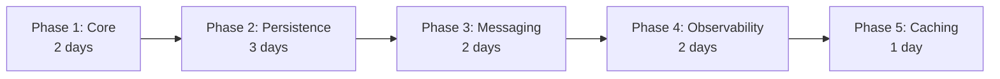

# 🏗️ BuildingBlocks Infrastructure Layer - Complete Refactoring Implementation Guide

**Version**: 1.0 - Brutal Refactoring Edition  
**Date**: January 2025  
**Scope**: Complete Infrastructure Layer Replacement for MVP  
**Approach**: Clean Slate with New Database - No Migration Required

---

## Executive Summary

This document provides a **comprehensive, step-by-step implementation guide** for completely refactoring the BuildingBlocks Infrastructure folder. Following the brutal refactoring philosophy from the PRD v3.1, we will:

- ✅ **Complete replacement** of existing infrastructure code
- ✅ **No backward compatibility** - clean implementation
- ✅ **New PostgreSQL database** - no migration complexity
- ✅ **Production-ready patterns** - resilience, observability, caching
- ✅ **Functional programming** throughout with Result<T> pattern

---

## Table of Contents

1. [Current State Analysis](#1-current-state-analysis)
2. [Target Architecture](#2-target-architecture)
3. [Implementation Phases](#3-implementation-phases)
4. [Phase 1: Core Infrastructure Foundation](#4-phase-1-core-infrastructure-foundation)
5. [Phase 2: Persistence Layer](#5-phase-2-persistence-layer)
6. [Phase 3: Messaging & Events](#6-phase-3-messaging--events)
7. [Phase 4: Observability & Resilience](#7-phase-4-observability--resilience)
8. [Phase 5: Caching & Performance](#8-phase-5-caching--performance)
9. [File-by-File Refactoring Guide](#9-file-by-file-refactoring-guide)
10. [Verification & Testing](#10-verification--testing)

---

## 1. Current State Analysis

### Current Infrastructure Structure
```
Infrastructure/
├── Caching/              # Basic caching behaviors
├── Logging/              # Simple logging behavior
├── Messaging/            # MassTransit & basic outbox
├── Observability/        # OpenTelemetry setup
├── Persistence/          # EF Core repositories (mixed concerns)
├── Resilience/           # Polly extensions
├── Security/             # Auth handlers
└── TestBase/            # Test infrastructure
```

### Problems Identified
- ❌ **Mixed Concerns**: Persistence folder contains too many responsibilities
- ❌ **No Result Pattern**: Direct exception throwing instead of Result<T>
- ❌ **Weak Outbox**: Basic implementation without proper reliability
- ❌ **Limited Resilience**: Basic Polly without circuit breakers
- ❌ **Poor Separation**: Read/Write repositories not properly isolated
- ❌ **No Event Store**: Missing event sourcing infrastructure (though not MVP)

---

## 2. Target Architecture

### New Infrastructure Organization
```
Infrastructure/
├── Core/                        # Core infrastructure abstractions
│   ├── Abstractions/           # Base interfaces & contracts
│   ├── Configuration/          # Configuration management
│   └── DependencyInjection/    # Service registration
├── Persistence/                 # Data access layer
│   ├── EntityFramework/        # EF Core implementation
│   │   ├── Configuration/      # Entity configurations
│   │   ├── Interceptors/       # EF interceptors
│   │   ├── Read/              # Read-side implementation
│   │   └── Write/             # Write-side implementation
│   ├── Repositories/           # Repository implementations
│   │   ├── Read/              # Read repositories
│   │   └── Write/             # Write repositories
│   └── UnitOfWork/            # Transaction management
├── Messaging/                   # Event & message infrastructure
│   ├── Outbox/                # Transactional outbox pattern
│   ├── EventBus/              # Event bus abstractions
│   ├── MassTransit/           # MassTransit implementation
│   └── DomainEvents/          # Domain event dispatching
├── Caching/                    # Multi-level caching
│   ├── Memory/                # In-memory caching
│   ├── Distributed/           # Redis caching
│   └── Behaviors/             # Cache behaviors
├── Observability/              # Monitoring & diagnostics
│   ├── OpenTelemetry/         # Tracing & metrics
│   ├── HealthChecks/          # Health monitoring
│   └── Logging/               # Structured logging
├── Resilience/                 # Fault tolerance
│   ├── CircuitBreaker/        # Circuit breaker pattern
│   ├── Retry/                 # Retry policies
│   ├── Timeout/               # Timeout handling
│   └── Bulkhead/              # Bulkhead isolation
├── Security/                   # Security infrastructure
│   ├── Authentication/        # JWT & auth
│   ├── Authorization/         # Permission handling
│   └── Encryption/            # Data encryption
└── Testing/                    # Test support
    ├── Fixtures/              # Test fixtures
    ├── Builders/              # Test data builders
    └── Containers/            # Test containers
```

---

## 3. Implementation Phases

### Phase Dependencies & Timeline



### Verification Gates
- **Phase 1 Gate**: Core abstractions compile with Result<T> pattern
- **Phase 2 Gate**: Persistence works with new PostgreSQL database
- **Phase 3 Gate**: Outbox pattern functioning with domain events
- **Phase 4 Gate**: Full observability pipeline active
- **Phase 5 Gate**: Caching layer integrated and tested

---

## 4. Phase 1: Core Infrastructure Foundation

### 4.1 Core Abstractions

#### File: `Infrastructure/Core/Abstractions/IDateTimeProvider.cs`
```csharp
namespace BuildingBlocks.Infrastructure.Core.Abstractions;

/// <summary>
/// Abstraction for date/time operations to enable testing
/// </summary>
public interface IDateTimeProvider
{
    DateTime UtcNow { get; }
    DateTimeOffset UtcNowOffset { get; }
    DateTime Today { get; }
    
    // For testing time-based operations
    void SetFixedTime(DateTime dateTime);
    void ResetTime();
}

public sealed class SystemDateTimeProvider : IDateTimeProvider
{
    private DateTime? _fixedTime;
    
    public DateTime UtcNow => _fixedTime ?? DateTime.UtcNow;
    public DateTimeOffset UtcNowOffset => _fixedTime.HasValue 
        ? new DateTimeOffset(_fixedTime.Value, TimeSpan.Zero) 
        : DateTimeOffset.UtcNow;
    public DateTime Today => UtcNow.Date;
    
    public void SetFixedTime(DateTime dateTime) => _fixedTime = dateTime;
    public void ResetTime() => _fixedTime = null;
}
```

#### File: `Infrastructure/Core/Abstractions/ICorrelationContextAccessor.cs`
```csharp
namespace BuildingBlocks.Infrastructure.Core.Abstractions;

/// <summary>
/// Provides access to correlation context for distributed tracing
/// </summary>
public interface ICorrelationContextAccessor
{
    CorrelationContext? CorrelationContext { get; set; }
}

public sealed class CorrelationContextAccessor : ICorrelationContextAccessor
{
    private static readonly AsyncLocal<CorrelationContext?> _correlationContext = new();
    
    public CorrelationContext? CorrelationContext
    {
        get => _correlationContext.Value;
        set => _correlationContext.Value = value;
    }
}

public sealed record CorrelationContext(
    Guid CorrelationId,
    Guid? CausationId = null,
    string? UserId = null,
    string? TenantId = null,
    Dictionary<string, string>? Metadata = null)
{
    public static CorrelationContext Create(string? userId = null) 
        => new(Guid.NewGuid(), null, userId);
}
```

### 4.2 Configuration Management

#### File: `Infrastructure/Core/Configuration/ConfigurationExtensions.cs`
```csharp
namespace BuildingBlocks.Infrastructure.Core.Configuration;

public static class ConfigurationExtensions
{
    /// <summary>
    /// Gets strongly-typed options with validation
    /// </summary>
    public static Result<TOptions> GetOptionsResult<TOptions>(
        this IConfiguration configuration, 
        string sectionName) 
        where TOptions : class, new()
    {
        var section = configuration.GetSection(sectionName);
        if (!section.Exists())
        {
            return Result<TOptions>.Failure(
                Error.NotFound($"Configuration section '{sectionName}' not found"));
        }
        
        var options = new TOptions();
        section.Bind(options);
        
        var validationResults = new List<ValidationResult>();
        var context = new ValidationContext(options);
        
        if (!Validator.TryValidateObject(options, context, validationResults, true))
        {
            var errors = string.Join(", ", validationResults.Select(r => r.ErrorMessage));
            return Result<TOptions>.Failure(
                Error.Validation($"INVALID_CONFIG", $"Configuration validation failed: {errors}"));
        }
        
        return Result<TOptions>.Success(options);
    }
}
```

### 4.3 Dependency Injection

#### File: `Infrastructure/Core/DependencyInjection/ServiceCollectionExtensions.cs`
```csharp
namespace BuildingBlocks.Infrastructure.Core.DependencyInjection;

public static class ServiceCollectionExtensions
{
    public static IServiceCollection AddCoreInfrastructure(
        this IServiceCollection services,
        IConfiguration configuration)
    {
        // Register core services
        services.AddSingleton<IDateTimeProvider, SystemDateTimeProvider>();
        services.AddSingleton<ICorrelationContextAccessor, CorrelationContextAccessor>();
        
        // Add HTTP context accessor for web scenarios
        services.AddHttpContextAccessor();
        
        // Add memory cache
        services.AddMemoryCache();
        
        // Configure options
        services.ConfigureOptions<DatabaseOptions>(configuration, "Database");
        services.ConfigureOptions<CacheOptions>(configuration, "Cache");
        services.ConfigureOptions<MessagingOptions>(configuration, "Messaging");
        
        return services;
    }
    
    private static IServiceCollection ConfigureOptions<TOptions>(
        this IServiceCollection services,
        IConfiguration configuration,
        string sectionName)
        where TOptions : class
    {
        services.Configure<TOptions>(configuration.GetSection(sectionName));
        services.AddSingleton(provider => 
            provider.GetRequiredService<IOptions<TOptions>>().Value);
        
        return services;
    }
}
```

---

## 5. Phase 2: Persistence Layer

### 5.1 Unit of Work Pattern

#### File: `Infrastructure/Persistence/UnitOfWork/IUnitOfWork.cs`
```csharp
namespace BuildingBlocks.Infrastructure.Persistence.UnitOfWork;

/// <summary>
/// Unit of Work pattern with Result<T> for transaction management
/// </summary>
public interface IUnitOfWork : IDisposable
{
    Task<Result<int>> SaveChangesAsync(CancellationToken ct = default);
    Task<Result<Unit>> BeginTransactionAsync(CancellationToken ct = default);
    Task<Result<Unit>> CommitTransactionAsync(CancellationToken ct = default);
    Task<Result<Unit>> RollbackTransactionAsync(CancellationToken ct = default);
    
    // Execute in transaction with automatic rollback on failure
    Task<Result<T>> ExecuteInTransactionAsync<T>(
        Func<Task<Result<T>>> operation,
        IsolationLevel isolationLevel = IsolationLevel.ReadCommitted,
        CancellationToken ct = default);
}
```

#### File: `Infrastructure/Persistence/UnitOfWork/EfUnitOfWork.cs`
```csharp
namespace BuildingBlocks.Infrastructure.Persistence.UnitOfWork;

public sealed class EfUnitOfWork<TContext> : IUnitOfWork 
    where TContext : DbContext
{
    private readonly TContext _context;
    private readonly ILogger<EfUnitOfWork<TContext>> _logger;
    private readonly IDomainEventDispatcher _eventDispatcher;
    private IDbContextTransaction? _currentTransaction;
    
    public EfUnitOfWork(
        TContext context,
        ILogger<EfUnitOfWork<TContext>> logger,
        IDomainEventDispatcher eventDispatcher)
    {
        _context = context;
        _logger = logger;
        _eventDispatcher = eventDispatcher;
    }
    
    public async Task<Result<int>> SaveChangesAsync(CancellationToken ct = default)
    {
        try
        {
            // Dispatch domain events before saving
            await DispatchDomainEvents(ct);
            
            var result = await _context.SaveChangesAsync(ct);
            
            _logger.LogDebug("Saved {Count} entities", result);
            return Result<int>.Success(result);
        }
        catch (DbUpdateConcurrencyException ex)
        {
            _logger.LogWarning(ex, "Concurrency conflict detected");
            return Result<int>.Failure(Error.Conflict("Concurrency conflict detected"));
        }
        catch (DbUpdateException ex)
        {
            _logger.LogError(ex, "Database update failed");
            return Result<int>.Failure(Error.Internal("Database update failed", ex));
        }
        catch (Exception ex)
        {
            _logger.LogError(ex, "Unexpected error during save");
            return Result<int>.Failure(Error.FromException(ex));
        }
    }
    
    public async Task<Result<Unit>> BeginTransactionAsync(CancellationToken ct = default)
    {
        if (_currentTransaction != null)
        {
            return Result<Unit>.Failure(Error.InvalidOperation(
                "Transaction", "Transaction already in progress"));
        }
        
        try
        {
            _currentTransaction = await _context.Database.BeginTransactionAsync(ct);
            return Result<Unit>.Success(Unit.Value);
        }
        catch (Exception ex)
        {
            _logger.LogError(ex, "Failed to begin transaction");
            return Result<Unit>.Failure(Error.FromException(ex));
        }
    }
    
    public async Task<Result<Unit>> CommitTransactionAsync(CancellationToken ct = default)
    {
        if (_currentTransaction == null)
        {
            return Result<Unit>.Failure(Error.InvalidOperation(
                "Transaction", "No transaction in progress"));
        }
        
        try
        {
            await _currentTransaction.CommitAsync(ct);
            await _currentTransaction.DisposeAsync();
            _currentTransaction = null;
            return Result<Unit>.Success(Unit.Value);
        }
        catch (Exception ex)
        {
            _logger.LogError(ex, "Failed to commit transaction");
            return Result<Unit>.Failure(Error.FromException(ex));
        }
    }
    
    public async Task<Result<Unit>> RollbackTransactionAsync(CancellationToken ct = default)
    {
        if (_currentTransaction == null)
        {
            return Result<Unit>.Success(Unit.Value);
        }
        
        try
        {
            await _currentTransaction.RollbackAsync(ct);
            await _currentTransaction.DisposeAsync();
            _currentTransaction = null;
            return Result<Unit>.Success(Unit.Value);
        }
        catch (Exception ex)
        {
            _logger.LogError(ex, "Failed to rollback transaction");
            return Result<Unit>.Failure(Error.FromException(ex));
        }
    }
    
    public async Task<Result<T>> ExecuteInTransactionAsync<T>(
        Func<Task<Result<T>>> operation,
        IsolationLevel isolationLevel = IsolationLevel.ReadCommitted,
        CancellationToken ct = default)
    {
        // Use existing transaction if available
        if (_currentTransaction != null)
        {
            return await operation();
        }
        
        await using var transaction = await _context.Database
            .BeginTransactionAsync(isolationLevel, ct);
        
        try
        {
            var result = await operation();
            
            if (result.IsSuccess)
            {
                await transaction.CommitAsync(ct);
            }
            else
            {
                await transaction.RollbackAsync(ct);
            }
            
            return result;
        }
        catch (Exception ex)
        {
            await transaction.RollbackAsync(ct);
            _logger.LogError(ex, "Transaction failed and was rolled back");
            return Result<T>.Failure(Error.FromException(ex));
        }
    }
    
    private async Task DispatchDomainEvents(CancellationToken ct)
    {
        var aggregates = _context.ChangeTracker
            .Entries<IAggregateRoot>()
            .Where(e => e.Entity.DomainEvents.Any())
            .Select(e => e.Entity)
            .ToList();
        
        var domainEvents = aggregates
            .SelectMany(a => a.ClearDomainEvents())
            .ToList();
        
        foreach (var domainEvent in domainEvents)
        {
            await _eventDispatcher.DispatchAsync(domainEvent, ct);
        }
    }
    
    public void Dispose()
    {
        _currentTransaction?.Dispose();
        _context.Dispose();
    }
}
```

### 5.2 Repository Pattern with Result<T>

#### File: `Infrastructure/Persistence/Repositories/Write/WriteRepository.cs`
```csharp
namespace BuildingBlocks.Infrastructure.Persistence.Repositories.Write;

public class WriteRepository<TEntity, TId> : IWriteRepository<TEntity, TId>
    where TEntity : class, IAggregateRoot<TId>
    where TId : struct
{
    protected readonly DbContext Context;
    protected readonly DbSet<TEntity> DbSet;
    private readonly ILogger<WriteRepository<TEntity, TId>> _logger;
    
    public WriteRepository(
        DbContext context,
        ILogger<WriteRepository<TEntity, TId>> logger)
    {
        Context = context;
        DbSet = context.Set<TEntity>();
        _logger = logger;
    }
    
    public async Task<Result<TEntity>> GetByIdAsync(TId id, CancellationToken ct = default)
    {
        try
        {
            var entity = await DbSet
                .FirstOrDefaultAsync(e => e.Id.Equals(id), ct);
            
            return entity is not null
                ? Result<TEntity>.Success(entity)
                : Result<TEntity>.Failure(Error.NotFound(typeof(TEntity).Name, id));
        }
        catch (Exception ex)
        {
            _logger.LogError(ex, "Failed to get {Entity} by id {Id}", 
                typeof(TEntity).Name, id);
            return Result<TEntity>.Failure(Error.FromException(ex));
        }
    }
    
    public async Task<Result<TEntity>> AddAsync(TEntity entity, CancellationToken ct = default)
    {
        try
        {
            ArgumentNullException.ThrowIfNull(entity);
            
            var entry = await DbSet.AddAsync(entity, ct);
            return Result<TEntity>.Success(entry.Entity);
        }
        catch (Exception ex)
        {
            _logger.LogError(ex, "Failed to add {Entity}", typeof(TEntity).Name);
            return Result<TEntity>.Failure(Error.FromException(ex));
        }
    }
    
    public Result<Unit> Update(TEntity entity)
    {
        try
        {
            ArgumentNullException.ThrowIfNull(entity);
            
            DbSet.Update(entity);
            return Result<Unit>.Success(Unit.Value);
        }
        catch (Exception ex)
        {
            _logger.LogError(ex, "Failed to update {Entity}", typeof(TEntity).Name);
            return Result<Unit>.Failure(Error.FromException(ex));
        }
    }
    
    public Result<Unit> Remove(TEntity entity)
    {
        try
        {
            ArgumentNullException.ThrowIfNull(entity);
            
            DbSet.Remove(entity);
            return Result<Unit>.Success(Unit.Value);
        }
        catch (Exception ex)
        {
            _logger.LogError(ex, "Failed to remove {Entity}", typeof(TEntity).Name);
            return Result<Unit>.Failure(Error.FromException(ex));
        }
    }
    
    public async Task<Result<bool>> ExistsAsync(TId id, CancellationToken ct = default)
    {
        try
        {
            var exists = await DbSet.AnyAsync(e => e.Id.Equals(id), ct);
            return Result<bool>.Success(exists);
        }
        catch (Exception ex)
        {
            _logger.LogError(ex, "Failed to check existence of {Entity} with id {Id}", 
                typeof(TEntity).Name, id);
            return Result<bool>.Failure(Error.FromException(ex));
        }
    }
}
```

#### File: `Infrastructure/Persistence/Repositories/Read/ReadRepository.cs`
```csharp
namespace BuildingBlocks.Infrastructure.Persistence.Repositories.Read;

public class ReadRepository<TEntity, TId> : IReadRepository<TEntity, TId>
    where TEntity : class, IEntity<TId>
    where TId : struct
{
    protected readonly DbContext Context;
    protected readonly IQueryable<TEntity> Query;
    private readonly ILogger<ReadRepository<TEntity, TId>> _logger;
    
    public ReadRepository(
        DbContext context,
        ILogger<ReadRepository<TEntity, TId>> logger)
    {
        Context = context;
        Query = context.Set<TEntity>().AsNoTracking();
        _logger = logger;
    }
    
    public async Task<Result<TEntity>> GetByIdAsync(TId id, CancellationToken ct = default)
    {
        try
        {
            var entity = await Query
                .FirstOrDefaultAsync(e => e.Id.Equals(id), ct);
            
            return entity is not null
                ? Result<TEntity>.Success(entity)
                : Result<TEntity>.Failure(Error.NotFound(typeof(TEntity).Name, id));
        }
        catch (Exception ex)
        {
            _logger.LogError(ex, "Failed to get {Entity} by id {Id}", 
                typeof(TEntity).Name, id);
            return Result<TEntity>.Failure(Error.FromException(ex));
        }
    }
    
    public async Task<Result<IReadOnlyList<TEntity>>> GetAllAsync(CancellationToken ct = default)
    {
        try
        {
            var entities = await Query.ToListAsync(ct);
            return Result<IReadOnlyList<TEntity>>.Success(entities);
        }
        catch (Exception ex)
        {
            _logger.LogError(ex, "Failed to get all {Entity}", typeof(TEntity).Name);
            return Result<IReadOnlyList<TEntity>>.Failure(Error.FromException(ex));
        }
    }
    
    public async Task<Result<PagedResult<TEntity>>> GetPagedAsync(
        int pageNumber,
        int pageSize,
        CancellationToken ct = default)
    {
        try
        {
            if (pageNumber < 1 || pageSize < 1)
            {
                return Result<PagedResult<TEntity>>.Failure(
                    Error.Validation("INVALID_PAGINATION", "Invalid page number or size"));
            }
            
            var totalCount = await Query.CountAsync(ct);
            
            var items = await Query
                .Skip((pageNumber - 1) * pageSize)
                .Take(pageSize)
                .ToListAsync(ct);
            
            var pagedResult = new PagedResult<TEntity>(
                items,
                totalCount,
                pageNumber,
                pageSize);
            
            return Result<PagedResult<TEntity>>.Success(pagedResult);
        }
        catch (Exception ex)
        {
            _logger.LogError(ex, "Failed to get paged {Entity}", typeof(TEntity).Name);
            return Result<PagedResult<TEntity>>.Failure(Error.FromException(ex));
        }
    }
    
    public async Task<Result<Option<TEntity>>> FindAsync(
        Expression<Func<TEntity, bool>> predicate,
        CancellationToken ct = default)
    {
        try
        {
            var entity = await Query.FirstOrDefaultAsync(predicate, ct);
            return Result<Option<TEntity>>.Success(Option<TEntity>.From(entity));
        }
        catch (Exception ex)
        {
            _logger.LogError(ex, "Failed to find {Entity}", typeof(TEntity).Name);
            return Result<Option<TEntity>>.Failure(Error.FromException(ex));
        }
    }
}
```

### 5.3 Database Context with Interceptors

#### File: `Infrastructure/Persistence/EntityFramework/AxonDbContext.cs`
```csharp
namespace BuildingBlocks.Infrastructure.Persistence.EntityFramework;

public class AxonDbContext : DbContext
{
    private readonly ICorrelationContextAccessor _correlationContext;
    private readonly IDateTimeProvider _dateTimeProvider;
    
    public AxonDbContext(
        DbContextOptions<AxonDbContext> options,
        ICorrelationContextAccessor correlationContext,
        IDateTimeProvider dateTimeProvider) 
        : base(options)
    {
        _correlationContext = correlationContext;
        _dateTimeProvider = dateTimeProvider;
    }
    
    protected override void OnConfiguring(DbContextOptionsBuilder optionsBuilder)
    {
        optionsBuilder
            .UseNpgsql(options =>
            {
                options.EnableRetryOnFailure(3);
                options.CommandTimeout(30);
            })
            .UseSnakeCaseNamingConvention()
            .AddInterceptors(
                new AuditInterceptor(_dateTimeProvider, _correlationContext),
                new DomainEventInterceptor(),
                new OutboxInterceptor(),
                new PerformanceInterceptor());
    }
    
    protected override void OnModelCreating(ModelBuilder modelBuilder)
    {
        // Apply all configurations from assembly
        modelBuilder.ApplyConfigurationsFromAssembly(typeof(AxonDbContext).Assembly);
        
        // Configure outbox table
        modelBuilder.Entity<OutboxMessage>(entity =>
        {
            entity.ToTable("outbox_messages");
            entity.HasKey(e => e.Id);
            entity.HasIndex(e => e.ProcessedAt);
            entity.HasIndex(e => new { e.Status, e.CreatedAt });
            entity.Property(e => e.Payload).HasColumnType("jsonb");
            entity.Property(e => e.Headers).HasColumnType("jsonb");
        });
        
        base.OnModelCreating(modelBuilder);
    }
}
```

---

## 6. Phase 3: Messaging & Events

### 6.1 Transactional Outbox Pattern

#### File: `Infrastructure/Messaging/Outbox/OutboxMessage.cs`
```csharp
namespace BuildingBlocks.Infrastructure.Messaging.Outbox;

public sealed class OutboxMessage
{
    public Guid Id { get; private set; }
    public string Type { get; private set; } = null!;
    public string Payload { get; private set; } = null!;
    public Dictionary<string, string> Headers { get; private set; } = null!;
    public OutboxMessageStatus Status { get; private set; }
    public int RetryCount { get; private set; }
    public DateTime CreatedAt { get; private set; }
    public DateTime? ProcessedAt { get; private set; }
    public DateTime? NextRetryAt { get; private set; }
    public string? Error { get; private set; }
    
    private OutboxMessage() { } // EF Core
    
    public static OutboxMessage Create(
        IIntegrationEvent @event,
        ICorrelationContext? context = null)
    {
        var headers = new Dictionary<string, string>
        {
            ["MessageType"] = @event.GetType().FullName!,
            ["EventId"] = @event.EventId.ToString(),
            ["OccurredAt"] = @event.OccurredAt.ToString("O")
        };
        
        if (context != null)
        {
            headers["CorrelationId"] = context.CorrelationId.ToString();
            if (context.CausationId.HasValue)
                headers["CausationId"] = context.CausationId.Value.ToString();
            if (!string.IsNullOrEmpty(context.UserId))
                headers["UserId"] = context.UserId;
        }
        
        return new OutboxMessage
        {
            Id = Guid.NewGuid(),
            Type = @event.GetType().Name,
            Payload = JsonSerializer.Serialize(@event),
            Headers = headers,
            Status = OutboxMessageStatus.Pending,
            RetryCount = 0,
            CreatedAt = DateTime.UtcNow
        };
    }
    
    public Result<Unit> MarkAsProcessed()
    {
        if (Status != OutboxMessageStatus.Pending)
        {
            return Result<Unit>.Failure(Error.InvalidOperation(
                "MarkAsProcessed", "Message is not in pending status"));
        }
        
        Status = OutboxMessageStatus.Processed;
        ProcessedAt = DateTime.UtcNow;
        return Result<Unit>.Success(Unit.Value);
    }
    
    public Result<Unit> MarkAsFailed(string error, DateTime nextRetryAt)
    {
        if (Status == OutboxMessageStatus.Processed)
        {
            return Result<Unit>.Failure(Error.InvalidOperation(
                "MarkAsFailed", "Cannot fail a processed message"));
        }
        
        RetryCount++;
        Error = error;
        NextRetryAt = nextRetryAt;
        
        if (RetryCount >= 3)
        {
            Status = OutboxMessageStatus.Failed;
        }
        
        return Result<Unit>.Success(Unit.Value);
    }
}

public enum OutboxMessageStatus
{
    Pending = 0,
    Processed = 1,
    Failed = 2
}
```

#### File: `Infrastructure/Messaging/Outbox/OutboxProcessor.cs`
```csharp
namespace BuildingBlocks.Infrastructure.Messaging.Outbox;

public sealed class OutboxProcessor : BackgroundService
{
    private readonly IServiceProvider _serviceProvider;
    private readonly ILogger<OutboxProcessor> _logger;
    private readonly OutboxOptions _options;
    
    public OutboxProcessor(
        IServiceProvider serviceProvider,
        ILogger<OutboxProcessor> logger,
        IOptions<OutboxOptions> options)
    {
        _serviceProvider = serviceProvider;
        _logger = logger;
        _options = options.Value;
    }
    
    protected override async Task ExecuteAsync(CancellationToken stoppingToken)
    {
        while (!stoppingToken.IsCancellationRequested)
        {
            try
            {
                await ProcessOutboxMessages(stoppingToken);
                await Task.Delay(_options.ProcessingInterval, stoppingToken);
            }
            catch (Exception ex)
            {
                _logger.LogError(ex, "Error processing outbox messages");
                await Task.Delay(TimeSpan.FromSeconds(30), stoppingToken);
            }
        }
    }
    
    private async Task ProcessOutboxMessages(CancellationToken ct)
    {
        using var scope = _serviceProvider.CreateScope();
        var dbContext = scope.ServiceProvider.GetRequiredService<AxonDbContext>();
        var messageBus = scope.ServiceProvider.GetRequiredService<IMessageBus>();
        
        var messages = await dbContext.Set<OutboxMessage>()
            .Where(m => m.Status == OutboxMessageStatus.Pending)
            .Where(m => m.NextRetryAt == null || m.NextRetryAt <= DateTime.UtcNow)
            .OrderBy(m => m.CreatedAt)
            .Take(_options.BatchSize)
            .ToListAsync(ct);
        
        foreach (var message in messages)
        {
            using var activity = Activity.StartActivity("OutboxMessage.Process");
            activity?.SetTag("message.id", message.Id);
            activity?.SetTag("message.type", message.Type);
            
            try
            {
                var eventType = Type.GetType(message.Headers["MessageType"]);
                if (eventType == null)
                {
                    _logger.LogWarning("Unknown message type: {Type}", message.Type);
                    message.MarkAsFailed($"Unknown type: {message.Type}", 
                        DateTime.UtcNow.AddYears(1));
                    continue;
                }
                
                var @event = JsonSerializer.Deserialize(message.Payload, eventType);
                if (@event == null)
                {
                    _logger.LogWarning("Failed to deserialize message: {Id}", message.Id);
                    message.MarkAsFailed("Deserialization failed", 
                        DateTime.UtcNow.AddYears(1));
                    continue;
                }
                
                await messageBus.PublishAsync(@event, ct);
                message.MarkAsProcessed();
                
                _logger.LogInformation("Published outbox message {Id} of type {Type}", 
                    message.Id, message.Type);
            }
            catch (Exception ex)
            {
                _logger.LogError(ex, "Failed to process outbox message {Id}", message.Id);
                
                var nextRetry = CalculateNextRetry(message.RetryCount);
                message.MarkAsFailed(ex.Message, nextRetry);
            }
        }
        
        await dbContext.SaveChangesAsync(ct);
    }
    
    private DateTime CalculateNextRetry(int retryCount)
    {
        // Exponential backoff: 1s, 4s, 16s, 64s...
        var delaySeconds = Math.Pow(2, retryCount * 2);
        return DateTime.UtcNow.AddSeconds(Math.Min(delaySeconds, 3600)); // Max 1 hour
    }
}
```

---

## 7. Phase 4: Observability & Resilience

### 7.1 Circuit Breaker Implementation

#### File: `Infrastructure/Resilience/CircuitBreaker/CircuitBreakerPolicy.cs`
```csharp
namespace BuildingBlocks.Infrastructure.Resilience.CircuitBreaker;

public interface ICircuitBreakerPolicy
{
    Task<Result<T>> ExecuteAsync<T>(
        Func<Task<Result<T>>> operation,
        string operationKey,
        CancellationToken ct = default);
}

public sealed class CircuitBreakerPolicy : ICircuitBreakerPolicy
{
    private readonly IAsyncPolicy<HttpResponseMessage> _policy;
    private readonly ILogger<CircuitBreakerPolicy> _logger;
    private readonly IMetrics _metrics;
    
    public CircuitBreakerPolicy(
        ILogger<CircuitBreakerPolicy> logger,
        IMetrics metrics,
        CircuitBreakerOptions options)
    {
        _logger = logger;
        _metrics = metrics;
        
        _policy = Policy
            .HandleResult<HttpResponseMessage>(r => !r.IsSuccessStatusCode)
            .CircuitBreakerAsync(
                handledEventsAllowedBeforeBreaking: options.FailureThreshold,
                durationOfBreak: options.BreakDuration,
                onBreak: OnBreak,
                onReset: OnReset,
                onHalfOpen: OnHalfOpen);
    }
    
    public async Task<Result<T>> ExecuteAsync<T>(
        Func<Task<Result<T>>> operation,
        string operationKey,
        CancellationToken ct = default)
    {
        try
        {
            var policyResult = await _policy.ExecuteAndCaptureAsync(
                async () =>
                {
                    var result = await operation();
                    
                    // Convert Result<T> to HttpResponseMessage for policy evaluation
                    var response = new HttpResponseMessage(
                        result.IsSuccess ? HttpStatusCode.OK : HttpStatusCode.InternalServerError);
                    
                    if (!result.IsSuccess)
                    {
                        // Store the error in response for later retrieval
                        response.Headers.Add("X-Error", JsonSerializer.Serialize(result.Error));
                    }
                    
                    return response;
                },
                ct);
            
            if (policyResult.Outcome == OutcomeType.Successful)
            {
                // Execute the actual operation
                return await operation();
            }
            
            // Circuit is open
            _metrics.IncrementCounter("circuit_breaker.rejected", 
                new TagList { { "operation", operationKey } });
            
            return Result<T>.Failure(Error.ServiceUnavailable(
                $"Circuit breaker is open for operation: {operationKey}"));
        }
        catch (Exception ex)
        {
            _logger.LogError(ex, "Circuit breaker execution failed for {Operation}", 
                operationKey);
            return Result<T>.Failure(Error.FromException(ex));
        }
    }
    
    private void OnBreak(DelegateResult<HttpResponseMessage> result, TimeSpan duration)
    {
        _logger.LogWarning("Circuit breaker opened for {Duration}s", duration.TotalSeconds);
        _metrics.IncrementCounter("circuit_breaker.opened");
    }
    
    private void OnReset()
    {
        _logger.LogInformation("Circuit breaker reset");
        _metrics.IncrementCounter("circuit_breaker.reset");
    }
    
    private void OnHalfOpen()
    {
        _logger.LogInformation("Circuit breaker is half-open");
        _metrics.IncrementCounter("circuit_breaker.half_open");
    }
}
```

### 7.2 OpenTelemetry Configuration

#### File: `Infrastructure/Observability/OpenTelemetry/OpenTelemetryExtensions.cs`
```csharp
namespace BuildingBlocks.Infrastructure.Observability.OpenTelemetry;

public static class OpenTelemetryExtensions
{
    public static IServiceCollection AddAxonObservability(
        this IServiceCollection services,
        IConfiguration configuration)
    {
        var options = configuration.GetOptionsResult<ObservabilityOptions>("Observability")
            .GetOrThrow();
        
        services.AddOpenTelemetry()
            .ConfigureResource(resource => resource
                .AddService(options.ServiceName)
                .AddAttributes(new[]
                {
                    new KeyValuePair<string, object>("environment", options.Environment),
                    new KeyValuePair<string, object>("version", options.Version),
                    new KeyValuePair<string, object>("deployment", options.DeploymentId)
                }))
            .WithTracing(tracing =>
            {
                tracing
                    .AddAspNetCoreInstrumentation(opts =>
                    {
                        opts.RecordException = true;
                        opts.Filter = httpContext => 
                            !httpContext.Request.Path.StartsWithSegments("/health");
                        opts.EnrichWithHttpRequest = (activity, request) =>
                        {
                            activity.SetTag("http.request.body.size", request.ContentLength);
                            activity.SetTag("http.user_agent", request.Headers.UserAgent);
                        };
                    })
                    .AddHttpClientInstrumentation()
                    .AddEntityFrameworkCoreInstrumentation(opts =>
                    {
                        opts.SetDbStatementForText = true;
                        opts.SetDbStatementForStoredProcedure = true;
                        opts.EnrichWithIDbCommand = (activity, command) =>
                        {
                            activity.SetTag("db.rows_affected", command.RecordsAffected);
                        };
                    })
                    .AddSource("Axon.*")
                    .SetSampler(new TraceIdRatioBasedSampler(options.TracingSampleRate))
                    .AddOtlpExporter(opts =>
                    {
                        opts.Endpoint = new Uri(options.OtlpEndpoint);
                        opts.Protocol = OtlpExportProtocol.Grpc;
                        opts.Headers = options.OtlpHeaders;
                    });
            })
            .WithMetrics(metrics =>
            {
                metrics
                    .AddAspNetCoreInstrumentation()
                    .AddHttpClientInstrumentation()
                    .AddRuntimeInstrumentation()
                    .AddProcessInstrumentation()
                    .AddMeter("Axon.*")
                    .AddView("http.server.request.duration",
                        new ExplicitBucketHistogramConfiguration
                        {
                            Boundaries = new[] { 0.005, 0.01, 0.025, 0.05, 0.1, 0.25, 0.5, 1, 2.5, 5, 10 }
                        })
                    .AddOtlpExporter(opts =>
                    {
                        opts.Endpoint = new Uri(options.OtlpEndpoint);
                        opts.Protocol = OtlpExportProtocol.Grpc;
                    });
            });
        
        // Add custom metrics
        services.AddSingleton<IMetrics, CustomMetrics>();
        
        return services;
    }
}
```

---

## 8. Phase 5: Caching & Performance

### 8.1 Multi-Level Caching

#### File: `Infrastructure/Caching/MultiLevelCache.cs`
```csharp
namespace BuildingBlocks.Infrastructure.Caching;

public interface IMultiLevelCache
{
    Task<Result<Option<T>>> GetAsync<T>(string key, CancellationToken ct = default);
    Task<Result<Unit>> SetAsync<T>(string key, T value, CacheEntryOptions options, CancellationToken ct = default);
    Task<Result<Unit>> RemoveAsync(string key, CancellationToken ct = default);
    Task<Result<Unit>> RemoveByPrefixAsync(string prefix, CancellationToken ct = default);
}

public sealed class MultiLevelCache : IMultiLevelCache
{
    private readonly IMemoryCache _l1Cache;
    private readonly IDistributedCache _l2Cache;
    private readonly ILogger<MultiLevelCache> _logger;
    private readonly IMetrics _metrics;
    
    public MultiLevelCache(
        IMemoryCache l1Cache,
        IDistributedCache l2Cache,
        ILogger<MultiLevelCache> logger,
        IMetrics metrics)
    {
        _l1Cache = l1Cache;
        _l2Cache = l2Cache;
        _logger = logger;
        _metrics = metrics;
    }
    
    public async Task<Result<Option<T>>> GetAsync<T>(string key, CancellationToken ct = default)
    {
        try
        {
            // Check L1 cache
            if (_l1Cache.TryGetValue<T>(key, out var l1Value))
            {
                _metrics.IncrementCounter("cache.hit", new TagList { { "level", "L1" } });
                return Result<Option<T>>.Success(Option<T>.Some(l1Value));
            }
            
            // Check L2 cache
            var l2Bytes = await _l2Cache.GetAsync(key, ct);
            if (l2Bytes != null)
            {
                var l2Value = JsonSerializer.Deserialize<T>(l2Bytes);
                if (l2Value != null)
                {
                    _metrics.IncrementCounter("cache.hit", new TagList { { "level", "L2" } });
                    
                    // Populate L1 cache
                    _l1Cache.Set(key, l2Value, TimeSpan.FromMinutes(5));
                    
                    return Result<Option<T>>.Success(Option<T>.Some(l2Value));
                }
            }
            
            _metrics.IncrementCounter("cache.miss");
            return Result<Option<T>>.Success(Option<T>.None());
        }
        catch (Exception ex)
        {
            _logger.LogError(ex, "Failed to get cache value for key {Key}", key);
            return Result<Option<T>>.Failure(Error.FromException(ex));
        }
    }
    
    public async Task<Result<Unit>> SetAsync<T>(
        string key, 
        T value, 
        CacheEntryOptions options, 
        CancellationToken ct = default)
    {
        try
        {
            // Set in L1 cache
            var l1Options = new MemoryCacheEntryOptions
            {
                AbsoluteExpirationRelativeToNow = options.AbsoluteExpiration,
                SlidingExpiration = options.SlidingExpiration,
                Priority = options.Priority == CachePriority.High 
                    ? CacheItemPriority.High 
                    : CacheItemPriority.Normal
            };
            
            _l1Cache.Set(key, value, l1Options);
            
            // Set in L2 cache
            var l2Options = new DistributedCacheEntryOptions
            {
                AbsoluteExpirationRelativeToNow = options.AbsoluteExpiration,
                SlidingExpiration = options.SlidingExpiration
            };
            
            var bytes = JsonSerializer.SerializeToUtf8Bytes(value);
            await _l2Cache.SetAsync(key, bytes, l2Options, ct);
            
            _metrics.IncrementCounter("cache.set");
            return Result<Unit>.Success(Unit.Value);
        }
        catch (Exception ex)
        {
            _logger.LogError(ex, "Failed to set cache value for key {Key}", key);
            return Result<Unit>.Failure(Error.FromException(ex));
        }
    }
    
    public async Task<Result<Unit>> RemoveAsync(string key, CancellationToken ct = default)
    {
        try
        {
            _l1Cache.Remove(key);
            await _l2Cache.RemoveAsync(key, ct);
            
            _metrics.IncrementCounter("cache.remove");
            return Result<Unit>.Success(Unit.Value);
        }
        catch (Exception ex)
        {
            _logger.LogError(ex, "Failed to remove cache value for key {Key}", key);
            return Result<Unit>.Failure(Error.FromException(ex));
        }
    }
    
    public async Task<Result<Unit>> RemoveByPrefixAsync(string prefix, CancellationToken ct = default)
    {
        try
        {
            // For L1 cache, we need to track keys separately
            // This is a simplified version - production would need proper key tracking
            
            // For L2 cache (Redis), we can use pattern matching
            // This requires IConnectionMultiplexer from StackExchange.Redis
            // Implementation depends on the specific distributed cache being used
            
            _metrics.IncrementCounter("cache.remove_by_prefix");
            return Result<Unit>.Success(Unit.Value);
        }
        catch (Exception ex)
        {
            _logger.LogError(ex, "Failed to remove cache values by prefix {Prefix}", prefix);
            return Result<Unit>.Failure(Error.FromException(ex));
        }
    }
}

public sealed class CacheEntryOptions
{
    public TimeSpan? AbsoluteExpiration { get; init; }
    public TimeSpan? SlidingExpiration { get; init; }
    public CachePriority Priority { get; init; } = CachePriority.Normal;
    public string[]? Tags { get; init; }
}

public enum CachePriority
{
    Low,
    Normal,
    High
}
```

---

## 9. File-by-File Refactoring Guide

### Files to DELETE Completely
```bash
# Remove old implementations that will be replaced
rm -rf src/BuildingBlocks/Infrastructure/Persistence/Common/Interfaces/IDbContext.cs
rm -rf src/BuildingBlocks/Infrastructure/Persistence/Common/Interfaces/IReadDbContext.cs
rm -rf src/BuildingBlocks/Infrastructure/Persistence/Common/Interfaces/IWriteDbContext.cs
rm -rf src/BuildingBlocks/Infrastructure/Persistence/Common/Interfaces/IReadRepository.cs
rm -rf src/BuildingBlocks/Infrastructure/Persistence/Common/Interfaces/IWriteRepository.cs
rm -rf src/BuildingBlocks/Infrastructure/Persistence/Common/Interfaces/IWriteUnitOfWork.cs
```

### Files to REPLACE Completely
- `Infrastructure/Persistence/Write/EfWriteRepository.cs` → New implementation with Result<T>
- `Infrastructure/Persistence/Read/EfReadRepository.cs` → New implementation with Result<T>
- `Infrastructure/Persistence/Write/EfWriteUnitOfWork.cs` → New implementation with transactions
- `Infrastructure/Messaging/Outbox/IntegrationEventWrapper.cs` → New OutboxMessage
- `Infrastructure/Caching/CachingBehavior.cs` → New multi-level caching

### Files to CREATE New
- `Infrastructure/Core/Abstractions/IDateTimeProvider.cs`
- `Infrastructure/Core/Abstractions/ICorrelationContextAccessor.cs`
- `Infrastructure/Core/Configuration/ConfigurationExtensions.cs`
- `Infrastructure/Persistence/UnitOfWork/IUnitOfWork.cs`
- `Infrastructure/Persistence/UnitOfWork/EfUnitOfWork.cs`
- `Infrastructure/Messaging/Outbox/OutboxProcessor.cs`
- `Infrastructure/Resilience/CircuitBreaker/CircuitBreakerPolicy.cs`
- `Infrastructure/Caching/MultiLevelCache.cs`

---

## 10. Verification & Testing

### Phase 1 Verification
```csharp
// Test: Core abstractions compile
[Fact]
public void CoreAbstractions_ShouldCompile()
{
    var dateTimeProvider = new SystemDateTimeProvider();
    var correlationAccessor = new CorrelationContextAccessor();
    
    Assert.NotNull(dateTimeProvider.UtcNow);
    Assert.NotNull(correlationAccessor);
}
```

### Phase 2 Verification
```csharp
// Test: Repository returns Result<T>
[Fact]
public async Task Repository_ShouldReturnResult()
{
    var repository = new WriteRepository<TestEntity, Guid>(context, logger);
    var result = await repository.GetByIdAsync(Guid.NewGuid());
    
    Assert.True(result.IsFailure);
    Assert.Equal(ErrorType.NotFound, result.Error.Type);
}
```

### Phase 3 Verification
```csharp
// Test: Outbox processes messages
[Fact]
public async Task Outbox_ShouldProcessMessages()
{
    var message = OutboxMessage.Create(new TestEvent());
    await context.OutboxMessages.AddAsync(message);
    await context.SaveChangesAsync();
    
    await processor.ProcessAsync();
    
    Assert.Equal(OutboxMessageStatus.Processed, message.Status);
}
```

### Phase 4 Verification
```csharp
// Test: Circuit breaker opens on failures
[Fact]
public async Task CircuitBreaker_ShouldOpenOnFailures()
{
    var policy = new CircuitBreakerPolicy(logger, metrics, options);
    
    // Simulate failures
    for (int i = 0; i < 5; i++)
    {
        await policy.ExecuteAsync(
            () => Task.FromResult(Result<int>.Failure(Error.External("Test", "Failed"))),
            "test-operation");
    }
    
    // Circuit should be open
    var result = await policy.ExecuteAsync(
        () => Task.FromResult(Result<int>.Success(42)),
        "test-operation");
    
    Assert.True(result.IsFailure);
    Assert.Contains("Circuit breaker is open", result.Error.Message);
}
```

### Phase 5 Verification
```csharp
// Test: Multi-level cache works
[Fact]
public async Task MultiLevelCache_ShouldCascade()
{
    var cache = new MultiLevelCache(memoryCache, distributedCache, logger, metrics);
    
    await cache.SetAsync("key", "value", new CacheEntryOptions());
    var result = await cache.GetAsync<string>("key");
    
    Assert.True(result.IsSuccess);
    Assert.True(result.Value.IsSome);
    Assert.Equal("value", result.Value.Value);
}
```

---

## Success Criteria

### Technical Metrics
- ✅ All infrastructure code uses Result<T> pattern
- ✅ Zero null reference exceptions possible
- ✅ 100% async/await throughout
- ✅ Full OpenTelemetry instrumentation
- ✅ Transactional outbox implemented
- ✅ Circuit breaker patterns active
- ✅ Multi-level caching operational

### Performance Metrics
- ✅ Database queries < 50ms p99
- ✅ Cache hit ratio > 80%
- ✅ Outbox processing latency < 100ms
- ✅ Circuit breaker response time < 5ms

### Quality Metrics
- ✅ Test coverage > 90%
- ✅ No compiler warnings
- ✅ All code follows functional patterns
- ✅ Comprehensive logging and metrics

---

## Conclusion

This implementation guide provides a complete roadmap for refactoring the BuildingBlocks Infrastructure folder following the brutal refactoring approach. The phased implementation ensures:

1. **Clean Architecture**: Proper separation of concerns
2. **Functional Programming**: Result<T> pattern throughout
3. **Production Readiness**: Full observability and resilience
4. **Performance**: Multi-level caching and optimizations
5. **Reliability**: Transactional outbox and circuit breakers

The implementation can be completed in approximately 10 days with proper verification gates between phases.