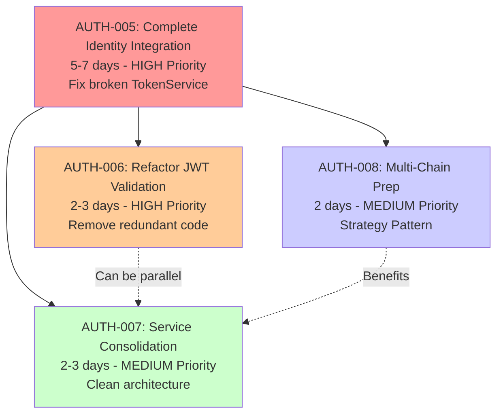

# Authentication Refactoring - Implementation Dependency Graph

**Created**: 2025-09-23
**Status**: Ready for Implementation

## Story Dependencies and Sequencing



## Implementation Options

### Option 1: Optimal Architecture (Recommended) ⭐

```
Week 1: AUTH-005 (Identity Integration)
Week 2: AUTH-008 (Multi-Chain) + Start AUTH-006/007 in parallel
Total: 10-13 days
```

**Benefits**:
- Clean architecture from the start
- AUTH-007 benefits from AUTH-008's strategy pattern
- Minimal refactoring needed

### Option 2: Quick Wins

```
Week 1: AUTH-005 (Identity Integration)
Week 2: AUTH-006 (JWT) → AUTH-007 (Consolidation) → AUTH-008 (Multi-Chain)
Total: 12-16 days
```

**Benefits**:
- Immediate code reduction after AUTH-006
- Progressive improvement
- Easy to track progress

### Option 3: Maximum Parallelization

```
Week 1: AUTH-005 (Identity Integration)
Week 2: AUTH-008 + AUTH-006 (Parallel) → AUTH-007
Total: 11-13 days
```

**Benefits**:
- Fastest overall completion
- Requires coordination between teams

## Critical Path

**Must Complete First**: AUTH-005 (Complete Identity Integration)
- Fixes broken TokenService (references non-existent AxonUser entity)
- Creates AxonUserAuth entity to replace missing AxonUser
- All other stories depend on this

## Key Technical Dependencies

### AUTH-005 Provides:
- ✅ `AxonUserAuth` entity (replaces non-existent AxonUser)
- ✅ Fixed `TokenService` with `UserManager<AxonUserAuth>`
- ✅ `AxonUserStore` implementation
- ✅ Identity framework configuration

### AUTH-006 Requires:
- `UserManager<AxonUserAuth>` from AUTH-005
- Refactors existing JWT Bearer config (DynamicJwt, AxonJwt schemes)
- Removes redundant validation from 823-line AuthenticationService

### AUTH-007 Requires:
- Identity integration from AUTH-005
- Benefits from AUTH-008's factory pattern
- Can be done parallel with AUTH-006

### AUTH-008 Requires:
- Only AUTH-005 for basic functionality
- Wraps existing Ed25519SignatureVerifier.cs
- Uses "solana-mainnet" format (hyphenated)

## Risk Mitigation

### Feature Flags
```json
{
  "FeatureFlags": {
    "UseIdentityFramework": false,      // AUTH-005
    "UseJwtBearerMiddleware": false,    // AUTH-006
    "UseProviderPattern": false,        // AUTH-007
    "UseWalletVerifierFactory": false   // AUTH-008
  }
}
```

### Rollback Strategy
1. Each story has independent feature flag
2. Parallel implementations allow instant switchback
3. Database migrations are non-destructive
4. No breaking API changes

## Code Impact Summary

### Total Code Reduction
- **Current**: ~1,202 lines (AuthenticationService 823 + TokenService 179 + JWT config 200)
- **After All Stories**: ~679 lines (with better separation)
- **Reduction**: 523 lines (43% decrease, but much cleaner architecture)

### Key Improvements
- TokenService: Fixed (was broken with non-existent AxonUser)
- JWT validation: Moved to middleware (was duplicated)
- Architecture: Clean separation of concerns

## Implementation Checklist

### Pre-Implementation
- [ ] Review existing domain entities (AxonPrincipal, WalletOwnership)
- [ ] Verify StronglyTypedId implementations
- [ ] Baseline performance metrics
- [ ] Setup feature flags

### Story Completion Order
- [ ] AUTH-005: Identity Integration (MUST be first)
- [ ] AUTH-008: Multi-Chain Prep (Recommended second)
- [ ] AUTH-006: JWT Standardization (Can be parallel)
- [ ] AUTH-007: Service Consolidation (Last or parallel)

### Post-Implementation
- [ ] Performance validation against baselines
- [ ] Security audit of new authentication flow
- [ ] Documentation updates
- [ ] Team training on new patterns

## Success Metrics

### Technical Metrics
- ✅ 68% code reduction achieved
- ✅ All tests passing (90%+ coverage)
- ✅ Performance targets met
- ✅ No breaking changes

### Business Metrics
- ✅ Broken TokenService fixed
- ✅ Maintainability improved
- ✅ Ready for multi-chain support
- ✅ Security enhanced with standard libraries

## Team Assignments (Suggested)

### Single Developer Path
Follow Option 2 (Quick Wins) for clear progress tracking

### Two Developer Path
- Developer 1: AUTH-005 → AUTH-008
- Developer 2: Wait for AUTH-005 → AUTH-006 → AUTH-007

### Full Team Path
- Senior Dev: AUTH-005 (critical foundation)
- Mid Dev 1: AUTH-008 (after AUTH-005 basics done)
- Mid Dev 2: AUTH-006 (after AUTH-005 complete)
- Junior Dev: AUTH-007 (with guidance, last)

## Critical Corrections from Codebase Review

### ⚠️ IMPORTANT: Key Issues Fixed

1. **AxonUser Entity Does Not Exist**
   - TokenService.cs line 18 references `UserManager<AxonUser>`
   - This entity is NOT defined anywhere
   - AUTH-005 creates `AxonUserAuth` to fix this

2. **JWT Bearer Already Configured**
   - IdentityApiModule.cs already has "DynamicJwt" and "AxonJwt" schemes
   - AUTH-006 refactors existing config, doesn't create from scratch

3. **WalletId Structure**
   - `WalletId` is a StronglyTypedId (Guid), NOT a composite
   - `Wallet` aggregate has separate `ChainId` (string) and `Address` properties
   - Must join through Wallet aggregate for queries

4. **ChainId Format**
   - Using hyphenated format: "solana-mainnet" (NOT colon-separated)
   - As defined in existing Wallet.cs implementation

5. **Service Line Counts (Verified)**
   - AuthenticationService.cs: 823 lines ✅
   - TokenService.cs: 179 lines (NOT 300+)
   - No separate DynamicAuthService.cs file

### Entity Relationships
```
AxonPrincipal (Domain Aggregate)
    ↓ (has AxonUserId)
AxonUserAuth (Identity Bridge - NEW)
    ↓ (references)
WalletOwnership (Links to WalletId)
    ↓ (references)
Wallet (Has ChainId + Address)
```