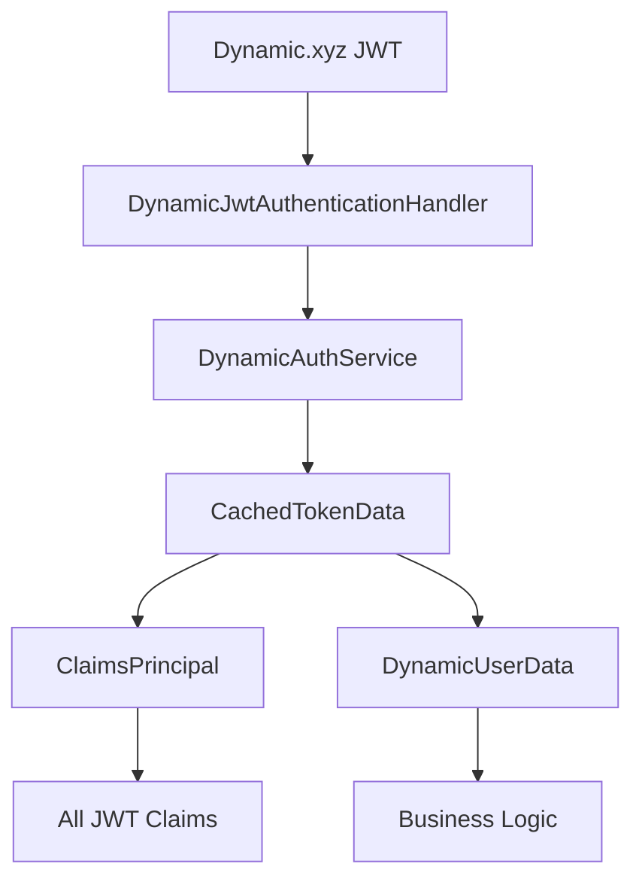

# JWT Claims Handling Architecture

**Document Version**: 1.0
**Last Updated**: September 15, 2025
**Status**: ✅ **Implemented**

## Overview

This document describes the comprehensive JWT claims handling system for Dynamic.xyz tokens in the Axon backend. The implementation follows the **"Digital Passport Principle"** - treating JWTs as complete identity documents that preserve all issued claims while providing structured access patterns for different use cases.

## Architecture Principles

### 1. **Complete Claims Preservation**
Every claim from the Dynamic.xyz JWT is preserved exactly as issued, maintaining the full identity context.

### 2. **Dual Data Access**
- **`DynamicUserData`**: Focused business model for application logic containing essential fields
- **`ClaimsPrincipal`**: Complete JWT claims for authentication, security, and rich metadata access

### 3. **Standards Compliance**
All standard JWT claims (`iss`, `sub`, `aud`, `iat`, `exp`, etc.) are preserved following RFC 7519 specifications.

### 4. **Automatic Extensibility**
New claims from Dynamic.xyz automatically flow through the system without requiring code changes.

## Dynamic.xyz JWT Structure

Dynamic.xyz provides rich JWT tokens containing multiple categories of claims that provide comprehensive user identity and context information.

### Standard JWT Claims

```json
{
  "kid": "c329830f-ee3b-472d-8cc1-01655ec55fc1",
  "aud": "http://localhost:5173",
  "iss": "app.dynamicauth.com/02203765-a9f5-4bf2-a9c8-e6e2e85c3fe1",
  "sub": "34999b11-ad84-4c10-aa03-bef4bbf1697e",
  "sid": "6131bb1d-d463-40af-a213-8f7810914af3",
  "iat": 1757933354,
  "exp": 1757940554
}
```

### Rich Metadata Claims

```json
{
  "email": "valentinkit14@gmail.com",
  "environment_id": "02203765-a9f5-4bf2-a9c8-e6e2e85c3fe1",
  "session_public_key": "0375158b6ba310c48a1d4d0a3dc6b068aef6415e594f74d2c3d76f12db88122851",
  "last_verified_credential_id": "dff1cf66-1dac-45aa-a112-d8b41ba5d698",
  "first_visit": "2025-08-26T21:34:26.368Z",
  "last_visit": "2025-09-15T10:49:14.469Z",
  "new_user": false
}
```

### Verified Credentials Array

```json
{
  "verified_credentials": [
    {
      "address": "7qvWUFx2yJzGAWhWNQ6ae51TRTrEPYGadByHXpQienKF",
      "chain": "solana",
      "id": "dff1cf66-1dac-45aa-a112-d8b41ba5d698",
      "public_identifier": "7qvWUFx2yJzGAWhWNQ6ae51TRTrEPYGadByHXpQienKF",
      "wallet_name": "phantom",
      "wallet_provider": "browserExtension",
      "format": "blockchain",
      "lastSelectedAt": "2025-09-15T10:49:14.479Z",
      "signInEnabled": true
    }
  ]
}
```

## Implementation Architecture

### Core Components



### 1. **DynamicAuthService Enhancement**

```csharp
public interface IDynamicAuthService
{
    // Business logic access
    Task<Result<DynamicUserData, Error>> ValidateTokenAsync(string token, CancellationToken cancellationToken = default);

    // Complete claims access - NEW
    Task<Result<ClaimsPrincipal, Error>> GetRawClaimsAsync(string token, CancellationToken cancellationToken = default);
}
```

**Key Features:**
- **Dual Caching**: Stores both `ClaimsPrincipal` and `DynamicUserData`
- **Single Source**: One validation creates both representations
- **Performance**: Cached results prevent duplicate validation

### 2. **CachedTokenData Structure**

```csharp
internal sealed record CachedTokenData(
    ClaimsPrincipal Principal,    // Complete JWT claims
    DynamicUserData UserData,     // Business-focused data
    DateTimeOffset CachedAt       // Cache metadata
);
```

### 3. **Claims Processing Flow**

The authentication handler implements a two-phase claims processing approach:

```csharp
// Phase 1: Preserve all original JWT claims
var rawClaimsResult = await _dynamicAuthService.GetRawClaimsAsync(token, cancellationToken);
var identity = new ClaimsIdentity(rawClaimsResult.Value.Claims, Scheme.Name);

// Phase 2: Add supplementary claims for compatibility and convenience
AddSupplementaryClaims(identity, userData);

var principal = new ClaimsPrincipal(identity);
```

**Supplementary Claims Strategy:**
- Only adds claims that don't already exist in the JWT
- Maintains ASP.NET Core compatibility (e.g., `ClaimTypes.NameIdentifier`)
- Provides structured wallet access patterns (`wallet:solana`, `wallet:provider:solana`)
- Never overwrites original JWT claims, ensuring data integrity

## Claims Access Patterns

### For Authentication Logic

```csharp
// Access standard JWT claims
var issuer = principal.FindFirst(JwtRegisteredClaimNames.Iss)?.Value;
var subject = principal.FindFirst(JwtRegisteredClaimNames.Sub)?.Value;
var audience = principal.FindFirst(JwtRegisteredClaimNames.Aud)?.Value;
var sessionId = principal.FindFirst("sid")?.Value;
var keyId = principal.FindFirst("kid")?.Value;

// Session security information
var sessionPublicKey = principal.FindFirst("session_public_key")?.Value;
var issuedAt = principal.FindFirst(JwtRegisteredClaimNames.Iat)?.Value;
var expiresAt = principal.FindFirst(JwtRegisteredClaimNames.Exp)?.Value;
```

### For Wallet Intelligence

```csharp
// Get all wallet addresses
var walletAddresses = principal.FindAll("wallet").Select(c => c.Value);

// Get chain-specific information
var solanaAddress = principal.FindFirst("wallet:solana")?.Value;
var solanaProvider = principal.FindFirst("wallet:provider:solana")?.Value; // "browserExtension"
var solanaWalletName = principal.FindFirst("wallet:name:solana")?.Value;     // "phantom"

// Rich metadata access
var lastCredentialId = principal.FindFirst("last_verified_credential_id")?.Value;
var firstVisit = principal.FindFirst("first_visit")?.Value;
var lastVisit = principal.FindFirst("last_visit")?.Value;
var isNewUser = bool.Parse(principal.FindFirst("is_new_user")?.Value ?? "false");
```

### For Business Logic

```csharp
// Use the focused business model
var userData = await dynamicAuthService.ValidateTokenAsync(token);
var userId = userData.Value.UserId;
var email = userData.Value.Email;
var wallets = userData.Value.Wallets; // Structured wallet data
```

## AxonPrincipal Integration

### Using JWT Claims for Identity Creation

When creating AxonPrincipal instances, the system uses authentic JWT claims for maximum identity integrity:

```csharp
var issuerClaim = principal.FindFirst(JwtRegisteredClaimNames.Iss);
var subjectClaim = principal.FindFirst(JwtRegisteredClaimNames.Sub);

var result = AxonPrincipal.CreateWithDynamicCredential(
    providerType: ProviderType.Dynamic,
    issuer: issuerClaim?.Value ?? "app.dynamicauth.com/unknown",
    subject: subjectClaim?.Value ?? userData.UserId,
    id: null
);
```

### Identity Resolution Benefits

Using authentic JWT claims provides:
- **Stable Identity**: Each user maintains consistent identity across sessions using the actual JWT `sub` claim
- **Provider Traceability**: The exact Dynamic.xyz environment that issued the credential is preserved via `iss` claim
- **Security Audit Trail**: Complete provenance of identity credentials for security investigations
- **Dynamic Provider Support**: Proper handling of different Dynamic.xyz provider environments (mapped to network environments)

## Security Considerations

### 1. **Token Integrity**
- All JWT signature validation occurs before claims processing
- Original signed claims preserved without modification
- Additional claims clearly marked as supplementary

### 2. **Cache Security**
- Cached data includes validation status
- Cache keys use secure token hashing
- Configurable cache expiration prevents stale data

### 3. **Claims Validation**
- Standard JWT validation (signature, expiry, issuer)
- Business rule validation in separate layer
- Clear separation between technical and business validation

## Performance Characteristics

### Caching Strategy

```csharp
// Cache hit: O(1) access to both representations
var cacheKey = $"dynamic_token_{GetTokenHash(token)}";
if (_cache.TryGetValue<CachedTokenData>(cacheKey, out var cached))
{
    return cached.Principal;    // or cached.UserData
}
```

### Memory Usage
- **Cache Storage**: Stores both `ClaimsPrincipal` and `DynamicUserData` per cached token
- **Memory Efficiency**: Optimized for functionality-to-memory ratio
- **Cache Management**: Configurable expiration prevents memory bloat

### Processing Time
- **JWT Parsing**: One-time cost with cached results
- **Claims Access**: O(1) dictionary lookups via `FindFirst()` and `FindAll()`
- **Business Logic**: Direct access to normalized `DynamicUserData`

## System Capabilities

The current implementation provides comprehensive access to:

- **Complete JWT Metadata**: All claims from Dynamic.xyz preserved
- **Rich Wallet Information**: Provider details, chain information, last selected timestamps
- **Session Security**: Public keys, session IDs, and cryptographic metadata
- **Precise Identity Tracking**: Authentic issuer/subject tracking for audit trails
- **Intelligence Layer Foundation**: Complete user context for personalization features

## Testing Strategy

### Unit Test Coverage

1. **Claims Preservation Tests**
   ```csharp
   [Test]
   public async Task GetRawClaimsAsync_WhenCacheHit_ShouldReturnAllOriginalClaims()
   {
       // Verifies ALL JWT claims are preserved
   }
   ```

2. **Supplementary Claims Tests**
   ```csharp
   [Test]
   public void AddSupplementaryClaims_ShouldNotOverwriteExistingClaims()
   {
       // Ensures no data loss from supplementation
   }
   ```

3. **Caching Integration Tests**
   ```csharp
   [Test]
   public async Task ValidateTokenAsync_WhenCacheHit_ShouldReturnCachedData()
   {
       // Validates dual caching strategy
   }
   ```

### Integration Test Scenarios

- Token validation with complete claim preservation
- Authentication handler flow with supplementary claims
- AxonPrincipal creation with correct issuer/subject
- Cache performance under load

## Monitoring & Observability

### Metrics to Track

1. **Claims Processing**
   - Total claims preserved per token
   - Supplementary claims added per request
   - Cache hit/miss ratios

2. **Performance Metrics**
   - JWT validation time
   - Claims processing latency
   - Memory usage per cached token

3. **Error Tracking**
   - Failed validations by error type
   - Claims normalization failures
   - Cache eviction rates

### Logging Strategy

```csharp
// Structured logging for claims processing
_logger.LogDebug("JWT validation completed for user {UserId} with {ClaimsCount} total claims",
    userData.UserId, claimsPrincipal.Claims.Count());

// Security-focused logging
_logger.LogInformation("New user session: Issuer={Issuer}, Subject={Subject}, SessionId={SessionId}",
    issuer, subject, sessionId);
```

## Intelligence Layer Integration

The comprehensive claims preservation enables powerful Intelligence Layer capabilities:

### 1. **Wallet Behavior Analysis**
```csharp
var preferredWallet = principal.FindFirst("wallet:name:solana")?.Value;
var lastUsedTimestamp = principal.FindFirst("last_visit")?.Value;
var walletProvider = principal.FindFirst("wallet:provider:solana")?.Value;
```

### 2. **Session Security Scoring**
```csharp
var sessionKey = principal.FindFirst("session_public_key")?.Value;
var sessionId = principal.FindFirst("sid")?.Value;
var issuedAt = principal.FindFirst(JwtRegisteredClaimNames.Iat)?.Value;
```

### 3. **Personalized User Experiences**
```csharp
var isNewUser = bool.Parse(principal.FindFirst("is_new_user")?.Value ?? "false");
var firstVisit = principal.FindFirst("first_visit")?.Value;
var environmentId = principal.FindFirst("environment_id")?.Value;
```

## Extensibility Framework

### Supported Extension Points

1. **Additional JWT Providers**: Architecture supports multiple JWT issuers beyond Dynamic.xyz
2. **Custom Claims Transformations**: Pluggable pipeline for specialized claim processing
3. **Distributed Caching**: Redis integration ready for high-scale deployments
4. **Audit Integration**: Complete claims provenance tracking for compliance
5. **Real-time Analytics**: Stream processing of claims data for behavioral insights

### Adding New Claims Processing

```csharp
// Custom claims processor example
public class CustomClaimsProcessor : IClaimsProcessor
{
    public void ProcessClaims(ClaimsIdentity identity, DynamicUserData userData)
    {
        // Add custom business logic claims
        if (!identity.HasClaim("custom_score"))
        {
            var score = CalculateUserScore(userData);
            identity.AddClaim(new Claim("custom_score", score.ToString()));
        }
    }
}
```

## Summary

This JWT claims handling architecture provides a robust, extensible foundation for identity management in the Axon system. The "Digital Passport Principle" ensures complete preservation of user identity context while maintaining clean separation between authentication concerns and business logic.

**Key System Characteristics:**
- ✅ **Complete Data Preservation**: All JWT claims maintained without loss
- ✅ **Dual Access Patterns**: Both raw claims and normalized business data available
- ✅ **Security Compliance**: Follows JWT standards and security best practices
- ✅ **Performance Optimized**: Efficient caching and O(1) claims access
- ✅ **Extensibility Ready**: Supports future enhancements without architectural changes

The implementation enables intelligent, personalized user experiences by providing the complete identity context needed for advanced features while maintaining system reliability and security standards.