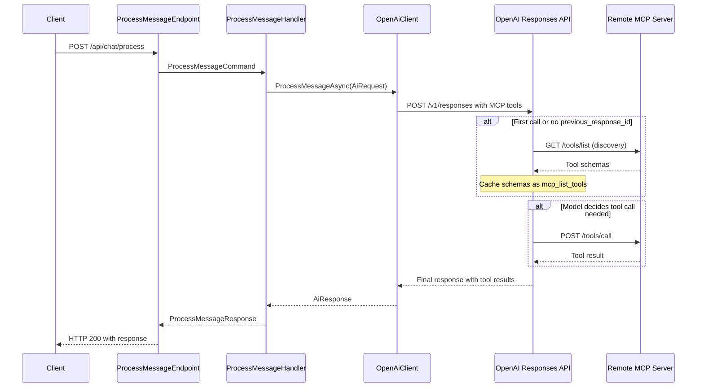
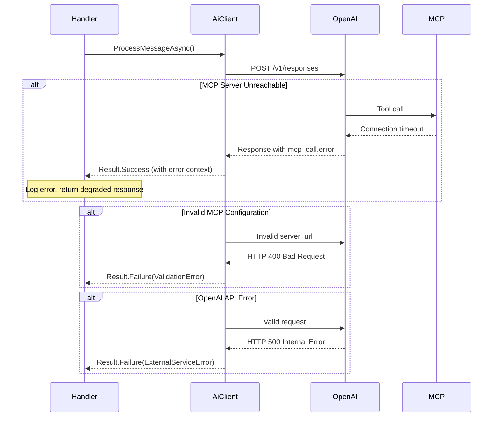

# Context & Scope

## Problem Statement
Current chat systems require application-mediated tool orchestration (App ↔ LLM ↔ App executes tool ↔ App replies), creating latency (>2s response times), token overhead, and complex orchestration logic. The Direct MCP feature enables OpenAI's language models to communicate directly with remote MCP (Model Context Protocol) servers, eliminating the application as a bottleneck.

## Scope Boundaries
**In Scope:**
- Direct OpenAI → Remote MCP server communication via Responses API
- CQRS command/handler pattern for message processing
- Clean Architecture integration within Chat module
- Result<T> error handling for business logic failures
- Security via configurable MCP server authentication headers
- Tool discovery caching via OpenAI conversation context

**Out of Scope (MVP):**
- Multi-turn conversation persistence across sessions
- Streaming responses (Phase 2)
- Tool approval workflows
- Multiple MCP server support per conversation
- Custom MCP server implementation

## Success Criteria
- Chat responses with tool results <2s for single tool calls
- Zero manual tool orchestration code in Application layer
- Successful tool discovery and execution without application intervention
- Clean Architecture compliance with proper dependency direction

# Boundaries & Dependencies

## Module Graph
```
Api ───► Modules.Chat.Application ───► Modules.Chat.Domain
                   ▲                           ▲
                   │                           │
  Modules.Chat.Infrastructure ──────────────────┘
                   │
                   ▼
            [External: OpenAI API]
                   │
                   ▼
            [External: Remote MCP Servers]
```

## Dependency Rules Enforcement
- ✅ **Api** → **Chat.Application** + **Shared.***
- ✅ **Chat.Application** → **Chat.Domain** + **Shared.***
- ✅ **Chat.Infrastructure** → **Chat.Application** + **Chat.Domain**
- ❌ **No Api → Domain** references
- ❌ **No cross-module** references
- ❌ **No business code** in Shared/*

## External Dependencies
- **OpenAI Responses API**: Direct MCP tool integration
- **Remote MCP Servers**: Weather, web search, calculator services
- **HttpClient**: Raw HTTP control for OpenAI API calls
- **System.Text.Json**: Request/response serialization

# Ports & Contracts

## Application Ports
```csharp
namespace Axon.Modules.Chat.Application.Abstractions;

/// <summary>
/// Port for AI client that supports direct MCP tool integration
/// </summary>
public interface IAiClient
{
    /// <summary>
    /// Process message with direct MCP tool support
    /// </summary>
    /// <param name="request">Message processing request with MCP configuration</param>
    /// <param name="cancellationToken">Cancellation token</param>
    /// <returns>Result containing AI response with tool results</returns>
    Task<Result<AiResponse>> ProcessMessageAsync(AiRequest request, CancellationToken cancellationToken);
}

/// <summary>
/// AI processing request with MCP server configuration
/// </summary>
public sealed record AiRequest(
    string Message,
    McpServerConfig? McpConfig = null,
    string? PreviousResponseId = null);

/// <summary>
/// MCP server configuration for direct tool access
/// </summary>
public sealed record McpServerConfig(
    string ServerUrl,
    string ServerLabel,
    Dictionary<string, string>? Headers = null,
    string[]? AllowedTools = null,
    bool RequireApproval = false);

/// <summary>
/// AI response with tool execution results
/// </summary>
public sealed record AiResponse(
    string Content,
    string? ResponseId = null,
    ToolExecution[]? ToolExecutions = null);

/// <summary>
/// Tool execution metadata for observability
/// </summary>
public sealed record ToolExecution(
    string ToolName,
    string Arguments,
    string Result,
    TimeSpan ExecutionTime);
```

## CQRS Contracts
```csharp
namespace Axon.Modules.Chat.Application.Commands.ProcessMessage;

/// <summary>
/// Command for processing chat messages with direct MCP support
/// </summary>
public sealed record ProcessMessageCommand(
    string Message,
    string? McpServerUrl = null,
    Dictionary<string, string>? McpHeaders = null,
    string[]? AllowedTools = null,
    string? PreviousResponseId = null) : IRequest<Result<ProcessMessageResponse>>;

/// <summary>
/// Response containing processed message with tool results
/// </summary>
public sealed record ProcessMessageResponse(
    string Response,
    string? ConversationId = null,
    ToolExecutionSummary[]? ToolExecutions = null);

/// <summary>
/// Tool execution summary for API responses
/// </summary>
public sealed record ToolExecutionSummary(
    string ToolName,
    bool Success,
    TimeSpan Duration);
```

## API Contracts
```csharp
namespace Axon.Api.Contracts.Chat;

/// <summary>
/// HTTP request for chat message processing
/// </summary>
public sealed record ProcessMessageRequest(
    string Message,
    McpServerRequest? McpServer = null,
    string? ConversationId = null);

/// <summary>
/// MCP server configuration in API request
/// </summary>
public sealed record McpServerRequest(
    string ServerUrl,
    string? ServerLabel = null,
    Dictionary<string, string>? Headers = null,
    string[]? AllowedTools = null);

/// <summary>
/// HTTP response for processed message
/// </summary>
public sealed record ProcessMessageResponse(
    string Response,
    string ConversationId,
    ToolExecutionResponse[]? ToolExecutions = null);

/// <summary>
/// Tool execution information in API response
/// </summary>
public sealed record ToolExecutionResponse(
    string ToolName,
    bool Success,
    int DurationMs);
```

# CQRS Mapping

## Command Flow
```
ProcessMessageEndpoint
    ├── Maps HTTP request → ProcessMessageCommand
    ├── Validates required fields (Message, McpServerUrl)
    └── Calls MediatR.Send()

ProcessMessageHandler
    ├── Receives ProcessMessageCommand
    ├── Maps to AiRequest with McpServerConfig
    ├── Calls IAiClient.ProcessMessageAsync()
    ├── Maps AiResponse → ProcessMessageResponse
    └── Returns Result<ProcessMessageResponse>
```

## Validators
```csharp
namespace Axon.Modules.Chat.Application.Commands.ProcessMessage;

public sealed class ProcessMessageValidator : AbstractValidator<ProcessMessageCommand>
{
    public ProcessMessageValidator()
    {
        RuleFor(x => x.Message)
            .NotEmpty()
            .MaximumLength(4000)
            .WithMessage("Message must be 1-4000 characters");

        When(x => x.McpServerUrl != null, () =>
        {
            RuleFor(x => x.McpServerUrl)
                .Must(BeValidUrl)
                .WithMessage("MCP server URL must be valid HTTPS URL");
        });
    }

    private static bool BeValidUrl(string? url) =>
        Uri.TryCreate(url, UriKind.Absolute, out var uri) && uri.Scheme == "https";
}
```

## Behaviors (Future)
- **ValidationBehavior**: FluentValidation integration
- **LoggingBehavior**: Structured logging with Activity tracing
- **TimeoutBehavior**: 30s timeout for AI calls

# Data Flow

## Happy Path Sequence


## Error Handling Flow


# Transactions, Idempotency, Consistency

## Transaction Boundaries
- **Single Request Scope**: No database persistence in MVP
- **OpenAI Context**: Managed by previous_response_id for tool schema caching
- **Stateless Design**: Each request is independent, no cross-request state

## Idempotency Strategy
- **Client-side**: Clients should avoid duplicate submissions
- **Tool Calls**: OpenAI handles idempotency for MCP tool execution
- **Error Recovery**: Safe to retry on transient failures (network, timeouts)

## Consistency Model
- **Eventual Consistency**: Tool results incorporated into final response
- **Error Isolation**: MCP server failures don't break conversation flow
- **Graceful Degradation**: Continue without tools when MCP unavailable

# Observability, Security, Performance

## Observability (ILogger, Activity, W3C)
```csharp
// Activity tracing with W3C headers
using var activity = ActivitySource.StartActivity("ProcessMessage");
activity?.SetTag("mcp.server_url", request.McpConfig?.ServerUrl);
activity?.SetTag("mcp.tools_count", toolExecutions?.Length ?? 0);

// Structured logging
_logger.LogInformation(
    "Processing message with MCP server {ServerUrl} completed in {Duration}ms",
    mcpServerUrl, 
    stopwatch.ElapsedMilliseconds);

// Tool execution logging
foreach (var tool in toolExecutions ?? [])
{
    _logger.LogInformation(
        "Tool {ToolName} executed in {Duration}ms with result length {ResultLength}",
        tool.ToolName,
        tool.ExecutionTime.TotalMilliseconds,
        tool.Result.Length);
}
```

## Security Measures
- **Authentication**: MCP server credentials via Headers, not stored by OpenAI
- **Path Redaction**: OpenAI redacts server_url paths in responses
- **Audit Logging**: All tool calls and results logged with sanitization
- **Input Validation**: Message length limits, URL validation
- **No Credential Storage**: Headers passed through, never persisted

## Performance Targets
- **Single Tool Call**: <2 seconds end-to-end
- **Tool Discovery**: <5 seconds with schema caching via previous_response_id
- **Memory Usage**: <50MB per conversation context
- **Concurrency**: HttpClient connection pooling for OpenAI API calls

# Compatibility & Migration

## Feature Flags
```json
{
  "Chat": {
    "DirectMcp": {
      "Enabled": true,
      "DefaultServerUrl": "https://api.weather-mcp.com/mcp",
      "TimeoutSeconds": 30,
      "MaxMessageLength": 4000
    }
  }
}
```

## Rollout Strategy
1. **Development**: Local MCP server testing
2. **Staging**: Trusted external MCP servers (weather, calculator)
3. **Production**: Gradual rollout with feature flag controls
4. **Monitoring**: Response times, error rates, tool usage patterns

## Migration Plan
- **No Breaking Changes**: New endpoint, existing chat functionality unchanged
- **Backward Compatibility**: Existing API contracts preserved
- **Graceful Fallback**: Standard chat when MCP disabled or unavailable

# Alternatives Considered

## Option 1: App-Mediated Tool Orchestration (Current State)
**Pros**: Full control, custom tool logic, detailed logging
**Cons**: High latency (>2s), complex orchestration, token overhead
**Decision**: Rejected for MVP due to performance requirements

## Option 2: OpenAI Function Calling with Local Tools
**Pros**: Lower latency than app-mediated, more control than direct MCP
**Cons**: Still requires application tool execution, limited to built-in tools
**Decision**: Rejected - doesn't meet goal of eliminating orchestration complexity

## Option 3: Custom MCP Server Implementation
**Pros**: Full control over tool behavior, custom business logic
**Cons**: High development cost, maintenance overhead, out of scope
**Decision**: Deferred to Phase 2, MVP uses existing external MCP servers

## Option 4: Direct MCP via Responses API (Selected)
**Pros**: Minimal latency, zero orchestration code, leverages OpenAI optimizations
**Cons**: Less control, external service dependency, preview API stability risk
**Decision**: Selected for MVP - best fit for performance and simplicity goals

# Risks & Mitigations

## High-Impact Risks

### R1: OpenAI Responses API Stability (Preview)
**Impact**: Breaking changes could break functionality
**Probability**: Medium
**Mitigation**: 
- Pin OpenAI SDK versions
- Monitor release notes and migration guides  
- Implement feature flag for quick disable
- Maintain app-mediated fallback option

### R2: External MCP Server Availability
**Impact**: Tool functionality unavailable, degraded user experience
**Probability**: Medium  
**Mitigation**:
- Implement graceful degradation (continue without tools)
- Clear error messages for users
- Health checks and monitoring for MCP endpoints
- Multiple MCP server options in Phase 2

### R3: Security - Untrusted MCP Servers
**Impact**: Data exfiltration, prompt injection attacks
**Probability**: Low (using trusted servers)
**Mitigation**:
- Curated list of trusted MCP servers only
- Audit logging of all tool calls and responses
- Input sanitization and output validation
- Regular security review of connected servers

## Medium-Impact Risks

### R4: Performance - Tool Discovery Latency  
**Impact**: First-call latency >5s SLA violation
**Probability**: Medium
**Mitigation**:
- Implement conversation context caching via previous_response_id
- Pre-warm tool schemas for common MCP servers
- Optimize allowed_tools filtering

### R5: Cost - Token Usage from Tool Schemas
**Impact**: Higher than expected OpenAI costs
**Probability**: Medium
**Mitigation**:
- Monitor token usage patterns
- Implement schema caching effectively
- Use allowed_tools to minimize schema size  
- Set usage limits and alerts

## Monitoring & Alerting
- **Response Time P95** > 2s → Alert
- **MCP Server Error Rate** > 5% → Alert  
- **Token Usage** > 150% of baseline → Alert
- **Tool Discovery Failures** > 10% → Alert