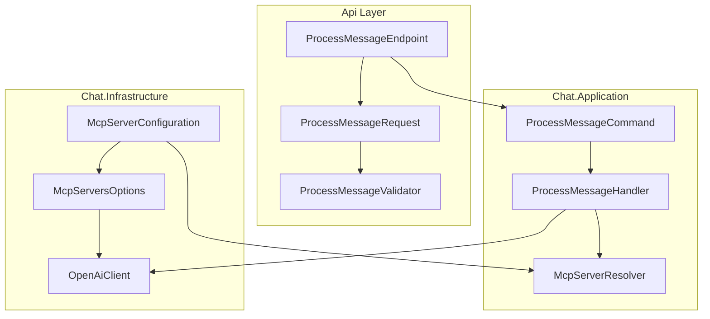

# Context & Scope

Migrate MCP (Model Context Protocol) server configuration from API request payloads to centralized `appsettings.json` configuration while maintaining backward compatibility with existing OpenAI Direct MCP integration.

**Current State**: MCP servers configured per-request via `McpServerRequest` in `ProcessMessageRequest`
**Target State**: Pre-configured MCP servers in `appsettings.json`, referenced by ID in API requests
**Scope**: Chat module only, affects API contracts, Application commands, and Infrastructure configuration

# Boundaries & Dependencies



**Module Boundaries Respected**:
- Api → Chat.Application (command dispatching)
- Chat.Application → Chat.Infrastructure (IAiClient interface)
- No cross-module references
- No Domain layer changes required

**External Dependencies**:
- Microsoft.Extensions.Options.ConfigurationExtensions (configuration binding)
- Microsoft.Extensions.Configuration (appsettings.json loading)

# Ports & Contracts

## Configuration Contract
```csharp
namespace Axon.Modules.Chat.Infrastructure.Configuration;

/// <summary>
/// MCP servers configuration options
/// </summary>
public sealed class McpServersOptions
{
    public const string SectionName = "Chat:McpServers";
    
    public Dictionary<string, McpServerOptions> Servers { get; init; } = new();
}

public sealed class McpServerOptions
{
    public bool Enabled { get; init; } = true;
    public required string ServerUrl { get; init; }
    public string ServerLabel { get; init; } = string.Empty;
    public Dictionary<string, string>? Headers { get; init; }
    public string[]? AllowedTools { get; init; }
    public int TimeoutSeconds { get; init; } = 30;
}
```

## Application Service Contract
```csharp
namespace Axon.Modules.Chat.Application.Abstractions;

/// <summary>
/// Resolves MCP server configuration from various sources
/// </summary>
public interface IMcpServerResolver
{
    Result<McpServerConfig?> ResolveServerConfig(
        string? mcpServerId, 
        McpServerRequest? legacyMcpRequest);
}
```

## API Contract Changes
```csharp
namespace Axon.Api.Contracts.Chat;

// Updated ProcessMessageRequest
public sealed record ProcessMessageRequest(
    string Message,
    string? McpServerId = null,           // NEW: reference to pre-configured server
    McpServerRequest? McpServer = null,   // DEPRECATED: will be removed after transition
    string? ConversationId = null);
```

# CQRS Mapping

## Commands
- **ProcessMessageCommand**: Add `McpServerId` field, keep existing MCP fields for backward compatibility
- **No new commands required**

## Queries
- **No queries affected**

## Validators
- **ProcessMessageValidator**: Add validation for `McpServerId` format (alphanumeric + underscore only)
- **McpServersOptionsValidator**: Startup validation for configuration

## Behaviors
- **No new behaviors required**
- Existing logging/validation behaviors remain unchanged

# Data Flow / Sequence

## Happy Path: New Format (McpServerId)
```
1. Client → ProcessMessageRequest(Message, McpServerId: "weather")
2. ProcessMessageEndpoint → ProcessMessageCommand(Message, McpServerId: "weather")
3. ProcessMessageHandler → IMcpServerResolver.ResolveServerConfig("weather", null)
4. McpServerResolver → McpServersOptions lookup → McpServerConfig
5. ProcessMessageHandler → IAiClient.ProcessMessageAsync(AiRequest with McpConfig)
6. OpenAiClient → OpenAI API with MCP tools
7. Return AiResponse → ProcessMessageResponse
```

## Backward Compatibility Path: Legacy Format (McpServerRequest)
```
1. Client → ProcessMessageRequest(Message, McpServer: McpServerRequest(...))
2. ProcessMessageEndpoint → ProcessMessageCommand(Message, legacy MCP fields)
3. ProcessMessageHandler → IMcpServerResolver.ResolveServerConfig(null, McpServerRequest)
4. McpServerResolver → Convert McpServerRequest → McpServerConfig
5. [Same as above from step 5]
```

## Failure Paths
- **Invalid McpServerId**: Return validation error "MCP server 'xyz' not found"
- **Disabled MCP Server**: Return service error "MCP server 'xyz' is currently disabled"
- **Configuration Error**: Return startup failure with validation details
- **Both formats provided**: Use new format, log deprecation warning

# Transactions, Idempotency, Consistency

## Transactions
- **No transactional requirements**: Configuration is read-only at runtime
- **Startup validation**: Fail-fast on invalid configuration

## Idempotency  
- **Configuration loading**: Idempotent, loaded once at startup
- **Server resolution**: Pure function, deterministic results

## Consistency
- **Configuration consistency**: Validated at startup, immutable at runtime
- **Backward compatibility**: Consistent behavior between old/new formats during transition

# Observability (ILogger, Activity, W3C), Security, Performance

## Observability
```csharp
// Structured logging in McpServerResolver
_logger.LogInformation(
    "Resolved MCP server configuration for {McpServerId} with {ToolCount} allowed tools",
    mcpServerId, allowedTools?.Length ?? 0);

// Deprecation warnings
_logger.LogWarning(
    "Legacy MCP server configuration used for {ServerUrl}. Please migrate to McpServerId format",
    mcpRequest.ServerUrl);

// Configuration validation errors
_logger.LogError(
    "Invalid MCP server configuration for {ServerId}: {ValidationError}",
    serverId, validationError);
```

## Security
- **Credentials in appsettings.json**: Use environment variables for sensitive headers
- **Request logging**: Exclude MCP server configurations from HTTP logs
- **HTTPS enforcement**: Validate all MCP server URLs use HTTPS scheme
- **Header sanitization**: Never log header values containing "Key", "Token", "Secret"

## Performance
- **Configuration caching**: Load once at startup, cached in memory
- **Server resolution**: O(1) dictionary lookup for configured servers
- **No additional HTTP calls**: Configuration pre-loaded, no runtime discovery
- **Memory usage**: Estimated <1KB per MCP server configuration

# Compatibility & Migration

## Feature Flag Strategy
```json
{
  "Chat": {
    "McpConfigMigration": {
      "Enabled": true,  // Controls new behavior
      "AllowLegacyFormat": true,  // 30-day transition period
      "LogDeprecationWarnings": true
    }
  }
}
```

## Migration Timeline
1. **Phase 1** (Week 1-2): Deploy with both formats supported, feature flag enabled
2. **Phase 2** (Week 3-4): Monitor adoption, increase deprecation warning frequency  
3. **Phase 3** (Week 5-6): Disable legacy format support, remove deprecated fields

## Environment-Specific Configuration
```json
// Development
{
  "Chat": {
    "McpServers": {
      "weather": {
        "ServerUrl": "https://dev-weather.example.com/mcp",
        "Headers": {
          "X-API-Key": "${WEATHER_API_KEY_DEV}"
        }
      }
    }
  }
}

// Production  
{
  "Chat": {
    "McpServers": {
      "weather": {
        "ServerUrl": "https://weather.example.com/mcp", 
        "Headers": {
          "X-API-Key": "${WEATHER_API_KEY_PROD}"
        }
      }
    }
  }
}
```

# Alternatives Considered

## Alternative 1: Runtime Configuration API
**Approach**: Add admin endpoints to manage MCP server configurations at runtime
**Rejected**: Increases complexity, security concerns, out of scope for current requirements

## Alternative 2: Database-Stored Configuration  
**Approach**: Store MCP server configurations in database with EF Core
**Rejected**: Over-engineering for relatively static configuration, adds database dependency

## Alternative 3: Complete Breaking Change
**Approach**: Remove old format immediately, require all clients to update
**Rejected**: Violates backward compatibility requirement, high migration risk

## Alternative 4: Configuration per Environment Only
**Approach**: Different appsettings files per environment, no runtime server selection
**Rejected**: Reduces flexibility, doesn't meet multi-server support requirement

# Risks & Mitigations

## Risk 1: Configuration Complexity (Medium)
**Description**: Managing multiple MCP servers across environments increases configuration complexity
**Mitigation**: 
- Comprehensive startup validation with clear error messages
- Configuration templates and documentation
- Environment variable substitution for sensitive values

## Risk 2: Backward Compatibility Issues (Medium)  
**Description**: Supporting both old and new formats simultaneously could introduce bugs
**Mitigation**:
- Comprehensive test coverage for both formats
- Feature flag to disable legacy support quickly if issues arise
- Clear precedence rules (new format wins if both provided)

## Risk 3: Security Credential Exposure (Low)
**Description**: MCP credentials in configuration files could be accidentally exposed
**Mitigation**:
- Environment variable substitution for all sensitive values
- Clear documentation about secret management
- Configuration validation to detect hardcoded credentials

## Risk 4: Performance Impact (Low)
**Description**: Additional configuration resolution could impact response times
**Mitigation**:
- O(1) dictionary lookup for server resolution
- Pre-validated configuration at startup
- Benchmark tests to verify <2s response time maintained

## Risk 5: Client Migration Resistance (Medium)
**Description**: API clients may be slow to adopt new McpServerId format
**Mitigation**:
- 30-day backward compatibility period
- Clear deprecation warnings with migration guidance
- Progressive deprecation (warnings → errors → removal)