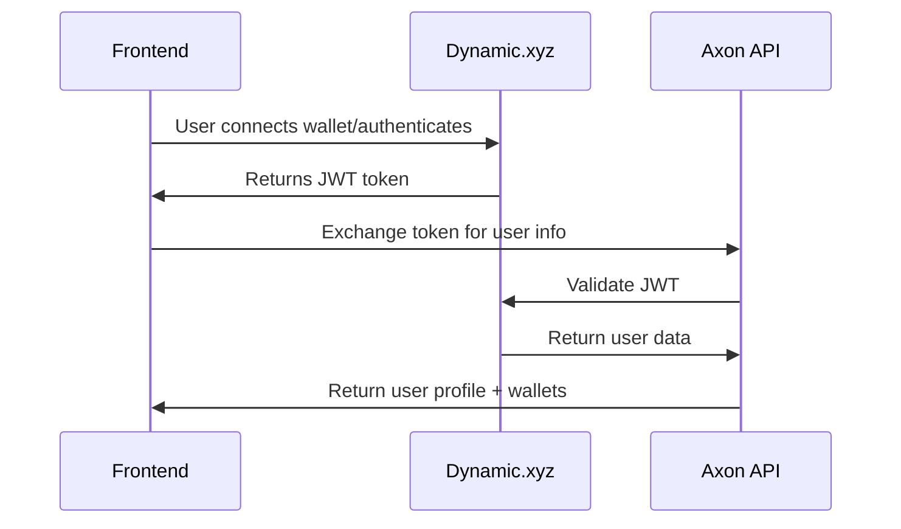

# Axon Backend API - Frontend Integration Guide

**Version:** 1.0  
**Last Updated:** December 2024  
**API Base URL:** `/api/v1`

## Table of Contents

1. [Authentication & Authorization](#authentication--authorization)
2. [API Endpoints Reference](#api-endpoints-reference)
3. [Integration Workflows](#integration-workflows)
4. [Error Handling](#error-handling)
5. [Frontend Implementation Guide](#frontend-implementation-guide)
6. [Best Practices](#best-practices)

---

## Authentication & Authorization

### Overview

Axon uses **Dynamic.xyz** as the authentication provider with JWT Bearer tokens. The authentication flow is designed to work seamlessly with Web3 wallet connections.

### Authentication Flow

#### 1. User Authentication with Dynamic.xyz



#### 2. Token Exchange Implementation

```javascript
// Step 1: Get JWT from Dynamic.xyz (using Dynamic SDK)
const dynamicToken = await dynamicAuth.getAuthToken();

// Step 2: Exchange with Axon backend
const exchangeResponse = await fetch('/api/v1/auth/exchange', {
  method: 'POST',
  headers: {
    'Authorization': `Bearer ${dynamicToken}`,
    'Content-Type': 'application/json'
  },
  body: JSON.stringify({})
});

if (exchangeResponse.ok) {
  const userData = await exchangeResponse.json();
  // Store user data in your state management
  setUser(userData);
} else {
  // Handle authentication errors
  handleAuthError(exchangeResponse.status);
}
```

### Authentication States

The frontend should handle these authentication states:

| State | Description | Action Required |
|-------|-------------|-----------------|
| `Unauthenticated` | User has not connected wallet | Redirect to Dynamic.xyz auth |
| `Authenticated` | Valid JWT token available | Allow access to protected features |
| `Token Expired` | JWT token is no longer valid | Re-authenticate with Dynamic.xyz |
| `Service Unavailable` | Dynamic.xyz is down | Show appropriate error message |

---

## API Endpoints Reference

### Authentication Endpoints

#### Exchange Token

**Endpoint:** `POST /api/v1/auth/exchange`  
**Authentication:** Bearer token required  
**Purpose:** Exchange Dynamic.xyz JWT for user information

**Request:**
```typescript
// Empty request body - token passed in Authorization header
{}
```

**Response (200 OK):**
```typescript
interface ExchangeTokenResponse {
  userId: string;           // Dynamic.xyz user ID
  email: string;           // User's email address
  wallets: WalletInfo[];   // Connected wallet information
}

interface WalletInfo {
  id: string;              // Wallet UUID
  address: string;         // Wallet address
  chain: string;           // Blockchain (ethereum, polygon, etc.)
  provider: string;        // Wallet provider (metamask, walletconnect, etc.)
  walletName?: string;     // Optional wallet name
  connectedAt?: Date;      // When wallet was connected
}
```

**Error Responses:**
- `401 Unauthorized`: Invalid or missing JWT token
- `503 Service Unavailable`: Dynamic.xyz service unavailable

#### Get Current User

**Endpoint:** `GET /api/v1/auth/me`  
**Authentication:** Bearer token required  
**Purpose:** Get detailed current user information

**Response (200 OK):**
```typescript
interface CurrentUserResponseDto {
  user: UserProfileDto;
  wallets: WalletInfo[];
  syncedAt: Date;          // Last sync with Dynamic.xyz
  syncStatus: string;      // "synced" | "pending" | "error"
}

interface UserProfileDto {
  id: string;              // Axon internal user ID
  dynamicUserId: string;   // Dynamic.xyz user ID
  email: string;
  displayName?: string;
  username?: string;
  firstVisit?: Date;
  lastVisit?: Date;
  metadata: Record<string, any>; // Dynamic.xyz metadata
}
```

### Chat Endpoints

#### Send Chat Message

**Endpoint:** `POST /api/v1/chat/turns`  
**Authentication:** Currently anonymous (will require auth in future)  
**Purpose:** Send a chat message (start new conversation or continue existing)

**Request:**
```typescript
interface ChatTurnRequestDto {
  conversationId?: string; // null = new conversation, UUID = continue existing
  message: string;         // User's message content
}
```

**Response (200 OK):**
```typescript
interface ChatTurnResponseDto {
  conversationId: string;      // UUID of conversation (new or existing)
  userMessageId: string;       // UUID of user's message
  assistantMessageId: string;  // UUID of assistant's response
  assistantMessage: string;    // Assistant's response content
  timestamp: Date;             // Response timestamp
}
```

#### Get Conversations List

**Endpoint:** `GET /api/v1/conversations`  
**Authentication:** Currently anonymous (will require auth in future)  
**Purpose:** Get paginated list of user's conversations

**Query Parameters:**
```typescript
interface GetConversationsParams {
  pageNumber?: number;     // 1-based page number (default: 1)
  pageSize?: number;       // Items per page (default: 20, max: 100)
  sortBy?: 'UpdatedAt' | 'CreatedAt' | 'Title'; // Default: UpdatedAt
  sortDirection?: 'Asc' | 'Desc'; // Default: Desc
  titleContains?: string;  // Filter by title substring (case-insensitive)
}
```

**Response (200 OK):**
```typescript
interface GetConversationsResponseDto {
  items: ConversationItemDto[];
  pageNumber: number;      // Current page (1-based)
  pageSize: number;        // Items per page
  totalCount: number;      // Total conversations
  totalPages: number;      // Total pages available
  hasPrevious: boolean;    // Has previous page
  hasNext: boolean;        // Has next page
  count: number;           // Items in current page
  isEmpty: boolean;        // Current page is empty
  firstItemIndex: number;  // 1-based index of first item
  lastItemIndex: number;   // 1-based index of last item
}

interface ConversationItemDto {
  conversationId: string;
  title: string;
  createdAtUtc: Date;
  updatedAtUtc: Date;
  lastAssistantResponseId?: string;
}
```

#### Get Conversation Messages

**Endpoint:** `GET /api/v1/conversations/{conversationId}/messages`  
**Authentication:** Currently anonymous (will require auth in future)  
**Purpose:** Get paginated messages from a specific conversation

**Query Parameters:**
```typescript
interface GetMessagesParams {
  pageNumber?: number;     // 1-based page number (default: 1)
  pageSize?: number;       // Items per page (default: 20)
  includeDeleted?: boolean; // Include deleted messages (default: false)
}
```

**Response (200 OK):**
```typescript
interface GetConversationMessagesResponseDto {
  // Same pagination structure as conversations
  items: ConversationMessageDto[];
  // ... pagination fields
}

interface ConversationMessageDto {
  messageId: string;       // UUID of message
  role: 'user' | 'assistant';
  content: string;         // Message content
  createdAtUtc: Date;
  sequence: number;        // Message order in conversation
  aiResponseId?: string;   // AI tracking ID for assistant messages
}
```

### Webhook Endpoints

#### Process Dynamic Webhook (Internal)

**Endpoint:** `POST /api/v1/webhooks/dynamic`  
**Authentication:** Signature-based (X-Dynamic-Signature header)  
**Purpose:** Internal endpoint for Dynamic.xyz webhooks

> ⚠️ **Note:** This endpoint is for server-to-server communication only. Frontend should not call this endpoint.

---

## Integration Workflows

### 1. Initial Application Load

```typescript
// App initialization sequence
async function initializeApp() {
  try {
    // Check if user has existing Dynamic.xyz session
    const dynamicToken = await dynamicAuth.getAuthToken();
    
    if (dynamicToken) {
      // Exchange token for user info
      const userData = await exchangeToken(dynamicToken);
      setUser(userData);
      setAuthState('authenticated');
      
      // Load user's conversations
      const conversations = await loadConversations();
      setConversations(conversations);
    } else {
      setAuthState('unauthenticated');
    }
  } catch (error) {
    console.error('App initialization failed:', error);
    setAuthState('error');
  }
}
```

### 2. User Authentication Flow

```typescript
async function handleUserLogin() {
  try {
    // Trigger Dynamic.xyz authentication
    const authResult = await dynamicAuth.connect();
    
    if (authResult.success) {
      const token = await dynamicAuth.getAuthToken();
      const userData = await exchangeToken(token);
      
      setUser(userData);
      setAuthState('authenticated');
      
      // Navigate to main app
      navigate('/chat');
    }
  } catch (error) {
    console.error('Authentication failed:', error);
    setAuthState('error');
    // Show user-friendly error message
  }
}
```

### 3. Chat Management Flow

#### Starting a New Conversation

```typescript
async function startNewConversation(message: string) {
  try {
    const response = await fetch('/api/v1/chat/turns', {
      method: 'POST',
      headers: {
        'Content-Type': 'application/json',
        // Note: Authorization will be required in future versions
      },
      body: JSON.stringify({
        conversationId: null, // null = new conversation
        message: message
      })
    });
    
    if (response.ok) {
      const result = await response.json();
      
      // Update UI with new conversation
      const newConversation = {
        id: result.conversationId,
        messages: [
          {
            id: result.userMessageId,
            role: 'user',
            content: message,
            timestamp: new Date()
          },
          {
            id: result.assistantMessageId,
            role: 'assistant',
            content: result.assistantMessage,
            timestamp: result.timestamp
          }
        ]
      };
      
      setCurrentConversation(newConversation);
      addToConversationsList(newConversation);
    }
  } catch (error) {
    console.error('Failed to start conversation:', error);
  }
}
```

#### Continuing Existing Conversation

```typescript
async function sendMessage(conversationId: string, message: string) {
  try {
    // Optimistic update - add user message immediately
    const userMessage = {
      id: generateTempId(),
      role: 'user' as const,
      content: message,
      timestamp: new Date(),
      pending: true
    };
    
    addMessageToConversation(conversationId, userMessage);
    
    const response = await fetch('/api/v1/chat/turns', {
      method: 'POST',
      headers: { 'Content-Type': 'application/json' },
      body: JSON.stringify({
        conversationId: conversationId,
        message: message
      })
    });
    
    if (response.ok) {
      const result = await response.json();
      
      // Replace temp user message with real one
      updateMessage(userMessage.id, {
        id: result.userMessageId,
        pending: false
      });
      
      // Add assistant response
      addMessageToConversation(conversationId, {
        id: result.assistantMessageId,
        role: 'assistant',
        content: result.assistantMessage,
        timestamp: result.timestamp
      });
    } else {
      // Handle error - mark message as failed
      updateMessage(userMessage.id, { failed: true, pending: false });
    }
  } catch (error) {
    console.error('Failed to send message:', error);
  }
}
```

### 4. Conversation History Management

#### Loading Conversations with Pagination

```typescript
interface ConversationsState {
  conversations: ConversationItemDto[];
  totalCount: number;
  currentPage: number;
  hasMore: boolean;
  loading: boolean;
}

async function loadConversations(
  page = 1, 
  filters?: { titleContains?: string }
) {
  setLoading(true);
  
  try {
    const params = new URLSearchParams({
      pageNumber: page.toString(),
      pageSize: '20',
      sortBy: 'UpdatedAt',
      sortDirection: 'Desc',
      ...(filters?.titleContains && { titleContains: filters.titleContains })
    });
    
    const response = await fetch(`/api/v1/conversations?${params}`);
    const data = await response.json();
    
    if (page === 1) {
      setConversations(data.items);
    } else {
      // Append for pagination
      setConversations(prev => [...prev, ...data.items]);
    }
    
    setTotalCount(data.totalCount);
    setCurrentPage(data.pageNumber);
    setHasMore(data.hasNext);
  } catch (error) {
    console.error('Failed to load conversations:', error);
  } finally {
    setLoading(false);
  }
}
```

#### Loading Conversation Messages

```typescript
async function loadConversationMessages(conversationId: string, page = 1) {
  try {
    const params = new URLSearchParams({
      pageNumber: page.toString(),
      pageSize: '50' // Larger page size for messages
    });
    
    const response = await fetch(
      `/api/v1/conversations/${conversationId}/messages?${params}`
    );
    
    if (response.ok) {
      const data = await response.json();
      
      // Messages are returned in chronological order
      const messages = data.items.map(msg => ({
        id: msg.messageId,
        role: msg.role,
        content: msg.content,
        timestamp: new Date(msg.createdAtUtc),
        sequence: msg.sequence
      }));
      
      if (page === 1) {
        setMessages(messages);
      } else {
        // Prepend older messages for infinite scroll up
        setMessages(prev => [...messages, ...prev]);
      }
      
      return {
        messages,
        hasMore: data.hasNext,
        totalCount: data.totalCount
      };
    }
  } catch (error) {
    console.error('Failed to load messages:', error);
    return { messages: [], hasMore: false, totalCount: 0 };
  }
}
```

---

## Error Handling

### HTTP Status Codes

The API uses standard HTTP status codes with consistent error response format:

```typescript
interface ApiError {
  status: number;
  title: string;
  detail: string;
  instance: string;
  type: string;
}
```

#### Common Status Codes

| Code | Meaning | Common Causes | Frontend Action |
|------|---------|---------------|-----------------|
| `400` | Bad Request | Invalid request format, validation errors | Show validation errors to user |
| `401` | Unauthorized | Missing/invalid JWT token | Redirect to login |
| `403` | Forbidden | User doesn't have access to resource | Show access denied message |
| `422` | Unprocessable Entity | Business rule violation | Show business error to user |
| `500` | Internal Server Error | Server-side error | Show generic error, retry option |
| `503` | Service Unavailable | Dynamic.xyz or external service down | Show service unavailable message |

### Error Handling Implementation

```typescript
class ApiClient {
  async request<T>(url: string, options: RequestInit): Promise<T> {
    try {
      const response = await fetch(url, {
        ...options,
        headers: {
          'Content-Type': 'application/json',
          ...this.getAuthHeaders(),
          ...options.headers,
        }
      });

      if (!response.ok) {
        await this.handleErrorResponse(response);
      }

      return await response.json();
    } catch (error) {
      if (error instanceof ApiError) {
        throw error;
      }
      
      // Network or other errors
      throw new ApiError('Network error', 'Failed to connect to server');
    }
  }

  private async handleErrorResponse(response: Response) {
    const errorData = await response.json().catch(() => ({}));
    
    switch (response.status) {
      case 401:
        // Token expired or invalid
        await this.handleTokenExpiry();
        throw new ApiError('Authentication failed', 'Please log in again');
        
      case 403:
        throw new ApiError('Access denied', 'You don\'t have permission');
        
      case 422:
        throw new ApiError('Validation error', errorData.detail || 'Invalid input');
        
      case 503:
        throw new ApiError(
          'Service unavailable', 
          'Authentication service is temporarily unavailable'
        );
        
      default:
        throw new ApiError('Request failed', errorData.detail || 'Unknown error');
    }
  }

  private async handleTokenExpiry() {
    // Clear stored auth data
    this.clearAuth();
    
    // Try to refresh token with Dynamic.xyz
    try {
      const newToken = await this.dynamicAuth.refreshToken();
      if (newToken) {
        await this.exchangeToken(newToken);
        return;
      }
    } catch (refreshError) {
      console.error('Token refresh failed:', refreshError);
    }
    
    // Redirect to login
    this.router.navigate('/login');
  }
}
```

---

## Frontend Implementation Guide

### State Management

#### Recommended State Structure

```typescript
interface AppState {
  // Authentication
  auth: {
    status: 'loading' | 'authenticated' | 'unauthenticated' | 'error';
    user?: UserProfileDto;
    wallets?: WalletInfo[];
    token?: string;
  };
  
  // Chat
  chat: {
    conversations: {
      items: ConversationItemDto[];
      totalCount: number;
      currentPage: number;
      hasMore: boolean;
      loading: boolean;
    };
    
    currentConversation?: {
      id: string;
      title: string;
      messages: MessageDto[];
      loading: boolean;
      hasMoreMessages: boolean;
    };
    
    ui: {
      sidebarOpen: boolean;
      selectedConversationId?: string;
      messageInput: string;
    };
  };
}
```

#### Redux Toolkit Example

```typescript
import { createSlice, createAsyncThunk } from '@reduxjs/toolkit';

// Async thunks
export const exchangeToken = createAsyncThunk(
  'auth/exchangeToken',
  async (token: string, { rejectWithValue }) => {
    try {
      const response = await apiClient.post('/auth/exchange', {}, {
        headers: { Authorization: `Bearer ${token}` }
      });
      return response;
    } catch (error) {
      return rejectWithValue(error.message);
    }
  }
);

export const sendMessage = createAsyncThunk(
  'chat/sendMessage',
  async ({ conversationId, message }: { conversationId?: string; message: string }) => {
    return await apiClient.post('/chat/turns', { conversationId, message });
  }
);

// Slices
const authSlice = createSlice({
  name: 'auth',
  initialState: {
    status: 'loading' as const,
    user: null,
    wallets: [],
  },
  reducers: {
    logout: (state) => {
      state.status = 'unauthenticated';
      state.user = null;
      state.wallets = [];
    },
  },
  extraReducers: (builder) => {
    builder
      .addCase(exchangeToken.fulfilled, (state, action) => {
        state.status = 'authenticated';
        state.user = action.payload.user;
        state.wallets = action.payload.wallets;
      })
      .addCase(exchangeToken.rejected, (state) => {
        state.status = 'error';
      });
  },
});
```

### API Client Setup

#### Axios Configuration

```typescript
import axios from 'axios';

const apiClient = axios.create({
  baseURL: '/api/v1',
  timeout: 30000,
});

// Request interceptor for auth
apiClient.interceptors.request.use((config) => {
  const token = localStorage.getItem('dynamicToken');
  if (token) {
    config.headers.Authorization = `Bearer ${token}`;
  }
  return config;
});

// Response interceptor for error handling
apiClient.interceptors.response.use(
  (response) => response.data,
  async (error) => {
    if (error.response?.status === 401) {
      // Handle token expiry
      localStorage.removeItem('dynamicToken');
      window.location.href = '/login';
    }
    
    return Promise.reject(error);
  }
);
```

#### React Query Integration

```typescript
import { useQuery, useMutation, useQueryClient } from '@tanstack/react-query';

// Custom hooks
export function useCurrentUser() {
  return useQuery({
    queryKey: ['user', 'current'],
    queryFn: () => apiClient.get('/auth/me'),
    retry: (failureCount, error) => {
      // Don't retry auth errors
      if (error.status === 401) return false;
      return failureCount < 3;
    },
  });
}

export function useConversations(filters?: ConversationFilters) {
  return useQuery({
    queryKey: ['conversations', filters],
    queryFn: () => apiClient.get('/conversations', { params: filters }),
  });
}

export function useSendMessage() {
  const queryClient = useQueryClient();
  
  return useMutation({
    mutationFn: ({ conversationId, message }: SendMessageParams) =>
      apiClient.post('/chat/turns', { conversationId, message }),
    
    onSuccess: (data, variables) => {
      // Invalidate conversations list
      queryClient.invalidateQueries(['conversations']);
      
      // Update conversation messages if loaded
      if (variables.conversationId) {
        queryClient.setQueryData(
          ['conversation', variables.conversationId, 'messages'],
          (oldData: any) => ({
            ...oldData,
            items: [
              ...oldData.items,
              {
                messageId: data.userMessageId,
                role: 'user',
                content: variables.message,
                createdAtUtc: new Date().toISOString(),
              },
              {
                messageId: data.assistantMessageId,
                role: 'assistant',
                content: data.assistantMessage,
                createdAtUtc: data.timestamp,
              }
            ]
          })
        );
      }
    },
  });
}
```

### UI Components

#### Authentication Guard

```typescript
function AuthGuard({ children }: { children: React.ReactNode }) {
  const { data: user, isLoading, error } = useCurrentUser();
  
  if (isLoading) {
    return <LoadingSpinner />;
  }
  
  if (error?.status === 401 || !user) {
    return <LoginPage />;
  }
  
  return <>{children}</>;
}
```

#### Chat Interface

```typescript
function ChatInterface() {
  const { data: conversations } = useConversations();
  const sendMessageMutation = useSendMessage();
  const [selectedConversationId, setSelectedConversationId] = useState<string>();
  const [messageInput, setMessageInput] = useState('');
  
  const handleSendMessage = async () => {
    if (!messageInput.trim()) return;
    
    try {
      const result = await sendMessageMutation.mutateAsync({
        conversationId: selectedConversationId,
        message: messageInput,
      });
      
      // If new conversation, select it
      if (!selectedConversationId) {
        setSelectedConversationId(result.conversationId);
      }
      
      setMessageInput('');
    } catch (error) {
      console.error('Failed to send message:', error);
      // Show error toast
    }
  };
  
  return (
    <div className="chat-container">
      <ConversationsSidebar 
        conversations={conversations?.items || []}
        selectedId={selectedConversationId}
        onSelect={setSelectedConversationId}
      />
      
      <ChatMessages 
        conversationId={selectedConversationId}
      />
      
      <MessageInput
        value={messageInput}
        onChange={setMessageInput}
        onSend={handleSendMessage}
        disabled={sendMessageMutation.isLoading}
      />
    </div>
  );
}
```

### Performance Considerations

#### Pagination Implementation

```typescript
function ConversationsList() {
  const [page, setPage] = useState(1);
  const [allConversations, setAllConversations] = useState<ConversationItemDto[]>([]);
  
  const { data, isLoading, isFetching } = useConversations({
    pageNumber: page,
    pageSize: 20,
  });
  
  useEffect(() => {
    if (data) {
      if (page === 1) {
        setAllConversations(data.items);
      } else {
        setAllConversations(prev => [...prev, ...data.items]);
      }
    }
  }, [data, page]);
  
  const loadMore = () => {
    if (data?.hasNext && !isFetching) {
      setPage(prev => prev + 1);
    }
  };
  
  return (
    <InfiniteScroll onLoadMore={loadMore} hasMore={data?.hasNext}>
      {allConversations.map(conversation => (
        <ConversationItem key={conversation.conversationId} {...conversation} />
      ))}
    </InfiniteScroll>
  );
}
```

---

## Best Practices

### 1. Authentication Management

- **Token Storage**: Store JWT tokens securely (consider HttpOnly cookies for production)
- **Token Refresh**: Implement automatic token refresh with Dynamic.xyz
- **Logout Handling**: Clear all stored data on logout
- **Session Persistence**: Restore user session on app reload

### 2. Error Handling

- **User-Friendly Messages**: Convert API errors to user-friendly messages
- **Retry Logic**: Implement exponential backoff for transient errors
- **Offline Handling**: Detect offline state and queue actions
- **Validation**: Validate inputs client-side before API calls

### 3. Performance Optimization

- **Pagination**: Always use pagination for lists
- **Caching**: Implement proper caching with React Query or SWR
- **Optimistic Updates**: Update UI immediately for better UX
- **Debouncing**: Debounce search and filter inputs

### 4. Security Considerations

- **HTTPS Only**: Always use HTTPS in production
- **Token Security**: Never log or expose JWT tokens
- **Input Validation**: Sanitize all user inputs
- **CORS**: Ensure proper CORS configuration

### 5. Testing

- **API Mocking**: Mock API responses for reliable testing
- **Error Scenarios**: Test all error conditions
- **Loading States**: Test loading and error states
- **Integration Tests**: Test complete user workflows

### 6. Monitoring

- **Error Tracking**: Implement error tracking (Sentry, etc.)
- **Performance Monitoring**: Monitor API response times
- **User Analytics**: Track user interactions for UX improvements
- **Health Checks**: Monitor API availability

---

## Migration Notes

### Current Limitations (S1 Implementation)

- **Authentication**: Some endpoints currently allow anonymous access
- **Authorization**: Full authorization implementation pending
- **Webhooks**: Signature validation is basic (header presence only)

### Upcoming Changes (S2+ Implementation)

- **Required Authentication**: All user endpoints will require Bearer tokens
- **Enhanced Security**: Full webhook signature validation
- **Real-time Features**: WebSocket support for live chat updates
- **Advanced Features**: Message editing, conversation sharing, file uploads

### Frontend Compatibility

When the backend implements full authentication:

1. Update API client to always send Authorization headers
2. Handle 401 responses consistently across all endpoints
3. Implement token refresh flow
4. Update error handling for new status codes

---

**For questions or clarifications, please refer to the API documentation or contact the backend development team.**