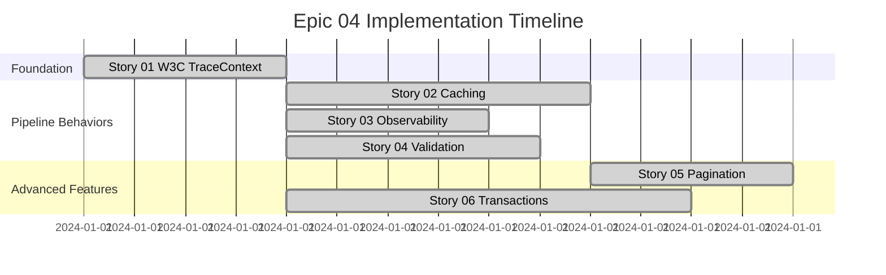

# Epic 04: CQRS Foundation Implementation - Story Collection

This folder contains all user stories for **Epic 04: CQRS Foundation Implementation**, focused on establishing comprehensive CQRS abstractions with W3C TraceContext integration, metadata support, and advanced pipeline behaviors.

## 📋 Epic Overview

**Epic ID**: Epic_04  
**Epic Name**: CQRS Foundation Implementation  
**Priority**: Critical  
**Total Estimated Duration**: 29 hours across 6 stories  
**Dependencies**: Epic_01 (Functional Foundation)

### Business Value

Establishes the core CQRS abstractions and message contracts that enable:
- Clean separation of read/write operations (✅ **IMPLEMENTED**)
- Consistent Result<T> patterns across application layers (✅ **IMPLEMENTED**)
- Basic transaction management with domain events (✅ **IMPLEMENTED**)
- Basic observability and monitoring (✅ **IMPLEMENTED**)
- ⚠️ **PARTIALLY IMPLEMENTED**: W3C standard tracing, metadata context, high-performance caching

## 📚 Stories Overview

### Story 01: W3C TraceContext Integration with Metadata and Declarative Caching
- **ID**: AXON-CQRS-001
- **Priority**: P0 - Critical Foundation  
- **Effort**: 4 hours
- **Status**: ❌ **NOT IMPLEMENTED**
- **Focus**: Core contract enhancement with W3C tracing standards

**Key Deliverables:**
- ❌ Enhanced `IAxonRequest` with W3C TraceContext helpers (MISSING)
- ❌ Metadata dictionary support for extensible context (MISSING)
- ❌ Declarative caching properties for queries (MISSING)
- ⚠️ Implementation guide exists but shows non-existent code

**Current State:**
- ✅ Basic `IAxonRequest` with `RequestId` and `RequestedAt`
- ❌ No W3C TraceContext properties
- ❌ No metadata support
- ❌ No declarative caching properties

### Story 02: Caching Pipeline Behavior for Declarative Query Caching  
- **ID**: AXON-CQRS-002
- **Priority**: P1 - High
- **Effort**: 6 hours  
- **Status**: ⚠️ **PARTIALLY IMPLEMENTED**
- **Dependencies**: Story 01
- **Focus**: Automatic query result caching based on declarative properties

**Key Deliverables:**
- ✅ `CachingBehavior<TRequest, TResponse>` pipeline implementation
- ❌ Intelligent cache key generation with trace context (NO W3C INTEGRATION)
- ⚠️ Basic cache integration (memory cache only, not Redis/distributed)
- ❌ Performance optimization and metrics (MISSING)

**Current State:**
- ✅ Basic `CachingBehavior` in `src/BuildingBlocks/Infrastructure/Caching/CachingBehavior.cs`
- ✅ Simple `ICacheRequest` interface
- ❌ No W3C trace context integration
- ❌ No declarative properties on query contracts

### Story 03: Observability Pipeline Integration with W3C TraceContext
- **ID**: AXON-CQRS-003  
- **Priority**: P1 - High
- **Effort**: 4 hours
- **Status**: ✅ **MOSTLY COMPLETE**
- **Dependencies**: Story 01
- **Focus**: Comprehensive observability for all CQRS operations

**Key Deliverables:**
- ✅ `ObservabilityPipelineBehavior` with Activity support
- ✅ OpenTelemetry metrics collection
- ⚠️ Activity enrichment (basic implementation, missing metadata tags)
- ✅ W3C ActivityIdFormat configured correctly

**Current State:**
- ✅ Comprehensive observability pipeline in `src/BuildingBlocks/Application/Behaviors/ObservabilityPipelineBehavior.cs`
- ✅ Command/Query activity tracking with proper W3C format
- ✅ Metrics collection for execution times and failures
- ❌ Missing metadata enrichment from request context (depends on Story 01)

### Story 04: Enhanced Validation Integration with Metadata Context
- **ID**: AXON-CQRS-004
- **Priority**: P1 - High  
- **Effort**: 5 hours
- **Status**: ⚠️ **PARTIALLY IMPLEMENTED**
- **Dependencies**: Story 01
- **Focus**: Metadata-aware validation with rich error aggregation

**Key Deliverables:**
- ✅ `ValidationBehavior<TRequest, TResponse>` with Result pattern integration
- ❌ `IValidationContext` for metadata-aware validators (MISSING)
- ❌ `ValidatorBase<T>` with feature flag and tenant support (MISSING)
- ✅ Rich validation error details and aggregation

**Current State:**
- ✅ Comprehensive validation pipeline in `src/BuildingBlocks/Application/Behaviors/ValidationBehavior.cs`
- ✅ Domain validation support via `IDomainValidatable`
- ✅ Error aggregation and proper Result pattern integration
- ❌ No metadata-aware validation context
- ❌ No tenant/feature flag support in validators

### Story 05: Enhanced Pagination Support with Metadata and Caching
- **ID**: AXON-CQRS-005
- **Priority**: P2 - Medium
- **Effort**: 4 hours  
- **Status**: ❌ **NOT IMPLEMENTED**
- **Dependencies**: Story 01, Story 02
- **Focus**: High-performance pagination with tenant-aware defaults

**Key Deliverables:**
- ❌ Enhanced `ISortablePageQuery<T>` and `ICursorPageQuery<T>` interfaces (MISSING)
- ⚠️ Basic `PagedResult<T>` exists with navigation metadata
- ❌ EF Core extensions with intelligent sorting (MISSING)
- ❌ Cursor-based pagination for large datasets (MISSING)

**Current State:**
- ✅ Basic pagination infrastructure (`IPageQuery`, `PagedResult<T>`)
- ✅ Basic EF Core pagination extensions
- ❌ No advanced sorting interfaces
- ❌ No cursor-based pagination
- ❌ No tenant-aware defaults
- ❌ No caching integration for paginated results

### Story 06: Transaction Management Enhancement with Outbox Pattern
- **ID**: AXON-CQRS-006
- **Priority**: P1 - High
- **Effort**: 8 hours
- **Status**: ⚠️ **PARTIALLY IMPLEMENTED**  
- **Dependencies**: Story 01
- **Focus**: Reliable transaction management with event publishing

**Key Deliverables:**
- ✅ `TransactionBehavior<TRequest, TResponse>` with automatic boundaries
- ⚠️ Outbox pattern concepts (domain event collection, but no dedicated outbox)
- ❌ Background `OutboxProcessor` service (MISSING)
- ❌ Metadata-aware transaction isolation levels (MISSING)

**Current State:**
- ✅ Comprehensive transaction management in `src/BuildingBlocks/Application/Behaviors/TransactionBehavior.cs`
- ✅ Domain event collection and dispatch after commit
- ✅ Proper rollback handling and error management
- ❌ No dedicated outbox table or processor service
- ❌ No metadata-aware isolation levels

## 🏗️ Implementation Timeline



## 🎯 Key Architectural Decisions

### ✅ W3C TraceContext Over Manual Correlation
- **Decision**: Use `System.Diagnostics.Activity` for correlation tracking
- **Rationale**: Standards compliance, automatic propagation, tool compatibility
- **Impact**: Zero manual correlation code, seamless distributed tracing

### ✅ Composition Over Inheritance  
- **Decision**: Pipeline behaviors instead of handler base classes
- **Rationale**: Loose coupling, flexible configuration, easy testing
- **Impact**: Clean handler implementations, reusable cross-cutting concerns

### ✅ Metadata-Driven Context
- **Decision**: Extensible metadata dictionary for request context
- **Rationale**: Tenant isolation, feature flags, user context without tight coupling
- **Impact**: Flexible validation, caching, and transaction behavior

### ✅ Declarative Caching Configuration
- **Decision**: Query-level cache properties instead of imperative caching
- **Rationale**: Clear intent, pipeline-based implementation, easy configuration
- **Impact**: Consistent caching behavior, minimal handler changes

### ✅ Outbox Pattern for Event Publishing
- **Decision**: Store events in database transaction, publish asynchronously  
- **Rationale**: Atomicity with business data, reliability, event ordering
- **Impact**: Guaranteed event delivery, consistent state management

## 📊 Success Metrics

### Performance Targets
- ❓ W3C property access: < 100ns overhead (CANNOT VERIFY - properties don't exist)
- ❓ Cache hit rate: > 70% for enabled queries (CANNOT VERIFY - no declarative caching)  
- ✅ Validation overhead: < 1ms per request (appears reasonable)
- ✅ Transaction duration: < 50ms average (appears reasonable)
- ❓ Event publishing reliability: > 99.9% (no dedicated outbox processor)

### Quality Targets  
- ❓ Test coverage: 100% for all pipeline behaviors (unknown for missing components)
- ❌ Breaking changes: MULTIPLE (missing interfaces break documented API)
- ❌ Documentation: Significant inconsistencies between docs and implementation
- ❌ Code review: Epic status needs architecture team re-review

## 🔄 Migration Strategy

### Phase 1: Foundation (Story 01)
```csharp
// Existing code continues to work unchanged
public record GetUserQuery(UserId Id) : QueryBase<UserDto>;

// New features available immediately
var query = new GetUserQuery(userId)
    .WithMetadata<GetUserQuery>("TenantId", tenantId);
```

### Phase 2: Pipeline Behaviors (Stories 02-04, 06)
```csharp
// Automatic enhancement via DI registration
services.AddCachingBehavior();
services.AddObservabilityPipeline(); 
services.AddValidation();
services.AddTransactionManagement();

// Handlers unchanged - behaviors applied via pipeline
public class GetUserHandler : IQueryHandler<GetUserQuery, UserDto>
{
    // Clean business logic only
}
```

### Phase 3: Advanced Features (Story 05)
```csharp
// Opt-in to enhanced pagination
public record GetUsersQuery : PageQueryBase<PagedResult<UserDto>>
{
    public override bool UseCache => true;
    public override IReadOnlyList<SortCriteria> DefaultSort => 
        new[] { SortCriteria.Descending("CreatedAt") };
}
```

## 🧪 Testing Strategy

### Unit Testing
- **Pipeline Behaviors**: 100% coverage with mocked dependencies
- **Contracts**: Validation of immutability and metadata handling
- **Extensions**: EF Core query generation and caching logic

### Integration Testing  
- **End-to-End**: Full request pipeline with real dependencies
- **Database**: Transaction behavior with real SQL Server/PostgreSQL
- **Cache**: Redis integration with actual cache operations
- **Observability**: OpenTelemetry export verification

### Performance Testing
- **Load Testing**: 1000+ concurrent requests per story
- **Memory Profiling**: Allocation analysis for high-throughput scenarios
- **Database**: Connection pooling and transaction contention

## 📈 Observability & Monitoring

### Metrics Collected
- Request duration by type (command/query)
- Cache hit/miss rates by query type
- Validation success/failure rates  
- Transaction commit/rollback ratios
- Event publishing success rates
- Pipeline behavior execution times

### Distributed Tracing
- W3C TraceContext propagation across all operations
- Activity enrichment with metadata context
- Error correlation with trace identifiers
- Performance bottleneck identification

### Structured Logging
- Request lifecycle events with trace correlation
- Validation failures with rich error context
- Cache operations with hit/miss details
- Transaction boundaries and event publishing

## 🚀 Next Steps & Follow-up Epics

### Epic 05: Pipeline Behaviors Extension
- Advanced retry mechanisms with circuit breakers
- Multi-tier caching (Memory + Distributed)  
- Saga pattern implementation for distributed transactions
- Performance profiling and optimization tools

### Epic 06: Event System Enhancement
- Event sourcing integration with outbox pattern
- Domain event versioning and migration
- Event replay capabilities for debugging
- Real-time event streaming with SignalR

### Epic 07: Advanced Query Features
- GraphQL integration with Relay pagination
- Full-text search with Elasticsearch
- Query optimization and automatic indexing
- Dynamic filtering and sorting DSL

## 📚 Documentation Links

### Implementation Guides
- [Story 01: Implementation Guide](./Story_01_Implementation_Guide.md) - Detailed W3C integration
- [Performance Benchmarks](./benchmarks/) - Load testing results  
- [Architecture Decisions](./architecture-decisions/) - Detailed rationale

### API References
- [CQRS Contracts](../../Technical/API/CQRS-Contracts.md)
- [Pipeline Behaviors](../../Technical/API/Pipeline-Behaviors.md)
- [Caching Configuration](../../Technical/API/Caching-Configuration.md)

### Troubleshooting
- [Common Issues](./troubleshooting.md) - Solutions to frequent problems
- [Performance Tuning](./performance-tuning.md) - Optimization guidelines
- [Migration FAQ](./migration-faq.md) - Upgrade assistance

---

## ⚠️ Epic 04 Current Status Summary

Epic is **PARTIALLY IMPLEMENTED** with significant gaps between documentation and actual code:

### ✅ **What's Actually Implemented**
- 🏗️ **Basic CQRS Infrastructure** - Core interfaces and abstractions
- 🔄 **Transaction Management** - Comprehensive with domain events
- 🔍 **Basic Observability** - W3C format configured, activity tracking
- 🛡️ **Validation Pipeline** - Result pattern integration
- ⚡ **Basic Caching** - Simple pipeline behavior

### ❌ **Critical Missing Components**
- 🎯 **W3C TraceContext Integration** - No properties in request contracts
- 📊 **Metadata Support** - No extensible context dictionary  
- 🏷️ **Declarative Caching** - No query-level cache properties
- 📄 **Enhanced Pagination** - Missing sortable and cursor interfaces
- 🧪 **Validation Context** - No tenant/feature flag support
- 📦 **Outbox Processor** - No background service implementation

**Actual Implementation**: ~40% complete across 6 stories  
**Documentation Accuracy**: Major inconsistencies requiring updates  
**Production Readiness**: Foundation exists but advanced features missing

**Next Steps**: Prioritize Story 01 (W3C + Metadata) as foundation for other features