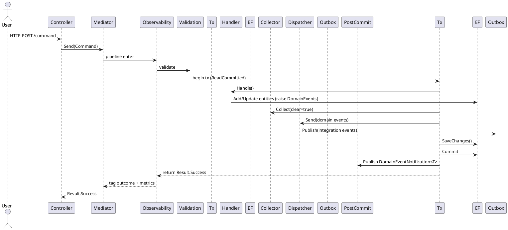

# Application Layer Index — **BuildingBlocks**

> Path: `src/BuildingBlocks/Application`

This document is a **complete, implementation-level index** of the Application layer primitives and infrastructure-facing glue. It catalogs public APIs, registrations, behavior ordering, eventing lanes, configuration knobs, and sharp edges.

---

## 0) Purpose & Scope

The Application layer coordinates **use‑cases** (commands/queries), **cross‑cutting behaviors** (validation, caching, retries, transactions, observability), and **eventing** (domain → integration, in‑process notifications) while keeping provider details (EF, MassTransit, Redis, etc.) outside.

**Key contracts:**

* CQRS request contracts (via `BuildingBlocks.Core.Abstractions.CQRS`): `ICommand<>`, `IQuery<>`, `IAxonRequest<>`, `IResult`.
* Repositories/UoW: `IReadRepository<>`, `IWriteRepository<>`, `IWriteUnitOfWork<>`.
* Eventing: collectors, dispatchers, publishers, envelope context.
* Pipeline behaviors (MediatR): observability, logging, validation, caching, retry, transactions, exception handling, auto‑commit.

---

## 1) File Map (flattened)

```
Application/
├── IReadRepository.cs
├── IWriteRepository.cs
├── IWriteUnitOfWork.cs
├── Behaviors/
│   ├── ObservabilityBehavior.cs
│   ├── RequestLoggingBehavior.cs
│   ├── RequestValidationBehavior.cs
│   ├── QueryCachingBehavior.cs
│   ├── QueryRetryBehavior.cs
│   ├── CommandTransactionBehavior.cs
│   ├── ExceptionHandlingBehavior.cs
│   └── AutoCommitOnSuccessBehavior.cs
├── Caching/HybridCache.cs
├── Configuration/
│   ├── ApplicationConfigurationExtensions.cs
│   ├── CachingServiceExtensions.cs
│   ├── LoggingOptions.cs
│   ├── OutboxServiceExtensions.cs
│   ├── PipelineBehaviorExtensions.cs
│   └── Json/JsonDefaults.cs
├── Events/
│   ├── Collecting/{EfDomainEventCollector.cs, IDomainEventCollector.cs}
│   ├── Dispatching/{IIntegrationEventDispatcher.cs, IntegrationEventDispatcher.cs}
│   ├── Enveloping/EnvelopeContext.cs
│   ├── Notifications/{DomainEventNotification.cs, IPostCommitDomainEventPublisher.cs, MediatorPostCommitDomainEventPublisher.cs}
│   └── Publishing/{IIntegrationEventPublisher.cs, NoOpIntegrationEventPublisher.cs}
├── Exceptions/ValidationException.cs
├── Outbox/{IOutboxService.cs, OutboxService.cs}
└── Validation/
    ├── SkipValidationAttribute.cs
    ├── Base/BaseValidator.cs
    ├── Constants/ValidationErrorCodes.cs
    └── Extensions/ValidationExtensions.cs
```

---

## 2) Registration & Composition

### 2.1 Service Registration (high‑level)

* `services.AddApplicationServices(configuration, environment)` ⇒

    * `ConfigureApplicationOptions(configuration)` ⇒ binds `Application:Logging` → `LoggingOptions`.
    * `AddCachingServices()` ⇒ `IMemoryCache`, `IDistributedCache` (in‑proc by default).
    * `AddPipelineBehaviors(configuration, environment)` ⇒ registers all MediatR pipeline behaviors (ordering below).

### 2.2 Eventing/Outbox

* `services.AddOutboxFacade()` ⇒ `IOutboxService`, `IDomainEventCollector`, `IIntegrationEventDispatcher`, `IPostCommitDomainEventPublisher`, **default** `IIntegrationEventPublisher` = `NoOpIntegrationEventPublisher`, `IEnvelopeContextAccessor`.
* `services.AddOutboxFacadeWithTransactions()` ⇒ `AddOutboxFacade()` + `CommandTransactionBehavior<,>`.

### 2.3 Behavior Ordering (MediatR)

Registration order defines call order (first is **outermost**):

1. `ObservabilityBehavior<,>` — tracing/metrics/log scope
2. `RequestLoggingBehavior<,>` — **optional** (dev‑default)
3. `QueryRetryBehavior<,>` — queries only, Polly v8
4. `RequestValidationBehavior<,>` — FluentValidation + domain mapping
5. `QueryCachingBehavior<,>` — queries only, minimal TTL cache
6. `CommandTransactionBehavior<,>` — commands only, EF transaction + outbox
7. `ExceptionHandlingBehavior<,>` — converts exceptions → `IResult` failure
8. `AutoCommitOnSuccessBehavior<,>` — commits any changed DbContexts

> **Note:** `AddPipelineBehaviors` *always* calls `AddCachingServices()` (duplicated with global add; idempotent but redundant).

---

## 3) CQRS Contracts

### 3.1 Requests & Results

* **Requires** requests implement `IAxonRequest<TResponse>` for observability tags (`RequestId`, `RequestedAt`, `TraceId`, `SpanId`, `Metadata`).
* Commands implement `ICommand<TResponse>`, queries implement `IQuery<TResponse>`.
* Behaviors expect `TResponse : IResult` (or notnull for caching behavior). Ensure your handlers return `Result`/`Result<T>`.

### 3.2 Repositories & UoW

* `IReadRepository<TReadModel, TId>`: **no tracking**, provider‑agnostic, LINQ expression predicates permitted (translatable by infra). Includes paged access via `IPageRequest`.
* `IWriteRepository<TAggregate, TId>`: aggregates only (`IAggregateRoot<TId>`), **tracked**, CRUD, `Any/Exists` helpers.
* `IWriteUnitOfWork` (and `IWriteUnitOfWork<TModule>`): ambient transactional boundary for a module; independent of EF.

> **Guidelines:** prefer `IWriteRepository` inside command handlers; keep complex query composition on read‑side abstractions.

---

## 4) Pipeline Behaviors — Responsibilities & Invariants

### 4.1 ObservabilityBehavior

* **Scope:** `TRequest : IAxonRequest<TResponse>`.
* **Adds** Activity + metrics; sets tags (request type/category, `axon.*`).
* **Outcome tagging:** success/failure/cancel/exception; records histogram/counters.
* **Dependency:** references `BuildingBlocks.Infrastructure.Observability.OpenTelemetry` **constants** for tag names.

### 4.2 RequestLoggingBehavior

* **No‑op** when an `Activity` is active (to avoid duplicate logs).
* **Options:** `Application:Logging` (`LoggingOptions`) for slow request threshold & structured logging toggles.
* **Enabled by default in Development** via `Pipeline:EnableRequestLogging`.

### 4.3 RequestValidationBehavior

* **Runs FluentValidation** validators for `TRequest` in parallel; aggregates failures by field.
* **Skip rules:** `[SkipValidation]` attribute **or** `ISystemCommand` marker (trusted path).
* **Maps** FluentValidation `ValidationFailure` → `Error` (aggregate when multiple).
* **Emits** metric tags into current Activity.

### 4.4 QueryCachingBehavior

* **Opt‑in** via `IQuery.UseCache` and `IQuery.CacheDuration` (TTL). Key = `q:{prefix}:{sha256(serialized request)[0..16]}`.
* **Storage:** `HybridCache` (L1 memory + L2 distributed).
* **Important:** serialization uses default `System.Text.Json` **without** custom converters.

### 4.5 QueryRetryBehavior

* **Opt‑in**: programmatic `IRetryableQuery.GetRetryPolicy()` or `[Retryable]` attribute; otherwise controlled by `RetryOptions` (default OFF).
* **Policy:** exponential backoff with jitter (Polly v8); retries on *exceptions* and on `IResult` failures classified as **external/transient** (simple code heuristics: `TIMEOUT`, `TRANSIENT`, `THROTTLE`, `429`).

### 4.6 CommandTransactionBehavior

* **Scope:** `TRequest : ICommand<TResponse>` and `TResponse : IResult`.
* **Own Tx path** (no ambient):

    1. push `IntegrationEnvelopeContext` → 2) `next()` → 3) collect & clear domain events → 4) publish **integration events before SaveChanges** (captured by MT EF Outbox) → 5) `SaveChanges()` → 6) **commit** → 7) publish **post‑commit** in‑process notifications.
* **Ambient Tx path:** participate (no new tx), publish integration events, `SaveChanges()`, **skip** post‑commit notifications (caller owns commit boundary).
* **Failure:** exceptions → `Error.Internal("TX_FAILED")` → `Result/Result<T>.Failure` via compiled factory.

### 4.7 ExceptionHandlingBehavior

* Converts thrown exceptions into `IResult.Failure` (keeps cancellations). Logs error and proceeds.

### 4.8 AutoCommitOnSuccessBehavior

* After `next()`, iterates all scoped `DbContext` instances; calls `SaveChangesAsync` **only if** `ChangeTracker.HasChanges()`.
* Designed to sit **innermost**; safe after transaction behavior (usually no changes left).

---

## 5) Eventing — Lanes, Roles & Flow

### 5.1 Components

* **Collector:** `EfDomainEventCollector` — duck‑types `DomainEvents` property & `ClearDomainEvents()` on tracked aggregates using compiled expressions; no I/O.
* **Dispatcher:** `IntegrationEventDispatcher` — maps domain events with `IHaveIntegrationEvent` → integration events, publishes via `IIntegrationEventPublisher`.
* **Publisher:** default `NoOpIntegrationEventPublisher` logs only (infra should replace with a real bus + outbox binding).
* **Post‑commit Publisher:** `MediatorPostCommitDomainEventPublisher` — wraps events into `DomainEventNotification<T>` and `IMediator.Publish`.
* **Envelope:** `AsyncLocalEnvelopeContextAccessor` — carries correlation (`TraceId`, `RequestId`, `TenantId`, metadata) across the flow.
* **Outbox façade:** `OutboxService` — thin façade over dispatcher for convenience.

### 5.2 Lanes

* **Lane A (In‑process orchestration):** Post‑commit MediatR notifications (`DomainEventNotification<T>`) for policies inside the same process/bounded context.
* **Lane B (Cross‑boundary):** Domain → Integration mapping, published **pre‑commit** so MT EF Outbox captures, persists, and reliably delivers.

---

## 6) JSON & Caching Defaults

* **`JsonDefaults.Options`** — camelCase, ignore nulls, enum as string, **StrongId** converters via `StrongIdJsonConverterFactory`.
* **`HybridCache`** — uses its **own** `JsonSerializerOptions` (camelCase **only**). See sharp edges below regarding StrongId.

---

## 7) Configuration Surface (appsettings)

```jsonc
{
  "Application": {
    "Logging": {
      "SlowRequestThresholdMs": 1000,
      "EnableStructuredLogging": true,
      "LogRequestParameters": false,
      "LogResponseData": false,
      "MaxLoggedDataLength": 1000
    }
  },
  "Pipeline": {
    "EnableRequestLogging": true // defaults to env.IsDevelopment() when null
  }
}
```

**RetryOptions** (for `QueryRetryBehavior`) are provided via `IOptions<RetryOptions>`; defaults: OFF, attempts=3, initial=100ms, max=30s.

---

## 8) Example Wiring

```csharp
// Program.cs / Composition Root
services.AddApplicationServices(builder.Configuration, builder.Environment);
services.AddOutboxFacadeWithTransactions();

// Replace default NoOp publisher with real bus (e.g., MassTransit)
services.AddScoped<IIntegrationEventPublisher, MassTransitEventPublisher>();

// Alternatively: if infra owns MT EF Outbox, that package can TryAdd/Replace
```

---

## 9) Usage Patterns & Mini‑Recipes

### 9.1 Command Handler (write with domain events)

```csharp
public sealed class PlaceOrder : ICommand<Result<OrderId>> { /* ... */ }

public sealed class PlaceOrderHandler : IRequestHandler<PlaceOrder, Result<OrderId>>
{
    private readonly IWriteRepository<Order, OrderId> _repo;

    public async Task<Result<OrderId>> Handle(PlaceOrder cmd, CancellationToken ct)
    {
        var order = Order.Create(/* domain guard clauses */);
        await _repo.AddAsync(order, ct);
        // Domain events raised by aggregate are auto‑collected by EfDomainEventCollector
        return Result.Success(order.Id);
    }
}
```

### 9.2 Query Handler with Cache & Retry

```csharp
[Retryable(MaxAttempts = 3, InitialDelayMs = 200)]
public sealed record GetOrder(OrderId Id) : IQuery<Result<OrderReadModel>>
{
    public bool UseCache => true;
    public TimeSpan? CacheDuration => TimeSpan.FromMinutes(2);
    public string? CacheKeyPrefix => $"order:{Id}";
}
```

---

## 10) Public API Surface (by namespace)

### 10.1 `BuildingBlocks.Application`

* `IReadRepository<TReadModel, TId>`, `IReadRepository<TReadModel>`
* `IWriteRepository<TAggregate, TId>`, `IWriteRepository<TAggregate>`
* `IWriteUnitOfWork`, `IWriteUnitOfWork<TModule>`, `IUsesWriteModule<TModule>`

### 10.2 `BuildingBlocks.Application.Behaviors`

* `ObservabilityBehavior<,>`
* `RequestLoggingBehavior<,>`
* `RequestValidationBehavior<,>`
* `QueryCachingBehavior<,>`
* `QueryRetryBehavior<,>` (+ `IRetryableQuery`, `RetryableAttribute`, `RetryPolicy`, `RetryOptions`)
* `CommandTransactionBehavior<,>`
* `ExceptionHandlingBehavior<,>`
* `AutoCommitOnSuccessBehavior<,>`

### 10.3 `BuildingBlocks.Application.Caching`

* `HybridCache`

### 10.4 `BuildingBlocks.Application.Configuration`

* `ApplicationConfigurationExtensions`
* `CachingServiceExtensions`
* `PipelineBehaviorExtensions`
* `OutboxServiceExtensions`
* `LoggingOptions`
* `Json.JsonDefaults`

### 10.5 `BuildingBlocks.Application.Events.*`

* `Collecting`: `IDomainEventCollector`, `EfDomainEventCollector`
* `Dispatching`: `IIntegrationEventDispatcher`, `IntegrationEventDispatcher`
* `Publishing`: `IIntegrationEventPublisher`, `NoOpIntegrationEventPublisher`
* `Notifications`: `DomainEventNotification`, `DomainEventNotification<T>`, `IPostCommitDomainEventPublisher`, `MediatorPostCommitDomainEventPublisher`
* `Enveloping`: `IntegrationEnvelopeContext`, `IEnvelopeContextAccessor`, `AsyncLocalEnvelopeContextAccessor`

### 10.6 `BuildingBlocks.Application.Outbox`

* `IOutboxService`, `OutboxService`

### 10.7 `BuildingBlocks.Application.Validation`

* `SkipValidationAttribute`
* `Base.BaseValidator<T>`
* `Extensions.ValidationExtensions`
* `Constants.ValidationErrorCodes`

### 10.8 `BuildingBlocks.Application.Exceptions`

* `ValidationException`

---

## 11) Sequence Diagrams

### 11.1 **Command** (no ambient transaction, domain events raised)



### 11.2 **Query** (cache & retry enabled, hit L2)

```plantuml
@startuml
actor User
participant Mediator as M
participant Obs as Obs
participant Retry as Rty
participant Validation as Val
participant Cache as Cch
participant Handler as H
participant L1 as Memory
participant L2 as Distributed

User -> M : Send(Query)
M -> Obs : start span
Obs -> Rty : build policy
Rty -> Val : validate
Val -> Cch : GetOrCreateAsync(key)
Cch -> L1 : TryGet(key)
L1 --> Cch : miss
Cch -> L2 : Get(key)
L2 --> Cch : bytes found
Cch -> Cch : deserialize
Cch --> Val : value
Val --> Rty --> Obs : return
Obs --> M : tag outcome + metrics
@enduml
```

---

## 12) Validation Toolbox

* **`ValidationExtensions`**

    * `NotEmptyGuid(Guid|Guid?)`
    * `MustBeValidDomainObject<TDomain>(Func<string, Result<TDomain>> create)` — accepts factory returning `Result<TDomain>`
    * `ContentLength(min, max)` — trimmed length check
    * `NotEmptyOrWhitespace()`
    * `ValidPageSize(max=100)` / `ValidPageNumber()`
* **`ValidationErrorCodes`** centralizes codes for uniformity.
* **`ValidationException`** converts Fluent `ValidationFailure` set → layered `Error` instances (with severity mapping) and keeps raw failures.
* **`BaseValidator<T>`** sets `ClassLevelCascadeMode = Stop` and offers `SetupAsyncValidation()` hook.

---

## 13) Implementation Notes & Invariants

* **Behavior ordering matters.** Observability must be outermost; ExceptionHandling near the end to turn exceptions into `IResult` failures; `AutoCommit` last.
* **CommandTransactionBehavior** *pre‑SaveChanges* integration publishing relies on **MassTransit EF Outbox** to capture messages in the same transaction; infra must replace `IIntegrationEventPublisher` with a bus‑backed publisher.
* **Ambient transaction** branch deliberately **skips post‑commit notifications** because it does not own commit boundaries.
* **Repository contracts are provider‑agnostic.** Avoid leaking `IQueryable` or `Include` into application handlers.
* **Envelope context** is AsyncLocal and **nestable**; `Push()` returns a scope that restores previous context.

---

## 14) Sharp Edges / Review Items

1. **QueryCachingBehavior caches failures.**

    * Comment says "cache only non‑null / successful results" but the factory returns the value unconditionally → `HybridCache` **will cache failures**. Consider:

        * Option A: have factory throw a private sentinel exception to avoid caching on failure (undesirable),
        * Option B: extend `HybridCache.GetOrCreateAsync` to accept a `shouldCache(value)` predicate,
        * Option C: wrap in a small adapter that returns a `(bool shouldCache, TResponse value)` pair.

2. **StrongId JSON converters are not used in cache.**

    * `HybridCache` uses local `JsonSerializerOptions` without `StrongIdJsonConverterFactory`. If `TResponse` contains StrongIds, serialization may fail or produce wrong shape. Fix by reusing `JsonDefaults.Options` or calling `AddStrongIdSupport()`.

3. **Request key serialization fragility.**

    * `QueryCachingBehavior.BuildKey` serializes the *request* with default JSON options. Custom types (e.g., StrongId) or non‑serializable members may break hashing. Align with `JsonDefaults` and/or implement a dedicated `ICacheKey` on queries.

4. **Application → Infrastructure coupling (observability).**

    * `ObservabilityBehavior` references `BuildingBlocks.Infrastructure.Observability.OpenTelemetry` for tag constants, creating a layer dependency. Consider moving tag constants to a neutral package or duplicating minimal constants in Application.

5. **`BaseValidator<T>.PreValidate` hook is unused.**

    * FluentValidation has its own `PreValidate` virtual method; current method is a custom hook that won’t run unless called manually. Either rename to avoid confusion or integrate by overriding FV’s `PreValidate`.

6. **Redundant services.AddCachingServices() call.**

    * `AddPipelineBehaviors` calls `AddCachingServices()` even if already called in `AddApplicationServices()`; harmless but redundant.

7. **AutoCommit with multiple DbContexts.**

    * Behavior iterates **all** scoped `DbContext` instances. Ensure composition root scopes exactly one write context per module to avoid surprising commits across modules in the same scope.

8. **Ambient transaction path saves and publishes.**

    * Under ambient transactions, the behavior calls `SaveChangesAsync` and publishes integration events but **skips** post‑commit notifications. If caller never commits, notifications never fire—make this explicit in docs to avoid surprises.

---

## 15) Extension & Customization Points

* Replace `IIntegrationEventPublisher` in Infrastructure with a bus (e.g., MassTransit) + EF Outbox.
* Provide custom `IReadRepository` / `IWriteRepository` implementations per module.
* Add validators (`IValidator<TRequest>`) per request type; use `ValidationExtensions`.
* Override retry defaults via `IOptions<RetryOptions>`; prefer explicit per‑query policies.
* Introduce Redis by replacing `AddDistributedMemoryCache` with `AddStackExchangeRedisCache` in `CachingServiceExtensions`.

---

## 16) Ready‑to‑Refactor TODOs (quick wins)

* [ ] Add `StrongIdJsonConverterFactory` to `HybridCache` and `QueryCachingBehavior` serialization.
* [ ] Add `shouldCache` predicate to `HybridCache.GetOrCreateAsync` and use it to avoid caching failed `IResult`s.
* [ ] Move observability tag constants to a cross‑layer neutral assembly (e.g., `BuildingBlocks.Telemetry.Abstractions`).
* [ ] Replace custom `BaseValidator<T>.PreValidate` with proper FV override or remove to reduce confusion.
* [ ] Consider a dedicated `ICacheKey` contract for queries to avoid brittle JSON hashing and to let handlers control cache scope.
* [ ] Document ambient transaction expectations (who commits, who publishes post‑commit notifications).

---

## 17) Quick Reference Snippets

### Register pipeline only

```csharp
services.AddPipelineBehaviors(Configuration, Environment);
```

### Register outbox without transactions

```csharp
services.AddOutboxFacade();
```

### Register cache

```csharp
services.AddCachingServices(); // Memory + Distributed (in‑proc)
```

### Create default JSON options w/ StrongId

```csharp
var json = JsonDefaults.CreateOptions();
```

---

## 18) Appendix — Glossary

* **Lane A:** In‑process domain notifications (MediatR) after commit; orchestration within the same process.
* **Lane B:** Cross‑boundary integration events captured by EF Outbox and delivered by the message bus.
* **Ambient transaction:** A transaction begun outside the behavior (e.g., by an outer pipeline or external coordinator) — the behavior participates but does not own commit.

---

*End of Application layer index.*
