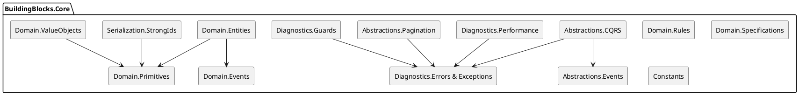

# SPEC-001-BuildingBlocks Core Index

## Background

This document indexes the **BuildingBlocks/Core** layer that underpins all modules in the Axon backend. It summarizes public contracts, patterns (DDD, CQRS, Domain/Integration Events, Specifications, Value Objects), and cross-cutting diagnostics to guide consistent reuse in Application/Infrastructure/Web layers.

## Requirements

**Must**

* Provide a clear, file-level index of Core with one-line responsibilities.
* Highlight key invariants, usage guidelines, and extension points.
* Note any potential defects or sharp edges spotted during the pass.

**Should**

* Show a high-level relationship diagram (PlantUML) of Core subpackages.
* Group items by concern (Abstractions, Domain, Diagnostics, Serialization, Constants).

**Could**

* Call out migration/compat flags (e.g., obsolete APIs) and recommended replacements.
* Add quick-start snippets later per audience (App/Infra authors).

**Won’t (for this pass)**

* Deep implementation walkthroughs or module-specific policies.

## Method

### Core Layer Structure (by concern)

> Repo root: `src/BuildingBlocks/Core`

#### 1) Abstractions

**CQRS**

* `Abstractions/CQRS/RequestBase.cs` – base for all requests; identity (Guid v7 on .NET 8+), timestamps, immutable metadata (+ `WithMetadata`).
* `Abstractions/CQRS/IAxonRequest.cs` – request identity + W3C TraceContext accessors (TraceId = CorrelationId).
* `Abstractions/CQRS/ICommand*.cs` – command contracts returning `Result<T>`; unit-typed variant via `Unit`.
* `Abstractions/CQRS/ICommandHandler*.cs` – MediatR-based handlers returning `Result<T>`.
* `Abstractions/CQRS/IQuery*.cs` – query contracts with cache hints (`UseCache`, `CacheDuration`, `CacheKeyPrefix`).
* `Abstractions/CQRS/IQueryHandler*.cs` – MediatR handlers returning `Result<T>`.
* `Abstractions/CQRS/CommandBase*.cs` – base records for commands (with/without response).
* `Abstractions/CQRS/QueryBase.cs` – base record for queries; `AsCached()` helper.
* `Abstractions/CQRS/ISystemCommand.cs` – marker for system/maintenance commands.

**Events (contracts)**

* `Abstractions/Events/IEvent.cs` – core event surface (Id, OccurredAt, Version, Name).
* `Abstractions/Events/IIntegrationEvent.cs` – cross-BC events (Source, CorrelationId, Metadata).
* `Abstractions/Events/IInternalCommand.cs` – internal command contract (Priority, Retry policy, Correlation).

**Pagination**

* `Abstractions/Pagination/IPageList.cs` – modern page result + `PaginationMeta`.
* `.../IPagedResult<T>` – **\[Obsolete]** legacy flattened members (delegates to `Meta`).
* `IPageQuery<T>`, `IPageRequest` – markers & request surface (IncludeTotalCount, SortBy, Filters/SortOrder **\[Obsolete]**).
* `ISortablePageQuery<T>` – combines client `SortBy` with `DefaultSort`, exposes `EffectiveSortBy`.
* `PagedResult<T>` – immutable result implementing both modern + legacy.
* `PageQueryBase<T>` – canonical page props (`Page`, `PageSize`), caps, `Skip/Take`, legacy aliases, effective sort (ensures unique tiebreaker).
* `PaginationMeta` – exact/countless constructors, navigation hints.
* `SortCriteria`, `SortHelpers` – direction enum + `EnsureUniqueOrder`.

#### 2) Domain

**Entities**

* Abstractions: `IAggregateRoot`, `IAggregateRoot<TId>`, `IEntity<TId>`, `IIdentifiable<TId>`, `IHasDomainEvents`, `IAuditable`, `ISoftDeletable`, `IVersioned`.
* Base types:

    * `Entity<TId>` – identity + equality semantics; transient detection for strong-ids.
    * `AuditableEntity<TId>` – `CreatedAt/UpdatedAt` helpers.
    * `SoftDeletableEntity<TId>` – `IsDeleted/DeletedAt` + restore.
    * `AuditableDeletableEntity<TId>` – audit + soft-delete, with `MarkUpdated/MarkCreated`.
    * `AggregateRoot<TId>` – version, domain events buffer, `RaiseDomainEvent`, `ClearDomainEvents`.

**Events (domain)**

* `DomainEvent` – base record; default `Name` = type full name, `OccurredAt = UtcNow`.
* `DomainEventEnvelope` – event + `DomainEventMetadata` (CorrelationId/CausationId/Tenant/User/Headers).
* `DomainEventExtensions` – `.ToEnvelope()`, `.WithCorrelation()`, `.WithTenant()`, `.WithHeaders()`.
* `IDomainEvent` – marker extends `IEvent`.
* `IHaveIntegrationEvent` – domain event can yield integration events.

**Primitives**

* `StrongId<TPrimitive>` – base record with non-default guard, comparison ops, implicit primitive conversion.
* `GuidStrongId`, `IntStrongId` – helpers for parsing/creation (`New`, `FromString`, try-create).
* `IStrongId`, `IStrongId<T>` – accessors for value/type.
* `ValueObject` – equality by components, `Validate()` contract, `IsValid/ValidationErrors`.
* `SingleValueObject<T>` – convenience base (holds `Value`, implicit to `T`).

**Rules**

* `IBusinessRule` – code/message/metadata + `IsBroken()/IsBrokenAsync()`; `.ToError()`.
* `BusinessRule` – base class with factories: `Create` (sync), `CreateAsync` (async).
* `RuleBuilder` (+ `RuleBuilderExtensions`) – collect & build `ValidationResult<Unit>` or `Result<Unit>`; sync/async checks; throw-as-exception option (`DomainRuleViolationException`).

**Specifications**

* `Specification` static – factory `Create<T>(expr)`.
* `Specification<T>` – composable base with `And/Or/Not`, caching `ToPredicate()`, operator sugar `& | !`, implicit to `Expression<Func<T,bool>>`.
* `.../SpecificationExtensions` – apply specs to `IEnumerable` (compiled predicate) and `IQueryable` (expression), plus lambda combinators.
* `CommonSpecifications` – tiny reusable spec factories (null/empty, comparables, strings, dates (with injected `nowUtc`), entity traits, set membership, numeric, boolean, composite builders).

**ValueObjects**

* `Email` – RFC 5322 validation; normalization (lowercase + IDN), plus/disposable/free/corporate detection, masking, aliases, `TryCreate`/`Create` returning `Result/Option`.
* `Money` (+ `Currency` enum) – currency-safe arithmetic (Add/Subtract/Multiply/Divide), rounding, minor units, conversion with exchange rate, allocate by ratios, comparisons; `TryCreate`/`Create`, `Zero`, formatting helpers.

#### 3) Serialization

* `Serialization/StrongIds/StrongIdJsonConverterFactory.cs` – `System.Text.Json` converter factory for any `StrongId<TPrimitive>` (Guid/int/long/string); compiles fast `ctor(TPrimitive)` for deserialization; guards against default primitives; respects null tokens.

#### 4) Constants

* `Constants/IdentityConstant.cs` – roles: `admin`, `user`.

#### 5) Diagnostics (Core)

**Errors**

* `Diagnostics/Errors/Error.cs` – immutable, rich error model with types (`ErrorType`), severity (`ErrorSeverity`), exception mapping (`FromException`), RFC7807 conversion, retryability hints, correlation, redaction; aggregate errors.
* `Diagnostics/Errors/ErrorType.cs`, `ErrorSeverity.cs` – categorizations & HTTP mappings.

**Exceptions**

* `Diagnostics/Exceptions/*` – `DomainException` (mirrors Error into `Exception.Data`, aggregation), `BusinessRuleException`, `ConcurrencyException`, `DomainStateException`, `InvariantViolationException`, `AggregateNotFoundException`; RFC7807 helpers, retryability, flattening; **compat shim**: `ValidationException` is **moved** to `BuildingBlocks.Application.Exceptions` via `global using` alias.

**Guards**

* `Diagnostics/Guards/Guard.cs` – static guard helpers with `[CallerArgumentExpression]` and numerics via `INumber<T>`.
* `Diagnostics/Guards/GuardClause.cs` – fluent guard that throws `ValidationException` (uses Error model).

**Performance**

* `Diagnostics/Performance/IErrorTelemetry.cs`, `ErrorTelemetry.cs` – minimal OpenTelemetry `Meter` counters/histograms for errors.
* `Diagnostics/Performance/Extensions/ErrorPerformanceExtensions.cs` – DI registration (`AddErrorTelemetry()`).
* `Diagnostics/Performance/MemoryCacheExtensions.cs` – safe compaction for `IMemoryCache`.

**AppException bridge**

* `Diagnostics/AppException.cs` – base app exception with round-trip to/from `Error` (Result pattern), plus `BadRequestException`, `NotFoundException`, `ConflictException`, `ValidationException` variant (HTTP-oriented).

### Notable Invariants & Usage Guidelines

* **W3C Trace Correlation**: `IAxonRequest` exposes `TraceId`/`CorrelationId`/`SpanId` from `Activity.Current`. `Error`/`DomainException` propagate correlation automatically.
* **Strongly-Typed IDs**: Always enforce non-default primitives; use `StrongIdJsonConverterFactory` in JSON options for seamless (de)serialization.
* **Specifications**: Favor `CommonSpecifications` + composition; avoid `DateTime.UtcNow` inside expressions (pass `nowUtc`).
* **Pagination**: Prefer `IPageList<T>` + `PaginationMeta`; legacy members are available via `PagedResult<T>` for back-compat.
* **Rules**: Use `RuleBuilder` to aggregate many checks into a single `ValidationResult` and return domain-friendly errors; resort to throwing only for invariants.
* **Value Objects**: Construct via `Create/TryCreate` returning `Result/Option`; call `.Validate()` only if required for runtime re-checks.

### Potential Issues / Sharp Edges (found during indexing)

* **`BusinessRule.IsBroken()` default implementation** currently reads `public virtual bool IsBroken() => IsBroken();` which recurses into itself and will stack overflow. Intended default is likely `return false;` (encouraging derived overrides) **or** delegating to the sync factory-provided predicate. Recommend fixing promptly.
* **`Diagnostics/Exceptions/ValidationException.cs`** is a redirect to `BuildingBlocks.Application.Exceptions.ValidationException`. Ensure the Application layer provides that type and all usages import the new namespace to avoid ambiguous references.

### High-Level Relationships (Core only)

## Implementation

* Register `StrongIdJsonConverterFactory` with your `JsonSerializerOptions`.
* Ensure DI includes `AddErrorTelemetry()` if you plan to emit error metrics.
* Adopt `PageQueryBase<TResponse>` for all paged queries; ensure `DefaultSort` ends with a unique key.
* Establish repo-wide analyzers/rules to enforce **VO factories only** (no public VO constructors), and prohibit `DateTime.UtcNow` inside LINQ-to-Entities expressions.

## Milestones

* ✅ Core layer indexed (this doc).
* ⏭️ Application layer indexing (next).
* ⏭️ Add per-audience quick-starts (App handlers, Infra repos, Web contracts).
* ⏭️ Automate drift detection (CI check compares file map vs. index).

## Gathering Results

* Team review: validate completeness and correctness.
* Track fixes: address `BusinessRule.IsBroken()` recursion; confirm Application-level `ValidationException` availability and usages.
* Once Application layer is indexed, produce a combined cross-layer dependency map.